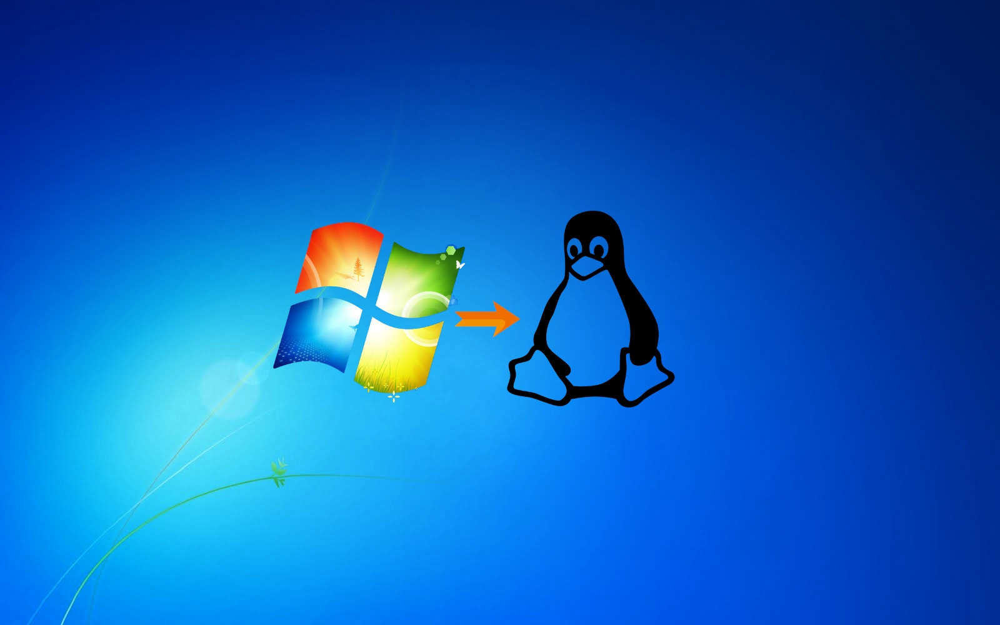
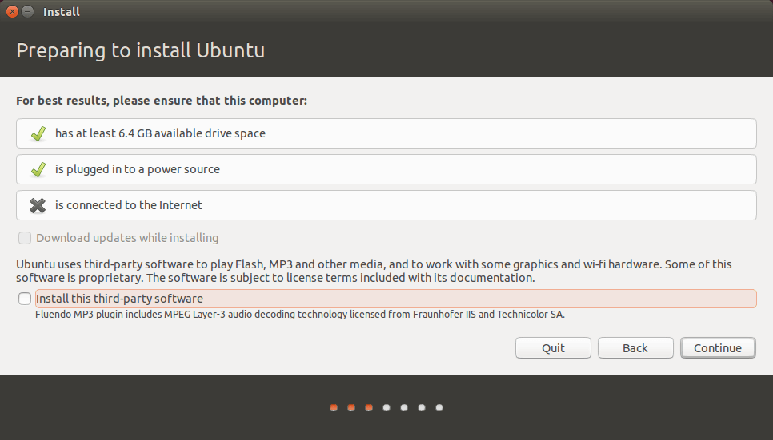
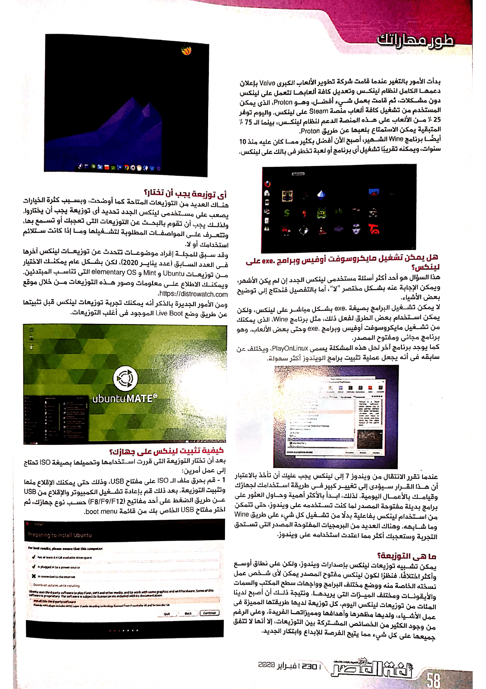

+++
title = "دليلك الشامل للهجرة من ويندوز 7 إلى لينكس"
date = "2020-02-01"
description = "صدر نظام التشغيل ويندوز 7 منذ عقد مضى وبالتحديد في عام 2009، ويعتبره الكثيرون أفضل إصدارات مايكروسوفت ويندوز على الإطلاق. لكن لكل شيء نهاية، فقد أعلنت مايكروسوفت يوم 14 من شهر يناير الماضي عن انتهاء الدعم الرسمي لويندوز 7، وبذلك لن يحصل على تحديثات جديدة ويشمل ذلك التحديثات الأمنية التي تعمل على سد الثغرات المكتشفة. وبعبارة أخرى فإن هذا يعنى أن مستخدمي ويندوز 7 أصبحوا في خطر التعرض للاختراق والقرصنة، فضلا عن مشكلة توقف البرامج عن دعم ويندوز 7 والتي ستحدث في القريب العاجل تماما كما حدث مع ويندوز XP. ولذلك يتبقى للمستخدم عدة اختيارات أهمها، الترقية إلى ويندوز 10، أو التحرر من نظام ويندوز والهجرة إلى لينكس."
categories = ["لينكس",]
tags = ["مجلة لغة العصر"]
images = ["images/0.png"]

+++
صدر نظام التشغيل ويندوز 7 منذ عقد مضى وبالتحديد في عام 2009، ويعتبره الكثيرون أفضل إصدارات مايكروسوفت ويندوز على الإطلاق. لكن لكل شيء نهاية، فقد أعلنت مايكروسوفت يوم 14 من شهر يناير الماضي عن انتهاء الدعم الرسمي لويندوز 7، وبذلك لن يحصل على تحديثات جديدة ويشمل ذلك التحديثات الأمنية التي تعمل على سد الثغرات المكتشفة. وبعبارة أخرى فإن هذا يعنى أن مستخدمي ويندوز 7 أصبحوا في خطر التعرض للاختراق والقرصنة، فضلا عن مشكلة توقف البرامج عن دعم ويندوز 7 والتي ستحدث في القريب العاجل تماما كما حدث مع ويندوز XP. ولذلك يتبقى للمستخدم عدة اختيارات أهمها، الترقية إلى ويندوز 10، أو التحرر من نظام ويندوز والهجرة إلى لينكس.

طبقا لأحدث إحصائيات NetMarketShare فإن 26% من إجمالي مستخدمي الأجهزة المكتبية التي تعمل بنظام ويندوز لا يزالون يستخدمون ويندوز 7، وهذا الرقم ضخم للغاية بالنظر إلى حقيقة أن مايكروسوفت قد أعلنت موعد انتهاء الدعم عن ويندوز 7 مسبقا في 2018. والآن وبعد انتهاء الدعم الرسمي لويندوز 7 فإن المستخدم الذي يحرص على أمانه الرقمي سيجد نفسه أمام مجموعة خيارات، أولها هو الدفع والترقية إلى ويندوز 10، والذي قد يعيقه ضعف مواصفات الجهاز، أو عدم القدرة على شراء ترخيص. لكن من وجهة نظر الكثيرين، فإن ويندوز 10 أسوا من حيث الخصوصية، وتجميع البيانات حول المستخدم ونشاطاته، كما يأتي معه العديد من البرامج المزعجة مثبتة مسبقا. أما الخيار الثاني فهو الترقية وشراء جهاز جديد يعمل بويندوز 10. والخيار الأخير هو الانتقال إلى نظام لينكس المجاني ومفتوح المصدر.

## نظام لينكس

عندما نقول لينكس فإننا نقصد به عائلة أنظمة التشغيل التي تندرج تحت هذا المسمى، فلينكس ليس نظام تشغيل واحد قام بتطويره شركة واحدة كما هو الحال مع الويندوز والماك. لكنه نتاج عمل الآلاف من المطورين من جميع أنحاء العالم. يستطيع أي شخص أن يطور نسخته الخاصة من نظام لينكس كما يرغب، ويٌطلق على هذه النسخ "توزيعات". 

وهناك العديد من التوزيعات التي يمكنك الاختيار منها وتجربة طبقا لاستخداماتك واحتياجاتك.

أما بشكل أكثر دقة، فلينكس هو اسم لنواة نظام تشغيل طورها لينوس تورفالدس عام 1991، وكان هذا النظام مجانيا، حيث تسمح رخصة استخدامه لكل شخص بالاطلاع على الكود المصدري ودراسته وتعديله ومشاركته وإعادة توزيعه كما يريد. وبداية من هذه النقطة قام المطورون بدمج النواة التي كان يطورها لينوس مع مجموعة من الأدوات الأخرى لإنشاء نظام تشغيل كامل يستطيع الجميع استخدامه. واستمر ذلك الوضع حتى الآن، لكن اليوم 99% من كود نواة لينكس لم يكتبه لينوس بنفسه بل الآلاف من المطورين المساهمين من شتى بقاع الأرض.

وتستخدم أغلب الأجهزة نظام لينكس بشكل أو بآخر، بداية من أجهزة السيرفرات الكبيرة، وحتى هواتف أندرويد وأجهزة التليفزيون الذكية، فربما أنت الآن تستخدم نظام لينكس دون أن تعلم! لكن في هذا الموضوع سنخص بالكلام نظام لينكس على أجهزة الكمبيوتر المكتبية وليس أجهزة السيرفر أو الأجهزة المدمجة.

## المصادر المفتوحة

عندما نطلق مصطلح Open Source أو مفتوح المصدر على برنامج أو نظام ما فإن ذلك يعني أن رخصته تسمح بدراسة الكود المصدري لهذا البرنامج وتعديله ومشاركته وإعادة توزيعه دون الحاجة إلى إذن كتابي خاص من مطور هذا البرنامج. نواة لينكس مفتوحة المصدر كما ذكرت سابقا، كما أن 99% تقريبا من البرمجيات التي تعمل على نظام لينكس مفتوحة المصدر أيضا. وهناك بعض البرامج مغلقة المصدر التي تعمل على لينكس كذلك.

## لماذا يجب أن تنتقل من ويندوز 7 إلى لينكس؟

1. لينكس نظام مجاني لا تحتاج لدفع أي أموال نظير استخدامه.
2. لينكس مفتوح المصدر، وذلك له العديد من المميزات والفوائد أذكر لك منها قاعدة المستخدمين المشتركة، بما يضمن أن مطوري البرمجيات لن يقوموا بزرع أبواب خلفية أو أكواد تجسس داخل البرامج التي تعمل على جهازك. كما أن لينكس يكفل للمستخدم حرية تعديل وتوزيع أي عمل مفتوح المصدر إذا رغب، بالإضافة إلى مشاركته مجانا.
3. لا توجد فيروسات في لينكس، آن الأوان لكي تنسي مضاد الفيروسات وإزعاجه، فلا حاجة لمثل هذه الأمور مع نظام لينكس.
4. من حيث الأداء، لينكس أسرع بكثير من ويندوز الذي يصبح أبطأ كل يوم تستخدمه فيه، كما أنه يعمل بكفاءة حتى على الأجهزة القديمة وذات المواصفات الضعيفة.
5. كل التعريفات تأتي محملة مع لينكس مسبقا، لن تحتاج مجددا إلى البحث على الإنترنت عن تعريفات أجهزتك وتحميلها وتثبيتها، باستثناء كروت الجرافيك التي ستحتاج إلى تثبيت بعض الحزم الإضافية لها فقط.
6. لينكس يلائم مختلف الاستخدامات، فهناك توزيعات للمستخدمين العاديين واللاعبين والمصممين ومستخدمي الأجهزة القديمة والمطورين، وكل استخدام يمكن أن تتخيله، ويرجع ذلك إلى العدد الضخم للتوزيعات المتوفرة.
7. إذا كنت ممن يستخدمون البرمجيات المقرصنة والكراكات، عليك أن تنسي كل ذلك عند استخدامك لنظام لينكس، فلن تحتاج إلى البحث عن برمجيات مقرصنة مجددا.
8. لا يصبح لينكس أبطأ بمرور الوقت ومع تثبيت العديد من البرمجيات والتطبيقات، سيظل جهازك يعمل بنفس الأداء الذي كان عليه عند تثبيتك للنظام لأول مرة.
9. لا توجد تحديثات إجبارية في لينكس، على الرغم من خطورة ترك جهازك بدون تثبيت آخر التحديثات، لكن في لينكس، أنت صاحب القرار. أيضا لينكس لا يحتاج إلى إعادة التشغيل لتثبيت التحديثات، باستثناء تحديثات النواة التي تحتاج إلى إعادة التشغيل للإقلاع باستخدام النسخة الجديدة.
10. لينكس سيساعدك في فهم كيفية عمل جهازك، كما يضمن لك الحرية المطلقة في استخدامه وعمل كل ما ترغب به.
11. لا توجد إعلانات أو برامج تجسس أو آليات لتجميع البيانات تعمل في الخفاء في نظام لينكس.

## أفكار ومفاهيم خاطئة عن نظام لينكس

1. لينكس هو عبارة عن موجه أوامر ذو شاشة سوداء وفقط.
يعتقد بعض الناس أن لينكس لا يمكن استخدامه إلا عن طريق واجهة موجه الأوامر فقط. لكن لينكس لديه العديد من الواجهات الرسومية التي لم تكن لتتخيل يوما وجودها على ويندوز والتي تلائم مختلف المستخدمين والأجهزة. ولربما السبب وراء هذا الاعتقاد هو ميل مستخدمي لينكس إلى استخدام سطر الأوامر بكثرة، لأنه يوفر الجهد والوقت بشكل كبير، فيمكنك القيام بمهمة ما تستغرق دقائق باستخدام الواجهة الرسومية في بضعة ثواني من خلال سطر الأوامر. ولكن هذا لا يعني بالمرة أن لينكس هو سطر أوامر وحسب.

2. لينكس نظام تشغيل للمبرمجين والمطورين فقط.
أحد أشهر الاعتقادات الخاطئة الشائعة هو أن لينكس نظام تشغيل للمبرمجين فقط. وبينما يفضل العديد من المبرمجين بالفعل نظام لينكس فإن هذا لا يعنى بالضرورة أن النظام حكر عليهم أو أن كل المبرمجين يستخدمون لينكس. فنظام لينكس مناسب لكل الناس، للأساتذة والطلاب وكبار السن وحتى الباحثين في المنشآت النووية! يمكنك إعداد لينكس بالطريقة التي تناسبك ليلائم استخدامك. وفي الواقع تشير الإحصائيات والدراسات إلى أن أغلب مستخدمي لينكس في الوقت الحالي ليسوا من المطورين أو المبرمجين.

3. لينكس لا يستطيع تشغيل الألعاب.
هذا الاعتقاد كان صحيحا منذ 10 سنوات، عندما كانت الألعاب على لينكس محصورة في الألعاب مفتوحة المصدر المصممة خصيصا له، أو الألعاب القديمة التي تعمل عن طريق برنامج Wine، لكن لحسن الحظ لم يعد هذا هو الحال الآن.
بدأت الأمور بالتغير عندما قامت شركة تطوير الألعاب الكبرى Valve بإعلان دعمها الكامل لنظام لينكس وتعديل كافة ألعابها لتعمل على لينكس دون مشاكل، ثم قامت بعمل شيء أفضل، وهو Proton، الذي يمكن المستخدم من تشغيل كافة ألعاب منصة Steam على لينكس. واليوم توفر 25% من الألعاب على هذه المنصة الدعم لنظام لينكس، بينما ال 75% المتبقية يمكن الاستمتاع بلعبها عن طريق Proton.
أيضا برنامج Wine الشهير، أصبح الآن أفضل بكثير مما كان عليه منذ 10 سنوات، ويمكنه تقريبا تشغيل أي برنامج أو لعبة تخطر في بالك على لينكس.

## هل يمكن تشغيل مايكروسوفت أوفيس وبرامج .exe على لينكس؟

هذا السؤال هو أحد أكثر أسئلة مستخدمي لينكس الجدد إن لم يكن الأشهر، ويمكن الإجابة عنه بشكل مختصر "لا"، أما بالتفصيل فنحتاج إلى توضيح بعض الأشياء.

لا يمكن تشغيل البرامج بصيغة .exe بشكل مباشر على لينكس، ولكن يمكن استخدام بعض الطرق لفعل ذلك، مثل برنامج Wine، الذي يمكنك من تشغيل مايكروسوفت أوفيس وبرامج .exe وحتى بعض الألعاب. وهو برنامج مجاني ومفتوح المصدر.

كما يوجد برنامج آخر لحل هذه المشكلة يسمي PlayOnLinux، ويختلف عن سابقه في أنه يجعل عملية تثبيت برامج الويندوز أكثر سهولة.

عندما تقرر الانتقال من ويندوز 7 إلى لينكس يجب عليك أن تأخذ بالاعتبار أن هذا القرار سيؤدي إلى تغيير كبير في طريقة استخدامك لجهازك وقيامك بالأعمال اليومية. لذلك، ابدأ بالأكثر أهمية وحاول العثور على برامج بديلة مفتوحة المصدر لما كنت تستخدمه على ويندوز، حتى تتمكن من استخدام لينكس بفاعلية بدلا من تشغيل كل شيء على طريق Wine وما شابهه. وهناك العديد من البرمجيات المفتوحة المصدر التي تستحق التجربة وستعجبك أكثر مما اعتدت استخدامه على ويندوز.

## ما هي التوزيعة؟

يمكن تشبيه توزيعات لينكس بإصدارات ويندوز، ولكن على نطاق أوسع وأكثر اختلافا. فنظرا لكون لينكس مفتوح المصدر يمكن لأي شخص عمل نسخته الخاصة منه ووضع مختلف البرامج وواجهات سطح المكتب والسمات والأيقونات ومختلف الميزات التي يريدها. ونتيجة ذلك أن أصبح لدينا المئات من توزيعات لينكس اليوم، كل توزيعة لديها طريقتها المميزة في عمل الأشياء، ولديها مظهرها وأهدافها ومميزاتها الفريدة. وعلى الرغم من وجود الكثير من الخصائص المشتركة بين التوزيعات، إلا أنها لا تتفق جميعها على كل شيء مما يتيح الفرصة للإبداع وابتكار الجديد.

## أي توزيعة يجب أن تختار؟

هناك العديد من التوزيعات المتاحة كما أوضحت، وبسبب كثرة الخيارات يصعب على مستخدمي لينكس الجدد تحديد أي توزيعة يجب أن يختاروا. ولذلك يجب أن تقوم بالبحث عن التوزيعات التي تعجبك أو تسمع بها، وتتعرف على المواصفات المطلوبة لتشغيلها وما إذا كانت ستلائم استخدامك أو لا.

وقد سبق للمجلة إفراد موضوعات تتحدث عن توزيعات لينكس آخرها كان العدد السابق، لكن بشكل عام يمكنك الاختيار من توزيعات Ubuntu وMint وelementary OS التي تناسب المبتدئين، ويمكنك الاطلاع على معلومات وصور هذه التوزيعات من خلال موقع https://distrowatch.com.

ومن الأمور الجديرة بالذكر أنه يمكنك تجربة توزيعات لينكس قبل تثبيتها عن طريق وضع Live Boot الموجود في أغلب التوزيعات.

## كيفية تثبيت لينكس على جهازك؟

بعد أن تختار التوزيعة التي قررت استخدامها وتحميلها بصيغة ISO تحتاج إلى عمل أمرين:

1. قم بحرق ملف ال ISO على مفتاح USB، وذلك حتى يمكنك الإقلاع منها وتثبيت التوزيعة. بعد ذلك قم بإعادة تشغيل الكمبيوتر والإقلاع من USB عن طريق الضغط على أحد مفاتيح (F8/F9/F12) حسب نوع جهازك، ثم اختار مفتاح USB الخاص بك من قائمة boot menu.

2. قم بتثبيت النظام الجديد على جهازك. بالطبع تختلف الخطوات من توزيعة إلى أخرى، وذلك لوجود عدد من برامج التثبيت المختلفة موزعة بين التوزيعات. وللتأكد من اتباع الخطوات السليمة عليك بقراءة التعليمات الموجودة على موقع التوزيعة، أو مشاهدة أحد الدروس الموجودة على يوتيوب والتي يصل عددها إلى الآلاف.
وبعد الانتهاء من خطوة التثبيت تحتاج إلى تثبيت البرمجيات التي ستستخدمها وعمل بعض الخطوات الإضافية، والتي يمكنك التعرف عليها من خلال البحث عن "أشياء تفعلها بعد تثبيت توزيعة.... أو Things to do after installing……" على الإنترنت.

## البرامج البديلة

قد تكون عملية إيجاد برامج بديلة لما اعتدت استخدامه في الويندوز صعبة. لكن لحسن الحظ، توجد العديد من البرامج توفر نسخة خاصة بـ لينكس مثل أغلب المتصفحات وبرامج تشغيل الوسائط، كما يوجد العديد من المصادر التي يمكنك الاطلاع عليها لمعرفة البرامج البديلة لبرامج الويندوز منها:
https://en.wikipedia.org/wiki/List_of_free_and_open-source_software_packages
https://alternativeto.net
كما استعرضت المجلة في عددي أغسطس وأكتوبر 2018 قائمة بأهم البرامج التي يجب تثبيتها على توزيعة أوبونتو.

## الحصول على المساعدة

عند مواجهة المشاكل في لينكس فلن تستطيع اللجوء إلى الحلول التقليدية مثل الاستعانة بصديق – إلا إذا كان مستخدم لينكس أيضا – لذلك عليك بإتقان مهارة البحث على الإنترنت، ولكن لا تقلق، فهناك العديد من مجتمعات مستخدمي لينكس على الإنترنت، متوفرة بأغلب اللغات بما فيها اللغة العربية، ويمكنك طرح تساؤلاتك في هذه المواقع والمنتديات وغرف الدردشة في حال واجهتك أية مشكلة ولم تستطع إيجاد حل لها عن طريق البحث.

قد يبدو الانتقال إلى لينكس بعد سنوات من استخدام الويندوز أمرا صعبا للغاية، لكن صدقني، بمجرد الاعتياد عليه فلن تستخدم ويندوز مجددا إلا للضرورة، فلينكس يتفوق على الويندوز بفارق كبير في الخصوصية والأداء والأمان. وبشكل شخصي فإنني استخدم لينكس منذ 2016 بشكل متقطع ومنذ 2017 بشكل يومي، وأعتقد أن لينكس قد أصبح الآن نظاما يعتمد عليه بما فيه الكفاية، وبديلا لويندوز يستحق التجربة.

---

هذا الموضوع نُشر باﻷصل في مجلة لغة العصر العدد 230 شهر 02-2020 ويمكن الإطلاع عليه [هنا](https://drive.google.com/file/d/13yxqTp-ZwlMo3h-nISmNsdkc-l6S2Jxz/view?usp=sharing).

