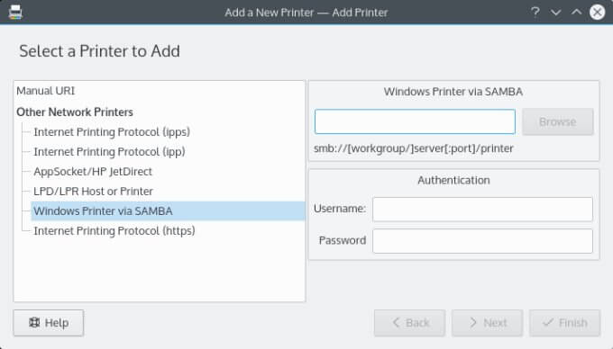
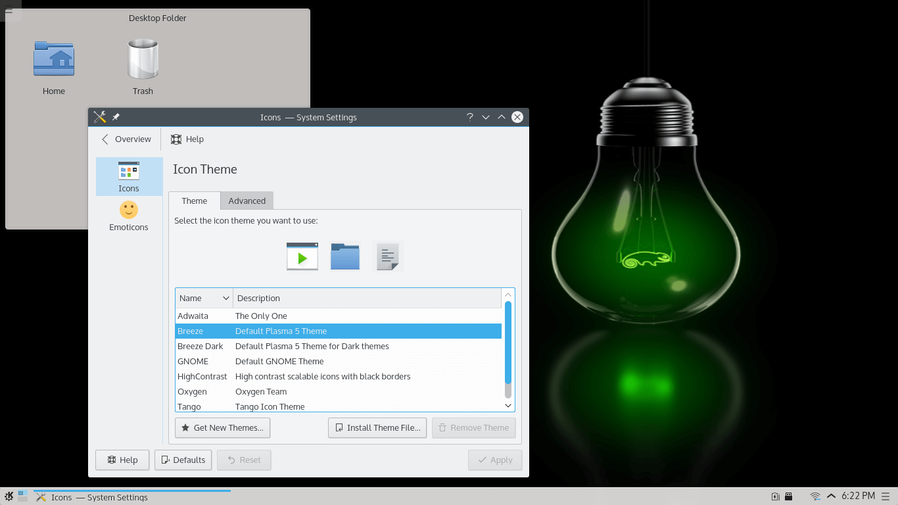
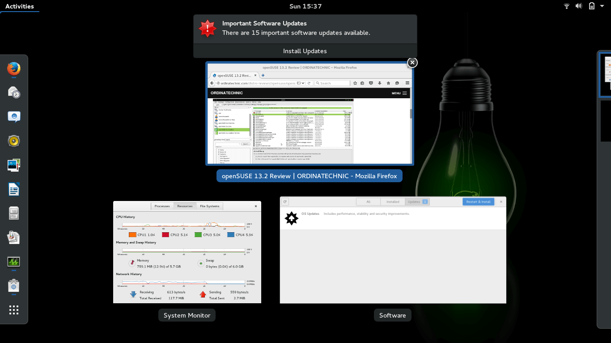
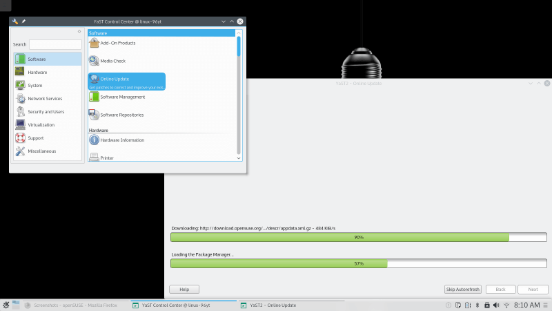
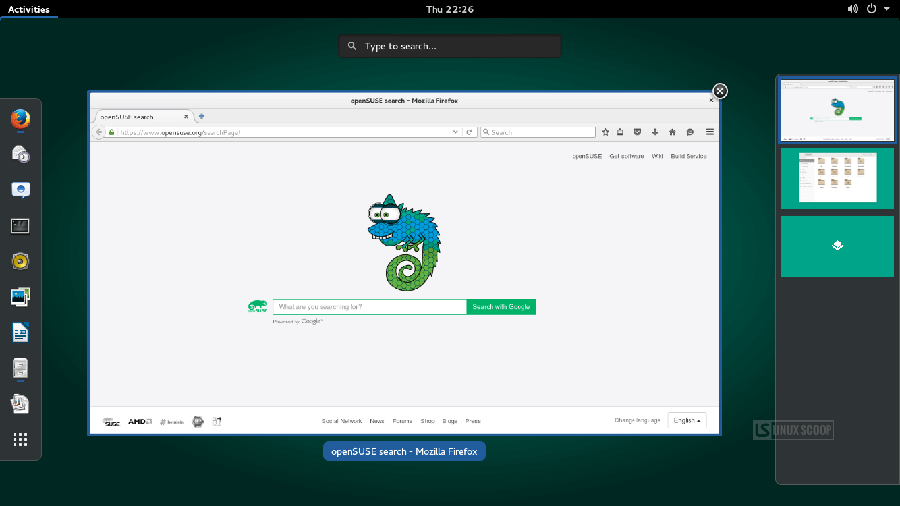
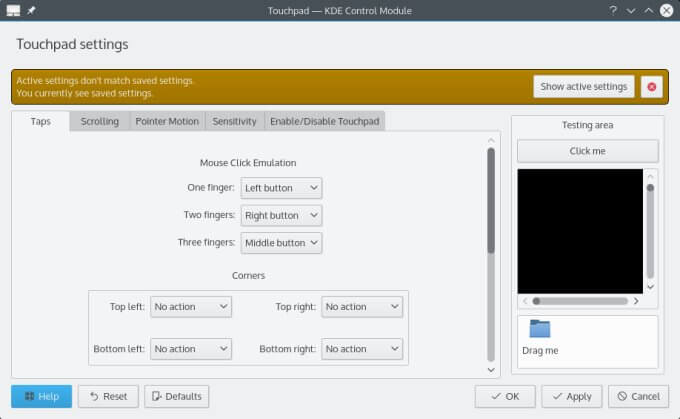
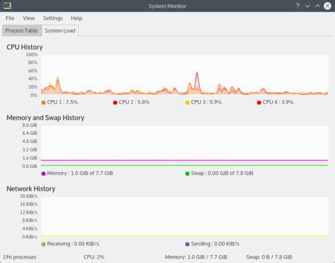
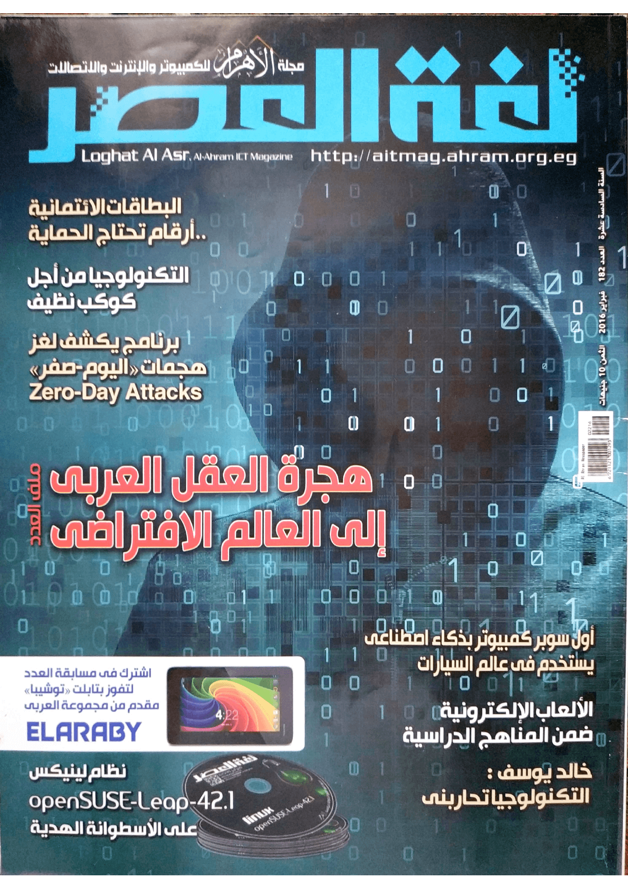
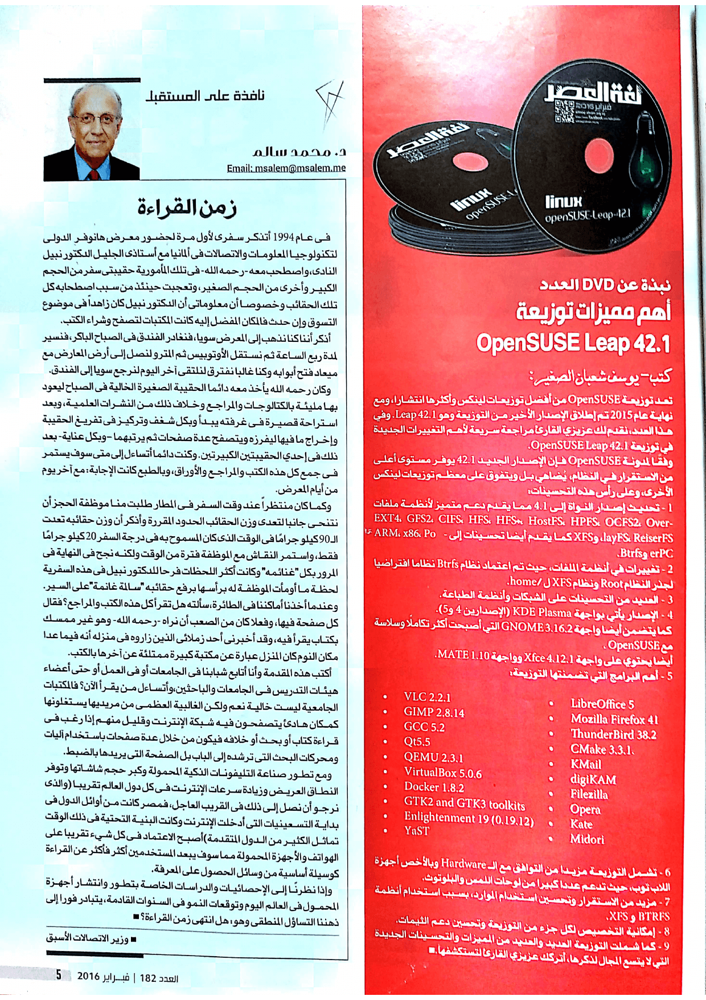

+++
title = "نظرة علي أهم مميزات توزيعة OpenSUSE Leap 42.1"
date = "2016-02-01"
description = "تعد توزيعة OpenSUSE من أفضل توزيعات لينكس وأكثرها انتشارا، ومع نهاية عام 2015 تم إطلاق الإصدار الأخير من التوزيعة وهو Leap 42.1 نقدم لك عزيزي القارئ مراجعة سريعة لأهم التغييرات الجديدة في توزيعة OpenSUSE Leap 42.1."
categories = ["لينكس",]
tags = ["مجلة لغة العصر"]

+++

تعد توزيعة OpenSUSE من أفضل توزيعات لينكس وأكثرها انتشارا، ومع نهاية عام 2015 تم إطلاق الإصدار الأخير من التوزيعة وهو Leap 42.1 نقدم لك عزيزي القارئ مراجعة سريعة لأهم التغييرات الجديدة في توزيعة OpenSUSE Leap 42.1.

وفقًا لمدونة أوبن سوزي فإن الإصدار الجديد 42.1 يوفر مستوى أعلى من الاستقرار في النظام والذي يُضاهي بل ويتفوق على معظم توزيعات لينكس الأخرى، وعلى رأس هذه التحسينات.

1. تحديث اصدار النواة إلى 4.1 مما يقدم دعم متميز لأنظمة ملفات EXT4, GFS2, CIFS, HFS, HFS+, HostFS, HPFS, OCFS2, OverlayFS, ReiserFS, وXFS كما يقدم أيضا تحسينات إلى ARM, x86, PowerPC وBtrfs.

2. تغييرات في أنظمة الملفات:

حيث تم اعتماد نظام Btrfs نظاما افتراضيا لجذر النظام Root ونظام XFS ل /home.

3. العديد من التحسينات على الشبكات وأنظمة الطباعة.

4. الإصدار يأتي بواجهة KDE Plasma (الإصدارين 4 و5).

كما يتضمن أيضا واجهة GNOME 3.16.2 التي أصبحت أكثر تكاملًا وسلاسة مع أوبن سوزي.

أيضا يحتوي على واجهة Xfce 4.12.1 وواجهة MATE 1.10.

5. أهم البرامج التي تضمنتها التوزيعة:

-   ​ VLC 2.2.1
-   ​ GIMP 2.8.14
-   ​ GCC 5.2
-   ​ Qt5.5
-   ​ QEMU 2.3.1
-   ​ VirtualBox 5.0.6
-   ​ Docker 1.8.2
-   ​ GTK2 and GTK3 toolkits
-   ​ Enlightenment 19 (0.19.12)
-   ​ YaST

-   ​ LibreOffice 5
-   ​ Mozilla Firefox 41

-   ​ ThunderBird 38.2
-   ​ CMake 3.3.1.
-   ​ KMail
-   ​ digiKAM
-   ​ Filezilla
-   ​ Opera
-   ​ Kate
-   ​ Midori

6. شملت التوزيعة مزيد من التوافق مع ال Hardware وبالأخص أجهزة اللاب توب حيث دعمت عددا كبيرا من لوحات اللمس والبلوتوث.

7. مزيد من الاستقرار وتحسين استخدام الموارد، بسبب استخدام أنظمة BTRFS و XFS.

8. إمكانية التخصيص لكل جزء من التوزيعة وتحسين دعم الثيمات.

9. كما شملت التوزيعة العديد والعديد من المميزات والتحسينات الجديدة التي لا يتسع المجال لذكرها، أتركك عزيزي القارئ لتستكشفها.

---

هذا الموضوع نُشر باﻷصل في مجلة لغة العصر العدد 182 شهر 2-2016 ويمكن الإطلاع عليه [هنا](https://drive.google.com/file/d/1Wx26dCh98PhkzJd_LJXU3NHNbzh88u1-/view?usp=sharing).

