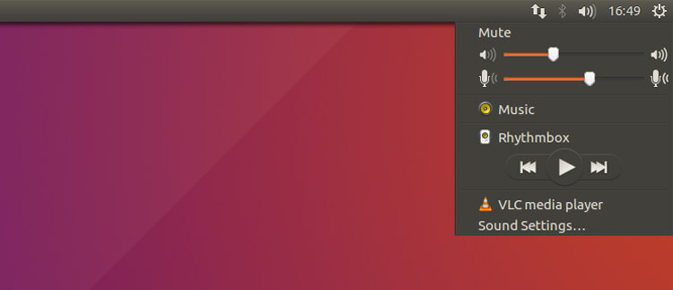
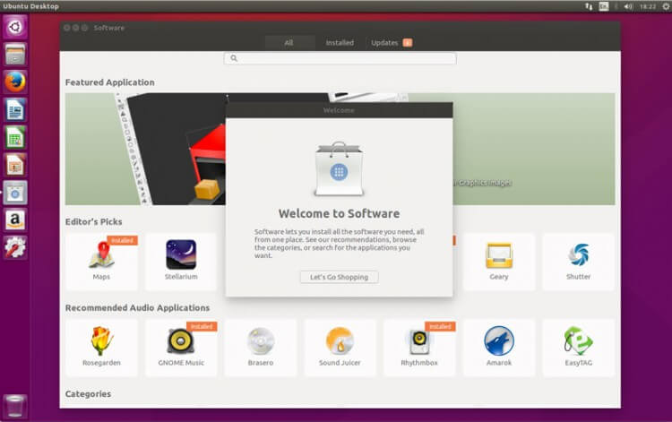

+++
title = "كيفية الترقية إلى أوبنتو 16.04 LTS"
date = "2016-05-01"
description = "في يوم 21 من الشهر الماضي، أعلنت شركة كانونيكال أخيرا عن إطلاق الإصدار المنتظر من توزيعة Ubuntu وهو الإصدار 16.04 LTS والذي يعد سادس إصدار طويل الدعم من نظام أوبنتو وأكبر تحديث منذ عامين، شمل الإصدار العديد من التغييرات والتحسينات الجديدة التي سنتعرف إليها في هذا الموضوع، كما سنتعرف أيضا على طريقة الترقية والتحميل."
categories = ["لينكس",]
tags = ["مجلة لغة العصر"]
series = ["دليل لينكس"]
images = ["images/0.png"]

+++
في يوم 21 من الشهر الماضي، أعلنت شركة كانونيكال أخيرا عن إطلاق الإصدار المنتظر من توزيعة Ubuntu وهو الإصدار 16.04 LTS والذي يعد سادس إصدار طويل الدعم من نظام أوبنتو وأكبر تحديث منذ عامين، شمل الإصدار العديد من التغييرات والتحسينات الجديدة التي سنتعرف إليها في هذا الموضوع، كما سنتعرف أيضا على طريقة الترقية والتحميل.

من أكبر ما يميز Ubuntu 16.04 LTS (‘Xenial Xerus’) هو الدعم المستمر لمدة 5 سنوات إلى جانب التحديثات الأمنية المستمرة وتحديثات البرامج، ويرجع هذا إلى أنه إصدار LTS (دعم المدى الطويل) فقد أصبح الإصدار الموصي بتحميله واستخدامه لكل من يرغب في تثبيت أوبنتو على جهازه إلى حين صدور الإصدار 18.04.

## المميزات الجديدة في Ubuntu 16.04

### 1- تحديث النواة إلى الإصدار 4.4

 والذي يقدم دعما أفضل للأجهزة العاملة بشرائح Intel Skylake، وأيضا دعم أفضل ل 3D و Journaled RAID 5، إلى جانب تحديث التعريفات الخاصة ب Corsair Vengeance K90 و Logitech G29 racing wheel وبعض أجهزة اللاب توب الجديدة من توشيبا.

### 2- تقديم الدعم لمزيد من الأنظمة

مثل تقنية ZFS لأنظمة الملفات وهي تقنية متطورة جدا لإدارة الملفات واسترجاعها، أيضا تم إضافة دعم أنظمة IBM Z و LinuxONE.

### 3-  صيغة جديدة للبرامج

هي صيغة Snappy الجديدة، والتي تتميز بالأمان والموثوقية، كما تجعل عملية تثبيت البرامج من المصادر الخارجية أسهل بكثير، فهي تتضمن جميع الملفات والمكتبات الخاصة بالتطبيقات، وتستطيع تثبيت نفسها دون التأثير أو الاعتماد على غيرها من الملفات في نظام التشغيل.

### 4- تحديث إصدار Python الافتراضي إلى الإصدار 3.5:

مما يقدم مميزات أفضل لمطوري البرامج، بالنسبة للبرامج التي تستخدم الإصدار 2 ستعمل أيضا بدون مشاكل.

### 5- اختصارات جديدة

حيث تم تغيير HUD (heads-up display) من ALT إلى ALT+SPACE.

### 6- واجهة Unity 7.4

والتي اشتملت على العديد من التغييرات لعل أبرزها هو إمكانية تغيير مكان المشغل Launcher (شريط تشغيل التطبيقات) من الجهة اليسرى للشاشة إلى الأسفل بشكل أفقي.

أيضا تم تعطيل ميزة البحث عبر الإنترنت من خلال ال Dash افتراضيا، ويمكن للمستخدم تفعيلها من خلال الإعدادات.

كما تضمن التحديث إمكانية عمل اختصارات على سطح المكتب من خلال السحب والإفلات، تقديم دعم أفضل للشاشات عالية الوضوح HiDPI، إضافة اختيار لجعل القوائم تظهر دائما في البرامج، إضافة اختصارات جديدة في القائمة السريعة Quicklist، إضافة اختصارات للتحكم في الطاقة من خلال ال Dash من خلال كتابة كلمة Session فقط، زيادة سرعة تسجيل الدخول والخروج، وأخيرا إضافة Slider خاص بالتحكم في صوت الميكروفون.

### 7- إزالة مركز برمجيات أوبنتو

وهو التغيير الأكبر في هذا الإصدار، حيث تم استبدال مركز برمجيات أوبنتو بتطبيق GNOME Software المُعتمد سابقًا ضمن توزيعة فيدورا Fedora.

### 8- تغييرات في البرامج المدمجة

حيث تم إزالة تطبيق Brasero لنسخ الأقراص وتطبيق لمحادثات الفورية Empathy، بينما تم إضافة بعض التطبيقات الجديدة مثل تقويم GNOME Calendar وتطبيق كاميرا الويب Cheese.

كما تم ترقية العديد من البرامج المدمجة إلى آخر اصداراتها مثل:
    • Firefox 45
    • Thunderbird 38
    • Chromium 48
    • LibreOffice 5.1
    • Nautilus (‘Files’) 3.14.2
    • Totem (‘Videos’) 3.18
    • Rhythmbox 3.3
    • GNOME Terminal 3.18
    • Eye of GNOME 3.18
    • Shotwell 0.22

## كيفية تحميل Ubuntu 16.04

كل ما عليك فعله هو الدخول إلى صفحة التحميل http://releases.ubuntu.com/16.04/ واختيار النسخة التي تود تحميلها سواء 32 أو 64، Desktop أو Server، ستجد روابط مباشرة للتحميل وأيضا روابط torrent.

## كيفية الترقية إلى الإصدار Ubuntu 16.04

- للترقية من الإصدار 14.04 إلى 16.04:

قم بالتأكد من تثبيت جميع التحديثات الجديدة وأنه لا توجد أي تحديثات متوفرة، ثم قم بفتح الطرفية Terminal واكتب الأوامر التالية:
sudo apt-get update
sudo apt-get update && sudo apt-get dist-upgrade
sudo update-manager –d
ستظهر لك الرسالة التالية:

اضغط على Upgrade ثم Upgrade مرة أخرى ثم اضغط start upgrade وانتظر حتى تحميل وتثبيت التحديث.

- للترقية من الإصدار 15.10 إلى 16.04:

ستحتاج لإعداد النظام قبل التحديث:
قم بالدخول إلى تطبيق الإعدادات ثم Software & Updates انتقل إلى التبويب Updates، ثم قم بتغيير Notify me of a new version إلى for LTS version.

بعد ذلك أعد تشغيل الجهاز قم بالدخول إلى مدير التحديثات Update Manager وتحقق من وجود تحديثات لتجد التحديثات إلى 16.04 LTS متاحا للتثبيت.
- ملاحظة: يمكنك استخدام أمر الترقية sudo do-release-upgrade في حالة عدم ظهور نافذة التحديث.

---

هذا الموضوع نُشر باﻷصل في مجلة لغة العصر العدد 185 شهر 05-2016 ويمكن الإطلاع عليه [هنا](https://drive.google.com/file/d/1QH89M5_xSqY5_q-wUvSV5gn4CK7kdkxq/view?usp=sharing).

