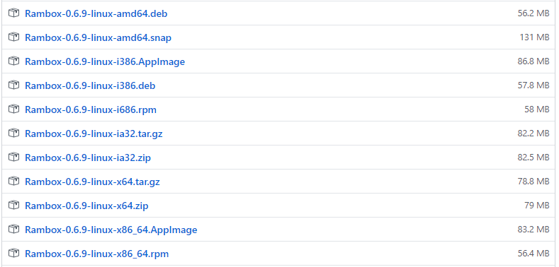
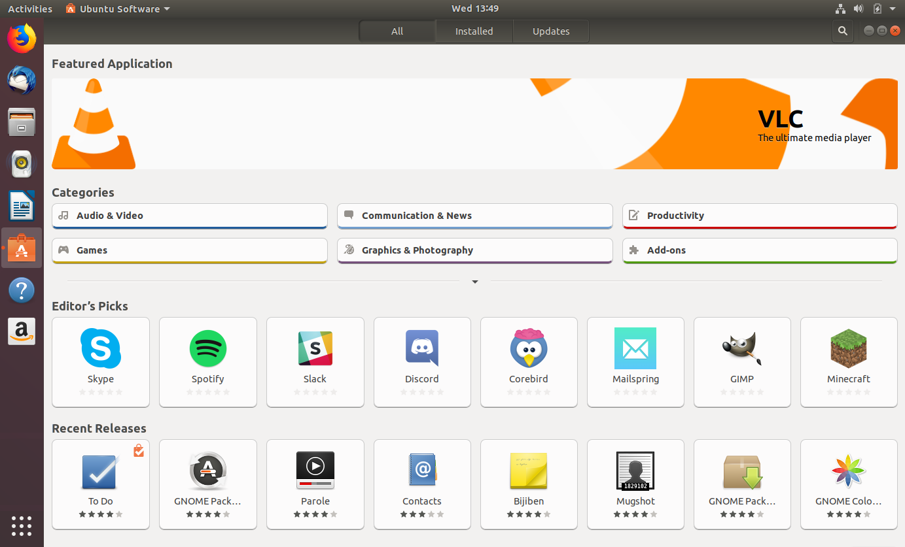
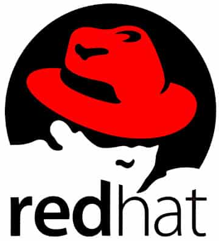
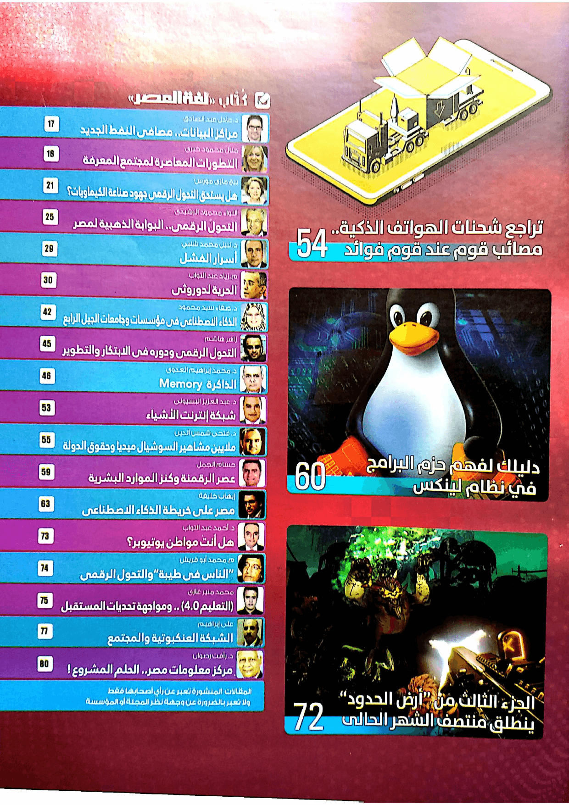
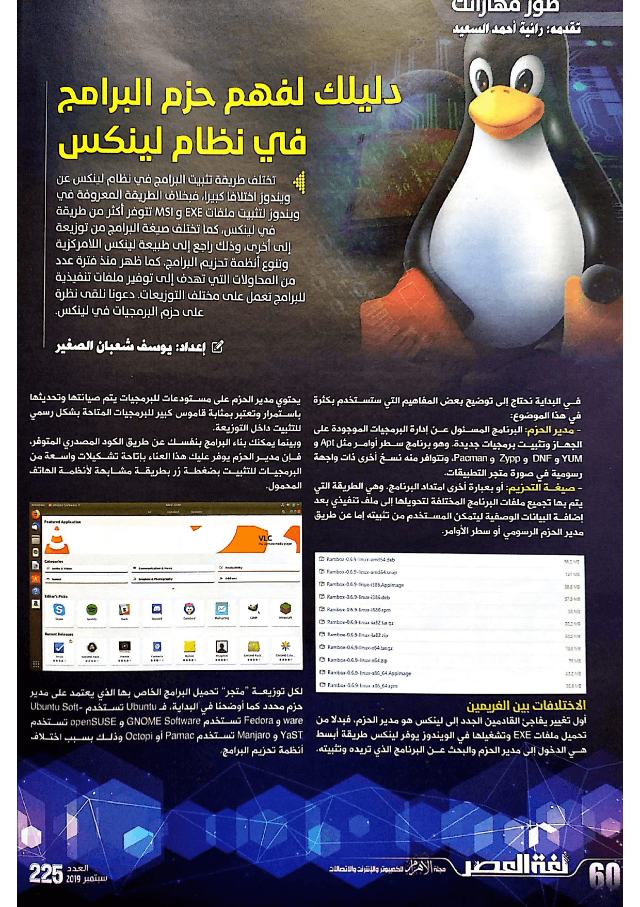
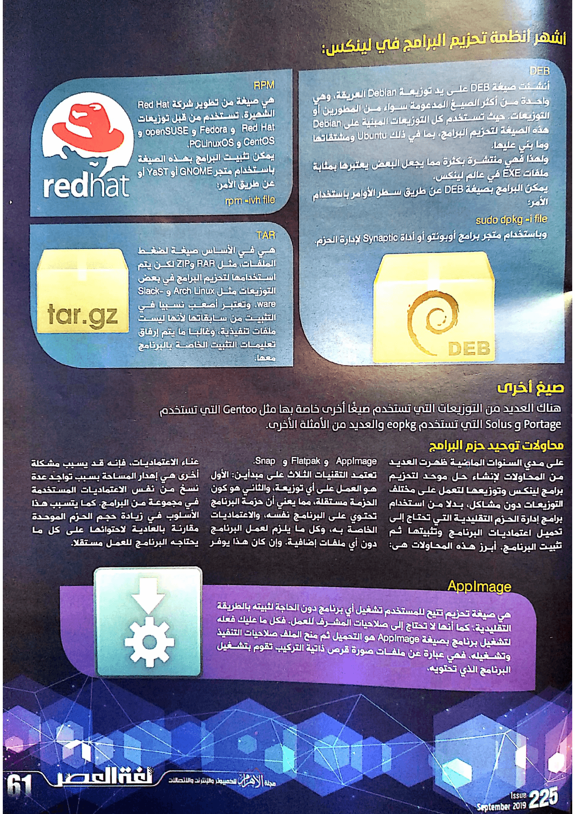
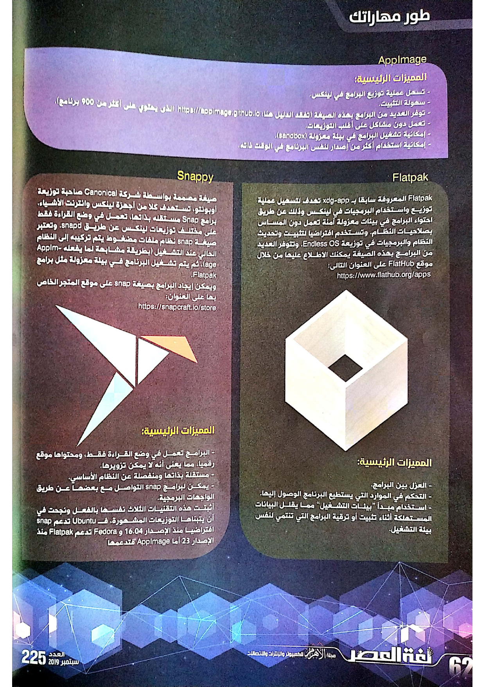

+++
title = "دليلك لفهم حزم البرامج في نظام لينكس"
date = "2019-09-01"
description = "تختلف طريقة تثبيت البرامج في نظام لينكس عن ويندوز اختلافًا كبيرًا، فبخلاف الطريقة المعروفة في ويندوز لتثبيت ملفات EXE وMSI تتوفر أكثر من طريقة في لينكس، كما تختلف صيغة البرامج من توزيعة إلى أخرى، وذلك راجع إلى طبيعة لينكس اللامركزية وتنوع أنظمة تحزيم البرامج. كما ظهر منذ فترة عدد من المحاولات التي تهدف إلى توفير ملفات تنفيذية للبرامج تعمل على مختلف التوزيعات. دعونا نلقى نظرة على حزم البرمجيات في لينكس."
categories = ["لينكس",]
tags = ["مجلة لغة العصر"]

+++

تختلف طريقة تثبيت البرامج في نظام لينكس عن ويندوز اختلافًا كبيرًا، فبخلاف الطريقة المعروفة في ويندوز لتثبيت ملفات EXE وMSI تتوفر أكثر من طريقة في لينكس، كما تختلف صيغة البرامج من توزيعة إلى أخرى، وذلك راجع إلى طبيعة لينكس اللامركزية وتنوع أنظمة تحزيم البرامج. كما ظهر منذ فترة عدد من المحاولات التي تهدف إلى توفير ملفات تنفيذية للبرامج تعمل على مختلف التوزيعات. دعونا نلقى نظرة على حزم البرمجيات في لينكس.

في البداية نحتاج إلى توضيح بعض المفاهيم التي ستستخدم بكثره في هذا الموضوع:

-   مدير الحزم: البرنامج المسؤول عن إدارة البرمجيات الموجودة على الجهاز وتثبيت برمجيات جديدة. وهو برنامج سطر أوامر مثل Apt وYUM، وDNF، وZYpp، وPacman، وتتوفر منه نسخ أخرى ذات واجهة رسومية في صورة متجر التطبيقات.
-   صيغة التحزيم: أو بعبارة أخرى كما هي متعارف عليها، امتداد البرنامج. وهي الطريقة التي يتم تجميع ملفات البرنامج المختلفة بها لتحويله إلى ملف تنفيذي بعد إضافة البيانات الوصفية ليتمكن المستخدم من تثبيته إما عن طريق مدير الحزم الرسومي أو سطر الأوامر.

## الاختلافات بين الغريمين

أول تغيير يفاجئ القادمين الجدد إلى لينكس هو مدير الحزم، فبدلا من تحميل ملفات EXE وتشغيلها في الويندوز يوفر لينكس طريقة أبسط هي الدخول إلى مدير الحزم والبحث عن البرنامج الذي تريده وتثبيته. يحتوي مدير الحزم على مستودعات للبرمجيات يتم صيانتها وتحديثها باستمرار وتعتبر بمثابة قاموس كبير للبرمجيات المتاحة بشكل رسمي للتثبيت داخل التوزيعة.

وبينما يمكنك بناء البرامج بنفسك عن طريق الكود المصدري المتوفر، فإن مدير الحزم يوفر عليك هذا العناء بإتاحة تشكيلات واسعة من البرمجيات للتثبيت بضغطة زر بطريقة مشابهة لأنظمة الهاتف المحمول.

لكل توزيعة "متجر" تحميل البرامج الخاص بها الذي يعتمد على مدير حزم محدد كما أوضحت في البداية، ف Ubuntu تستخدم Ubuntu Software وFedora تستخدم GNOME Software وopenSUSE تستخدم YaST، وManjaro تستخدم Pamac أو Octopi، وذلك راجع كما أشرت إلى اختلاف أنظمة تحزيم البرامج.

## أشهر أنظمة تحزيم البرامج في لينكس

### DEB

أنشئت صيغة DEB على يد توزيعة Debian العريقة، وهي واحدة من أكثر الصيغ المدعومة سواء من المطورين أو التوزيعات. حيث تستخدم كل التوزيعات المبنية على Debian هذه الصيغة لتحزيم البرامج، بما في ذلك Ubuntu ومشتقاتها وما بني عليها.

ولهذا فهي منتشرة بكثرة مما يجعل البعض يعتبرها بمثابة ملفات EXE في عالم لينكس.
يمكن البرامج بصيغة DEB عن طريق سطر الأوامر باستخدام الأمر
`sudo dpkg -i file`
وباستخدام متجر برامج أوبونتو أو أداة Synaptic لإدارة الحزم.

### RPM

هي صيغة من تطوير شركة Red Hat الشهيرة. تستخدم من قبل توزيعات Red Hat وFedora وopenSUSE، وCentOS، وPCLinuxOS.
يمكن تثبيت البرامج بهذه الصيغة باستخدام متجر GNOME أو YaST أو عن طريق الأمر
`rpm -ivh file`

### TAR

هي في الأساس صيغة لضغط الملفات، مثل RAR وZIP، لكن يتم استخدامها لتحزيم البرامج في بعض التوزيعات مثل Arch Linux وSlackware. وتعتبر أصعب نسبيا في التثبيت من سابقاتها لأنها ليست ملفات تنفيذية، وغالبا ما يتم إرفاق تعليمات التثبيت الخاصة بالبرنامج معها.

### صيغ أخرى

هناك العديد من التوزيعات التي تستخدم صيغ أخرى خاصة بها مثل Gentoo التي تستخدم Portage، وSolus التي تستخدم eopkg، والعديد من الأمثلة الأخرى.

## محاولات توحيد حزم البرامج

على مدي السنوات الماضية ظهرت العديد من المحاولات لإنشاء حل موحد لتحزيم برامج لينكس وتوزيعها لتعمل على مختلف التوزيعات دون مشاكل، بدلا من استخدام برامج إدارة الحزم التقليدية التي تحتاج إلى تحميل اعتماديات البرنامج وتثبيتها ثم تثبيت البرنامج. أبرز هذه المحاولات هي AppImage – Flatpak – Snap.

تعتمد الثلاثة تقنيات على مبدأين: الأول هو العمل على أي توزيعة، والثاني هو كون الحزمة مستقلة، مما يعني أن حزمة البرنامج تحتوي على البرنامج نفسه، والاعتماديات الخاصة به، وكل ما يلزم لعمل البرنامج دون أي ملفات إضافية. وإن كان هذا يوفر عناء الاعتماديات، فإنه قد يسبب مشكلة أخرى هي إهدار المساحة بسبب تواجد عدة نسخ من نفس الاعتماديات المستخدمة في مجموعة من البرامج. كما يتسبب هذا الأسلوب في زيادة حجم الحزم الموحدة مقارنة بالعادية لاحتوائها على كل ما يحتاجه البرنامج للعمل مستقلا.

### AppImage

هي صيغة تحزيم تتيح للمستخدم تشغيل أي برنامج دون الحاجة لثبيته بالطريقة التقليدية، كما أنها لا تحتاج إلى صلاحيات المشرف للعمل. فكل ما عليك فعله لتشغيل برنامج بصيغة AppImage هو التحميل ثم منح الملف صلاحيات التنفيذ وتشغيله. فهي عبارة عن ملفات صورة قرص ذاتية التركيب تقوم بتشغيل البرنامج الذي تحتويه.

#### المميزات الرئيسية

-   تسهل عملية توزيع البرامج في لينكس.
-   سهولة التثبيت.
-   توفر العديد من البرامج بهذه الصيغة (تفقد الدليل هنا https://appimage.github.io يحتوي على أكثر من 900 برنامج).
-   تعمل دون مشاكل على كل أغلب التوزيعات.
-   إمكانية تشغيل البرامج في بيئة معزولة (sandbox).
-   إمكانية استخدام أكثر من إصدار لنفس البرنامج في الوقت ذاته.

### Flatpak

Flatpak المعروفة سابقا بxdg-app تهدف لتسهيل عملية توزيع واستخدام البرمجيات في لينكس وذلك عن طريق احتواء البرامج في بيئات معزولة آمنة تعمل دون المساس بصلاحيات النظام. وتستخدم افتراضيا لتثبيت وتحديث النظام والبرمجيات في توزيعة Endless OS. وتتوفر العديد من البرامج بهذه الصيغة يمكنك الاطلاع عليها من خلال موقع FlatHub https://www.flathub.org/apps

#### المميزات الرئيسية

-   العزل بين البرامج.
-   التحكم في الموارد التي يستطيع البرنامج الوصول إليها.
-   استخدام مبدأ "بيئات التشغيل" مما يقلل البيانات المستهلكة أثناء تثبيت أو ترقية البرامج التي تنتمي لنفس بيئة التشغيل.

### Snappy

صيغة مصممة بواسطة شركة Canonical صاحبة توزيعة أوبونتو، تستهدف كلا من أجهزة لينكس وانترنت الأشياء. برامج Snap مستقله بذاتها، تعمل في وضع القراءة فقط على مختلف توزيعات لينكس عن طريق snapd. وتعتبر صيغة snap نظام ملفات مضغوط يتم تركيبه إلى النظام الحالي عند التشغيل (بطريقة مشابهة لما يفعله AppImage)، ثم يتم تشغيل البرنامج في بيئة معزولة مثل برامج Flatpak.
ويمكن إيجاد البرامج بصيغة snap على موقع المتجر الخاص بها https://snapcraft.io/store

#### المميزات الرئيسية

-   البرامج تعمل في وضع القراءة فقط، ومحتواها موقع رقميا، مما يعنى أنه لا يمكن تزويرها.
-   مستقلة بذاتها ومنفصلة عن النظام الأساسي.
-   يمكن لبرامج snap التواصل مع بعضها عن طريق الواجهات البرمجية.

هذه التقنيات الثلاث قد أثبتت نفسها بالفعل ونجحت في أن يتبناها التوزيعات المشهورة، ف Ubuntu تدعم snap افتراضيا منذ الإصدار 16.04، وFedora تدعم Flatpak منذ الإصدار 23، أما AppImage فتدعمها توزيعه Nitrux OS افتراضيا وتعتمدها في متجر البرامج الخاص بها.

والمميز في الأمر أن الثلاث تقنيات تعمل جنبًا إلى جنب دون مشاكل أو تعارض. وكل منها مميز بطريقته، ف AppImages تعتبر أفضل اختيار لتوزيع البرامج للمستخدم النهائي، وFlatpak تظهر جدارتها عند استخدام توزيعة ذات واجهة رسومية، وأخيرا Snappy هي الاختيار الأفضل لتوزيعات أجهزة انترنت الأشياء، كما تدعم التحديثات التلقائية دون تدخل من المستخدم.

---

هذا الموضوع نُشر باﻷصل في مجلة لغة العصر العدد 225 شهر 09-2019 ويمكن الإطلاع عليه [هنا](https://drive.google.com/file/d/1KkqxwKng06EsYaIj5OTrDe26AxR7eEJO/view?usp=sharing).

