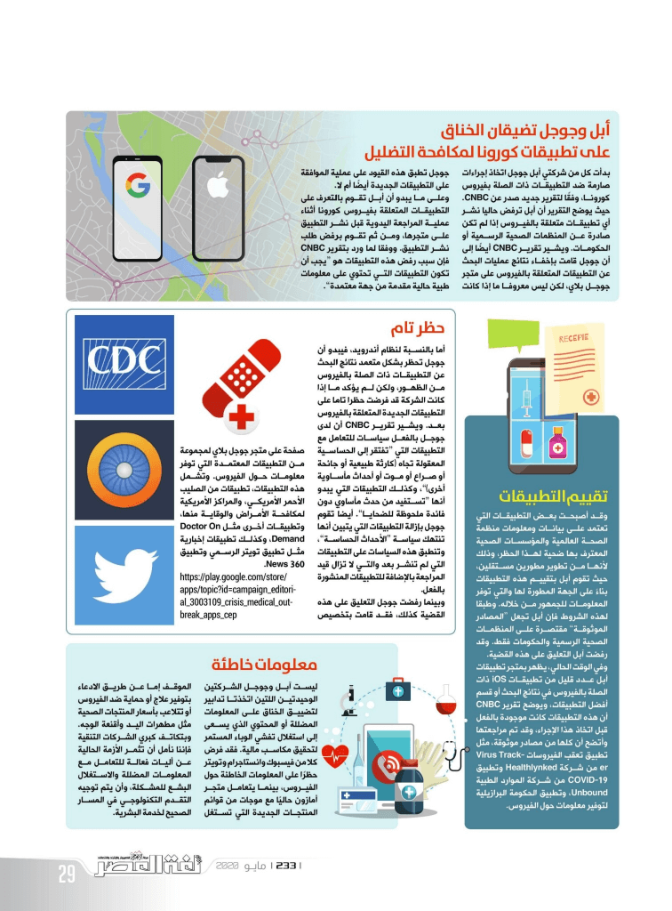

+++
title = "التطبيقات الصحية خلال أزمة كورونا.. المعلومات صمام الأمان"
date = "2020-05-01"
description = "أبرزت أزمة فيروس كورونا الحالية الدور الهام الذي تلعبه التكنولوجيا في حياتنا، بداية من العمل والتعليم عن بُعد، وحتى التوعية والمساعدة في إيجاد علاج للفيروس. فالتقدم التكنولوجي الحالي قد ساعد كثيرا في نشر حملات التوعية ومساعدة الشركات والأفراد، ولكن في الوقت نفسه يساعد هذا التقدم على نشر المعلومات على نطاق واسع سواء كانت صحيحة أو مغلوطة، ومن حسن الحظ أن صُناع التقنية ومنظمة الصحة العالمية قد أطلقوا العديد من المبادرات والدعوات الجديدة للمساعدة في احتواء الفيروس ونشر المعلومات الموثوقة فقط والحد من انتشار الشائعات."
categories = ["تقارير",]
tags = ["مجلة لغة العصر"]

+++

أبرزت أزمة فيروس كورونا الحالية الدور الهام الذي تلعبه التكنولوجيا في حياتنا، بداية من العمل والتعليم عن بُعد، وحتى التوعية والمساعدة في إيجاد علاج للفيروس. فالتقدم التكنولوجي الحالي قد ساعد كثيرا في نشر حملات التوعية ومساعدة الشركات والأفراد، ولكن في الوقت نفسه يساعد هذا التقدم على نشر المعلومات على نطاق واسع سواء كانت صحيحة أو مغلوطة، ومن حسن الحظ أن صُناع التقنية ومنظمة الصحة العالمية قد أطلقوا العديد من المبادرات والدعوات الجديدة للمساعدة في احتواء الفيروس ونشر المعلومات الموثوقة فقط والحد من انتشار الشائعات.

## منظمة الصحة العالمية تنشد مساعدة مطوري تطبيقات الهواتف

أعلنت منظمة الصحة العالمية حاجاتها إلى مساعدة مطوري تطبيقات المحمول للعمل على تطبيق جديد يساعد في احتواء والحد من انتشار فيروس كورونا المستجد (COVID-19). حيث تبحث المنظمة عن متطوعين يمكنهم المساعدة في تطوير تطبيق لمساعدة الأفراد في جميع أنحاء العالم، ومن ثم الاستمرار في تحديث التطبيق للاستجابة بشكل أفضل لانتشار الوباء.

وترغب منظمة الصحة العالمية في:

-   أن يستهدف التطبيق الأشخاص العاديين غير العاملين بقطاع الصحة.
-   أن يعمل التطبيق على هواتف أندرويد وiOS.
-   أن يعمل التطبيق بكل اللغات التي تتوفر بها معلومات المنظمة، وهي الإنجليزية والفرنسية والصينية والإسبانية والعربية والروسية.
-   أن يكون الهدف الأساسي من التطبيق إيصال المعلومات والنصائح المعتمدة من منظمة الصحة العالمية للجمهور.
-   أن يقدم التطبيق إرشادات معتمدة من منظمة الصحة العالمية للأفراد حول كيفية الاستجابة للأعراض.

ويهدف المشروع بشكل رئيسي إلى احتواء وتخفيف انتشار الفيروس، والمساعدة في تشخيص وفرز حالات المرضى، وتوفير ملاحظات وتعليقات للمستخدمين. وتريد المنظمة أن يكون التطبيق متاحا في أسرع وقت ممكن، كما تركز أيضًا على التزامه بمعايير المنظمة للخصوصية والأمن وإمكانية الوصول.

وقد أتاحت المنظمة الكود المصدري للتطبيق على موقع GitHub، حتى يتمكن مطورو التطبيقات من المساهمة وأن يكونوا في طليعة هذا الجهد. ويمكنك الاطلاع على مزيد من المعلومات من خلال الرابط https://worldhealthorganization.github.io/app/ONBOARDING.html

## أبل وجوجل يضيقان الخناق على تطبيقات الفيروس لمكافحة التضليل

بدأ كل من شركتي أبل جوجل اتخاذ إجراءات صارمة ضد التطبيقات ذات الصلة بفيروس كورونا، وفقًا لتقرير جديد صدر عن CNBC. حيث يوضح التقرير أن أبل ترفض حاليا نشر أي تطبيقات متعلقة بالفيروس إذا لم تكن صادرة عن المنظمات الصحية الرسمية أو الحكومات. ويشير تقرير CNBC أيضًا إلى أن جوجل قامت بإخفاء نتائج عمليات البحث عن التطبيقات المتعلقة بالفيروس على متجر جوجل بلاي، لكن ليس معروفا ما إذا كانت جوجل تطبق هذه القيود على عملية الموافقة على التطبيقات الجديدة أيضًا أم لا.

وعلى ما يبدو أن أبل تقوم بالتعرف على التطبيقات المتعلقة بفيروس كورونا أثناء عملية المراجعة اليدوية قبل نشر التطبيق على متجرها، ومن ثم تقوم برفض طلب نشر التطبيق. ووفقا لما ورد بتقرير CNBC فإن سبب رفض هذه التطبيقات هو "يجب أن تكون التطبيقات التي تحتوي على معلومات طبية حالية مقدمة من جهة معتمدة".

### تقييم التطبيقات

وقد أصبحت بعض التطبيقات التي تعتمد على بيانات ومعلومات منظمة الصحة العالمية والمؤسسات الصحية المعترف بها ضحية لهذا الحظر، وذلك لأنها من تطوير مطورين مستقلين، حيث تقوم أبل بتقييم هذه التطبيقات بناءً على الجهة المطورة لها والتي توفر المعلومات للجمهور من خلاله. وطبقا لهذه الشروط فإن أبل تجعل "المصادر الموثوقة" مقتصرة على المنظمات الصحية الرسمية والحكومات فقط. وقد رفضت آبل التعليق على هذه القضية.

وفي الوقت الحالي، يظهر بمتجر تطبيقات أبل عدد قليل من تطبيقات iOS ذات الصلة بالفيروس في نتائج البحث أو قسم أفضل التطبيقات، ويوضح تقرير CNBC أن هذه التطبيقات كانت موجودة بالفعل قبل اتخاذ هذا الإجراء، وقد تم مراجعتها وأتضح أن كلها من مصادر موثوقة، مثل تطبيق تعقب الفيروسات Virus Tracker من شركة Healthlynked وتطبيق COVID-19 من شركة الموارد الطبية Unbound، وتطبيق الحكومة البرازيلية لتوفير معلومات حول الفيروس.

### حظر تام

أما بالنسبة لنظام أندرويد، فيبدو أن جوجل تحظر بشكل متعمد نتائج البحث عن التطبيقات ذات الصلة بالفيروس من الظهور، ولكننا لم يؤكد ما إذا كانت الشركة قد فرضت حظرا تاما على التطبيقات الجديدة المتعلقة بالفيروس بعد. ويشير تقرير CNBC أن لدى جوجل بالفعل سياسات للتعامل مع التطبيقات التي "تفتقر إلى الحساسية المعقولة تجاه (كارثة طبيعية أو جائحة أو صراع أو موت أو أحداث مأساوية أخرى)"، وكذلك التطبيقات التي يبدو أنها "تستفيد من حدث مأساوي دون فائدة ملحوظة للضحايا". أيضا تقوم جوجل بإزالة التطبيقات التي يتبين أنها تنتهك سياسة "الأحداث الحساسة"، وتنطبق هذه السياسات على التطبيقات التي لم تنشر بعد والتي لا تزال قيد المراجعة بالإضافة للتطبيقات المنشورة بالفعل.

وبينما رفضت جوجل التعليق على هذه القضية كذلك، فقد قامت بتخصيص صفحة على متجر جوجل بلاي لمجموعة من التطبيقات المعتمدة التي توفر معلومات حول الفيروس. وتشمل هذه التطبيقات، تطبيقات من الصليب الأحمر الأمريكي، والمراكز الأمريكية لمكافحة الأمراض والوقاية منها، وتطبيقات أخرى مثل Doctor On Demand، وكذلك تطبيقات إخبارية مثل تطبيق تويتر الرسمي وتطبيق News 360.

https://play.google.com/store/apps/topic?id=campaign_editorial_3003109_crisis_medical_outbreak_apps_cep

### معلومات خاطئة

ليس أبل وجوجل الشركتان الوحيدتان اللتان اتخذتا تدابير لتضييق الخناق على المعلومات المضللة أو المحتوي الذي يسعى إلى استغلال تفشي الوباء المستمر لتحقيق مكاسب مالية. فقد فرض كلا من الفيسبوك وانستاجرام وتويتر حظرًا على المعلومات الخاطئة حول الفيروس، بينما يتعامل متجر أمازون حاليًا مع موجات من قوائم المنتجات الجديدة التي تستغل الموقف إما عن طريق الادعاء بتوفير علاج أو حماية ضد الفيروس أو تتلاعب بأسعار المنتجات الصحية مثل مطهرات اليد وأقنعة الوجه. وبتكاتف كبري الشركات التنقية فإننا نأمل أن تثمر الأزمة الحالية عن أليات فعالة للتعامل مع المعلومات المضللة والاستغلال البشع للمشكلة، وأن يتم توجيه التقدم التكنولوجي في المسار الصحيح لخدمة البشرية.

---

هذا الموضوع نُشر باﻷصل في مجلة لغة العصر العدد 233 شهر 05-2020 ويمكن الإطلاع عليه [هنا](https://drive.google.com/file/d/12dPqAtjKDqmIhgG_3_1cpqVElDSiky9l/view?usp=sharing).

](images/233-2.png)

