+++
title = "برنامج OBS Studio... السكين السويسري للبث المباشر"
date = "2020-12-01"
description = "لا شك أن البث المباشر قد أصبح اليوم أحد أكثر صور الفيديو انتشارًا، فهو طريقة ممتازة لتغطية الأحداث في الوقت الفعلي، وبديل أمن للمحاضرات والتجمعات الكبيرة، ووسيلة للترفيه والتواصل مع الجمهور. ويتوفر العديد من المنصات التي يمكن استخدامها لاستضافة البث المباشرة مثل YouTube وFacebook وTwitch وأيضًا العديد من أدوات وبرامج البث المباشر؛ بداية من استخدام زر التصوير داخل الموقع أو منصة البث وحتى استخدام البرامج المخصصة للبث. أحد هذه البرامج هو OBS Studio الذي يمكنك من عمل كل شيء له علاقة بالبث المباشر من مكان واحد، مثل تسجيل الشاشة والتحكم في المحتوى المعروض بشكل كامل وعمل بث مباشر على أكثر من 66 منصة بث مباشر على الإنترنت."
categories = ["مهارات رقمية",]
tags = ["مجلة لغة العصر"]

+++
لا شك أن البث المباشر قد أصبح اليوم أحد أكثر صور الفيديو انتشارًا، فهو طريقة ممتازة لتغطية الأحداث في الوقت الفعلي، وبديل أمن للمحاضرات والتجمعات الكبيرة، ووسيلة للترفيه والتواصل مع الجمهور. ويتوفر العديد من المنصات التي يمكن استخدامها لاستضافة البث المباشرة مثل YouTube وFacebook وTwitch وأيضًا العديد من أدوات وبرامج البث المباشر؛ بداية من استخدام زر التصوير داخل الموقع أو منصة البث وحتى استخدام البرامج المخصصة للبث. أحد هذه البرامج هو OBS Studio الذي يمكنك من عمل كل شيء له علاقة بالبث المباشر من مكان واحد، مثل تسجيل الشاشة والتحكم في المحتوى المعروض بشكل كامل وعمل بث مباشر على أكثر من 66 منصة بث مباشر على الإنترنت.

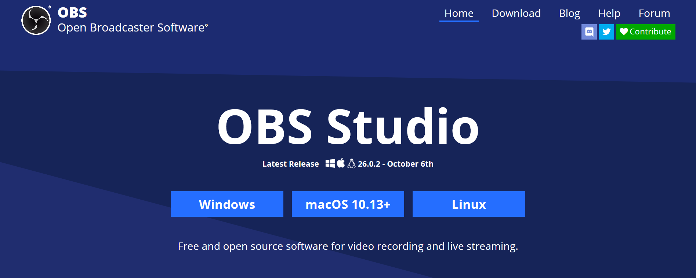

## ما هو OBS Studio؟

OBS Studio هو برنامج مجاني ومفتوح المصدر لتسجيل الشاشة وعمل بث مباشر متاح على ويندوز ولينكس وmacOS. ويقدم البرنامج مجموعة من الميزات التي تجعل منه بمثابة السكين السويسري لبرامج البث المباشر. فيمكنك باستخدام البرنامج بث محتوى الصوت والفيديو في الوقت الفعلي، واستخدام أدوات التحرير ومزج مختلف مصادر الصوت والفيديو والتحكم فيما يتم عرضه أثناء البث.

يسمح OBS Studio للمستخدمين بإنشاء وبث مقاطع الفيديو باستخدام نظام لوحة الطبقات الشبيه بما يستخدمه برنامج الفوتوشوب. فكل طبقة ستظهر على الشاشة هي عبارة عن "مشهد" Scene، وكل مشهد يمكن أن يحتوي على عدد غير محدود من الوسائط المتعددة التي قد تكون شاشة الكمبيوتر أو أحد النوافذ المفتوحة أو فيديو من الكاميرا مباشرة أو مجموعة صور أو ملفات صوت أو حتى نصوص توضيحية ثابتة والعديد من المصادر الأخرى، وبالتالي يمكن للمستخدم القيام بأمور لا حصر لها وتخصيص الفيديو الذي سيتم عرضه كما يرغب.

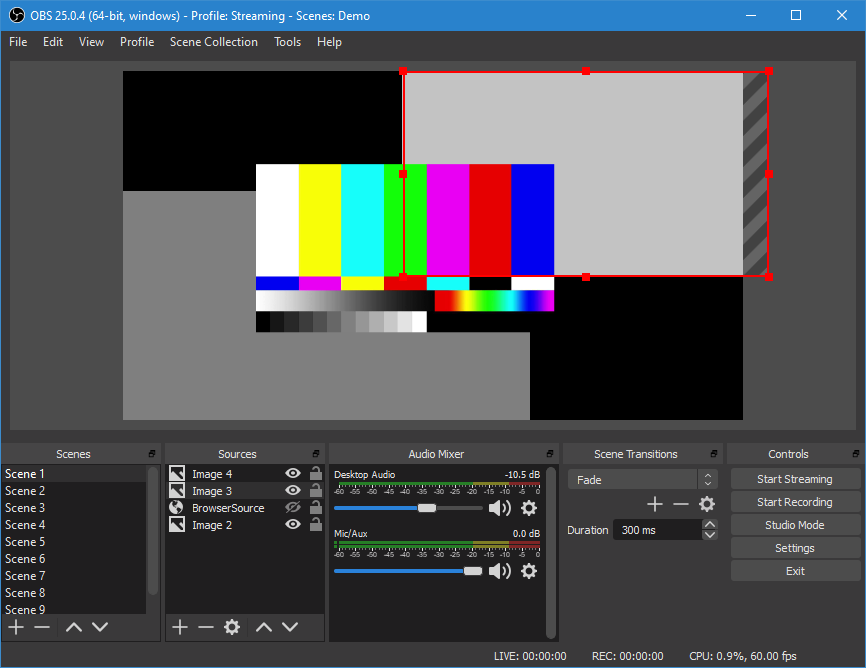

أما بالنسبة لخدمات البحث المباشر فالبرنامج يدعم أكثر من 66 منصة بث مباشر مثل YouTube وRestream وFacebook وTwitter وYouStreamer وTrovo. وبالإضافة إلى ذلك، يوفر البرنامج أداة لمزج الصوت والعديد من الفلاتر مثل مزيل الضوضاء، ومجموعة كبيرة من المؤثرات الانتقالية لاستخدامها عند التبديل بين مصادر الفيديو أثناء البث.

## ميزات OBS Studio

- تسجيل وبث وخلط الفيديو والصوت بأداء عالي في الوقت الحقيقي، وإنشاء مشاهد مكونة من مصادر متعددة مثل لقطات النوافذ والصور والنصوص ونوافذ المتصفح وكاميرات الويب وبطاقات والمزيد.

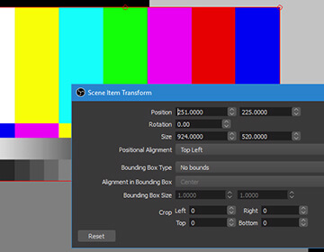

- إنشاء عدد غير محدود من المشاهد التي يمكنك التبديل بينها بسلاسة عبر مؤثرات الانتقال المخصصة.

- معدل صوت سهل الاستخدام يحتوي على مرشحات التحكم في الصوت وتقليل الضوضاء.

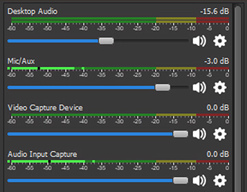

- توفر خيارات تحكم قوية وسهلة الاستخدام، وإمكانية إضافة مصادر جديدة، وتكرار المصادر الموجودة وضبط خصائصها بسهولة.

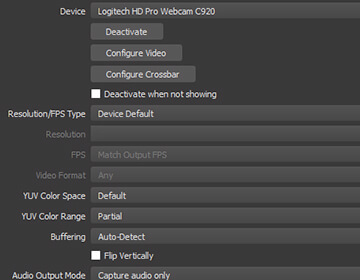

- لوحة الإعدادات مبسطة تمنح المستخدم وصولًا سهلاً إلى مجموعة واسعة من خيارات الإعداد لتعديل كل جانب من جوانب البث والتسجيل.

- إمكانية تخصيص اختصارات لوحة المفاتيح لكل الإجراءات الممكنة داخل البرنامج تقريبًا، مثل التبديل بين المشاهد، وبدء أو إيقاف التدفقات أو التسجيلات، وكتم مصادر الصوت، والضغط للتحدث، والمزيد من الأمور.

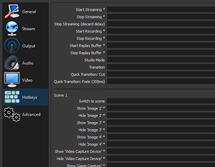

- وضع الاستوديو الذي يتيح معاينة المشاهد والمصادر قبل بثها مباشرة، كما يتيح ضبط المشاهد والمصادر أو إنشاء أخرى جديدة والتأكد من أنها مثالية قبل أن يراها المشاهدون.

- عرض مصادر الوسائط بطريقة احترافية تدعم حتى 28 مشهد مختلف مع إمكانية تكبير أو الانتقال إلى أي منها بسهولة.

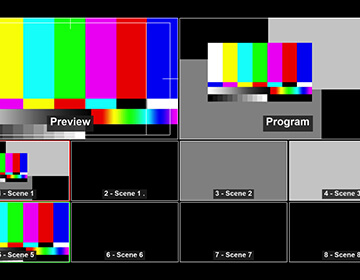

## كيفية استخدام البرنامج

بما أن برنامج OBS Studio يقوم بمهمتي التسجيل والبث سيطلب منك بعد تحميله من موقعه الرسمي https://obsproject.com وتشغيله لأول مرة تخصيص الواجهة للقيام بإحدى المهمتين بشكل أساسي والأخرى بشكل ثانوي، اختر المهمة التي ستستخدم البرنامج فيها ليتم تبسيط الواجهة وإتاحة تحكم أبسط. بعد ذلك سيطلب منك البرنامج اختيار جودة التسجيل الافتراضية وال FPSثم حفظ هذه الإعدادات الأولية.

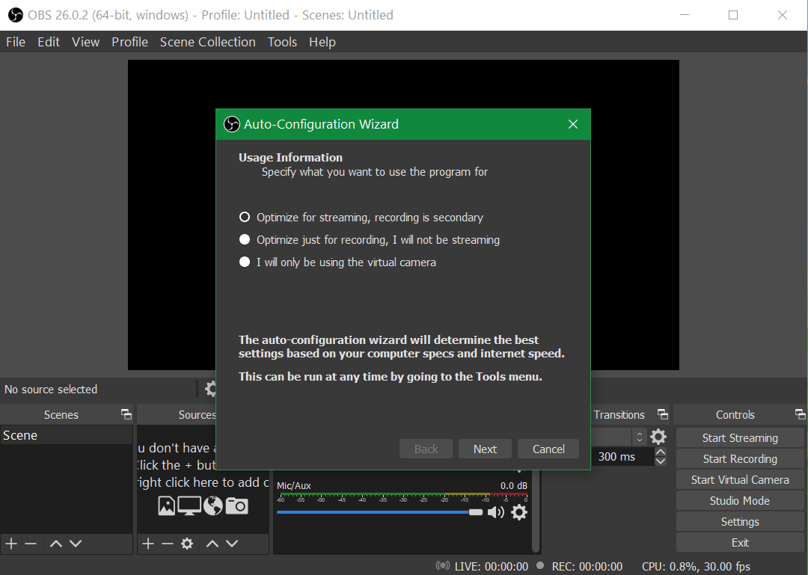

- إعداد ما سيعرض على الشاشة:
قبل بدء التسجيل أو البث تحتاج إلى إعداد "المشاهد" التي سيتم عرضها على الشاشة. وعند فتحتك لمشروع فارغ داخل البرنامج ستجد أن هناك مشهد فارغ موجود بالفعل، لكن لا يوجد أي مصادر وسائط مضافة. لذلك من قائمة Sources اضغط على زر + لإضافة وسائط مثل صوت الميكروفون وتصوير نافذة على الشاشة وفيديو من الكاميرا.

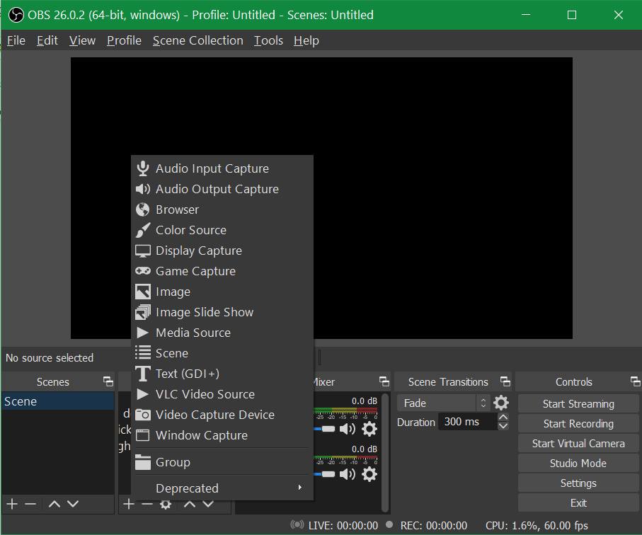

بعد ذلك يمكنك التحكم في مكان عرض كل من هذه الوسائط على الشاشة من خلال الضغط على كل عنصر في قائمة Sources ثم سحبه إلى المكان الذي ترغب في وضعه به في شاشة العرض أعلى البرنامج.

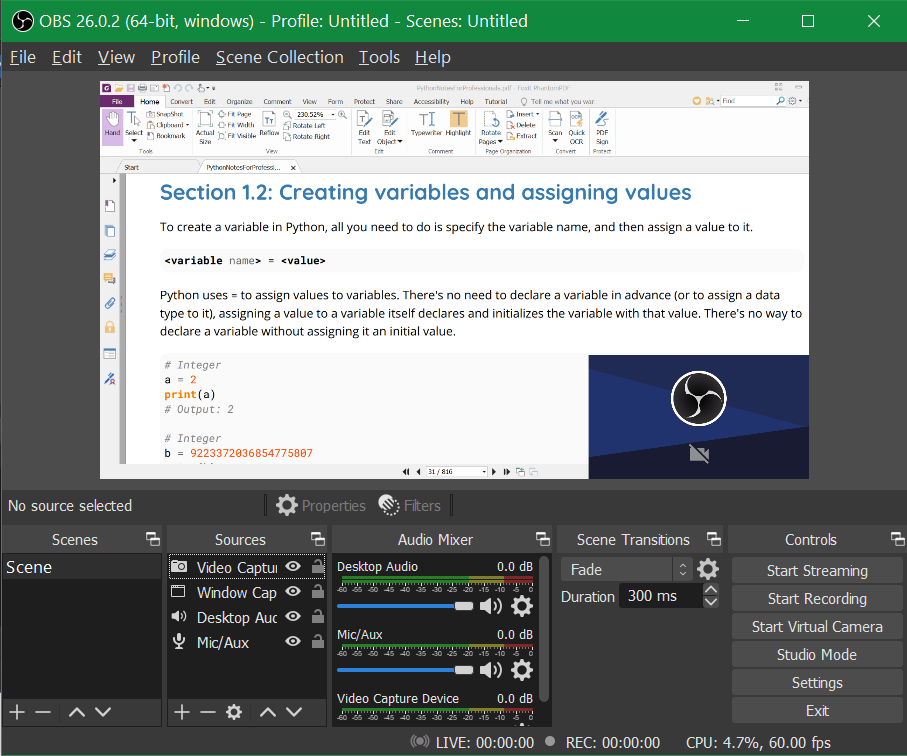

- تسجيل الشاشة:
يتطلب بدء جلسة تسجيل إعداد المشاهد ومصادر الوسائط، ذلك تأكد من اتباع الخطوات المذكورة أولًا، بعد ذلك اضغط على زر بدء التسجيل Start Recording لتصوير الشاشة وحفظ الفيديو على الجهاز بعد الانتهاء. لاحظ أنه أثناء التسجيل يمكنك رؤية مقدار المعالجة التي تستخدمها وحدة المعالجة المركزية، ومعدل الإطارات في الثانية الواحدة للفيديو في شريط الحالة أسفل نافذة البرنامج.

- البث المباشر:
أما البث المباشر فقبل البدء به يجب عليك أولاً توصيل OBS Studio بمنصة البث التي تختارها (YouTube أو Twitch أو Mixer أو أي من المنصات المدعومة الأخرى)، بعد القيام بذلك، اضغط على زر Start Streaming. لاحظ أيضًا أنك ستحتاج إلى سرعة رفع عالية للقيام ببث عالي الجودة، وإلا قم بتقليل جودة الفيديو لتناسب الإنترنت الخاص بك.

## إعدادات البرنامج

يحتوي البرنامج على عدد كبير من الإعدادات التي تسمح لك بتخصيص كل جزء منه كما تريد والتحكم في الصوت والفيديو وجودة البث والاختصارات والعديد من الأمور الأخرى. ولتبسيط الأمر على المستخدم يضع البرنامج كل مجموعة من الإعدادات في تبويب منفصل كالتالي:

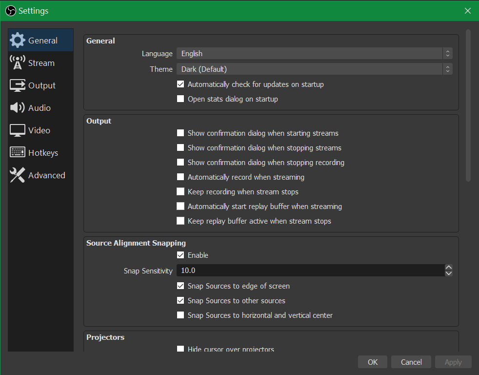

- General: لتغيير إعدادات واجهة البرنامج وخيارات تأكيد بدء أو إيقاف البث والتحكم في وضع العرض المتعدد.
- Stream: يتيح لك هذا التبويب توصيل البرنامج بواحدة من منصات البث المباشرة المدعومة أو إضافة Stream Key الخاص بالمنصة.
- Output: للتحكم في مختلف خصائص الفيديو الذي سيعرض سواء في وضع التسجيل أو وضع البث، مثل مكان حفظ الفيديو وجودته وصيغة الحفظ والمشفر الذي سيتم استخدامه.
- Audio: لتخصيص إعدادات الصوت مثل التردد والتحكم في مصادر الصوت سواء التسجيل من الشاشة أو أجهزة الميكروفون المتصلة بالجهاز.
- Video: لتغيير أبعاد الشاشة التي سيتم استخدمها في "المشاهد" ووضع مصادر الفيديو عليها.
- Hotkeys: المكان الذي يمكنك التحكم في اختصارات كل الإجراءات داخل البرنامج وتخصيصها بالطريقة التي تريد.
- Advanced: آخر تبويب بإعدادات البرنامج والذي يمكنك من التحكم في العديد من الخيارات المتقدمة مثل تأخير البث وإعادة الاتصال بشكل تلقائي.

---

هذا الموضوع نُشر باﻷصل في مجلة لغة العصر العدد 240 شهر 12-2020 ويمكن الإطلاع عليه [هنا](https://drive.google.com/file/d/1DqCtANCysMsTke9wpueIEqrrcM63oZ01/view?usp=sharing) أو [هنا](https://gate.ahram.org.eg/News/2546506.aspx).

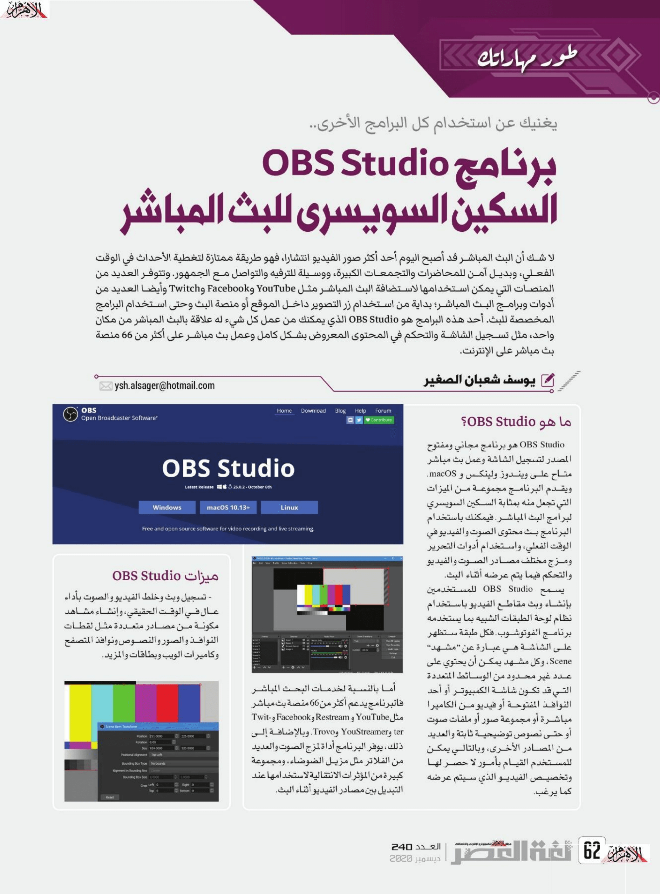

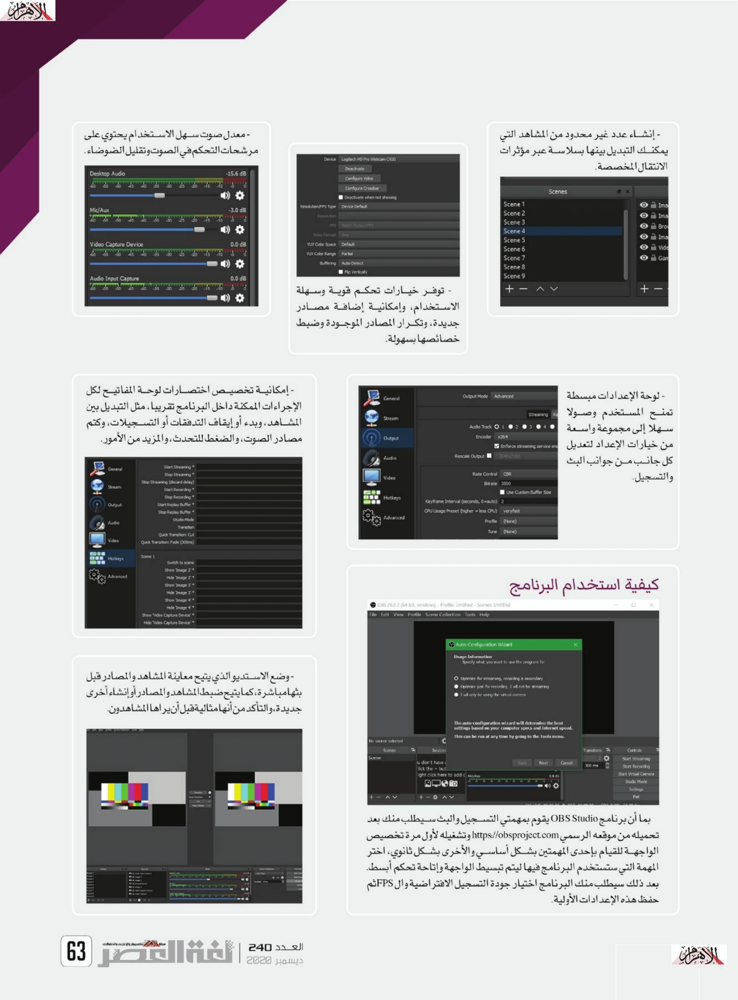

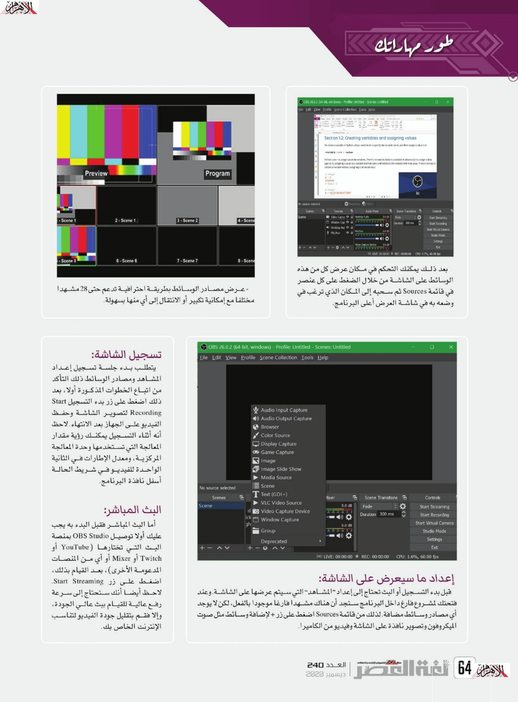

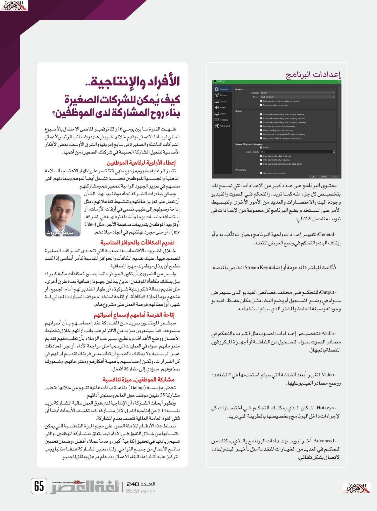
