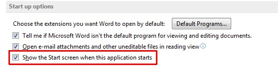

+++
title = "طريقة إلغاء شاشة البداية في أوفيس 2013"
date = "2015-02-14"
description = "مما لا شك فيه أن مجموعة برامج مايكروسوفت 2013 من أهم البرامج التي يحتاجها جميع مستخدمي الويندوز وخصوصا برنامج Word، ولكن في النسخة الأخيرة أصبح هناك تغييرات كبيره منها شاشة البداية نقدم لك عزيزي القارئ طريقة الغاء شاشة البداية في أوفيس 2013."
categories = ["مهارات رقمية",]
tags = ["موقع لغة العصر"]

+++

مما لا شك فيه أن مجموعة برامج مايكروسوفت 2013 من أهم البرامج التي يحتاجها جميع مستخدمي الويندوز وخصوصا برنامج Word، ولكن في النسخة الأخيرة أصبح هناك تغييرات كبيره منها شاشة البداية التي قد تسبب ازعاجا لبعض المستخدين، لذلك نقدم طريقة إلغاء شاشة البداية في أوفيس 2013.

من أكبر وظائف شاشة البداية في أوفيس 2013 هي إعطاء المستخدم الخيارات الأكثر شيوعا مثل انشاء مستند جديد – استخدام قالب – الدخول إلى خيارات البرنامج – فتح المستندات الأخيرة.

ولكن أكثر ما يحتاجه المستخدم عند فتح البرنامج هو إنشاء مستند جديد لذا هناك خيار موجود داخل البرنامج لا يعرفه الكثير هو تخطى شاشة البداية وفتح مستند فارغ دائما.

1. قم بفتح برنامج Word ثم قم بفتح مستند جديد.
2. من شريط File قم باختيارOptions ثم التبويب General.

3. قم بإزالة العلامة الموجودة أمام الاختيار Show the Start screen when this application starts.

إذا أردت إعادة تفعيل شاشة البداية مرة أخرى قم بتنفيذ نفس الخطوات السابقة ثم قم بوضع العلامة على نفس الاختيار.

---

هذا الموضوع نٌشر باﻷصل على موقع مجلة لغة العصر.

http://aitmag.ahram.org.eg/News/5529.aspx
