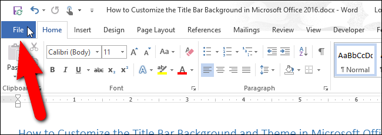
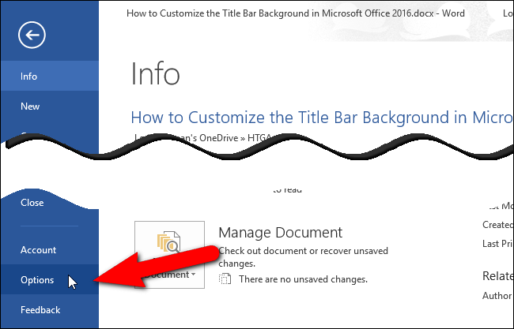
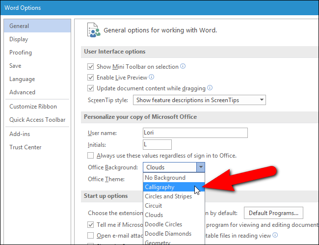
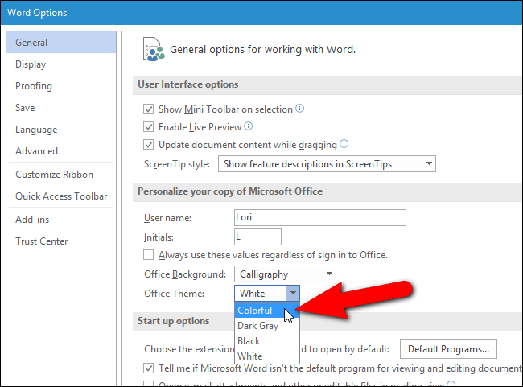
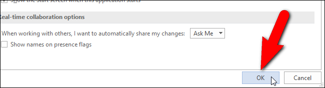
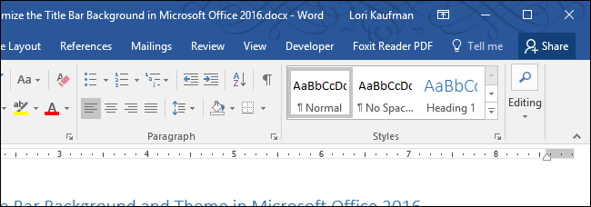

+++
title = "كيفية تخصيص شكل شريط العنوان في أوفيس 2016"
date = "2016-05-20"
description = "من المميزات الجديدة في أوفيس 2016 التحسينات التي طرأت على واجهة المستخدم، من هذه التغييرات الخلفية التي تظهر في شريط العنوان، وفي هذا الدرس سنتعرف على طريقة تغيير شكل شريط العنوان في أوفيس 2016"
categories = ["مهارات رقمية",]
tags = ["موقع لغة العصر"]
images = ["images/2016-635992772810732737-73_thumb705x335.png"]

+++

من المميزات الجديدة في أوفيس 2016 التحسينات التي طرأت على واجهة المستخدم، من هذه التغييرات الخلفية التي تظهر في شريط العنوان، وفي هذا الدرس سنتعرف على طريقة تغيير شكل شريط العنوان في أوفيس 2016.

الخلفية المعينة افتراضيا هي خلفية السحاب، كما يوجد أيضا العديد من الخلفيات التي يمكنك الاختيار منها، ولكن لا يمكنك اختيار خلفية من جهازك.

لتغيير خلفية شريط العنوان قم أولا بفتح أي برنامج من برامج الأوفيس مثل الوورد.

1- اضغط على قائمة File.

2- قم بالانتقال إلى Options.

3- من الإعدادات، انتقل إلى الاختيار Office Background ثم من القائمة المنسدلة قم باختيار الخلفية التي تريدها.

4- إذا أردت الغاء الخلفية قم باختيار No Background من القائمة.

ولتغيير الثيم الخاص بالأوفيس، قم بفتح Options ثم من القائمة Office Theme اختر الثيم الذي تريد تطبيقه.

ثم اضغط OK.

ستجد التغييرات التي قمت بها قد تم تطبيقها كما بالصورة.

---
هذا الموضوع نٌشر باﻷصل على موقع مجلة لغة العصر.

http://aitmag.ahram.org.eg/News/49612.aspx