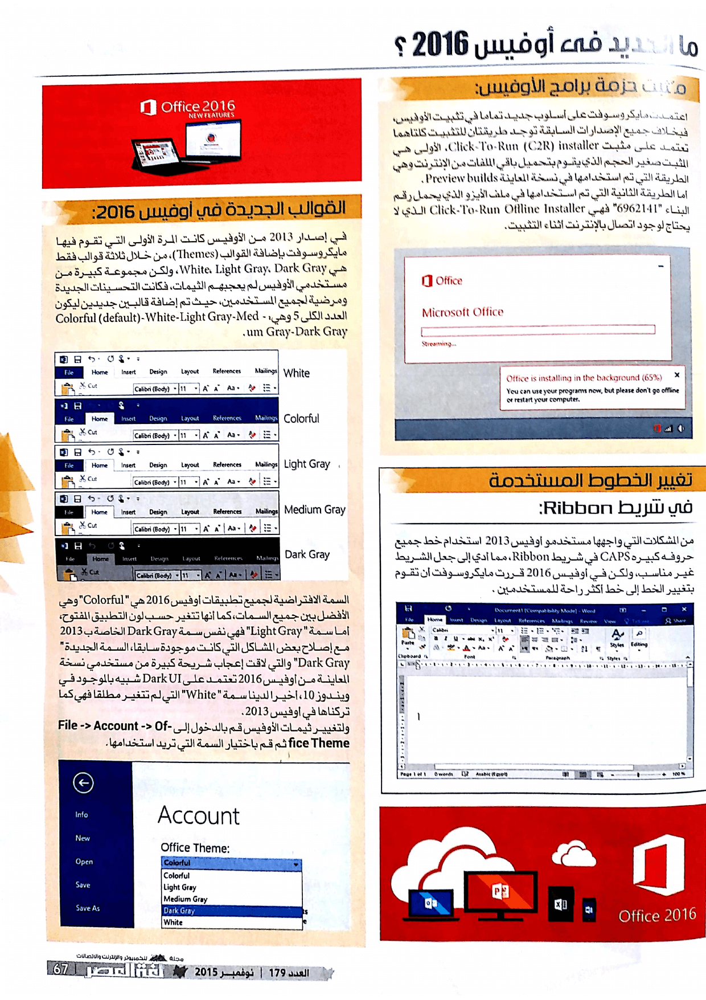

+++
title = "ما الجديد في أوفيس 2016؟"
date = "2015-11-01"
description = "قامت مايكروسوفت بمجموعة ضخمة من التغييرات في الإصدار الأحدث من أشهر برامجها \"مايكروسوفت أوفيس\"، إصدار 2016 الذي حاز على إعجاب كل مواقع المراجعات الأجنبية وعلى رأسها PC Magazine، فبعد ثلاثة سنوات من التطوير المستمر لمجموعة برامج أوفيس، ومع أكثر من 1.2 مليار مستخدم للأوفيس كان على مايكروسوفت أن تقوم بالأفضل لمستخدميها وهو ما حدث في هذا الإصدار، انتقل معك عزيزي القارئ إلى استعراض مجلة لغة العصر لأهم المميزات الجديدة في أوفيس 2016."
categories = ["تقارير",]
tags = ["مجلة لغة العصر"]
images = ["images/0.jpg"]

+++

قامت مايكروسوفت بمجموعة ضخمة من التغييرات في الإصدار الأحدث من أشهر برامجها "مايكروسوفت أوفيس"، إصدار 2016 الذي حاز على إعجاب كل مواقع المراجعات الأجنبية وعلى رأسها PC Magazine، فبعد ثلاثة سنوات من التطوير المستمر لمجموعة برامج أوفيس، ومع أكثر من 1.2 مليار مستخدم للأوفيس كان على مايكروسوفت أن تقوم بالأفضل لمستخدميها وهو ما حدث في هذا الإصدار، انتقل معك عزيزي القارئ إلى استعراض مجلة لغة العصر لأهم المميزات الجديدة في أوفيس 2016.

## أهم الإيجابيات

- تحسينات كبيره في المظهر.
- ميزة Share والتعديل الجماعي للمستندات.
- ميزة Tell Me التي تمكنك من الوصول لأي اختيار في البرنامج بضغط زر.
- سرعة كبيرة في تشغيل البرامج مقارنة بالإصدارات السابقة.

## أهم السلبيات

- الترقية المجانية غير متاحة سوي لمستخدمي حزمة Office 365.
- التحديثات الشهرية لمستخدمي أوفيس 365 غير التحديثات التي ستصل لمستخدمي أوفيس 2016 العاديين.

## ما الجديد في أوفيس 2016؟

- مٌثبت حزمة برامج الأوفيس:

اعتمدت مايكروسوفت على أسلوب جديد تماما في تثبيت الأوفيس فبخلاف جميع الإصدارات السابقة تتواجد طريقتان للتثبيت كلاهما يعتمد على مثبت Click-To-Run (C2R) installer، الأولى هي المثبت صغير الحجم الذي يقوم بتحميل باقي الملفات من الإنترنت وهي الطريقة التي تم استخدامها في نسخة المعاينة Preview builds.

 أما الطريقة الثانية التي تم استخدامها في ملف الأيزو الذي يحمل رقم البناء "6962141" هي Click-To-Run Offline Installer الذي لا يحتاج لوجود اتصال بالإنترنت أثناء التثبيت.

- الثيمات الجديدة في أوفيس 2016:

في إصدار 2013 من الأوفيس كانت المرة الأولى التي تقوم فيها مايكروسوفت بإضافة الثيمات، ولكن كان هناك ثلاث ثيمات فقط هي White, Light Gray, Dark Gray، ولكن مجموعة كبيرة من مستخدمي الأوفيس لم يعجبهم الثيمات الجديدة، فكانت التحسينات الجديدة مرضية لجميع المستخدمين، تمت إضافة 2 من الثيمات ليكون العدد الكلى للثيمات 5 ثيمات وهي: Colorful (default)-White-Light Gray-Medium Gray-Dark Gray.

السمة الافتراضية لجميع تطبيقات أوفيس 2016 هي " Colorful" وهي السمة الأفضل بين جميع السمات، كما أنها تتغير حسب لون التطبيق المفتوح، أما سمة " Light Gray" هو نفس سمة Dark Gray الخاصة ب 2013 مع تصليح بعض المشاكل التي كانت موجودة سابقا، السمة الجديدة " Dark Gray" والتي لاقت إعجاب شريحة كبيرة من مستخدمي نسخة المعاينة من أوفيس 2016 فهي تعتمد على Dark UI شبيه بالموجود في ويندوز 10، أخيرا لدينا سمة " White" التي لم تتغير مطلقا فهي كما تركناها في أوفيس 2013.

لتغيير ثيمات الأوفيس قم بالدخول إلى File -> Account -> Office Theme ثم قم باختيار السمة التي تريد استخدامها كما بالصورة 4.

- تغيير الخطوط المستخدمة في شريط Ribbon:

من المشكلات التي واجهها مستخدمي أوفيس 2013 هي استخدام خط جميع حروفه كبيره CAPS في شريط Ribbon، مما أدي إلى جعل الشريط غير مناسب، ولكن هنا في أوفيس 2016 قررت مايكروسوفت أن تقوم بتغيير الخط إلى خط أكثر راحة للمستخدمين كما بالصورة 5.

- ميزة Tell Me:

عندما تقوم بتشغيل أي من مجموعة برامج أوفيس 2016، حتما ستلاحظ مربع البحث الجديد الموجود في شريط Ribbon، هذا الشريط الذي بداخله عبارة "Tell me what you want to do...” يسمي أداة "Tell Me” وهى عبارة عن مساعد مصغر مدمج في برامج الأوفيس وظيفته جعل المهام أسهل بالنسبة للمستخدمين فمن خلاله يمكنك البحث عن أي وظيفة داخل البرنامج، فمثلا بداخل برنامج الوورد Word إذا قمت بالبحث عن Auto-Correct سيظهر في أداة Tell Me كل اﻷوامر التي تحتوي على Correct كما بالصورة 6، وبنفس الطريقة في البرامج اﻷخري، عند كتابة جزء من اﻷمر في مربع بحث Tell Me ستظهر جميع اﻷوامر التي تستطيع تنفيذها مباشرة من داخل البحث، دون الحاجة للذهاب إلى الأوامر مرة أخري وتنفيذها كما كان في ميزة المساعدة في اﻹصدارات الأقدم من الأوفيس.

- تحديثات الأوفيس  Office Updates:

في جميع اﻹصدارات السابقة من اﻷوفيس لم يكن هناك خيار داخل البرنامج يمكن المستخدم من التحكم في التحديثات، ولكن كان يتم التحكم فيها عن طريق تحديثات الويندوز Windows Update، ولكن في أوفيس 2016 يمكنك عزيزي القارئ  التحكم في التحديثات عن طريق الدخول إلى File -> Account ستجد إعدادات "Office Updates" كما بالصورة 7.

- حذف قسم إعدادات الخصوصية من  Trust Center:

 من ضمن التغييرات التي حدثت في أوفيس 16 هي إزالة القسم الخاص بالتحكم في إعدادات الخصوصية، ودمج الأقسام الفرعية إلى 2 بدلا من 7 في الإصدارات السابقة كما يظهر في الصورة 8، (باﻷعلى إعدادات الخصوصية في أوفيس 13 والجزء السفلي في أوفيس 16)، ويمكنك الدخول إلى الإعدادات عن طريق File -> Options -> Trust Center -> Trust Center Settings.

- ميزة Smart Lookup:

وتسمي أيضا "Insights from Bing” وهي ميزة رائعة تمكن المستخدم من البحث بشكل سريع عن أي محتوي مكتوب فبمجرد تحديد النص والضغط بزر الفأرة اﻷيمن واختيار Smart Lookup سيتم الحصول على المعلومات من مصادر متعددة مثل Bing Snapshot, Wikipedia, Bing image search, و Oxford dictionary بدون مغادرة البرنامج المفتوح.

- المزيد من التنسيقات السريعة للأشكالQuick Shape Formatting :

قامت مايكروسوفت بزيادة عدد التنسيقات المتاحة في برنامج الوورد، الاكسيل و البوربوينت، وتستطيع التعرف عليها عن طريق قائمة Format كما بالصورة.

- التعديل الجماعي على المستندات :

كما هو متاح في خدمتيGoogle Docs و Office Online تستطيع دعوة اﻵخرين للمشاركة في تعديل المستندات معك، كل ما عليك هو الضغط على زر Share الموجود أعلي يمين الشاشة.

ثم سيتم حفظ الملف علي مساحة Onedrive الخاصة بك، قم بإرسال رابط المستند إلى الشخص الذي تريد أن يقوم بتعديل المستند معك، بعدما يقوم بالدخول علي المستند سيظهر لك إشعار أن هناك من يقوم بتعديل الملف كما بالصورة.

- تحويل المعادلات المكتوبة بخط اليد إلى نصوص :

ميزة جديدة أخري تم إضافتها إلى Word, Excel, و PowerPoint لتقوم بتسهيل عملية إدخال المعادلات، فبدلا من الوضع التقليدي لكتابة المعادلات، يمكن اﻵن كتابة المعادلات بخط اليد ومن ثم سيقوم البرنامج بتحويلها إلى نصوص يمكنه التعامل معها.

- تحسين خاصية الملفات المرفقة في برنامج Attachments  أوت لوك Outlook:

يمكن للمستخدم التحكم في صلاحيات الملفات المرفقة في برنامج أوت لوك 2016، كما يمكنه أيضا عند إضافة مرفقات الاختيار من الملفات الأخيرة التي تم إرفاقها بدون إعادة الدخول إلى مكانها وارفقاها مرة أخري.

## باقي التغييرات في أوفيس 2016

- تحسينات على خاصية Version History في كل من  Word, Excel, و PowerPoint.

- أنواع جديدة للرسم البياني في  كل من  Word, Excel, و PowerPoint مثل Treemap, Waterfall, Pareto, Histogram, Box , Whisker, و Sunburst

- أسلوب جديد في التكامل مع Onedrive يتيح استعراض الملفات المخزنة عليه.

---

هذا الموضوع نشر باﻷصل في مجلة لغة العصر العدد 179 شهر 11-2015 ويمكن الإطلاع عليه [هنا](https://drive.google.com/file/d/1V4UUKDbecEhR3C4I6MRBAbqYIyRTqdb3/view?usp=sharing).

