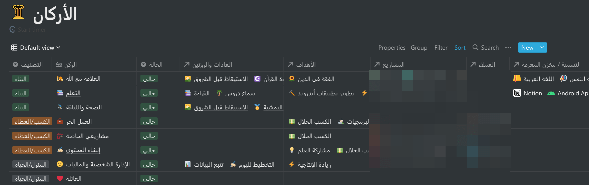
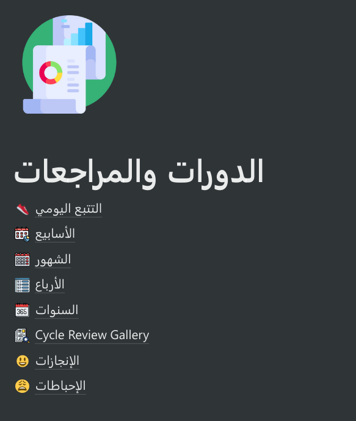
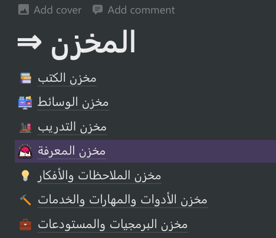
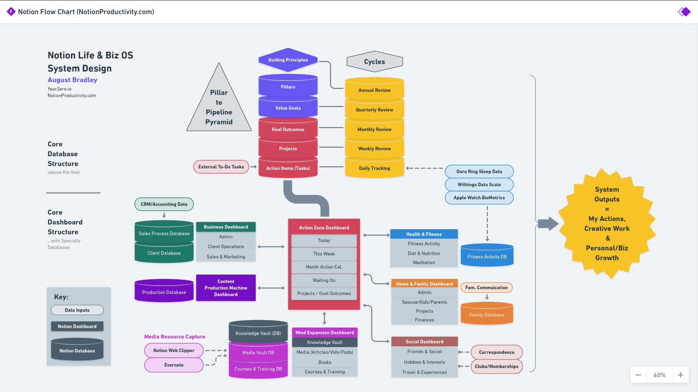

+++
author = "yshalsager"
title = "خلاصة استخدام نوشن لمدة سنة في إدارة المهام والمشاريع"
date = "2021-12-30"
description = "اليوم هو ختام عام 2021 الذي استخدمت فيه نوشن بشكل يومي لتنظيم المهام والمشاريع والعادات والقراءة والعمل الحر وكتابة المحتوى! في السطور القادمة سأستعرض خلاصة استخدامي لنوشن لمدة سنة في التخطيط وتنظيم اﻷمور المختلفة، وكيف يمكن الاستفادة من هذه اﻷداة لتحقيق أقصى استفادة وإدارة الحياة بشكل أكثر تنظيمًا وفعالية."
featured = true
categories = ["الإنتاجية",]
tags = ["المدونة",]
+++

التخطيط الجيد هو أول طريق تحقيق الأهداف، ومن حسن حظنا أننا نعيش في زمان فيه أدوات تخطيط رقمية تمكننا من تصور اﻷمور ووضع الخطط بطريقة أفضل من الورقة والقلم. واحدة من هذه اﻷدوات هي أداة [نوشن Notion](https://notion.so/) لتدوين الملاحظات والتخطيط وتنظيم المهام، وقد تعرفت عليها لأول مرة منذ سنتين تقريبا، وبدأت باستخدامها في كتابة الملاحظات وإدارة المهام دون اتباع أي نظام معين لفترة طويلة.

وفي 2020 بدأت بتطبيق نظام "دفتر اﻹنجاز" الذي شرحه [علي محمد علي](https://www.youtube.com/channel/UChbuH4HULlesX_rzlozkT6Q) في [كورس التخطيط الفعال](http://entagia.com/epc/) حتى نهاية السنة والتي تعرفت فيها على أوغست برادلي [August Bradley](https://www.youtube.com/channel/UCfqj2oq6LVmR3ybC2nfjqKg) صاحب إطار عمل Pillars Pipelines Vaults لتنظيم شتى مناحي الحياة. وبما أنني شخص متعدد الاهتمامات وأعاني كثيرًا من تنظيم اﻷمور وفي أغلب اﻷحيان يطغى جانب ما من الحياة على الجوانب الأخرى شاهدت عدد من [المقاطع المنشورة على قناة أوغست](https://www.youtube.com/playlist?list=PLAl0gPKnL3V8s7dPXoo07mYnuErhWVk8b) لأرى هذا النظام، ووجدت فيه ضالتي فقررت تخصيص أول أيام من عام 2021 لمشاهدة قائمة التشغيل كاملة وتطبيق النظام على نوشن ثم نقل الصفحات القديمة من عام 2020 إلى النظام الجديد.

واليوم نصل إلى ختام عام 2021 الذي استخدمت فيه نوشن بشكل يومي لتنظيم المهام والمشاريع والعادات والقراءة والعمل الحر وكتابة المحتوى! وفي السطور القادمة سأستعرض خلاصة استخدامي لنوشن لمدة سنة في التخطيط وتنظيم اﻷمور المختلفة، وكيف يمكن الاستفادة من هذه اﻷداة لتحقيق أقصى استفادة وإدارة الحياة بشكل أكثر تنظيمًا وفعالية.

|     |
| -----------------------------------------------------------: |
| الصورة بواسطة [Pauline Bernard](https://unsplash.com/@studiopoline?utm_source=unsplash&utm_medium=referral&utm_content=creditCopyText) من موقع [Unsplash](https://unsplash.com/?utm_source=unsplash&utm_medium=referral&utm_content=creditCopyText) |

# نظام PPV

يعتبر إطار عمل PPV السبب الرئيسي في تحقيقي أكبر فائدة من أداة نوشن خلال 2021، حيث يغطي النظام العديد من نواحي الحياة وهو ما يمكنني من إراحة نفسي من عناء حفظ كل شيء في دماغي ووضعه في مكان واحد بشكل متكامل. ويتكون النظام من:

- Pillars (اﻷركان): تقسيمات الحياة لتنظيم اﻷمور داخل النظام.

- Pipelines (خطوط المعالجة): الأمور المتعلقة بالجانب العملي مثل المهام والمشاريع والأهداف والعملاء.

- Vaults (المخازن): مكان تخزين الكتب والوسائط والدورات التدريبية والملاحظات إلخ

- Cycles (الدورات والمراجعات): مكان المراجعة الدورة للتأكد أن اﻷمور تسير في الاتجاه السليم.

وهذه هي طريقة عمل النظام:

وبما أن شرح نظام مثل PPV أمر سيستغرق وقتًا طويلًا وهذا ليس سياقه فسأكتفي باﻹشارة إلى [شرح أوغست](https://www.youtube.com/playlist?list=PLAl0gPKnL3V8s7dPXoo07mYnuErhWVk8b) نفسه [وشرح قناة نفع باللغة العربية](https://www.youtube.com/playlist?list=PLe5moQexuXHjTHZswsttq4yI39q665kzm) لمن يرغب في التوسع في هذا اﻷمر.

# مكونات نظام اﻹدارة الناجح

عند استخدام أداة قوية مثل نوشن دون منهجية واضحة أو تطبيق إطار عمل معين ﻹدارة المهام مثل PPV أو GTD وغيرها فسيواجه الشخص مشكلة كبيرة في تنظيم اﻷمور داخل البرنامَج وسيرتكب العديد من اﻷخطاء، أو أنه سيستخدم الأداة بطريقة سطحية لا تتجاوز قائمة مهام يمكن القيام بها في أي أداة بسيطة لعمل القوائم.

ولتحقيق أقصى استفادة من نظام إدارة المهام يجب أن تتوفر فيه الخصائص التالية:

- الشفافية
- ترتيب اﻷولويات
- التركيز على المطلوب دون مشتتات
- لوحات المعلومات لرؤية اﻷمور بطرق مختلفة (قائمة مهام / تقويم / خط زمني / إلخ)
- الترابط بين مكونات النظام

# خلاصات

خلال 2021 وباستخدام نوشن والمبادئ التي تعلمتها من علي محمد علي وأوغست برادلي، أصبحت أكثر مهارة في التخطيط للمهام وتتبع الأمور المختلفة في حياتي وكل ذلك في مكان واحد مما يمنحني رؤية أفضل للأمور التي قمت بها خلال كل أسبوع أو شهر أو ربع سنة أو سنة، ويمكنني من التخطيط طويل وقصير اﻷمد لمشاريعي الخاصة ومشاريع العملاء خلال العمل الحر، وكذلك الدورات التدريبية والبرامج العلمية وقراءة الكتب، وسأذكر فيما يلي عدد من النِّقَاط التي ستفيد كل من يرغب في التخطيط بشكل جيد لأموره المختلفة.

## التخطيط الجيد يبدأ من اليوم السابق

اليوم الذي تستيقظ فيه ولا تكون قائمة المهام لديك جاهزة ستشعر أنك ليس لديك شيء لفعله وستبدأ في تضييع الوقت إلى أن تبدأ - أو لا تبدأ - في القيام باﻷمور المهمة خلال هذا اليوم. وتكرار هذا اﻷمر سيذهب بأيامك سدى ويضيع عمرك دون فائدة! لذلك لا تنم إلا وقائمة مهام اليوم التالي جاهزة لديك، وإن حدث ولم تتمكن من القيام باﻷمر خلال ليلة اليوم السابق فقم به في بداية اليوم التالي بمجرد الاستيقاظ.

## ابدأ بالمهم ولا تهتم بالباقي

ابدأ يومك دائمًا بأكثر المهام تأثيرًا والتي ستعتبر يومك خالي من اﻹنجازات إن لم تقم بها. وبعد ذلك قم بباقي المهام ذات اﻷولوية اﻷقل، وحتى إن لم تتمكن من إكمال كل المهام في قائمة مهام اليوم، فأن تكمل المهمة اﻷعلى أولوية خير من ألا تفعل أي شيء أو أن تقوم بالمهام اﻷقل أهمية فقط.

## تتبع العادات يوميًا

تتبع العادات بشكل يومي يفيد في تثبيتها وكذلك في ملاحظة بعض أنماط السلوك. فمثلا عند تسجيل وقت استخدام الهاتف بشكل يومي ستلاحظ أن استخدام يصل في المتوسط إلى عدد ساعات محدد، فإذا تجاوزت هذا العدد في يوم حاول التعرف على السبب، وكذلك اﻷمر بالنسبة لتتبع أوقات النوم والاستيقاظ وساعات النوم والعادات الصحية.

## خطط للمهام في ظل مشروعات وأهداف محددة

عندما تضع مهامك سواء في بداية الشهر أو اﻷسبوع أو اليوم، يجب أن تكون أغلب المهام التي تقوم بها مرتبطة بمشاريع (المشروع: أمر محدد صغير ترغب في إنجازه أو مشروع فعلي تعمل عليه) وهذه المشروعات يجب أن تكون مرتبطة بأهداف بطريقة SMART (أهداف واضحة وقابلة للقياس وواقعية ومحددة بوقت زمني ويمكن تحقيقها) وأخيرًا يجب أن تكون هذه الأهداف مرتبطة برؤية محددة خاصة بك في الحياة (والرؤية هنا أقصد بها اﻷهداف الكبرى غير القابلة للقياس مثل الفقه في الدين وتعلم تطوير البرمجيات)

## مرونة النظام أمر مهم

من أهم العوامل المطلوبة في أي نظام للتخطيط من وجهة نظري المرونة. فإذا لم يكن النظام مرنًا كفاية وسيستغرق الكثير من الوقت للتعديل عليه، أو كان يستهلك وقتًا كبيرًا في الصيانة والتحديث، أو لا يسمح لك بالقيام باﻷمور إلا بطريقة واحدة ومحددة، فربما تكون هذه اﻷمور عوائق في استخدام النظام لفترات طويلة وتمنعك من القيام بالمطلوب بشكل أكثر إنتاجية.

فعلى سبيل المثال، أنا استخدم "عرض التقويم" و "جدول المهام" في نوشن للتخطيط للمشاريع ومهام الأسبوع، وفي حالة حدوث أي تغيير يمكنني إما سحب المهمة من اليوم القديم إلى اليوم الجديد في "عرض التقويم" لتغيير اليوم بسرعة، بينما عن طريق "جدول المهام" يمكنني نسخ ولصق بعض خصائص المهام عندما يكون هناك مجموعة مهام مشتركة في أمر ما مثل قراءة كتاب كبير، وفي حالة عدم كون النظام مرنًا بالشكل الكافي سأضطر إلى تضييع الكثير من الوقت لعمل هذه اﻷمور.

## المعرفة الشخصية يجب أن تكون مرتبطة بما تقوم به من مهام

نوشن ليس مجرد تطبيق ﻹدارة المهام، فيمكن استخدامه أيضًا لبناء "قاعدة معرفة شخصية" Personal Knowledge Base يخزن بها مختلف أجزاء المعرفة المهمة التي يكتسبها الشخص بالقراءة أو بالمشاهدة أو بالاستماع أو بالتعلم من الدورات التدريبية. ونقطة القوة في نوشن هي أن هذه الملاحظات وأجزاء المعرفة يمكن ربطها بما تقوم به في حياتك. فيمكنك مثلًا حفظ الاقتباسات وفوائد الكتب داخل صفحة خاصة بكل كتاب، وربط هذه الفوائد بقسم معين في مخزن المعرفة الخاص بك، مثل فوائد في اللغة أو في التاريخ، وبنفس الطريقة يمكن تخزين ملاحظات المشروعات والدورات وربطها بمعرفة معينة مثل لغة برمجة.

ويفيد ربط المعرفة في مهامك في إنشاء صفحات خاصة لكل موضوع معرفي تحتوي على الأجزاء المعرفية التي اكتسبتها مع السياق الذي كانت جزءًا منه مثل المشروع المعين والكتاب المعين والدورة المعينة، مما يعين على ربط اﻷمور ذهنيًا ببعضها وإنشاء أمور جديدة لم تكن واضحة في الدماغ بهذه الطريقة من قبل.

# ختام

مع أنّ نوشن أداة ذات نفع كبير لي، إلا أنني غير راضي عنه تمامًا. إذ أنه لا يعمل إلا مع وجود اتصال باﻹنترنت والبيانات الخاصة بي مخزنة على سيرفرات الخدمة وبالتالي هي ليست ملكي في الواقع. ومع ذلك، أنوي الاستمرار في استخدام نوشن خلال 2022 إن شاء الله تعالى حتى يظهر بديل قوي يحترم الخصوصية ويعمل دون الحاجة إلى الاتصال بالإنترنت مع توفير الميزات التي أشرت إليها خلال الموضوع والتي تجعل إدارة المهام والمشروعات أمرًا مسليًا بدلًا من كونه أمرًا ثقيلًا على النفس.
