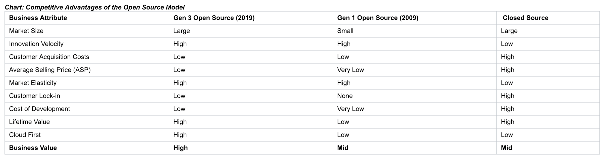
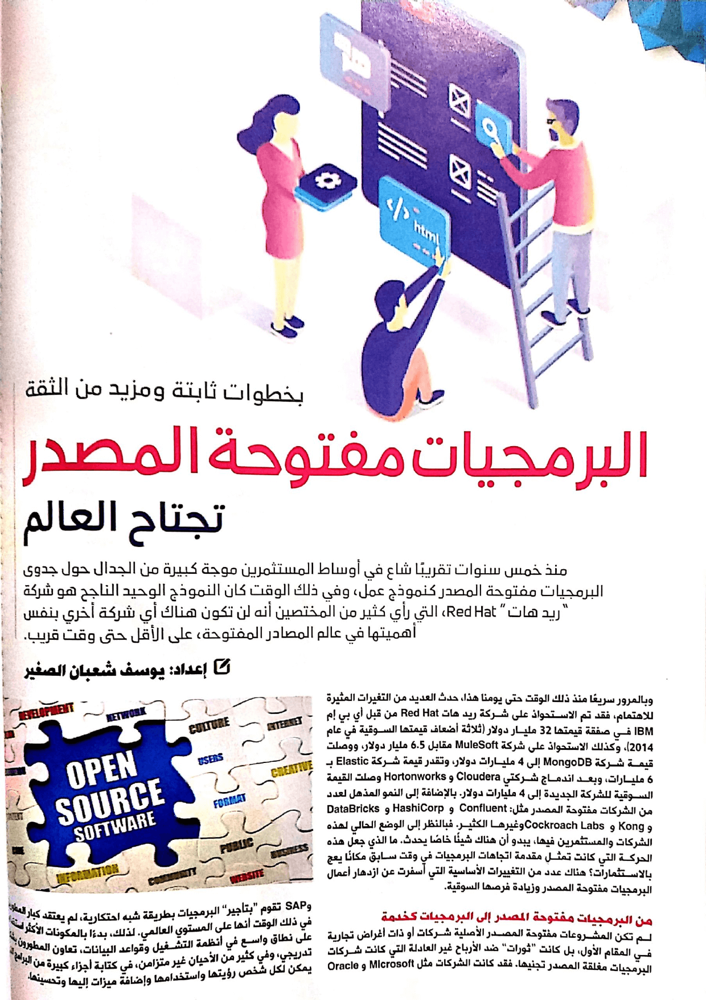
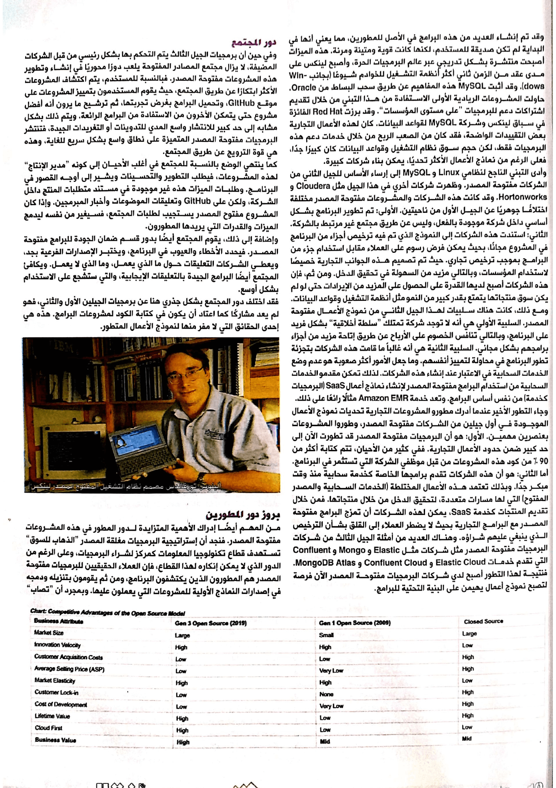
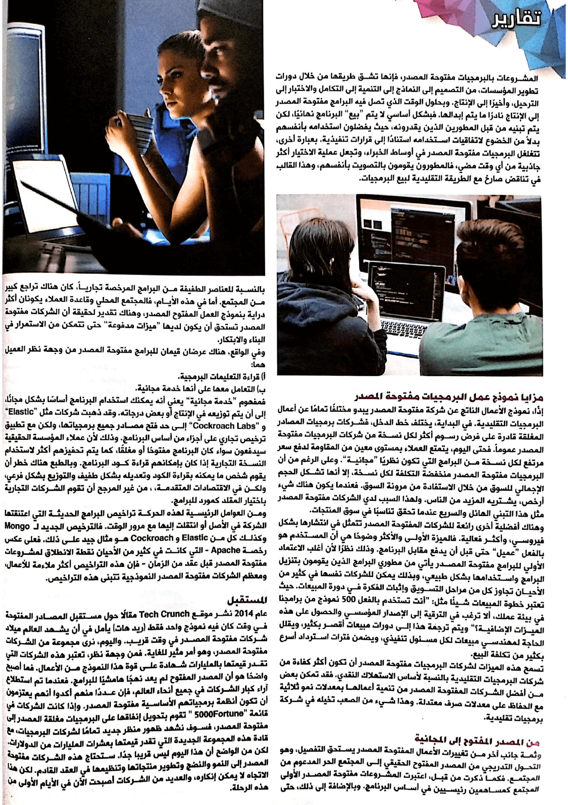

+++
title = "البرمجيات مفتوحة المصدر تجتاح العالم"
date = "2019-02-01"
description = "منذ خمسة سنوات تقريبا شاع في أوساط المستثمرين موجة كبيرة من الجدال حول جدوى البرمجيات مفتوحة المصدر كنموذج عمل، وفي ذلك الوقت كان النموذج الوحيد الناجح هو شركة ريد هات Red Hat، التي رأي كثير من المختصين أنه لن تكون هناك أي شركة أخري بنفس أهميتها في عالم المصادر المفتوحة، على الأقل حتى وقت قريب."
categories = ["تقارير", "برمجيات حرة",]
tags = ["مجلة لغة العصر"]

+++
منذ خمسة سنوات تقريبا شاع في أوساط المستثمرين موجة كبيرة من الجدال حول جدوى البرمجيات مفتوحة المصدر كنموذج عمل، وفي ذلك الوقت كان النموذج الوحيد الناجح هو شركة ريد هات Red Hat، التي رأي كثير من المختصين أنه لن تكون هناك أي شركة أخري بنفس أهميتها في عالم المصادر المفتوحة، على الأقل حتى وقت قريب.

وبالمرور سريعًا منذ ذلك الوقت حتى يومنا هذا، حدث العديد من التغيرات المثيرة للاهتمام، فقد تم الاستحواذ على شركة ريد هات Red Hat من قبل أي بي إم IBM في صفقة قيمتها 32 مليار دولار (ثلاثة أضعاف قيمتها السوقية في عام 2014)، وكذلك الاستحواذ على شركة MuleSoft مقابل 6.5 مليار دولار، ووصلت قيمة شركة MongoDB إلى 4 مليار دولار، وتقدر قيمة شركة Elastic ب 6 مليار، وبعد اندماج شركتي Cloudera وHortonworks وصلت القيمة السوقية للشركة الجديدة إلى 4 مليار دولار. بالإضافة إلى النمو المذهل لعدد من الشركات مفتوحة المصدر مثل Confluent - HashiCorp - DataBricks - Kong - Cockroach Labs، وغيرها الكثير. فبالنظر إلى الوضع الحالي لهذه الشركات والمستثمرين فيها يبدو أن هناك شيئًا خاصًا يحدث. ما الذي جعل هذه الحركة التي كانت تمثل مقدمة اتجاهات البرمجيات في وقت سابق مكانًا يعج بالاستثمارات؟ هناك عدد من التغييرات الأساسية التي أسفرت عن ازدهار أعمال البرمجيات مفتوحة المصدر وزيادة فرصها السوقية.

## من البرمجيات مفتوحة المصدر إلى البرمجيات كخدمة

لم تكن المشروعات مفتوحة المصدر الأصلية شركات أو ذات أغراض تجارية في المقام الأول، بل كانت "ثورات" ضد الأرباح غير العادلة التي كانت شركات البرمجيات مغلقة المصدر تجنيها. فقد كانت الشركات مثل Microsoft، وOracle، وSAP تقوم "بتأجير" البرمجيات بطريقة شبه احتكارية، لم يعتقد كبار المطورين في ذلك الوقت أنها على المستوي العالمي. لذلك، بدءًا بالمكونات الأكثر استخدامًا على نطاق واسع في أنظمة التشغيل وقواعد البيانات، تعاون المطورون بشكل تدريجي وفي كثير من الأحيان غير متزامن، في كتابة أجزاء كبيرة من البرامج التي يمكن لكل شخص رؤيتها واستخدامها وإضافة ميزات إليها وتحسينها.

وقد تم إنشاء العديد من هذه البرامج في الأصل للمطورين، مما يعني أنها في البداية لم تكن صديقة للمستخدم. لكنها كانت قوية ومتينة ومرنة. هذه الميزات أصبحت منتشرة بشكل تدريجي عبر عالم البرمجيات الحرة، وأصبح لينكس على مدى عقد من الزمن ثاني أكثر أنظمة التشغيل للخوادم شيوعًا (بجانب Windows)، وقد أثبت MySQL هذه المفاهيم عن طريق سحب البساط من Oracle.

حاولت المشاريع الريادية الأولى الاستفادة من هذا التبني من خلال تقديم اشتراكات دعم للبرمجيات "على مستوى المؤسسات". وقد برزت Red Hat الفائزة في سباق لينكس وشركة MySQL لقواعد البيانات. كان لهذه الأعمال التجارية بعض التقييدات الواضحة، فقد كان من الصعب الربح من خلال خدمات دعم هذه البرمجيات فقط، لكن حجم سوق نظام التشغيل وقواعد البيانات كان كبيرًا جدًا، فعلى الرغم من نماذج الأعمال الأكثر تحديًا، يمكن بناء شركات كبيرة.

وأدى التبني الناجح لنظام Linux وMySQL إلى إرساء الأساس للجيل الثاني من الشركات مفتوحة المصدر، وظهرت شركات آخري في هذا الجيل مثل Cloudera وHortonworks. وقد كانت هذه الشركات والمشاريع مفتوحة المصدر مختلفة اختلافًا جوهريًا عن الجيل الأول من ناحيتين. الأولى: تم تطوير البرنامج بشكل أساسي داخل شركة موجودة بالفعل وليس عن طريق مجتمع غير مرتبط بالشركة. الثاني: استندت هذه الشركات إلى النموذج الذي تم فيه ترخيص أجزاء من البرنامج في المشروع مجانًا، بحيث يمكن فرض رسوم على العملاء مقابل استخدام جزء من البرامج بموجب ترخيص تجاري. حيث تم تصميم هذه الجوانب التجارية خصيصًا لاستخدام المؤسسات وبالتالي مزيد من السهولة في تحقيق الدخل. ومن ثم، فإن هذه الشركات أصبح لديها القدرة على الحصول على المزيد من الإيرادات حتى لو لم يكن سوق منتجاتها يتمتع بقدر كبير من النمو مثل أنظمة التشغيل وقواعد البيانات.

ومع ذلك، كانت هناك سلبيات لهذا الجيل الثاني من نموذج الأعمال مفتوحة المصدر. السلبية الأولي هي أنه لا توجد شركة تمتلك "سلطة أخلاقية" بشكل فريد على البرنامج، وبالتالي تنافس الخصوم على الأرباح عن طريق إتاحة مزيد من أجزاء برامجهم بشكل مجاني. السلبية الثانية هي أنه غالباً ما قامت هذه الشركات بتجزئة تطور البرنامج في محاولة لتمييز أنفسهم. وما جعل الأمور أكثر صعوبة هو عدم وضع الخدمات السحابية في الاعتبار عند إنشاء هذه الشركات. لذلك تمكن مقدمو الخدمات السحابية من استخدام البرامج مفتوحة المصدر لإنشاء نماذج أعمال SaaS (البرمجيات كخدمة) من نفس أساس البرامج. وتعد خدمة Amazon EMR مثالًا رائعًا على ذلك.

وجاء التطور الأخير عندما أدرك مطورو المشاريع التجارية تحديات نموذج الأعمال الموجودة في أول جيلين من الشركات مفتوحة المصدر، وطوروا المشاريع بعنصرين مهمين. الأول هو أن البرمجيات مفتوحة المصدر قد تطورت الآن إلى حد كبير ضمن حدود الأعمال التجارية. ففي كثير من الأحيان، يتم كتابة أكثر من 90٪ من كود هذه المشاريع من قبل موظفي الشركة التي تستثمر في البرنامج. أما الثاني هو أن هذه الشركات تقدم برامجها الخاصة كخدمة سحابية منذ وقت مبكر جدًا. وبذلك تعتمد هذه الأعمال المختلطة (الخدمات السحابية والمصدر المفتوح) التي لها مسارات متعددة، لتحقيق الدخل من خلال منتجاتها. فمن خلال تقديم المنتجات كخدمة SaaS، يمكن لهذه الشركات أن تمزج البرامج مفتوحة المصدر مع البرامج التجارية بحيث لا يضطر العملاء إلى القلق بشأن الترخيص الذي ينبغي عليهم شراءه. هنالك العديد من أمثلة الجيل الثالث من شركات البرمجيات مفتوحة المصدر مثل شركات مثل Elastic وMongo وConfluent التي تقدم خدمات Elastic Cloud وConfluent Cloud وMongoDB Atlas. فنتيجة لهذا التطور أصبح لدي شركات البرمجيات مفتوحة المصدر الآن فرصة لتصبح نموذج أعمال يهيمن على البنية التحتية للبرامج.

## دور المجتمع

وفي حين أن برمجيات الجيل الثالث يتم التحكم بها بشكل رئيسي من قبل الشركات المضيفة، لا يزال مجتمع المصادر المفتوحة يلعب دورا محوريا في إنشاء وتطوير هذه المشاريع مفتوحة المصدر. فبالنسبة للمستخدم، يتم اكتشاف المشاريع الأكثر ابتكارًا عن طريق المجتمع، حيث يقوم المستخدمين بتمييز المشاريع على موقع GitHub، وتحميل البرامج بغرض تجربتها، ثم ترشيح ما يرون أنه أفضل مشروع حتى يتمكن الآخرون من الاستفادة من البرامج الرائعة. ويتم ذلك بشكل مشابه إلى حد كبير للانتشار واسع المدي للتدوينات أو التغريدات الجيدة، فتنتشر البرمجيات مفتوحة المصدر المتميزة على نطاق واسع بشكل سريع للغاية، وهذه هي قوة الترويج عن طريق المجتمع.

كما ينتهي الوضع بالنسبة للمجتمع في أغلب الأحيان إلى كونه "مدير الإنتاج" لهذه المشروعات، فيطلب التطوير والتحسينات ويشير إلى أوجه القصور في البرنامج. وطلبات الميزات هذه غير موجودة في مستند متطلبات المنتج داخل الشركة، ولكن على GitHub، وتعليقات الموضوعات وأخبار المبرمجين. وإذا كان المشروع مفتوح المصدر يستجيب لطلبات المجتمع، فسيغير من نفسه ليدمج الميزات والقدرات التي يريدها المطورون.

وإضافة إلى ذلك، يقوم المجتمع أيضا بدور قسم ضمان الجودة للبرامج مفتوحة المصدر. فيحدد الأخطاء والعيوب في البرنامج، ويختبر الإصدارات الفرعية بجد ويعطي الشركات التعليقات حول ما الذي يعمل، وما الذي لا يعمل. ويكافئ المجتمع أيضًا البرامج الجيدة بالتعليقات الإيجابية، والتي ستشجع على الاستخدام بشكل أوسع.

فقد أختلف دور المجتمع بشكل جذري هنا عن برمجيات الجيلين الأول والثاني، فهو لم يعد مشاركًا كما اعتاد أن يكون في كتابة الكود لمشاريع البرامج. هذه هي أحد الحقائق التي لا مفر منها لنموذج الأعمال المتطور.

(لينوس تورفالدس مصمم نظام التشغيل المفتوح المصدر لينكس)

## بروز دور المطورين

من المهم أيضًا إدراك الأهمية المتزايدة لدور المطور في هذه المشاريع مفتوحة المصدر. فنجد أن استراتيجية البرمجيات مغلقة المصدر "الذهاب للسوق" تستهدف قطاع تكنولوجيا المعلومات كمركز لشراء البرمجيات، وعلى الرغم من الدور الذي لا يمكن إنكاره لهذا القطاع، فإن العملاء الحقيقيون للبرمجيات مفتوحة المصدر هم المطورون الذين يكتشفون البرنامج، ومن ثم يقومون بتنزيله ودمجه في إصدارات النماذج الأولية للمشاريع التي يعملون عليها. وبمجرد أن "تصاب" المشاريع بالبرمجيات مفتوحة المصدر، فإنها تشق طريقها من خلال دورات تطوير المؤسسات، من التصميم إلى النماذج إلى التنمية إلى التكامل والاختبار إلى الترحيل، وأخيرا إلى الإنتاج. وبحلول الوقت الذي تصل فيه البرامج مفتوحة المصدر إلى الإنتاج نادرا ما يتم ابدالها. فبشكل أساسي لا يتم "بيع" البرنامج نهائيًا، لكن يتم تبنيه من قبل المطورين الذين يقدرونه، حيث يفضلون استخدامه بأنفسهم بدلاً من الخضوع لاتفاقيات استخدامه استنادًا إلى قرارات تنفيذية. بعبارة أخرى، تتغلغل البرمجيات مفتوحة المصدر في أوساط الخبراء، وتجعل عملية الاختيار أكثر جاذبية من أي وقت مضي، فالمطورون يقومون بالتصويت بأنفسهم، وهذا القالب في تناقض صارخ مع الطريقة التقليدية لبيع البرمجيات.

## مزايا نموذج عمل البرمجيات مفتوحة المصدر

إذًا، نموذج الأعمال الناتج عن شركة مفتوحة المصدر يبدو مختلفًا تماما عن أعمال البرمجيات التقليدية. في البداية، يختلف خط الدخل، فشركة برمجيات المصدر مغلقة قادرة على فرض رسوم أكثر لكل نسخة من شركة مفتوحة المصدر عموماً. فحتى اليوم، يتمتع العملاء بمستوى معين من المقاومة لدفع سعر مرتفع لكل نسخة من البرامج التي تكون نظريًا "مجانية". وعلى الرغم من أن البرمجيات مفتوحة المصدر منخفضة التكلفة لكل نسخة، إلا أنها تشكل الحجم الإجمالي للسوق من خلال الاستفادة من مرونة السوق. فعندما يكون هناك شيء أرخص، يشتريه المزيد من الناس. ولهذا السبب لدي الشركات مفتوحة المصدر مثل هذا التبني الهائل والسريع عندما تحقق تناسبًا في سوق المنتجات.

وهناك أفضلية أخرى رائعة للشركات المفتوحة المصدر تتمثل في انتشارها بشكل فيروسي وأكثر فعالية. فالميزة الأولى والأكثر وضوحا هي أن المستخدم هو بالفعل "عميل" حتى قبل أن يدفع مقابل البرنامج. وذلك نظرًا لأن أغلب الاعتماد الأولي للبرامج مفتوحة المصدر يأتي من مطوري البرامج الذين يقومون بتنزيل البرامج واستخدامها بشكل طبيعي، وبذلك يمكن للشركات نفسها في كثير من الأحيان تجاوز كل من مراحل التسويق وإثبات الفكرة في دورة المبيعات. حيث تعتبر خطوة المبيعات شيئا مثل "أنت تستخدم بالفعل 500 نموذج من برامجنا في بيئة عملك، ألا ترغب في الترقية إلى الإصدار المؤسسي والحصول على هذه الميزات الإضافية؟" وهذا يُتَرجَم إلى دورات مبيعات أقصر بكثير، ويقلل الحاجة لمهندسي مبيعات لكل مسؤول تنفيذي، ويضمن فترات استرداد أسرع بكثير من تكلفة البيع.

تسمح هذه الميزات لشركات البرمجيات مفتوحة المصدر أن تكون أكثر كفاءة من شركات البرمجيات التقليدية بالنسبة لأساس الاستهلاك النقدي. فقد تمكنت بعض من أفضل الشركات المفتوحة المصدر من تنمية أعمالها بمعدلات نمو ثلاثية مع الحفاظ على معدلات صرف معتدلة. وهذا شيء من الصعب تخيله في شركة برمجيات تقليدية.

## من المصدر المفتوح إلى المجانية

وثمة جانب اخر من تغييرات الأعمال المفتوحة المصدر يستحق التفصيل، وهو التحول التدريجي من المصدر المفتوح الحقيقي إلى المجتمع الحر المدعوم من المجتمع. فكما ذكرت من قبل، اعتبرت المشروعات مفتوحة المصدر الأولى المجتمع كمساهمين رئيسيين في أساس البرنامج. وبالإضافة إلى ذلك، حتى بالنسبة للعناصر الطفيفة من البرامج المرخصة تجارياً، كان هناك تراجع كبير من المجتمع. أما في هذه الأيام، فالمجتمع المحلي وقاعدة العملاء يكونان أكثر دراية بنموذج العمل المفتوح المصدر، وهناك تقدير لحقيقة أن الشركات مفتوحة المصدر تستحق أن يكون لديها "ميزات مدفوعة" حتى تتمكن من الاستمرار في البناء والابتكار.

وفي الواقع، العرضان القيمان للبرامج مفتوحة المصدر من وجهة نظر العميل هما:

أ) قراءة التعليمات البرمجية
ب) التعامل معها على أنها خدمة مجانية.

فمفهوم "خدمة مجانية" يعني أنه يمكنك استخدام البرنامج أساسًا بشكل مجانًا، إلى أن يتم توزيعة في الإنتاج أو بعض درجاته. وقد ذهبت شركات مثل " Elastic" و " Cockroach Labs" إلى حد فتح مصادر جميع برمجياتها ولكن مع تطبيق ترخيص تجاري على أجزاء من أساس البرنامج. وذلك لأن عملاء المؤسسة الحقيقية سيدفعون سواء كان البرنامج مفتوحًا أو مغلقًا، كما يتم تحفيزهم أكثر لاستخدام النسخة التجارية إذا كان بإمكانهم قراءة كود البرنامج. وبالطبع هناك خطر أن يقوم شخص ما يمكنه بقراءة الكود وتعديله بشكل طفيف والتوزيع بشكل فرعي، ولكن في الاقتصادات المتقدمة - حيث توجد الكثير من الإيجارات على أي حال - من غير المرجح أن تقوم الشركات التجارية باختيار المقلد كمورد للبرامج.

ومن العوامل الرئيسية لهذه الحركة تراخيص البرامج الحديثة التي اعتنقتها الشركة في الأصل أو انتقلت إليها مع مرور الوقت. فالترخيص الجديد ل Mongoوكذلك كلا من Elastic وCockroachهو مثال جيد على ذلك. فعلى عكس رخصة Apache - التي كانت في كثير من الأحيان نقطة الانطلاق لمشاريع مفتوحة المصدر قبل عقد من الزمان - فإن هذه التراخيص أكثر ملاءمة للأعمال، ومعظم الشركات مفتوحة المصدر النموذجية تتبنى هذه التراخيص.

## المستقبل

عام 2014 نشر موقع Tech Crunch مقالا حول مستقبل المصادر المفتوحة في وقت كان فيه نموذج واحد فقط (ريد هات) يأمل في أن يشهد العالم ميلاد شركات مفتوحة المصدر في وقت قريب. واليوم، نرى مجموعة من الشركات مفتوحة المصدر، وهو أمر مثير للغاية. فمن وجهة نظر واحدة، هذه الشركات التي تقدر قيمتها بالمليارات هي شهادة على قوة هذا النموذج من الأعمال. فما أصبح واضحا هو أن المصدر المفتوح لم يعد نهجًا هامشيًا للبرامج. فعندما تم استطلاع آراء كبار الشركات في جميع أنحاء العالم، فإن عددت منهم يعتزمون أن تكون أنظمة برمجياتهم الأساسية مفتوحة المصدر. وإذا كانت الشركات في قائمة "5000Fortune " تقوم بتحويل إنفاقها على البرمجيات مغلقة المصدر إلى مفتوحة المصدر، فسوف نشهد ظهور منظر جديد تمامًا لشركات البرمجيات، مع قادة هذه المجموعة الجديدة التي تقدر قيمتها بعشرات المليارات من الدولارات.

لكن من الواضح أن هذا اليوم ليس قريبا جدًا. ستحتاج هذه الشركات مفتوحة المصدر إلى النمو والنضج وتطوير منتجاتها وتنظيمها في العقد القادم. لكن هذا الاتجاه لا يمكن إنكاره، والعديد من الشركات أصبحت الآن في الأيام الأولى من هذه الرحلة.

[المصدر](https://techcrunch.com/2019/01/12/how-open-source-software-took-over-the-world/)

---

هذا الموضوع نُشر باﻷصل في مجلة لغة العصر العدد 218 شهر 02-2019 ويمكن الإطلاع عليه [هنا](https://drive.google.com/file/d/1FTbE9MDcqwYb7zo29KhhHdFgvlP7ldZo/view?usp=sharing).

