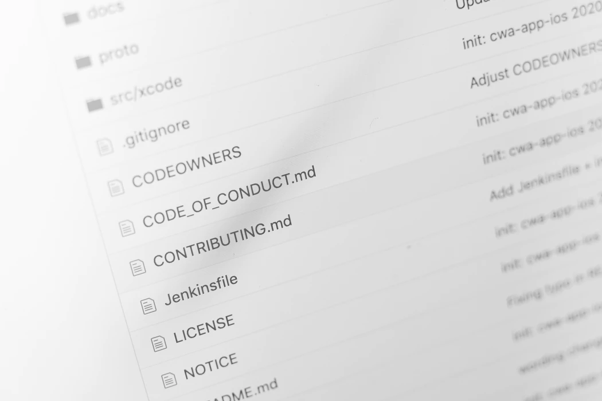
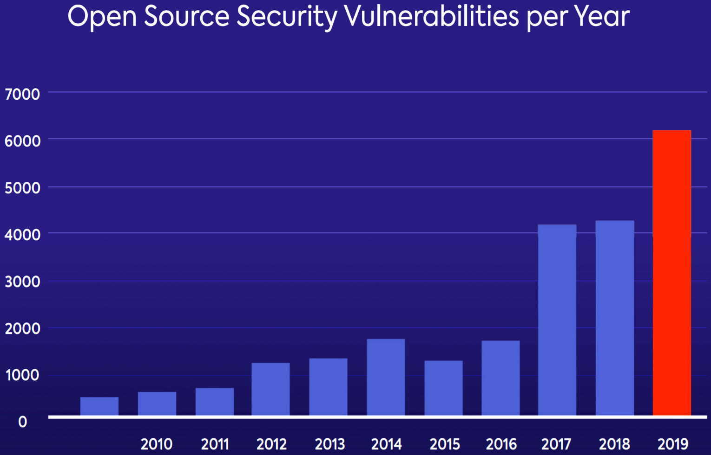
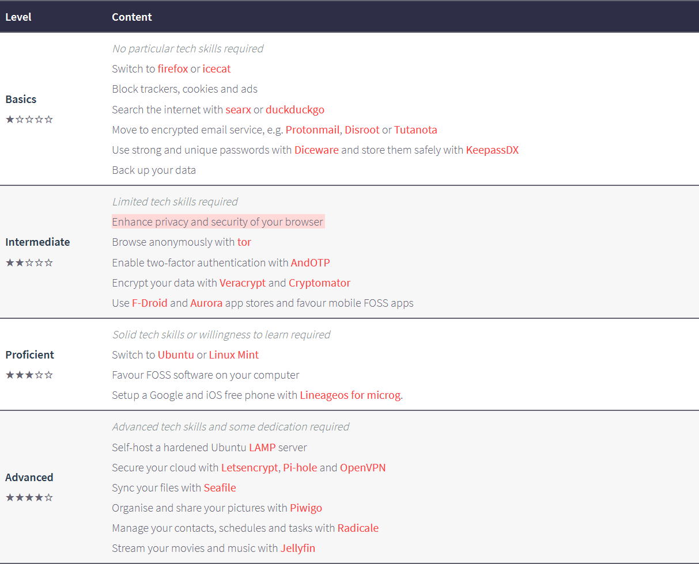
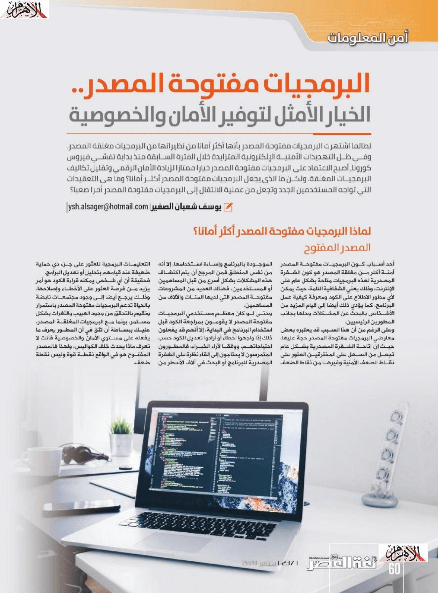
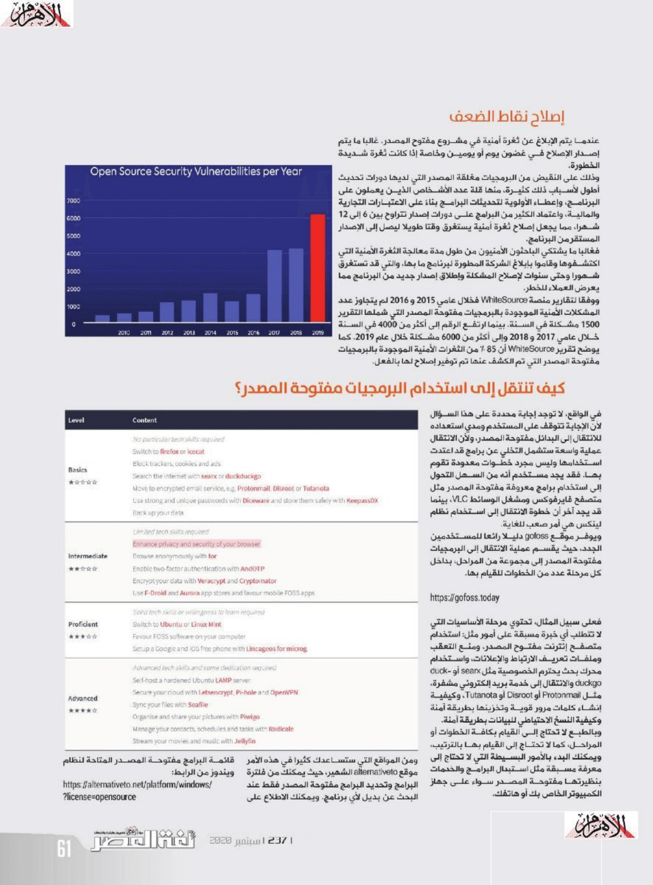
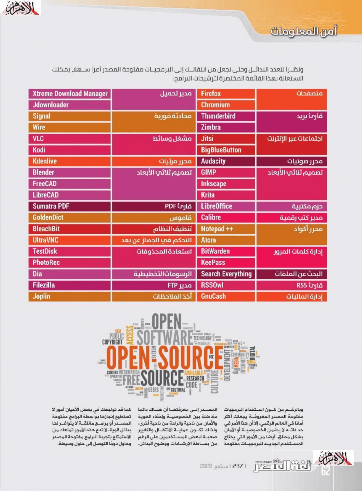

+++
title = "البرمجيات مفتوحة المصدر.. الخيار الأمثل لتوفير الأمان والخصوصية"
date = "2020-09-01"
description = "لطالما اشتهرت البرمجيات مفتوحة المصدر بأنها أكثر أمانًا من نظيراتها من البرمجيات مغلقة المصدر. وفي ظل التهديدات الأمنية الإلكترونية المتزايدة خلال الفترة السابقة منذ بداية تفشي فيروس كورونا، أصبح الاعتماد على البرمجيات مفتوحة المصدر خيارًا ممتازًا لزيادة الأمان الرقمي وتقليل تكاليف البرمجيات المغلقة. ولكن ما الذي يجعل البرمجيات مفتوحة المصدر أكثر أمانًا؟ وما هي التعقيدات التي تواجه المستخدمون الجدد وتجعل من عملية الانتقال إلى البرمجيات مفتوحة المصدر أمرًا صعبًا؟"
categories = ["برمجيات حرة", "الخصوصية", "اﻷمن الرقمي",]
tags = ["مجلة لغة العصر"]

+++
لطالما اشتهرت البرمجيات مفتوحة المصدر بأنها أكثر أمانًا من نظيراتها من البرمجيات مغلقة المصدر. وفي ظل التهديدات الأمنية الإلكترونية المتزايدة خلال الفترة السابقة منذ بداية تفشي فيروس كورونا، أصبح الاعتماد على البرمجيات مفتوحة المصدر خيارًا ممتازًا لزيادة الأمان الرقمي وتقليل تكاليف البرمجيات المغلقة. ولكن ما الذي يجعل البرمجيات مفتوحة المصدر أكثر أمانًا؟ وما هي التعقيدات التي تواجه المستخدمون الجدد وتجعل من عملية الانتقال إلى البرمجيات مفتوحة المصدر أمرًا صعبًا؟

 

## لماذا البرمجيات مفتوحة المصدر أكثر أمانًا؟

### المصدر المفتوح

أحد أسباب كون البرمجيات مفتوحة المصدر آمنة أكثر من مغلقة المصدر هو كون الشفرة المصدرية لهذه البرمجيات متاحة بشكل عام على الإنترنت، وذلك يعني الشفافية التامة حيث يمكن لأي مطور الاطلاع على الكود ومعرفة كيفية عمل البرنامج، كما يؤدي ذلك أيضا إلى قيام المزيد من الأشخاص بالبحث عن المشاكل وحلها بجانب المطورين الرئيسيين.

وعلى الرغم من أن هذا السبب قد يعتبره بعض معارضو البرمجيات مفتوحة المصدر حجة عليها حيث إن إتاحة الشفرة المصدرية بشكل عام تجعل من السهل على المخترقين العثور على نقاط الضعف الأمنية وغيرها من نقاط الضعف الموجودة بالبرنامج وإساءة استخدامها، إلا أنه من نفس المنطلق فمن المرجح أن يتم اكتشاف هذه المشكلات بشكل أسرع من قبل المساهمين أو المستخدمين، فهناك العديد من المشاريع مفتوحة المصدر التي لديها المئات والآلاف من المساهمين.

وحتى لو كان معظم مستخدمي البرمجيات مفتوحة المصدر لا يقومون بمراجعة الكود قبل استخدام البرنامج في البداية، إلا أنهم قد يفعلون ذلك إذا واجهوا أخطاء أو أرادوا تعديل الكود حسب احتياجاتهم. ووفقًا لآراء الخبراء، فالمطورين المتمرسين لا يحتاجون إلى إلقاء نظرة على الشفرة المصدرية للبرنامج أو البحث في آلاف الأسطر من التعليمات البرمجية للعثور على جزء ذو حماية ضعيفة عند قيامهم بتحليل أو تعديل البرامج.

فحقيقة أن أي شخص يمكنه قراءة الكود هو أمر يزيد من فرصة العثور على الأخطاء وإصلاحها. وذلك يرجع أيضًا إلى وجود مجتمعات نابضة بالحياة تدعم البرمجيات مفتوحة المصدر باستمرار وتقوم بالتحقق من وجود العيوب والثغرات بشكل مستمر، بينما مع البرمجيات المغلقة المصدر، عليك ببساطة أن تثق في أن المطور يعرف ما يفعله على مستوي الأمان والخصوصية فأنت لا تعرف ماذا يحدث خلف الكواليس، ولهذا فالمصدر المفتوح هو في الواقع نقطة قوة وليس نقطة ضعف.

### إصلاح نقاط الضعف وإصدار النسخ الجديدة بشكل أسرع

عندما يتم الإبلاغ عن ثغرة أمنية في مشروع مفتوح المصدر، غالبًا ما يتم إصدار الإصلاح في غضون يوم أو يومين وخاصة إذا كانت ثغرة شديدة الخطورة.

وذلك على النقيض من البرمجيات مغلقة المصدر التي لديها دورات تحديث أطول لأسباب ذلك كثيرة منها قلة عدد الأشخاص الذين يعملون على البرنامج، وإعطاء الأولوية لتحديثات البرامج بناءً على الاعتبارات التجارية والمالية، واعتماد الكثير من البرامج على دورات إصدار تتراوح بين 6 إلى 12 شهرًا مما يجعل إصلاح ثغرة أمنية يستغرق وقتًا طويلاً ليصل إلى الإصدار المستقر من البرنامج.

فغالبًا ما يشتكي الباحثون الأمنيون من طول مدة معالجة الثغرة الأمنية التي اكتشفوها وقاموا بإبلاغ الشركة المطورة لبرنامج ما بها، والتي قد تستغرق شهورًا وحتى سنوات لإصلاح المشكلة وإطلاق إصدار جديد من البرنامج مما يعرض العملاء للخطر.

ووفقًا لتقارير منصة WhiteSource، فخلال عامي 2015 و2016 لم يتجاوز عدد المشاكل الأمنية الموجودة بالبرمجيات مفتوحة المصدر التي شملها التقرير 1500 مشكلة في السنة، بينما ارتفع الرقم إلى أكثر من 4000 في السنة خلال عامي 2017 و2018 وإلى أكثر من 6000 مشكلة خلال عام 2019. كما يوضح تقرير WhiteSource أن 85٪ من الثغرات الأمنية الموجودة بالبرمجيات مفتوحة المصدر التي تم الكشف عنها تم توفير إصلاح لها بالفعل.

## كيف تنتقل إلى استخدام البرمجيات مفتوحة المصدر؟

في الواقع، لا توجد إجابة محددة على هذا السؤال لأن الإجابة تتوقف على المستخدم ومدي استعداده للانتقال إلى البدائل مفتوحة المصدر، ولأن الانتقال عملية واسعة ستشمل التخلي عن برامج قد اعتدت استخدامها وليس مجرد خطوات معدودة تقوم بها. فقد يجد مستخدم أنه من السهل التحول إلى استخدام برامج معروفة مفتوحة المصدر مثل متصفح فايرفوكس ومشغل الوسائط VLC، بينما قد يجد آخر أن خطوة الانتقال إلى استخدام نظام لينكس هي أمرٌ صعبٌ للغاية.

ويوفر موقع gofoss دليلًا رائعا للمستخدمين الجدد، حيث يقسم عملية الانتقال إلى البرمجيات مفتوحة المصدر إلى مجموعة من المراحل، بداخل كل مرحلة عدد من الخطوات للقيام بها.

[https://gofoss.today](https://gofoss.today/)

فعلى سبيل المثال، تحتوي مرحلة الأساسيات والتي لا تتطلب أي خبرة مسبقة على أمور مثل: استخدام متصفح إنترنت مفتوح المصدر، ومنع التعقب وملفات تعريف الارتباط والإعلانات، واستخدام محرك بحث يحترم الخصوصية مثل searx أو duckduckgo، والانتقال إلى خدمة بريد إلكتروني مشفرة، مثل Protonmail أو Disroot أو Tutanota، وكيفية إنشاء كلمات مرور قوية وتخزينها بطريقة آمنة وكيفية النسخ الاحتياطي للبيانات بطريقة آمنة.

وبالطبع لا تحتاج إلى القيام بكافة الخطوات أو المراحل، كما لا تحتاج إلى القيام بها بالترتيب، ويمكنك البدء بالأمور البسيطة التي لا تحتاج إلى معرفة مسبقة مثل استبدال البرامج والخدمات بنظيرتها مفتوحة المصدر سواء على جهاز الكمبيوتر الخاص بك أو هاتفك.

ومن المواقع التي ستساعدك كثيرا في هذه الأمر موقع alternativeto الشهير، حيث يمكنك من فلترة البرامج وتحديد البرامج مفتوحة المصدر فقط عند البحث عن بديل لأي برنامج. ويمكنك الاطلاع على قائمة البرامج مفتوحة المصدر المتاحة لنظام ويندوز هنا 

https://alternativeto.net/platform/windows/?license=opensource

ونظرا لتعدد البدائل وحتى نجعل من انتقالك إلى البرمجيات مفتوحة المصدر أمرًا سهلا، يمكنك الاستعانة بهذا القائمة المختصرة لترشيحات البرامج:

| الفئة | البرنامج | الفئة | البرنامج |
| ----------------------------- | ----------------- | ------------------------------- | ----------------------- |
| **متصفحات** | Firefox | **مدير تحميل** | Xtreme Download Manager |
| | Chromium | | Jdownloader |
| **قارئ بريد** | Thunderbird | **محادثة فورية** | Signal |
| | Zimbra | | Wire |
| **اجتماعات عبر الإنترنت** | Jitsi | **مشغل وسائط** | VLC |
|  | BigBlueButton |  | Kodi |
| محرر صوتيات‬ | Audacity | **محرر مرئيات‬** | Kdenlive |
| **تصميم ثنائي الأبعاد** | GIMP | **تصميم ثلاثي الأبعاد** | Blender‬‬‬‬ |
| | Inkscape‬‬‬‬ | | FreeCAD |
| | Krita | | LibreCAD |
| **حزم مكتبية** | LibreOffice | **قارئ PDF** | Sumatra‬‬ PDF‬‬‬‬‬‬ |
| **مدير كتب رقمية** | Calibre | **قاموس** | GoldenDict |
| **محرر أكواد** | Notepad‬‬ ++‬‬‬‬‬‬ | **تنظيف النظام** | BleachBit |
| | Atom | **التحكم في الجهاز عن بعد** | UltraVNC |
| **إدارة كلمات المرور** | BitWarden | **استعادة المحذوفات** | TestDisk |
|  | KeePass | | PhotoRec |
| **البحث عن الملفات** | Search Everything | **الرسومات التخطيطية** | Dia |
| **قارئ RSS** | RSSOwl | **مدير FTP** | Filezilla |
| **إدارة الماليات** | GnuCash | **أخذ الملاحظات** | Joplin |

وبالرغم من كون استخدام البرمجيات مفتوحة المصدر المعروفة يجعلك أكثر أمانا في العالم الرقمي، إلا أن هذا الأمر في حد ذاته لا يضمن الخصوصية أو الأمان بشكل مطلق. أيضا من الأمور التي يحتاج المستخدم الجديد للبرمجيات مفتوحة المصدر إلى معرفتها أن هناك دائما مفاضلة بين الخصوصية وإخفاء الهوية والأمان من ناحية والراحة من ناحية أخرى، ولذلك تكون عملية الانتقال والتغيير صعبة لبعض المستخدمين على الرغم من بساطة الإرشادات ووضوح البدائل. كما قد تواجهك في بعض الأحيان أمور لا تستطيع إنجازها بواسطة البرامج مفتوحة المصدر أو برامج مغلقة لا يتوفر لها بدائل قوية، لا تدع هذه الأمور تمنعك من الاستمتاع بتجربة البرامج مفتوحة المصدر وحاول دومًا التوصل إلى حلول وسيطة.

---

هذا الموضوع نُشر باﻷصل في مجلة لغة العصر العدد 237 شهر 09-2020 ويمكن الإطلاع عليه [هنا](https://drive.google.com/file/d/10tpjJH9UwTpuxQ8nMAAQL2JYKltr0RIh/view?usp=sharing).

