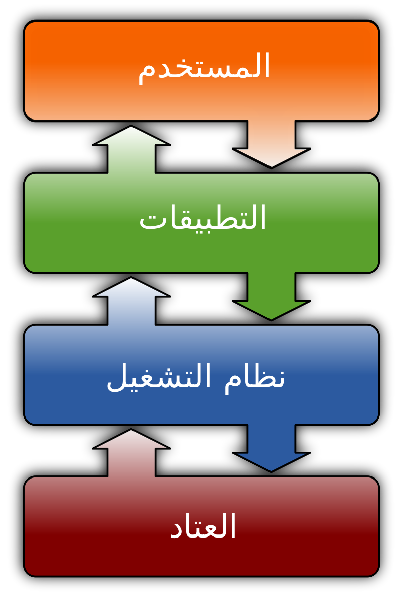
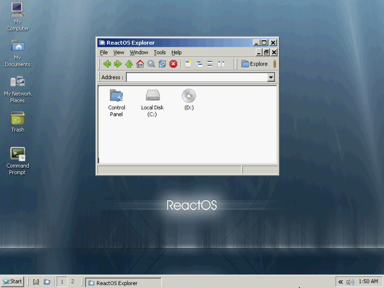
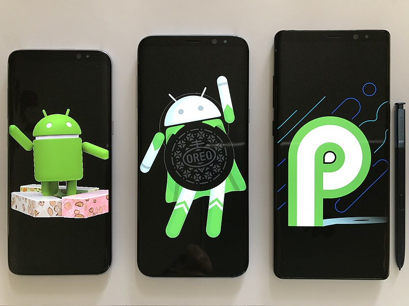
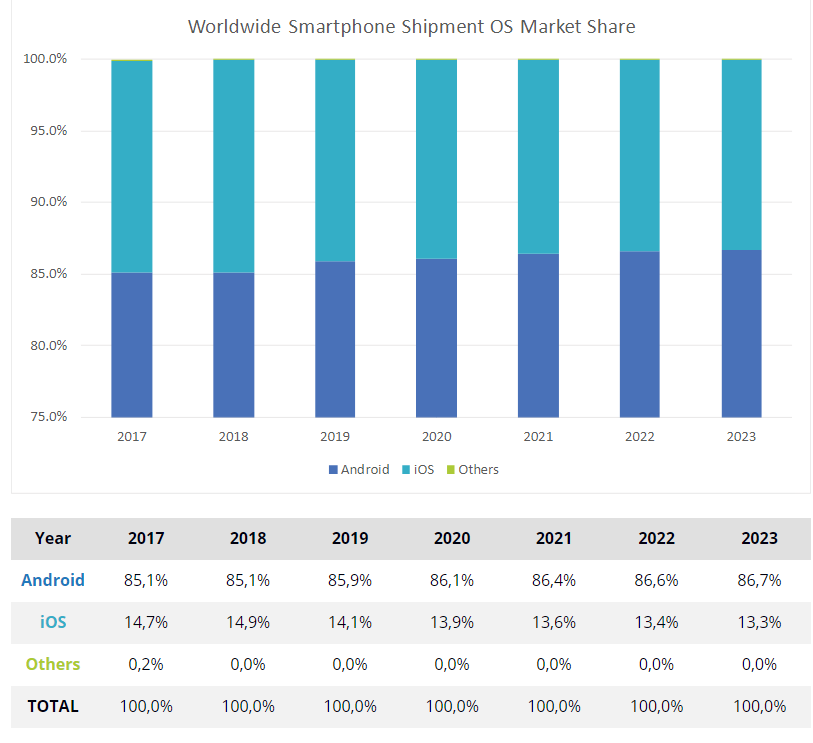
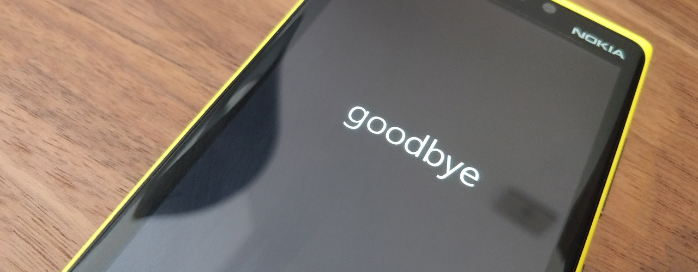
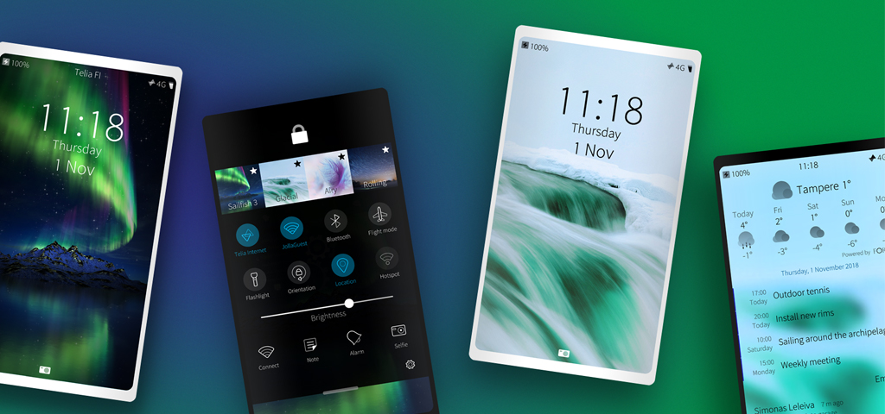
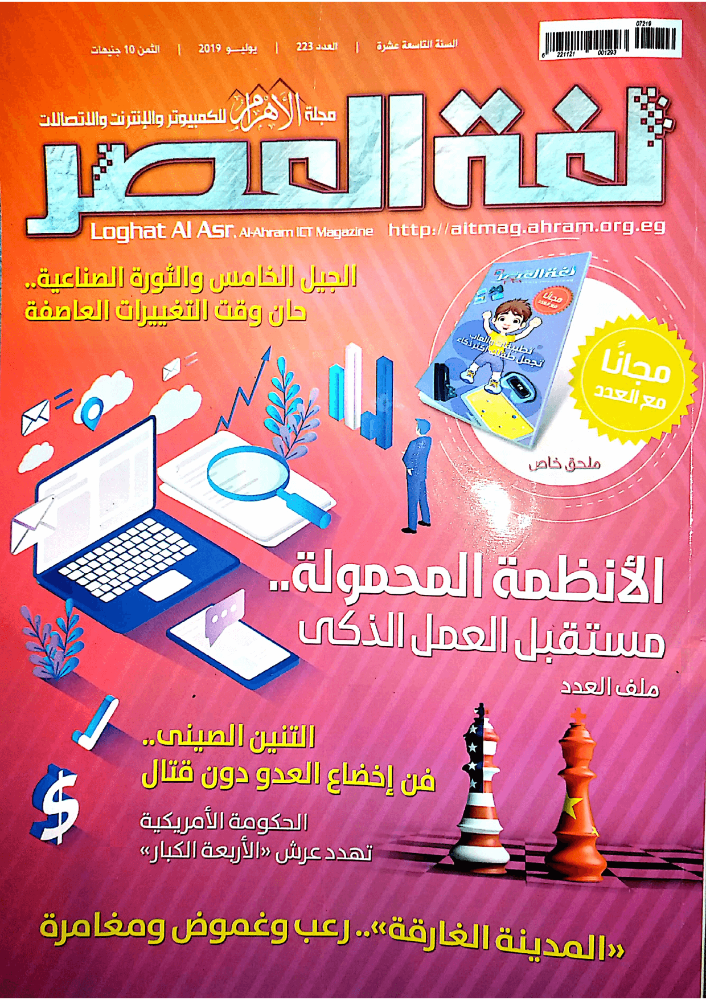
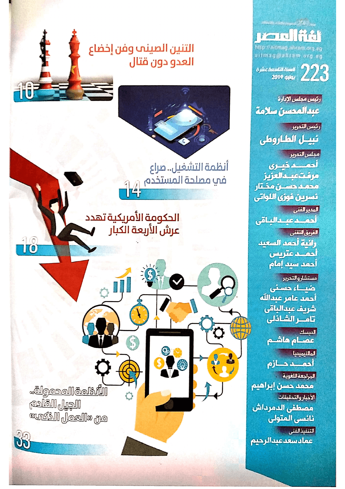
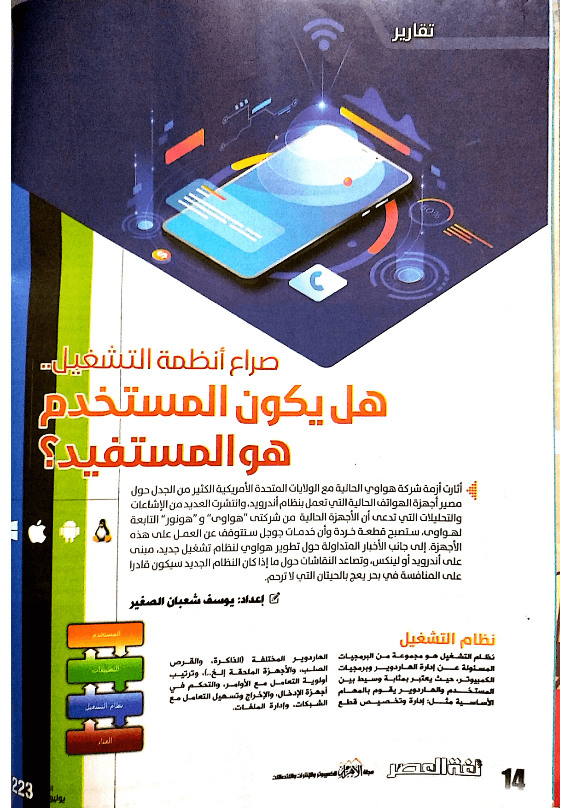
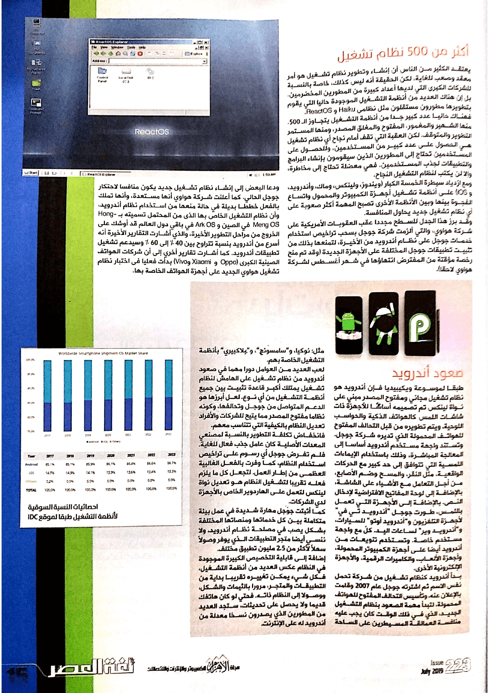

+++
title = "صراع أنظمة التشغيل.. هل يكون المستخدم هو المستفيد؟"
date = "2019-07-01"
description = "أثارت أزمة شركة هواوي الحالية مع الولايات المتحدة الأمريكية الكثير من الجدل حول مصير أجهزة الهواتف الحالية التي تعمل بنظام أندرويد، وتفاقم إلى السطح العديد من الإشاعات والتحليلات التي تدعى أن الأجهزة الحالية ستصبح قطعة خردة وأن خدمات جوجل ستتوقف عن العمل على هذه الأجهزة. إلى جانب الأخبار المتداولة حول تطوير هواوي لنظام تشغيل جديد، مبنى على أندرويد أو لينكس، وتصاعد النقاشات حول ما إذا كان النظام الجديد سيكون قادرا على المنافسة في بحر يعج بالحيتان التي لا ترحم."
categories = ["تقارير",]
tags = ["مجلة لغة العصر"]
images = ["images/big4.png"]

+++
أثارت أزمة شركة هواوي الحالية مع الولايات المتحدة الأمريكية الكثير من الجدل حول مصير أجهزة الهواتف الحالية التي تعمل بنظام أندرويد، وتفاقم إلى السطح العديد من الإشاعات والتحليلات التي تدعى أن الأجهزة الحالية ستصبح قطعة خردة وأن خدمات جوجل ستتوقف عن العمل على هذه الأجهزة. إلى جانب الأخبار المتداولة حول تطوير هواوي لنظام تشغيل جديد، مبنى على أندرويد أو لينكس، وتصاعد النقاشات حول ما إذا كان النظام الجديد سيكون قادرا على المنافسة في بحر يعج بالحيتان التي لا ترحم.

## نظام التشغيل

نظام التشغيل هو مجموعة من البرمجيات المسؤولة عن إدارة الهاردوير وبرمجيات الكمبيوتر، حيث يعتبر بمثابة وسيط بين المستخدم والهاردوير يقوم بالمهام الأساسية مثل: إدارة وتخصيص قطع الهاردوير المختلفة (الذاكرة، والقرص الصلب، والأجهزة الملحقة إلخ...)، وترتيب أولوية التعامل مع الأوامر، والتحكم في أجهزة الإدخال، والإخراج وتسهيل التعامل مع الشبكات، وإدارة الملفات.

## أكثر من 500 نظام تشغيل

يعتقد الكثير من الناس أن إنشاء وتطوير نظام تشغيل هو أمر معقد وصعب للغاية، لكن الحقيقة أنه ليس كذلك، وخاصة بالنسبة للشركات الكبرى التي لديها أعداد كبيرة من المطورين المخضرمين. بل إن هناك العديد من أنظمة التشغيل الموجودة حاليا التي يقوم بتطويرها مطورون مستقلون مثل Haiku وReactOS.

فهناك حاليا عدد كبير جدا من أنظمة التشغيل يتجاوز ال 500. منها الشهير والمغمور، مفتوح مغلق المصدر، المستمر التطوير والمتوقف. لكن العقبة التي تقف أمام نجاح أي نظام تشغيل هي الحصول مستخدمين، وللحصول على المستخدمين تحتاج إلى المطورين الذين سيقومون بإنشاء البرامج والتطبيقات للمستخدمين. فهي معضلة تحتاج إلى مخاطرة، وإلا لن يكتب لنظام التشغيل النجاح.

ومع ازدياد سيطرة الخمسة الكبار (ويندوز – لينكس – ماك – أندرويد – iOS) على أنظمة تشغيل أجهزة الكمبيوتر والمحمول واتساع الفجوة بينها وبين الأنظمة الأخرى تصبح المهمة أكثر صعوبة على أي نظام تشغيل جديد يحاول المنافسة.

وقد بزر هذا الجدل للسطح مجددا عقب العقوبات الأمريكية على شركة هواوي، والتي ألزمت شركة جوجل بسحب تراخيص استخدام خدمات جوجل على نظام أندرويد من الأخيرة، لتمنعها بذلك من تثبيت تطبيقات جوجل المختلفة على الأجهزة الجديدة (وقد تم منح رخصة مؤقتة من المفترض انتهائها في شهر أغسطس لشركة هواوي لاحقا).

ودعا البعض إلى إنشاء نظام تشغيل جديد يكون منافسا لاحتكار جوجل الحالي. كما أعلنت شركة هواوي أنها مستعدة، وأنها تملك بالفعل خططا بديلا في حالة منعها من استخدام نظام أندرويد، وأن نظام التشغيل الخاص بها الذي من المحتمل تسميته ب HongMeng OS في الصين وArk OS في باقي دول العالم قد أوشك على الخروج من مراحل التطوير الأخيرة، والذي أشارت التقارير الأخيرة أنه أسرع من أندرويد بنسبة 60% وسيدعم تشغيل تطبيقات أندرويد. كما أشارت تقارير أخري إلى أن شركات الهواتف الصينية الكبرى (Oppo – Xiaomi – Vivo) بدأت باختبار نظام تشغيل هواوي الجديد على أجهزة الهواتف الخاصة بها بالفعل.

## صعود أندرويد

وفقًا لموسوعة ويكيبيديا فإن أندرويد هو نظام تشغيل مجاني ومفتوح المصدر مبني على نواة لينكس صُمّم أساسًا للأجهزة ذات شاشات اللمس كالهواتف الذكية والحواسب اللوحية، يتم تطويره من قبل التحالف المفتوح للهواتف المحمولة الذي تديره شركة جوجل. وتستند واجهة مستخدم أندرويد أساسا إلى المعالجة المباشرة، وذلك باستخدام الإيماءات اللمسية التي تتوافق إلى حد كبير مع الحركات الواقعية، مثل النقر، والمسح وضم الأصابع، من أجل التعامل مع الأشياء على الشاشة، بالإضافة إلى لوحة المفاتيح الافتراضية لإدخال النص. بالإضافة إلى الأجهزة التي تعمل باللمس، طورت جوجل أندرويد تي في لأجهزة التلفزيون وأندرويد أوتو للسيارات، وأندرويد وير لساعات اليد. كلٌ مع واجهة مستخدم خاصة. وتستخدم أنواع من أندرويد أيضا على أجهزة الكمبيوتر المحمولة، وأجهزة الألعاب، والكاميرات الرقمية، والأجهزة الإلكترونية الأخرى.

بدأ أندرويد كنظام تشغيل من شركة تحمل نفس الاسم ثم اشترته جوجل عام 2007 وقامت بالإعلان عنه، وتأسيس التحالف المفتوح للهواتف المحمولة، لتبدأ مهمة الصعود بنظام التشغيل الجديد، الذي في ذلك الوقت كان يجب عليه عمالقة مسيطرة على الساحة مثل نوكيا وسامسونج وبلاكبيري بأنظمة التشغيل الخاصة بهم.

لعبت العديد من العوامل دورا هاما في صعود أندرويد من نظام تشغيل على الهامش لنظام تشغيل يمتلك أكبر قاعدة تثبيت بين جميع أنظمة التشغيل من أي نوع. لعل أبرزها هو الدعم المتواصل من جوجل وتحالفها، وكونه نظاما مفتوح المصدر مما يتيح للشركات والأفراد تعديل النظام بالكيفية التي تتناسب معهم.

فانخفاض تكلفة التطوير بالنسبة لمصنعي المعدات الأصلية كان عامل جذب فعال للغاية. فلم تفرض Google أي رسوم على تراخيص استخدام النظام، كما وفرت بالفعل الغالبية العظمى من إطار العمل. لتجعل كل ما يلزم فعله تقريبا لتشغيل النظام هو تعديل نواة لينكس لتعمل على الهاردوير الخاص بالأجهزة لدي الشركات.

كما أثبتت جوجل مهارة شديدة في عمل بيئة متكاملة بين كل خدماتها ومنصاتها المختلفة بشكل يصب في مصلحة نظام أندرويد، ولا ننسي أيضا متجر التطبيقات الذي يوفر وصول سهل لأكثر من 2 مليون ونصف تطبيقات المختلفة.

إضافة إلى قابلية التخصيص الكبيرة الموجودة في النظام عكس العديد من أنظمة التشغيل، فكل شيء يمكن تغييره تقريبا بداية من التطبيقات والمتجر، مرورا بالثيمات والشكل، ووصولا إلى النظام ذاته. فحتي لو كان هاتفك قديم ولا يحصل على تحديثات، ستجد العديد من المطورين الذي يصدرون نسخ معدلة من أندرويد له على الإنترنت.
(احصائيات النسبة السوقية لأنظمة التشغيل طبقا لموقع IDC)

## خسارة المنافسين

استطاع أندرويد القضاء على العديد من أنظمة التشغيل منهاWindows Phone -BlackBerry -Firefox OS - Asha - Symbian. وحاليا يسيطر هو وiOS على أنظمة تشغيل الهواتف المحمولة بالعالم كما هو موضح بالإحصائيات.

تتعدد أسباب خسارة أنظمة التشغيل السابقة، فنجد أن ويندوز موبايل على الرغم من استثمار مايكروسوفت للمليارات في تطويره قد خرج من اللعبة تماما بسبب قلة دعم المطورين الذي بدوره جعل عدد التطبيقات المتوفرة قليلا للغاية مقارنة بالمنافسين في ذلك الوقت، وقد سببت مايكروسوفت هذه الأزمة بإعادة بناء النظام مع كل تحديث، مما جعل المطورين في مشاكل عديدة أدت في النهاية للحكم على النظام بالموت. أما نظام Symbian فقد واجه مشكلة كبيرة في دعم الهاردوير الجديد بشكل سريع، مما جعل أندرويد يوجه له ضربة في مقتل ليسقط سريعا مع بدايات صعود أندرويد. وكذلك كان حال أنظمة مفتوحة المصدر مثل Firefox OS – MeeGo – webOS.

خسارة كل هذه الأنظمة وخروجها من المنافسة أعطت دروسا عديدة أن أسباب النجاح ليست محصورة في دعم شركة كبيرة للنظام، أو كون النظام مفتوح المصدر، أو كون النظام يتميز بفكر جديد.

## المنافسون الجدد

ستشهد الأيام القادمة تطورا كبيرا في صراع أنظمة التشغيل وخاصة أنظمة أجهزة الهاتف. فإلى جانب أندرويد وiOS اللذان يحتلان العرش حاليا، قد يغير نظام Fuchsia الذي يتم تطويره حاليا من جوجل قواعد اللعبة مجددا. وقد تكون الضربة الأمريكية لهواوي سببا في إيقاظ عملاق جديد يستطيع المنافسة في الميدان المشتعل. كما أن Sailfish OS المبنى على لينكس والذي يدعم تشغيل تطبيقات أندرويد لا يزال متواجدا على الساحة، بل إن هناك تقارير مؤخرا عن احتمالية استخدام هواوي لنسخة منه تحت اسم Aurora OS بدلا من استخدام نظام خاص بها. إضافة إلى عمل مايكروسوفت على نظام تشغيل جديد يكون بمثابة "الكل في واحد" ليعمل على مختلف أنواع الأجهزة.

ويظل هناك سؤال أخير يتبادر إلى ذهن المستخدم، وهو ما مدي تأثير هذا الصراع عليه؟
بالنسبة إلى أزمة شركة هواوي الحالية، فإن الأجهزة الموجودة بالأسواق لن تتأثر بأي شكل من الأشكال، لكن التأثير سيطال أغلب الأجهزة التي ستصدر مستقبلا إن لم يكن جميعها.

وعلى المدي البعيد، إذا ظهر منافس قوي يستطيع الوقوف في وجه أندرويد وiOS فقد يكون هذا أمر جيد ولصالح المستخدم، حيث ستزداد حده المنافسة ويرتفع مستواها ليحاول كل نظام إثبات أنه الأفضل وأن يستحوذ على أكبر قدر ممكن من السوق، على الرغم من وجود جانب سلبي بعض الشيء هو انشقاق المنصات المختلفة وصعوبة التوافق فيما بينها. لكن الشيء المؤكد أن المنافسة حالية هي مهمة شاقة للغاية، لأن المستحوذ الحالي لن يتزحزح إلا إذا تغيرت قواعد اللعبة.

---

هذا الموضوع نُشر باﻷصل في مجلة لغة العصر العدد 223 شهر 07-2019 ويمكن الإطلاع عليه [هنا](https://drive.google.com/file/d/1BVEa31mPndHJLGphd26pZEEhv8kMNZua/view?usp=sharing).

