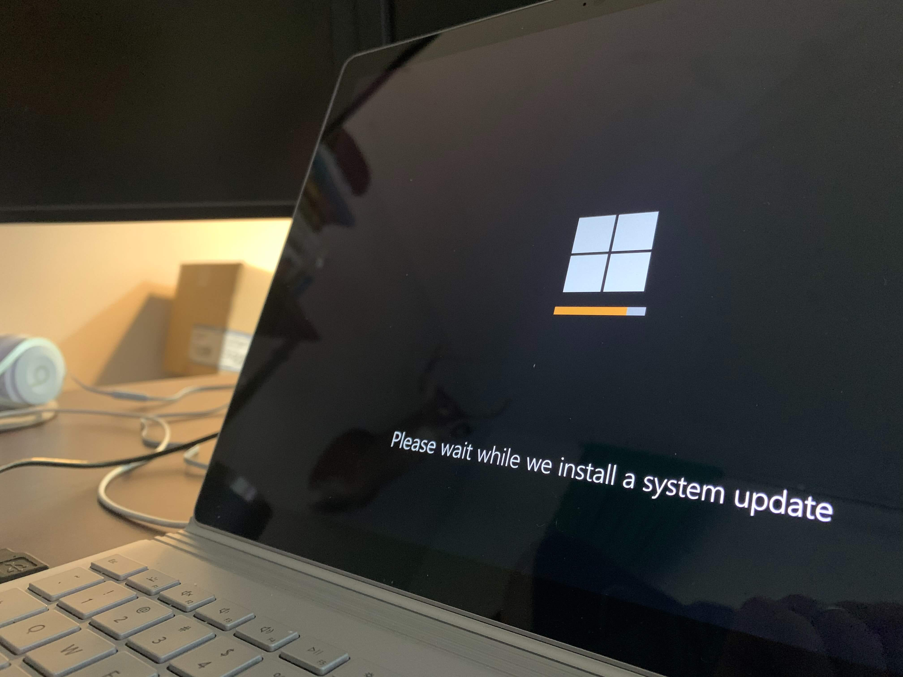
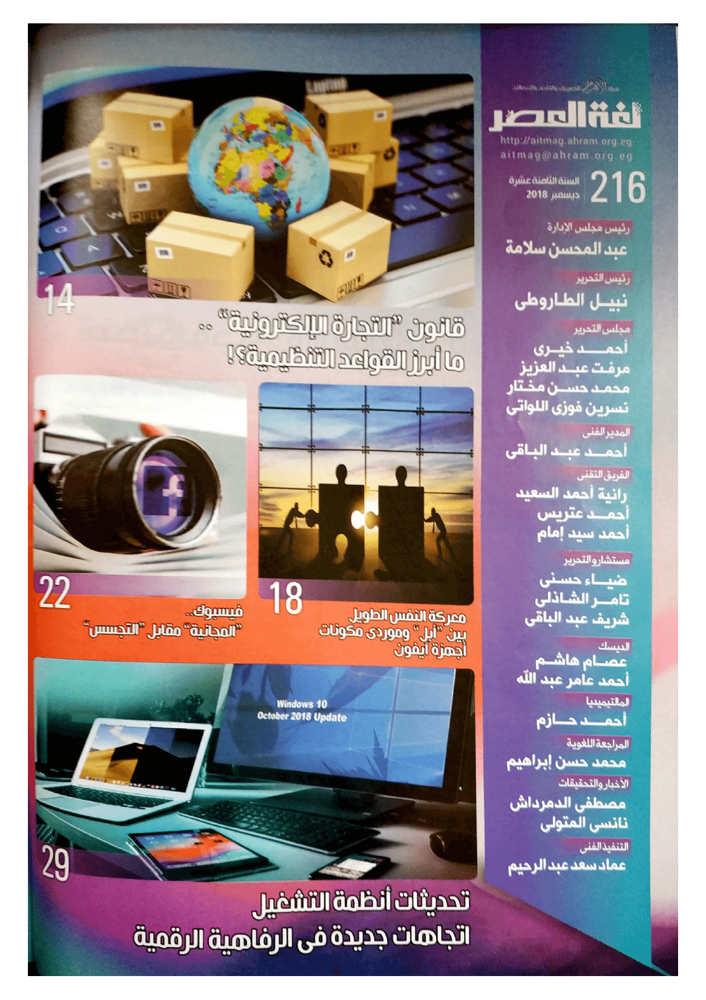
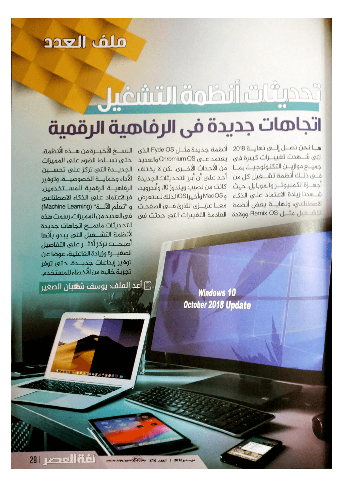

+++
title = "تحديثات أنظمة التشغيل.. اتجاهات جديدة في الرفاهية الرقمية"
date = "2018-12-01"
description = "نستعرض معا عزيزي القارئ في الصفحات القادمة التغييرات التي حدثت في النسخ اﻷخيرة من هذه الأنظمة، حتى نسلط الضوء على المميزات الجديدة التي تركز على تحسين اﻷداء وحماية الخصوصية وتوفير الرفاهية الرقمية للمستخدمين. فبالاعتماد على الذكاء الصناعي و \"تعلّم الآلة\" (Machine Learning) في العديد من المميزات، رسمت هذه التحديثات ملامح اتجاهات جديدة ﻷنظمة التشغيل التي يبدو بأنها أصبحت تركز أكثر على التفاصيل الصغيرة وزيادة الفاعلية، عوضا عن توفير إبداعات جديدة، حتى توفر تجربة خالية من الأخطاء للمستخدم."
categories = ["لينكس",]
tags = ["مجلة لغة العصر"]

+++
ها نحن نصل إلى نهاية 2018، التي شهدت تغييرات كبيرة في جميع موازين التكنولوجيا، بما في ذلك أنظمة تشغيل كل من أجهزة الكمبيوتر والموبايل، حيث شهدنا زيادة الاعتماد على الذكاء الاصطناعي، ونهاية بعض أنظمة التشغيل مثل Remix OS، وولادة أنظمة جديدة مثل Fyde OS الذي يعتمد على Chromium OS والعديد من الأحداث اﻷخري. لكن لا يختلف أحد على أن أبرز التحديثات الجديدة كانت من نصيب ويندوز 10، وأندرويد، وMac OS وأخيرا iOS. لذلك نستعرض معا عزيزي القارئ في الصفحات القادمة التغييرات التي حدثت في النسخ اﻷخيرة من هذه الأنظمة، حتى نسلط الضوء على المميزات الجديدة التي تركز على تحسين اﻷداء وحماية الخصوصية وتوفير الرفاهية الرقمية للمستخدمين. فبالاعتماد على الذكاء الصناعي و "تعلّم الآلة" (Machine Learning) في العديد من المميزات، رسمت هذه التحديثات ملامح اتجاهات جديدة ﻷنظمة التشغيل التي يبدو بأنها أصبحت تركز أكثر على التفاصيل الصغيرة وزيادة الفاعلية، عوضا عن توفير إبداعات جديدة، حتى توفر تجربة خالية من الأخطاء للمستخدم.

> نظرًا لضخامة محتوى هذا الملف فقد نشرته مقسمًا إلى أجزاء ويمكنك قراءته عبر الروابط التالية:

1. ## [ما الجديد في تحديث ويندوز 10 أكتوبر 2018؟](/ar/posts/windows-10-october-2018-update/)

2. ## [ما الجديد في أندرويد 9؟](/ar/posts/android-9-new-features/)

3. ## [تحديث MacOS Mojave.. أفضل تجربة للمستخدم](/ar/posts/what-is-new-in-macos-mojave/)

4. ## [ما الجديد في تحديث IOS 12؟](/ar/posts/what-is-new-in-ios-12/)

---

هذا الموضوع نُشر باﻷصل في مجلة لغة العصر العدد 216 شهر 12-2018 ويمكن الإطلاع عليه [هنا](https://drive.google.com/file/d/18TzxpJ64gqA7SWZsUk-s9GLsvVYcz0sc/view?usp=sharing).

