+++
title = "استخراج البيانات من الإنترنت باستخدام أداة ParseHub"
date = "2021-01-01"
description = "الإنترنت في الأصل هو مجموعة كبيرة من البيانات، والبيانات هي نفط القرن الواحد والعشرين. ولذلك نشهد حاليًا ارتفاعًا كبيرًا في الطلب على علوم البيانات ومحللي البيانات. ويعد استخرج البيانات من الإنترنت أو ما يعرف ب Web Scraping أو استخلاص المواقع حجر الأساس الذي تبني عليه الشركات كل الأمور المتعلقة بكل تحليل وتصوير البيانات وبناء النماذج والتوقعات. وتعتمد الكثير من الشركات على تقنيات استخراج البيانات لجعل أعمالها أكثر ربحية من خلال بناء أدوات لاستخلاص المواقع بالاعتماد على مطورين متخصصين."
categories = ["مهارات رقمية",]
tags = ["مجلة لغة العصر"]

+++

الإنترنت في الأصل هو مجموعة كبيرة من البيانات، والبيانات هي نفط القرن الواحد والعشرين. ولذلك نشهد حاليًا ارتفاعًا كبيرًا في الطلب على علوم البيانات ومحللي البيانات. ويعد استخرج البيانات من الإنترنت أو ما يعرف ب Web Scraping أو استخلاص المواقع حجر الأساس الذي تبني عليه الشركات كل الأمور المتعلقة بكل تحليل وتصوير البيانات وبناء النماذج والتوقعات. وتعتمد الكثير من الشركات على تقنيات استخراج البيانات لجعل أعمالها أكثر ربحية من خلال بناء أدوات لاستخلاص المواقع بالاعتماد على مطورين متخصصين.

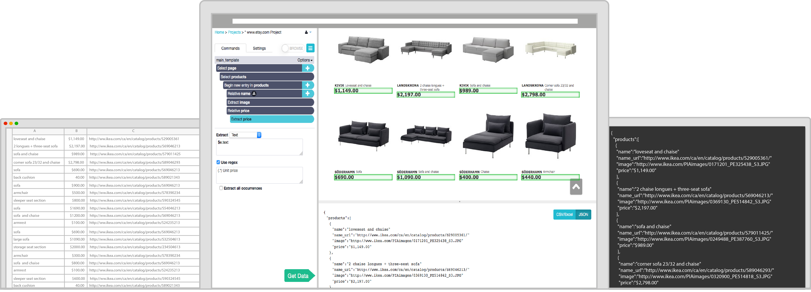

لكن مع النمو الكبير في منصات التطوير دون استخدام كود التي توفر الوقت والمال والموارد لكل من الشركات والأفراد أصبح من الممكن لأي شخص ليس لديه خبرة في البرمجة استخراج البيانات من الإنترنت باستخدام أدوات تعتمد على واجهة رسومية بسيطة مثل ParseHub التي تتيح للمستخدم إنشاء مهام استخراج بيانات من خلال تحديد الخطوات التي سيقوم بها مستخرج الويب مع كل عنصر داخل الصفحة على حدي، وأي البيانات التي سيتم استخراجها من هذه العناصر دون الحاجة لكتابة أي كود.

## ما الأمور التي يمكن استخدام ParseHub بها؟

1. عمل الأبحاث بواسطة علماء البيانات.
2. استخلاص الأخبار وتسعير المنتجات والمراجعات والملفات التعريفية والوظائف وما إلى ذلك.
3. استخراج بيانات عدة مواقع على الإنترنت إلى مكان واحد.
4. تحليل المنافسين والتسويق واتجاهات الصناعة.

## كيفية التثبيت

بداية تحتاج إلى إنشاء حساب على منصة ParseHub بشكل مجاني، حيث تتيح الخطة المجانية إنشاء حتى 5 مشاريع، واستخراج البيانات حتى 200 صفحة في كل مرة.

https://www.parsehub.com/register

بعد التسجيل يمكنك تحميل البرنامج الخاص بالمنصة من خلال صفحة التحميل https://www.parsehub.com/quickstart ويعمل البرنامج على أنظمة ويندوز ولينكس وماك.

## طريقة الاستخدام

بعد تثبيت البرنامج وتسجيل الدخول ستتمكن من القيام بمختلف الأمور من داخل واجهة البرنامج حيث يأتي مع متصفحه المدمج الذي سنستخدمه للدخول إلى صفحات الويب واستخراج المعلومات أيضًا.

1. تحتاج في البداية إلى الضغط على مشروع جديد لبدء مشروع استخراج فارغ.

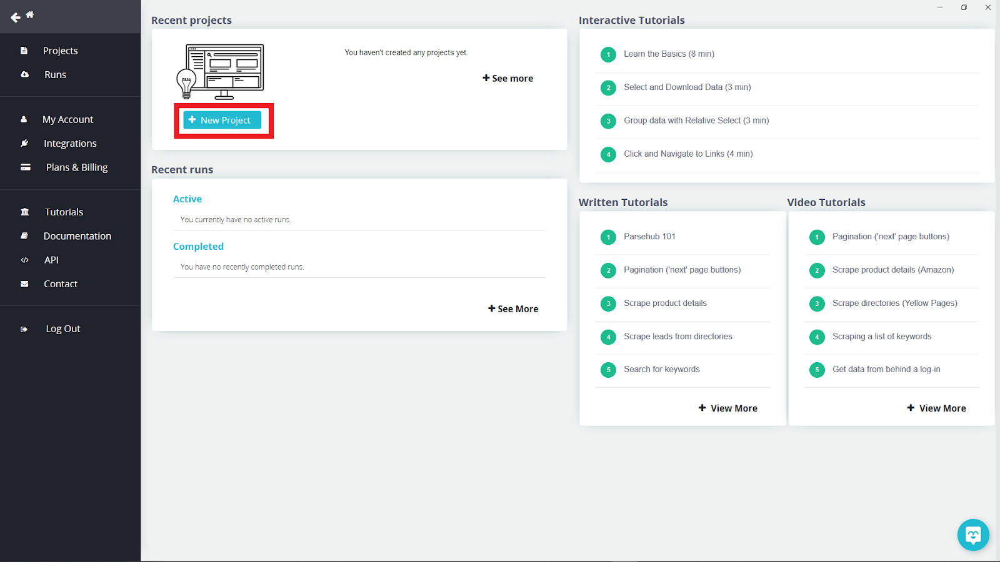

2. داخل علامة تبويب المتصفح قم بالبحث عن الموقع الذي تود استخراج المعلومات منه، أو يمكنك ببساطة إدخال عنوان URL في المربع العلوي الأيسر كما هو موضح في الصورة.

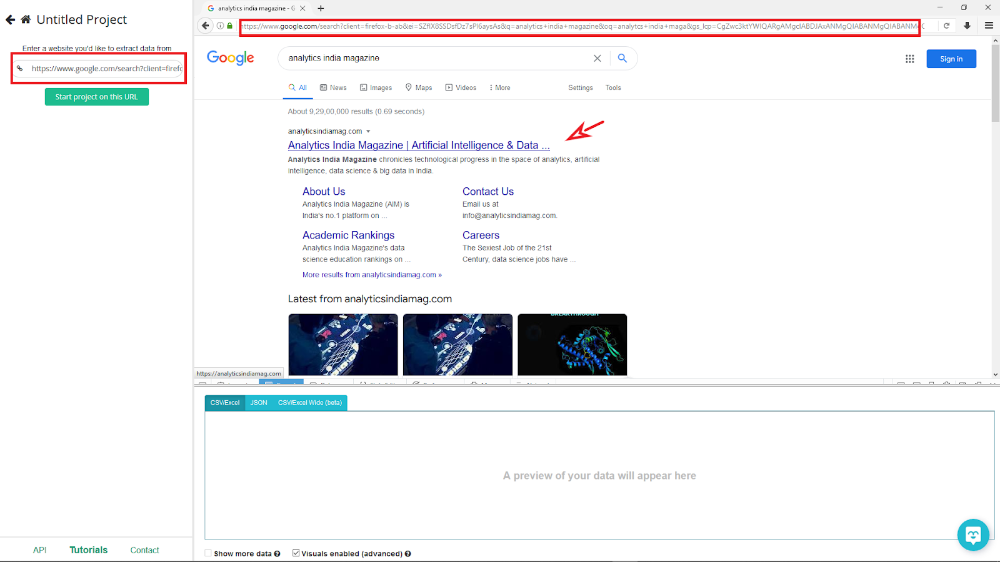

3. اضغط على Start project on this URL وستظهر نافذة جديدة.

4. تنقسم الواجهة الرئيسية لاستخراج المعلومات إلى 3 أجزاء:

-   على الجانب الأيسر يمكنك التحكم في كيفية سير العمل وإضافة وتعديل العناصر التي سيتم استخراجها من الصفحة وإعادة تسميتها.
-   بينما تبويب المتصفح على الجهة اليمنى يمكنك من خلاله التفاعل وتحديد العناصر في أي صفحة ويب لاستخدامها.
-   أما الجزء السفلي فيتم عرض جميع المخرجات به، حتى تتمكن من معرفة البيانات التي سيتم استخراجها بشكل مباشر والقيام بأي تحسينات لازمة.

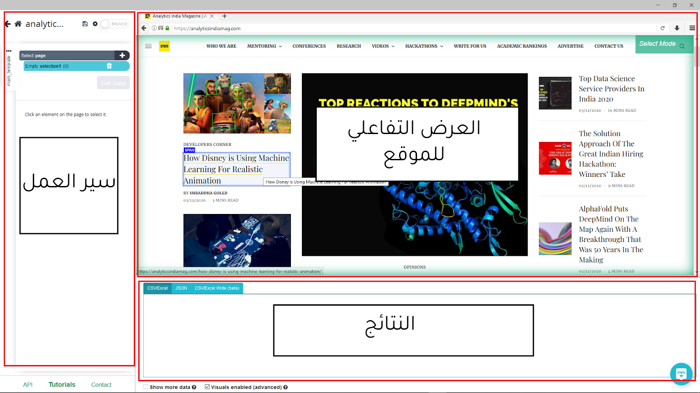

5. ولبدء الاستخراج، تحتاج إلى الضغط على أي نص أو صورة بصفحة الويب. فمثلا يمكنك تحديد عنوان مقال ما. ستقترح الأداة عليك بعض العناصر الأخرى وبجانبها علامة الصواب، بالضغط على هذه المقترحات يمكنك جعل عملية الاستخراج أكثر دقة. يمكنك أيضًا تغيير اسم العنصر الذي قمت بتحديده من خلال لوحة العناصر أيسر الشاشة إلى title مثلا.

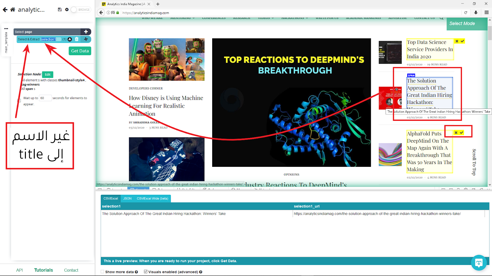

6. بعد أن أصبح لديك بعض البيانات يمكنك رؤية معاينة لما ستكون عليه من خلال علامة تبويب النتائج أسفل الشاشة.

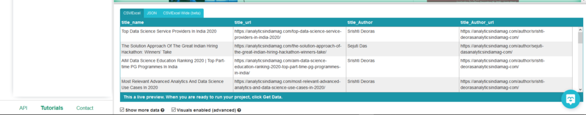

7. يمكنك أيضأ استخراج معلومات متعلقة بالعنصر الذي اختره من خلال الضغط على زر + الموجود يمين كل عنصر في لوحة العناصر يسار الشاشة.

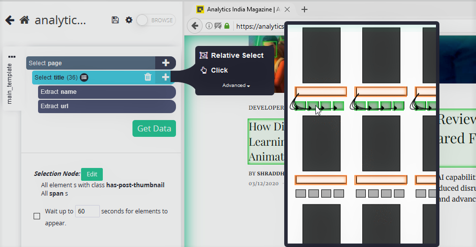

8. فمثلا باستخدام أمر التحديد النسبي Relative Select، اضغط على المقالة الأولى ثم اسم المؤلف لاستخراج أسماء المؤلفين الخاصة بكل مقال.

9. ويمكنك تكرار الخطوتين 7 و8 لاستخراج المزيد من المعلومات مثل تاريخ النشر ووقت القراءة باستخدام أمر التحديد النسبي.
10. الآن لتصدير البيانات يمكنك الضغط على زر Get Data.

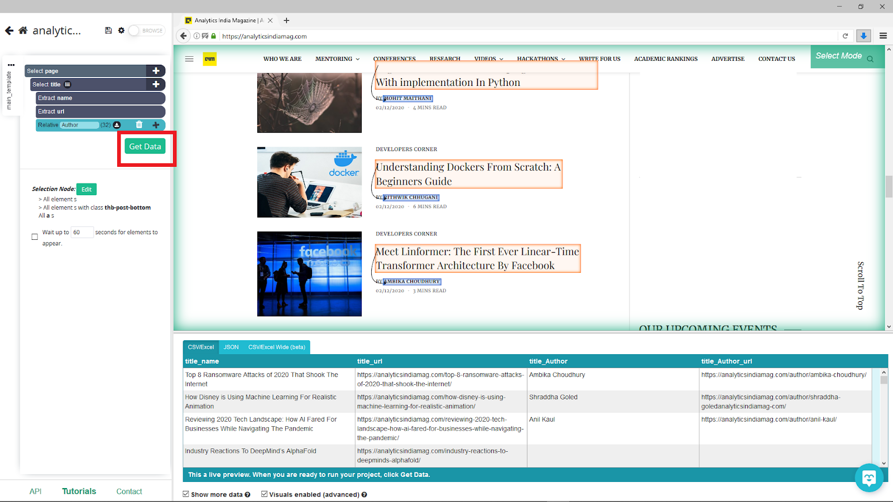

11. ستمنحك الأداة ثلاث اختيارات: Test Run للتشغيل الاختباري لمعرفة ما إذا كان كل شيء يسير على ما يرام، والجدولة Schedule لجدولة عملية استخراج البيانات، وأخيرًا Run للتشغيل العادي.

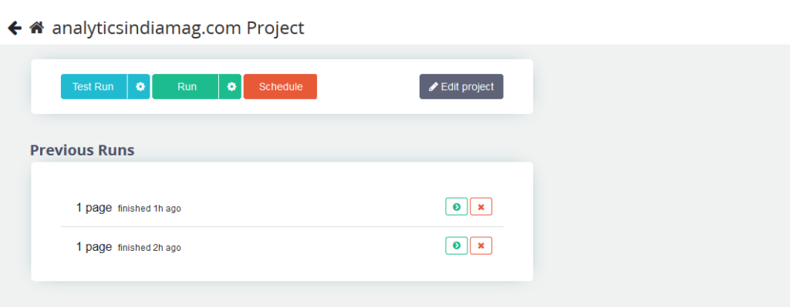

12. سيبدأ ParseHub عملية جمع البيانات وفي غضون دقيقة ستحصل على البيانات.
13. بعد الانتهاء، يمكنك تنزيل البيانات في العديد من التنسيقات مثل CSV / Excel وJSON حسبما ترغب.

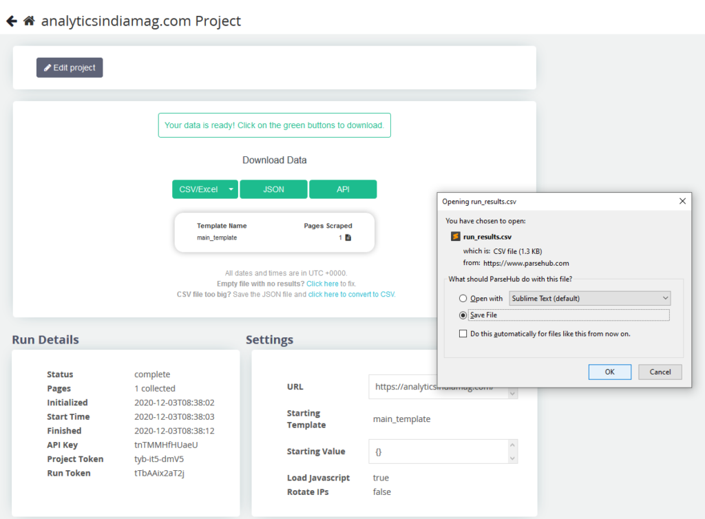

14. وأخيرًا ستجد البيانات منظمة ونظيفة لاستخدمها بالطريقة التي تريد.

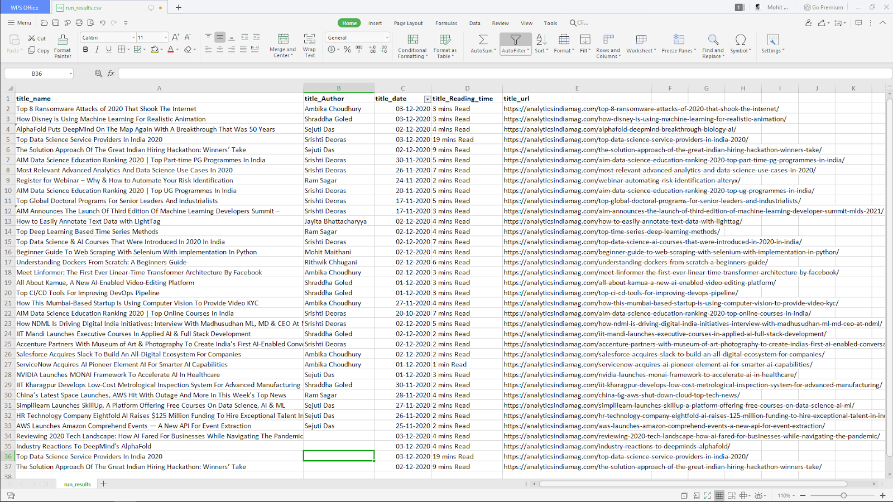

إذن، يمكنك البدء في استخراج البيانات من على الإنترنت واستخدامها في علوم البيانات باستخدام أداة ParseHub دون الحاجة لكتابة أي أكواد. وعلى الرغم من سهولة أداة ParseHub إلا أنها قوية للغاية وتغنيك عن كتابة برامجك الخاصة لاستخراج الملفات، كما أنها توفر واجهة تحكم برمجية تتيح لك دمج الأداة وتكاملها مع التطبيقات والخدمات الأخرى بصورة سهلة وفعالة مما يوفر وقتك وجهدك ويمنحك إمكانيات كبيرة للبدء في استخراج البيانات.

---

هذا الموضوع نُشر باﻷصل في مجلة لغة العصر العدد 241 شهر 01-2021 ويمكن الإطلاع عليه [هنا](https://drive.google.com/file/d/1hpStlj48wU-1CYcT_YWD8ZqN4vgOOqwA/view?usp=sharing) أو [هنا](https://gate.ahram.org.eg/News/2559840.aspx).

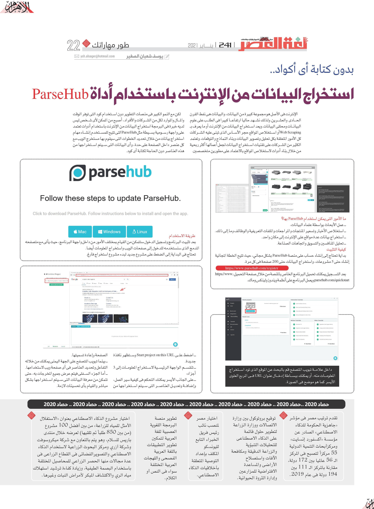

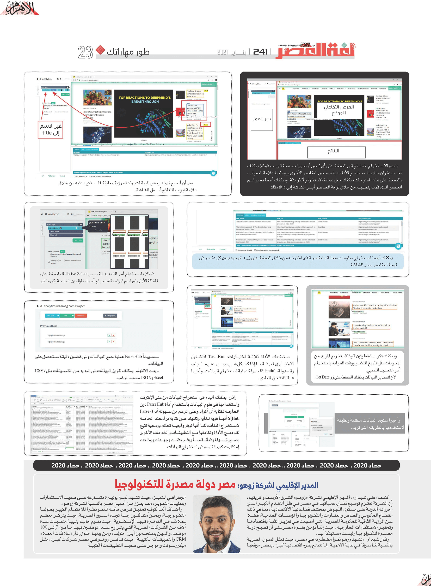
