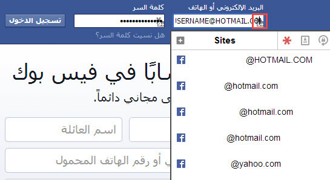
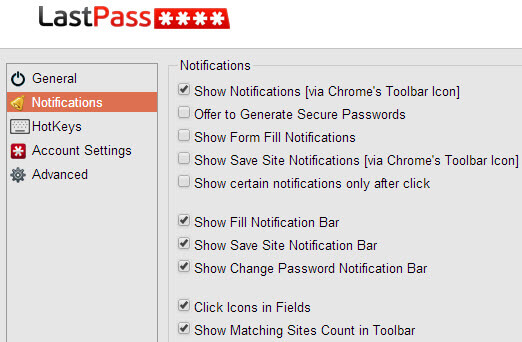

+++
title = "طريقة تخزين كلمات سر حساباتك سحابيا لضمان عدم نسيانها"
date = "2015-02-01"
description = "مع تزايد استخدامنا اليومي لشبكة الإنترنت وتعدد الأرقام التي نتعامل معها يوميا في حياتنا من رَقَم بطاقة الائتمان وأرقام الهواتف وأرقام الحسابات الإلكترونية وكثرة المواقع التي تتطلب التسجيل وحاجتنا لاستخدام أكثر من بريد إلكتروني أو أكثر من حساب في الشبكات الاجتماعية، أصبح من الصعب علينا تذكر أسماء المستخدمين أو كلمات المرور الخاصة بحساباتنا على المواقع المختلفة، لذلك أصبح من الضروري البحث عمّن يعيننا على تذكّر كلمات المرور أو حفظها بدلاً منا، إليك عزيزي القارئ أفضل طريقة لضمان عدم نسيان كلمات مرورك مرة أخرى."
categories = ["اﻷمن الرقمي",]
tags = ["مجلة لغة العصر"]
+++

مع تزايد استخدامنا اليومي لشبكة الإنترنت وتعدد الأرقام التي نتعامل معها يوميا في حياتنا من رَقَم بطاقة الائتمان وأرقام الهواتف وأرقام الحسابات الإلكترونية وكثرة المواقع التي تتطلب التسجيل وحاجتنا لاستخدام أكثر من بريد إلكتروني أو أكثر من حساب في الشبكات الاجتماعية، أصبح من الصعب علينا تذكر أسماء المستخدمين أو كلمات المرور الخاصة بحساباتنا على المواقع المختلفة، لذلك أصبح من الضروري البحث عمّن يعيننا على تذكّر كلمات المرور أو حفظها بدلاً منا، إليك عزيزي القارئ أفضل طريقة لضمان عدم نسيان كلمات مرورك مرة أخرى.

فبدلا من استخدام الملفات النصية لتخزين معلومات حساباتك على الحاسوب الخاص بك وتعريض ملفاتك لخطر السرقة نظرا لوجود المتطفلين والاتصال الدائم بالإنترنت يفضل أن تقوم بتشفير حساباتك وكلمات المرور الخاصة بك بعيداً عن أولئك المتطفلين، وهناك العديد من البرامج التي تقوم بهذه المهمة ومن أفضلها برنامَج LastPass، هذا البرنامَج الصغير الحجم الكبير القيمة، الذي يوفر عليك عناء حفظ حساباتك وكلمات المرور الخاصة بك.

ما يميز هذا البرنامَج أنه يعمل على كل أنظمة التشغيل الشهيرة (ويندوز – لينكس - ماك او إس) وكافة المنصات (أندرويد – ويندوز فون – iOS - بلاك بيرى) وكافة مستعرضات الإنترنت (Google Chrome - Mozilla Firefox - Internet Explorer – Opera - Safari).

## أولا: إنشاء حساب على البرنامَج

1. ​ ادخل على رابط إنشاء حساب https://lastpass.com/create_account.php

2. ​ تظهر لك صفحة التسجيل كما بالصورة:

    

-   ​ في الخانة الأولى تكتب البريد الإلكتروني الذي ستستخدمه في الوصول إلى كلمات مرورك فيما بعد.
-   ​ في الخانة الثانية اكتب كلمة سر حسابك على الموقع (مثل كلمة سر الخزنة) ويجب أن تكون كلمة قوية وتستطيع تذكرها حتى لا تقع في مشكلة عدم القدرة على الوصول إلى كلماتك المخزنة على الموقع فيما بعد.
-   ​ في الخانة الثالثة يتيح لك البرنامَج كتابة تلميح أو تذكير بكلمة السر الرئيسية الخاصة بحسابك.
-   ​ في الخانة الرابعة اختر المنطقة الزمنية الخاصة ببلدك.
-   ​ وأخيرا في الخانة الخامسة اختر اللغة التي سيعمل البرنامَج بها.
-   ​ سيرسل لك البرنامَج رسالة تأكيد على البريد الذي سجلت به، اضغط على الرابط لتأكيد الحساب.

## ثانيا: تحميل البرنامَج

1. ​ ادخل إلى صفحة تحميل البرنامَج واضافاته:

https://lastpass.com/misc_download2.php

1. ​ اختر المنصة التي تريد تحميل البرنامج عليها:

يفضل التثبيت مباشرة كإضافة على المتصفحات نظرا لسهولة إدارتها. وكاقتراح يمكنك تثبيت الإضافة على متصفح جوجل كروم أو فايرفوكس نظرا لوجود إمكانية المزامنة لتستطيع الوصول إلى حساباتك وكلمات المرور عن طريق حساب جوجل.

## ثالثا: تهيئة الإضافة

1. ​ بعد تثبيت الإضافة مباشرة تقوم الإضافة بفتح تبويب جديد في المتصفح كما بالصورة:

    

2. ​ اضغط على Log In.

3. ​ تظهر لك صفحة جديدة، اكتب البريد الإلكتروني وكلمة السر اللذان سجلت بهما في الخطوة الأولى.

    

## رابعا: التعامل مع الإضافة

بعد الانتهاء من تثبيت الإضافة ستجدها بجانب شريط العنوان اضغط عليها بزر الفأرة الأيسر واختر My Lastpass Vault في هذا المكان سوف تجد كلمات السر الخاصة بك بعد أن تحفظ بعض حساباتك على الإنترنت.

### خصائص مهمة في البرنامج

1. شريط البحث:

من خلاله تستطيع الوصول السريع إلى بياناتك عن طريق إدخال اسم المستخدم أو جزء منه.

2. Generate Secure Password:

هي أداة لإنشاء كلمات مرور معقدة بشكل عشوائي وتستطيع استخدامها عند انشاء حساب جديد.

3. Recently Used:

يعرض لك البرنامج في هذا القسم حساباتك المستخدمة أخيرا بحيث تتمكن من الوصول إليها بشكل أسرع.

-   ​ أساسيات عند التعامل مع البرنامج:

-   ​ عند إنشاء حساب جديد أو الدخول إلى موقع لأول مرة سيعرض عليك البرنامج إضافته إلى حساباتك عن طريق شريط أزرق يظهر تحت شريط العنوان مباشرة يحتوي على زر Save Site-Not Now، إذا رغبت في حفظ الحساب إلى خزينة بياناتك اضغط Save site ثم اختر اسم لهذا المدخل وبعدها اضغط Save.

-   ​ البرنامج به إمكانية المليء التلقائي للحسابات فعند زيارتك لموقع الفيس بوك مثلا ستجد علامة البرنامج على يمين خانة البريد الإلكتروني كما بالصورة:

    

إذا قمت بالضغط عليها فستظهر لك حسابات الفيس بوك التي قمت بحفظها في حسابك.

اضغط على أي بريد إلكتروني ليقوم البرنامج بكتابة البريد الإلكتروني وكلمة المرور بدلا منك وكل ما يتبقى عليك هو الضغط على تسجيل الدخول.

-   ​ لتفعيل ميزة شريط تسجيل الدخول التلقائي في البرنامج وهي ميزة تمكنك بمجرد الضغط على اسم الحساب أن يكتب البرنامج اسم المستخدم وكلمة السر وتسجيل الدخول نيابة عنك، اتبع الخطوات الآتية:

1. اضغط بزر الفأرة الأيمن على أيقونة البرنامج بجانب شريط الإشعارات.

2. تظهر لك قائمة اختر منها Options.

3. يقوم البرنامج بفتح صفحة الخيارات في تبويب جديد.

4. من قائمة الأقسام على اليسار اختر التبويب الثاني Notifications.

5. اختر الخاصية Show Fill Notification Bar كما بالصورة.

    

6. وأخيرا اضغط على Save.

7. عند دخولك مجددا على موقع مثل الفيس بوك سيظهر لك شريط تسجيل الدخول التلقائي كما بالصورة:

---

هذا الموضوع نشر باﻷصل في مجلة لغة العصر العدد 170 شهر 2-2015 ويمكن الإطلاع عليه [هنا](https://drive.google.com/file/d/18og9TY-oWYdZ6mV5bVsdI8ksz2zGyNtK/view?usp=sharing).

