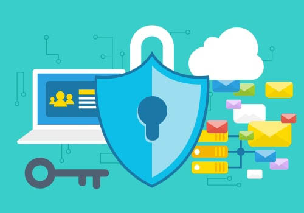

+++
title = "برامج إدارة كلمات المرور.. ضرورة لا غني عنها لحماية حساباتك على الإنترنت"
date = "2019-08-01"
description = "لا يختلف أحد على أن إحدى أقوي طرق حماية حساباتك على الإنترنت هي استخدام كلمة سر قوية وفريدة لكل موقع أو خدمة تستخدمها، لكن نظرا لصعوبة تذكر جميع كلمات السر يقوم بعضنا باستخدام حروف متتابعة على لوحة المفاتيح أو مجموعة أرقام أو تاريخ الميلاد أو رقم الهاتف ككلمة سر للحسابات المختلفة، مما يجعله يقع فريسة سهلة للاختراق وسرقة الهوية الرقمية. ولذلك كانت برامج إدارة كلمات المرور هي الحل الأفضل لهذه المشكلة."
categories = ["اﻷمن الرقمي",]
tags = ["مجلة لغة العصر"]

+++

لا يختلف أحد على أن إحدى أقوي طرق حماية حساباتك على الإنترنت هي استخدام كلمة سر قوية وفريدة لكل موقع أو خدمة تستخدمها، لكن نظرا لصعوبة تذكر جميع كلمات السر يقوم بعضنا باستخدام حروف متتابعة على لوحة المفاتيح أو مجموعة أرقام أو تاريخ الميلاد أو رقم الهاتف ككلمة سر للحسابات المختلفة، مما يجعله يقع فريسة سهلة للاختراق وسرقة الهوية الرقمية. ولذلك كانت برامج إدارة كلمات المرور هي الحل الأفضل لهذه المشكلة.

## ما هو مدير كلمات المرور؟

مدير كلمة المرور هو برنامج خاص يخزن جميع بيانات اعتماد المواقع والخدمات التي تستخدمها بصورة مشفره أو في أي شكل آمن أخر، ومن ثم يسمح لك بالوصول إلى كلمات المرور المخزنة في أي وقت تريده باستخدام "كلمة المرور الرئيسية"، والتي بدونها لا يمكن لأحد الوصول إلى بيانات تسجيل الدخول المحفوظة مثل اسم المستخدم، كلمة المرور. كما يتيح لك البرنامج إضافة وإزالة وتعديل البيانات الخاصة بك لكل موقع.

إذن يمكن اعتباره بمثابة مخزن مشفر لحفظ معلوماتك الحساسة، وكلمة المرور الرئيسية هي المفتاح "الوحيد" لفتح هذا المخزن.

## لماذا تحتاج إلى مدير كلمات المرور؟

عند استخدام برامج إدارة كلمات المرور ستتمكن من حماية حسابتك المختلفة بكلمات مرور قوية وفريدة دون الحاجة لتذكر جميع أسماء المستخدم وكلمات المرور لمختلف المواقع التي تزورها. فكل ما عليك حفظه هو كلمة السر الرئيسية لتتمكن من الوصول للكلمات الأخرى. وبذلك يمكنك زيادة طول وتعقيد كلمات المرور التي تستخدمها، لأنه لم يعد هناك حاجة لتذكرها بعد الآن. تخيل مدي قوة أن تستخدم شيء مثل " 21#^#Y3#^2h281+\_0H^I@F!##YU&^" ككلمة سر حسابك على الفيس بوك دون مشاكل!

كما توفر بعض برامج إدارة كلمات المرور مزايا إضافية مثل:

-   الملء التلقائي لبيانات تسجيل الدخول.

-   المزامنة بين الأجهزة المختلفة.

-   مشاركة كلمات السر بين أكثر من شخص "فريق العمل مثلا"

-   التكامل مع الهاتف.

-   أدوات توليد كلمات سر قوية.

## استخدام مدير كلمات المرور

يقوم مدير كلمة المرور النموذجي بتثبيت إضافة للمتصفح لحفظ كلمات المرور واستخدامها. فعندما تسجل الدخول إلى موقع آمن الأول مرة، يقترح حفظ بيانات الدخول الخاصة بك، وعندما تفتح هذا الموقع مجددا فإنه يوفر خيارات لملء بيانات الدخول المحفوظة تلقائيًا. وإذا قمت بحفظ بيانات تسجيل دخول متعددة لنفس الموقع فسيوفر لك مدير كلمة المرور خيارات متعددة لتسجيل الدخول إلى أي من هذه الحساب. حيث يقدم معظم هذه البرامج شريط أدوات في المتصفح لتسجيل الدخول ليمكنك من الانتقال مباشرة إلى موقع محفوظ وتسجيل الدخول إليه تلقائيًا.

تمتلك بعض البرامج أيضا العديد من الميزات لجعل استخدامها أكثر سهولة مثل قدرة التعرف على حدوث تغيير في كلمة المرور واقتراح تحديث البيانات الحالية، وحفظ بيانات الدخول الخاصة بك أثناء عملية التسجيل لأول مرة في موقع جديد، وإمكانية استيراد جميع كلمات المرور الحالية إلى مدير كلمات المرور من المتصفحات الموجودة على جهازك أو حتى من برامج أخرى لإدارة كلمات المرور، كما يستطيع بعضها التعرف على كلمات المرور الضعيفة والمكررة.

ويتجاوز الأمر مجرد حفظ كلمات المرور ليصل إلى توفير مكان آمن لحفظ البيانات الشخصية والملء التلقائي للاستمارات وحفظ الملاحظات وبيانات بطاقات الائتمان بصورة مشفرة وآمنة.

## اختيار مدير كلمات المرور

يوجد عدد كبير من برامج إدارة كلمات المرور، منها مفتوح المصدر ومنها الاحتكاري، بعضها مجاني وبعضها مدفوع. إذا لنستعرض أفضل الاختيارات التي يمكنك استخدامها لتأمين نفسك.

### 1- BitWarden

[https://bitwarden.com](https://bitwarden.com/)

برنامج مفتوح المصدر مجاني بشكل كامل، يعمل على ويندوز ولينكس وماك وأندرويد وiOS. يحتوي البرنامج على كل المميزات المطلوبة في أي مدير كلمات مرور احترافي، من دعم المصادقة الثنائية، والاستيراد من البرامج الأخرى، والمزامنة بين مختلف المنصات والمتصفحات.

ونظرا لكونه مفتوح المصدر فإن عملية التشفير وحفظ البيانات تتم بشفافية، حيث يوفر موقع البرنامج ردودا على كل أسئلة المستخدمين حول كل ما يتعلق ببياناتهم https://help.bitwarden.com/security

يستخدم BitWarden تشفير end-to-end، مما يعنى أن البيانات التي تخزن على سيرفرات الشركة تكون مشفرة، ولا يمكن حتى لفريق العمل فك تشفيرها والاطلاع عليها.

وإذا كنت لا تزال قلقا حول استخدام سيرفرات البرنامج، يوفر BitWarden إمكانية تشغيله على سيرفر خاص بك، حيث أن الكود المصدري للبرنامج كاملا متاح على موقع GitHub.

يوفر البرنامج أيضا اشتراك مدفوع قيمته عشر دولارات سنويا، يتيح المزيد من المزايا مثل مساحة تخزين ملفات مشفرة، ودعم مفاتيح USB للمصادقة.

### 2- LastPass

[https://www.lastpass.com](https://www.lastpass.com/)

أحد أشهر وأقوي برامج إدارة كلمات المرور، يعمل على أغلب أنظمة التشغيل ومختلف المتصفحات. البرنامج متاح بنسختين، مجانية ومدفوعة.

توفر النسخة المجانية كل الخيارات المهمة مثل التخزين الآمن والمشفر لكلمات السر وإمكانية الوصول من أي جهاز، والملء التلقائي للبيانات، وفحص كلمات السر، وتوليد رموز أمان المصادقة الثنائية.

بينما تتيح النسخة المدفوعة (36 دولار سنويا) مجموعة من المزايا الإضافية مثل مشاركة كلمات المرور، ودعم وسائل أخرى للمصادقة، ودعم الملء التلقائي داخل التطبيقات، ومساحة تخزين مشفرة حجمها 1 جيجا بايت، وإمكانية الوصول في حالة الطوارئ.

### 3- KeePassXC

[https://keepassxc.org](https://keepassxc.org/)

KeePass هو أحد أقدم برامج إدارة كلمات المرور مفتوحة المصدر الموجودة، فقد بدأ تطويره في عام 2003، وهو مكتوب بلغتي C# و.NET ويعمل على ويندوز ولينكس فقط.

ظهرت العديد من التفرعات عن هذا المشروع العريق بعد ذلك مثل KeePassX في 2005 والذي يهدف بشكل أساسي لجعل KeePass يعمل على مختلف المنصات، وKeePassXC الذي ظهر في 2016 ويهدف إلى توفير جميع الميزات الحديثة للمستخدم في واجهة نظيفة متميزة تعمل على جميع الأنظمة.

يتوافق KeePassXC مع ملفات KDBX 3.1 فأحدث المستخدمة في KeePass2 – KeePassX – KeeWeb والعديد من البرامج الأخرى المبنية على KeePass.

يوفر KeePassXC العديد من المميزات التي تجدها في الإصدارات المدفوعة من البرامج السابق ذكرها بشكل مجاني مثل دعم مفاتيح USB للمصادقة كـ YubiKey، وتوليد رموز TOTP للمصادقة الثنائية.

يعمل البرنامج دون الحاجة لوجود الإنترنت، وذلك لأنه لا يقوم بمزامنة أو تخزين البيانات على أي سيرفر، حيث أنها تظل مخزنة محليا على جهازك. وإذا كنت تحتاج إلى المزامنة بين الأجهزة يمكنك استخدام التخزين السحابى ورفع قاعدة البيانات على موقعك المفضل، أو استخدام KeeWeb الذي يمكن إعداده ليقوم بالمزامنة باستخدام العديد من الخدمات مثل Dropbox – Google Drive – OneDrive.

يعمل البرنامج على ويندوز ولينكس وماك، وتتوفر إضافات للمتصفحات المشهورة مثل كروم وفايرفوكس، إضافة إلى توفر نسخ تعمل بدون تثبيت من البرنامج.

يمكن لمستخدمي أندرويد استخدام أي من تطبيقات KeePassDroid - Keepass2Android - KeePass DX المتوافقة مع ملفات KeePass.

كما يمكن لمستخدمي iOS استخدام KeePassium - Strongbox - MiniKeePass

### 4- Dashlane

[https://www.dashlane.com](https://www.dashlane.com/)

برنامج آخر منافس، توفر منه نسخة مجانية للتجربة، تدعم تخزين حتى 50 كلمة سر فقط، بينما توفر النسخة المدفوعة (60 دولار سنويا) العديد من المميزات، مثل تخزين عدد غير محدود من كلمات المرور، والمزامنة بين الأجهزة، ومساحة تخزين آمنة للملفات الحساسة، ومراقبة عمليات الاختراق وتنبيه المستخدم، بالإضافة إلى وجود خدمة VPN للاتصال الآمن بالإنترنت على شبكات ال Wi-Fi الغير محمية.

### مقارنة بين أفضل البرامج المتاحة

|                           | Bitwarden         | LastPass          | KeePass | Dashlane  | 1Password | Sticky Password   | Keeper Password   | LogMeOnce         |
| ------------------------- | ----------------- | ----------------- | ------- | --------- | --------- | ----------------- | ----------------- | ----------------- |
| السعر                     | مجاني / 10$ سنويا | مجاني / 36$ سنويا | مجاني   | 60$ سنويا | 36$ سنويا | مجاني / 30$ سنويا | مجاني / 30$ سنويا | مجاني / 30$ سنويا |
| المصادقة الثنائية         | ✓                 | ✓                 | ✓       | ✓         | ✓         | ✓                 | ✓                 | ✓                 |
| ملء استمارات الويب        | ✓                 | ✓                 | -       | ✓         | ✓         | ✓                 | ✓                 | ✓                 |
| تقارير حول قوة كلمات السر | -                 | ✓                 | -       | ✓         | ✓         | -                 | ✓                 | ✓                 |
| المشاركة الآمنة           | ✓                 | ✓                 | -       | ✓         | -         | -                 | ✓                 | ✓                 |
| الوصول في حالة الطوارئ    | -                 | ✓                 | -       | ✓         | -         | -                 | ✓                 | ✓                 |
| كلمات سر التطبيقات        | -                 | ✓                 | ✓       | -         | ✓         | ✓                 | ✓                 | -                 |

إذن، استخدام برنامج لإدارة كلمات المرور وكلمة مرور رئيسية قوية صعبة النسيان، إضافة إلى تفعيل المصادقة الثنائية لمختلف حساباتك بما فيها حساب برنامج إدارة كلمات المرور سيجعل اختراق حساباتك مهمة عسيرة بشكل كبير. قم بتجربة البرامج التي استعرضناها وخاصة مفتوحة المصدر، وابدأ الآن بتغيير كلمات مرور حساباتك القديمة إلى أخرى معقدة مولدة تلقائيا لتضمن حماية حساباتك وعدم سرقة هويتك الرقمية.

---

هذا الموضوع نُشر باﻷصل في مجلة لغة العصر العدد 224 شهر 08-2019 ويمكن الإطلاع عليه [هنا](https://drive.google.com/file/d/1DvrXcgPjjo94JHlcALfN6vUmsd7Dx905/view?usp=sharing).

