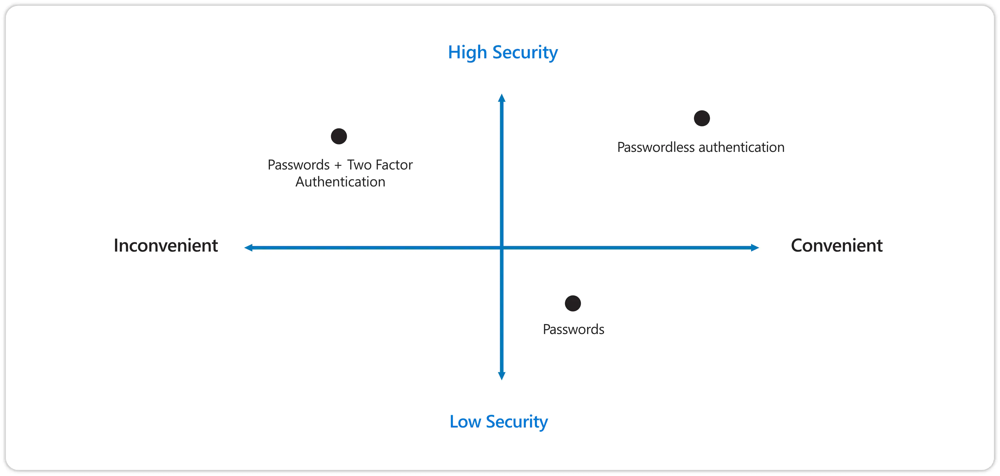
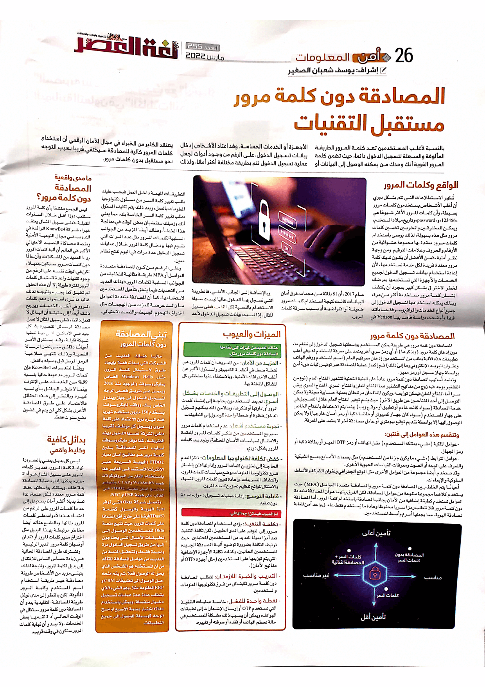

+++
title = "هل تغير المصادقة دون كلمة مرور مستقبل تقنيات المصادقة؟"
date = "2022-03-01"
description = "بالنسبة لأغلب المستخدمين تعد كلمة المرور الطريقة المألوفة والسهلة لتسجيل الدخول دائما، حيث تضمن كلمة المرور القوية أنك وحدك من يمكنه الوصول إلى البيانات أو الأجهزة أو الخدمات الحساسة. وقد اعتاد الأشخاص إدخال بيانات تسجيل الدخول، على الرغم من وجود أدوات لجعل عملية تسجيل الدخول تتم بطريقة مختلفة أكثر أمانا، ولذلك يعتقد الكثير من الخبراء في مجال الأمان الرقمي أن استخدام كلمات المرور كآلية للمصادقة سيختفي قريبا بسبب التوجه نحو مستقبل بدون كلمات مرور."
categories = ["تقارير", "اﻷمن الرقمي"]
tags = ["مجلة لغة العصر"]

+++

بالنسبة لأغلب المستخدمين تعد كلمة المرور الطريقة المألوفة والسهلة لتسجيل الدخول دائما، حيث تضمن كلمة المرور القوية أنك وحدك من يمكنه الوصول إلى البيانات أو الأجهزة أو الخدمات الحساسة. وقد اعتاد الأشخاص إدخال بيانات تسجيل الدخول، على الرغم من وجود أدوات لجعل عملية تسجيل الدخول تتم بطريقة مختلفة أكثر أمانا، ولذلك يعتقد الكثير من الخبراء في مجال الأمان الرقمي أن استخدام كلمات المرور كآلية للمصادقة سيختفي قريبا بسبب التوجه نحو مستقبل بدون كلمات مرور.

## الواقع وكلمات المرور

تُظهر الاستطلاعات التي تتم بشكل دوري أن أغلب الأشخاص يستخدمون كلمات مرور بسيطة، وأن كلمات المرور الأكثر شيوعًا هي "123456" و \"password\" وتاريخ ميلاد المستخدم، ويمكن للمخترقين والمخربين تخمين كلمات مرور مثل هذه بسهولة، لذلك يُوصى باستخدام كلمات مرور معقدة بها مجموعة عشوائية من الأرقام والحروف وعلامات الترقيم. ومن وجهة نظر أمنية، فمن الأفضل أن يكون لديك كلمة مرور معقدة فريدة لكل خدمة تستخدمها، لأن إعادة استخدام بيانات تسجيل الدخول لجميع الخدمات والأجهزة التي تستخدمها يعرضك لخطر الاختراق بشكل كبير بمجرد أن يكتشف المتسلل كلمة مرور مستخدمة أكثر من مرة، وبذلك يمكنه استخدامها لتسجيل الدخول إلى جميع أنواع الخدمات والمواقع وسرقة حساباتك فيها. وأوضحت دراسة قامت بها Verizon في عام 2017، أن 81 بالمئة من هجمات خرق أمان البيانات كانت نتيجة استخدام كلمات مرور ضعيفة أو افتراضية أو بسبب سرقة كلمات المرور.

وبالإضافة إلى الجانب الأمني، فالطريقة التي نسجل بها الدخول حاليًا ليست سهلة الاستخدام بالنسبة لكل الناس، فعلى سبيل المثال إذا نسيت بيانات تسجيل الدخول لأحد التطبيقات المهمة داخل العمل فيجب عليك طلب تغيير كلمة السر من مسؤول تكنولوجيا المعلومات بالعمل، وبعد ذلك يتم تكليف المسؤول بطلب تغيير كلمة السر الخاصة بك، مما يعني أنك وزميلك ستقضيان بعض الوقت في معالجة هذا الخطأ. وهناك أيضًا المزيد من الجوانب السلبية لكلمات المرور مثل عدد المرات التي تقوم فيها بإدخال كلمة المرور خلال عمليات تسجيل الدخول عدة مرات في اليوم لفتح نظام معين.

وعلى الرغم كون المصادقة متعددة العوامل أو MFA طريقة مثالية للتخفيف من الجوانب السلبية لكلمات المرور فهناك العديد من التحديات فيما يتعلق بتأهيل المستخدمين لاستخدامها، كما أن المصادقة متعددة العوامل ما زالت عرضة للمزيد من الهجمات مثل اختراق \"الهجوم الوسيط\" والتصيد الاحتيالي.

## المصادقة دون كلمة مرور

المصادقة دون كلمة مرور هي طريقة مصادقة يمكن للمستخدم بواسطتها تسجيل الدخول إلى نظام ما، دون إدخال كلمة مرور (وتذكرها) أو أي رمز سري آخر يعتمد على معرفة المستخدم له. وفي أغلب تطبيقات هذه الآلية يُطلب من المستخدمين إدخال معرفهم العام (اسم المستخدم ورقم الهاتف وعنوان البريد الإلكتروني وما إلى ذلك) ثم إكمال عملية المصادقة عبر توفير إثبات هوية آمن بواسطة جهاز مسجل أو رمز مميز.

وتعتمد أساليب المصادقة دون كلمة مرور عادةً على البنية التحتية لتشفير المفتاح العام (نوع من التشفير يوجد فيه زوج من مفاتيح التشفير هما المفتاح المعلن والمفتاح السري. المفتاح السري يبقى سرا أما المفتاح المعلن فيمكن توزيعه. ويكون المفتاحان مرتبطان بعملية حسابية معينة ولا يمكن التوصل إلى أحد المفتاحين عن طريق الآخر) حيث يتم توفير المفتاح العام خلال التسجيل في خدمة المصادقة (سواء كانت خادم أو تطبيق أو موقع ويب) بينما يتم الاحتفاظ بالمفتاح الخاص على جهاز المستخدم (سواء كان جهاز كمبيوتر أو هاتف ذكي أو رمز أمان خارجي) ولا يمكن الوصول إليها إلا بواسطة تقديم توقيع بيومتري أو عامل مصادقة آخر لا يعتمد على المعرفة.

**وتنقسم هذه العوامل إلى فئتين:**

-   عوامل الملكية (\"شيء يمتلكه المستخدم\") مثل الهاتف أو
    رمز OTP المميز أو بطاقة ذكية أو رمز الجهاز.

-   عوامل الترابط (\"شيء ما يكون جزءًا من المستخدم\") مثل بصمات الأصابع ومسح الشبكية والتعرف على الوجه أو الصوت ومعرفات القياسات الحيوية الأخرى.

وقد تستخدم أيضا مجموعة من العوامل الأخرى مثل الموقع الجغرافي وعنوان الشبكة والأنماط السلوكية والإيماءات.

أحيانًا يتم الخلط بين المصادقة دون كلمة مرور والمصادقة متعددة العوامل (MFA) حيث يستخدم كلاهما مجموعة متنوعة من عوامل المصادقة، لكن الفرق بينهما هو أن المصادقة متعددة العوامل تستخدم كطبقة إضافية من الأمان بجانب المصادقة باستخدام كلمة المرور، أما المصادقة دون كلمة مرور فلا تتطلب رمز سري محفوظ وعادة ما يستخدم فقط عامل واحد آمن للغاية لمصادقة الهوية، مما يجعلها أسرع وأبسط للمستخدمين.

## الميزات والعيوب

هناك العديد من الميزات التي تقدمها المصادقة دون كلمات مرور
مثل:

-   **المزيد من الأمان**: من المعروف أن كلمات المرور هي نقطة ضعف في أنظمة الكمبيوتر والمسؤول الأكبر عن أغلب الاختراقات الأمنية، وبالاستغناء عنها ستختفي كل المشاكل المتعلقة بها.

-   **الوصول إلى التطبيقات والخدمات بشكل أسرع**: لم يعد المستخدمون بحاجة إلى إنشاء كلمات المرور أو إدارتها أو تذكرها، وبدلا من ذلك يمكنهم تسجّيل الدخول بنظرة أو ضغطة واحدة للوصول إلى التطبيقات.

-   **تجربة مستخدم أفضل**: عدم استخدام كلمات مرور سيريح المستخدمين من تذكر كلمات المرور المعقدة والامتثال لسياسات الأمان المختلفة، وتجديد كلمات المرور بشكل دوري.

-   **خفض تكلفة تكنولوجيا المعلومات**: نظرًا لعدم الحاجة إلى تخزين كلمات المرور وإدارتها فلن ينشغل فرق تكنولوجيا المعلومات بوضع سياسات كلمات المرور، واكتشاف التسريبات، وإعادة تعيين كلمات المرور المنسية، والامتثال للوائح تنظيم تخزين كلمات المرور.

-   **قابلية التوسع**: إدارة عمليات تسجيل دخول متعددة دون تعقيد.

أما العيوب فيمكن إجمالها في:

-   **تكلفة التنفيذ**: يؤدي استخدام المصادقة دون كلمة مرور إلى التوفير على المدى الطويل، لكن تكلفة التنفيذ تعد أمرًا معيقًا للعديد من المستخدمين المحتملين حيث ترتبط التكلفة بضرورة توضيح آلية المصادقة الجديدة للمستخدمين الحاليين وكذلك تكلفة الأجهزة الإضافية التي يتم توزيعها على المستخدمين (مثل أجهزة OTPs أو مفاتيح الأمان).

-   **التدريب والخبرة اللازمتان**: تتطلب المصادقة دون كلمة مرور تكيف كل من فرق تكنولوجيا المعلومات والمستخدمين.

-   **نقطة واحدة للفشل**: خاصة عمليات التنفيذ التي تستخدم OTP أو إرسال الإشعارات إلى تطبيقات الهواتف، ويمكن أن يسبب ذلك مشكلة للمستخدم في حالة تحطم الهاتف أو فقده أو سرقته أو تغييره.

## تبني المصادقة دون كلمات المرور

حاليًا هناك العديد من الشركات التي بدأت فعلًا بإيجاد طرق لاستبدال كلمة المرور، مثل Windows Hello الخاص بمايكروسوفت والموجود منذ 2016 ويعمل عن طريق فحص الوجه لتسجيل الدخول إلى جهاز ويندوز الخاص بك. ووفقًا لمايكروسوفت، يستخدم 150 مليون مستخدم شهريا هذه الميزة دون الاعتماد على كلمة مرور، ويسجل كل موظف تقريبًا داخل الشركة نفسها الدخول بهذه الطريقة. كما توفر مايكروسوفت أسلوب آخر للمصادقة بدون كلمة مرور هو مفاتيح أمان معيار FIDO2 (الهوية السريعة عبر الإنترنت) المستند إلى المعايير هذا باستخدام اثنان من البروتوكولات هما WebAuthN وCTAP، وتتوفر مفاتيح أمان معيار FIDO2 في الغالب على هيئة USB أو NFC.

وتعمل شركة Okta التي توفر إدارة الهوية والوصول كخدمة (IDaaS) أيضًا على طرق أقل اعتمادًا على كلمات المرور، حيث تتيح منصة Okta للمستخدمين الوصول إلى تطبيقات الأعمال التي يحتاجون إليها عن طريق تسجيل الدخول مرة واحدة فقط. وتتحقق المنصة من العديد من عوامل المصادقة للتأكد من أن المستخدم هو الشخص الذي يحق له الوصول فعلًا، ثم يتم منحه حق الوصول إلى تطبيقات CRM وERP المطلوبة مثلا، وهو الشيء الذي يتطلب عادةً عدة عمليات تسجيل دخول منفصلة. ويمكن باستخدام Okta اختيار بصمة الإصبع أو مسح الوجه كوسيلة للوصول إلى جميع التطبيقات.

## ما مدى واقعية المصادقة دون كلمة مرور؟

ليس الجميع مقتنعًا بأن كلمة المرور ستلعب دورًا أقل خلال السنوات القادمة. فعلى سبيل المثال يعتقد خبراء شركة KnowBe4 الرائدة في التدريب في مجال التوعية الأمنية ومنصة محاكاة التصيد الاحتيالي  الأكبر في العالم أن آلية كلمات المرور بها العديد من المشاكل، وأن عالمًا دون كلمات مرور سيكون جميلا، لكن في الوقت نفسه على الرغم من وجود تقنيات واعدة لاستبدال كلمات المرور لفترة طويلة إلا أن هذه الحلول لم تطبق كما يجب، ونتيجة لذلك غالبًا ما نرى استمرار دعم كلمات المرور في أغلب الخدمات.

ويرجع ذلك أيضًا إلى حقيقة أن البدائل لا تعمل دائمًا، فعلى سبيل المثال لا تعمل مصادقة الرسائل القصيرة بشكل جيد في الأماكن التي بها تغطية شبكة قليلة، وقد يستغرق الأمر أحيانًا دقائق حتى تصل الرسالة النصية وبذلك تنتهي صلاحية الرمز المرسل قبل وصوله بالفعل.

ووفقًا لتقديرات KnowBe4 فإن كلمات المرور مدعومة حاليًا بنسبة 99% من الخدمات على الإنترنت بينما لا تتوفر البدائل بأي نسبة كبيرة. وبالنظر إلى هذه الحقائق فالاعتماد على طرق المصادقة الأخرى بشكل كلي لن يتم في غضون بضع سنوات فقط.

## بدائل كافية وخليط واقعي

ليس كل بديل يعني بالضرورة نهاية كلمة المرور، فمدير كلمات المرور على سبيل المثال هو أداة مفيدة يمكنها إدارة عملية المصادقة بدلا عنك، ويمكنك بواسطتها حفظ كلمة مرور معقدة لكل خدمة، لذا تعدّ بديل أكثر أمانًا يستبدل إلى حد ما كلمات المرور على الرغم من اعتماد هذه الأدوات على كلمات المرور بذاتها. وبالطبع هناك أيضًا مخاطر مرتبطة بهذا البديل مثل اختراق مدير كلمات المرور أو فقدان أو نسيان كلمة مرور المدير الرئيسية.

وتشترك طرق المصادقة الحالية في زيادة حماس الناس للانتقال إلى بديل لكلمة المرور، ونتيجة لذلك يتبنى مزيد من الأشخاص طريقة مصادقة غير طريقة استخدام اسم المستخدم وكلمة المرور المألوفة، لكن بالنظر إلى مدى توغل طريقة المصادقة التقليدية يبدو أن المصادقة دون كلمة مرور ستظل في الوقت الحالي أداة تقدمها بعض الخدمات، ولا يبدو أن نهاية كلمات المرور ستكون في وقت قريب.

---

هذا الموضوع نُشر باﻷصل في مجلة لغة العصر العدد 255 شهر 03-2022 ويمكن الإطلاع عليه [هنا](https://drive.google.com/file/d/1WSE8sZrPba8S770i58WIeMVXwkpAVTzz/view?usp=sharing).

