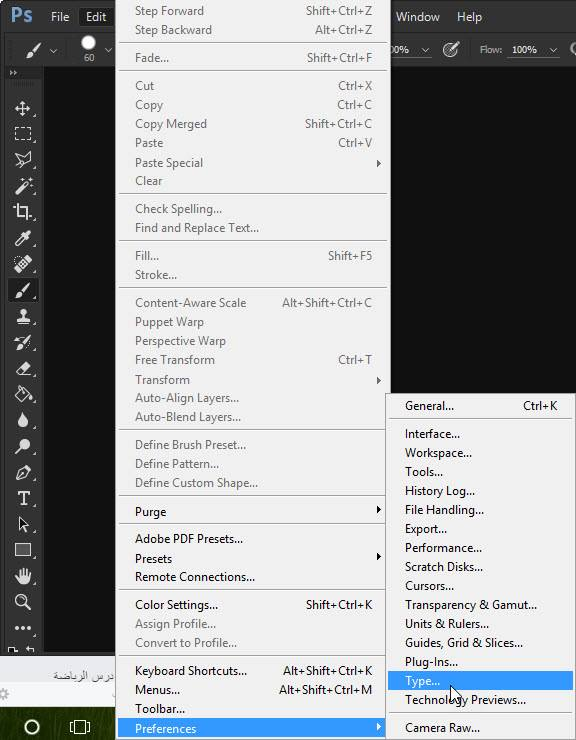
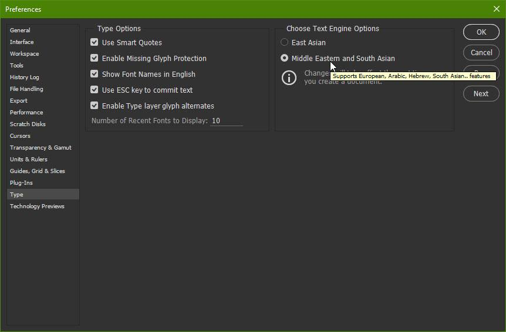

+++
title = "حل مشكلة الكتابة باللغة العربية فى فوتوشوب CC 2015.5"
date = "2016-06-26"
description = "بعد تغيير اسلوب تثبيت الفوتوشوب فى نسخة الأخيرة CC 2015.5، لم يعد هناك اختيار يمكن المستخدم من التثبيت باللغة الإنجليزية مع دعم العربية وتغيرت طريقة إعداد البرنامج للكتابة باللغة العربية."

categories = ["دروس",]

tags = ["افهم تكنولوجيا"]

images = ["images/main.jpg"]

+++

بعد تغيير اسلوب تثبيت الفوتوشوب فى نسخة الأخيرة CC 2015.5، لم يعد هناك اختيار يمكن المستخدم من التثبيت باللغة الإنجليزية مع دعم العربية وتغيرت طريقة إعداد البرنامج للكتابة باللغة العربية. إليكم طريقة حل مشكلة الكتابة باللغة العربية فى فوتوشوب CC 2015.5.

1. قم بقتح البرنامج ثم من قائمة Edit اختر Preferences ثم Type.

   

2. قم بضبط الإعدادات كما بالصورة وتأكد من اختيار Middle East.

   

3. اضغط OK وأعد تشغيل البرنامج.

---

هذا المقال نشر باﻷصل على مدونة افهم تكنولوجيا ويمكن الإطلاع عليه [هنا](https://efhamtechnology.blogspot.com/2016/06/photoshopcc-20155.html).
