+++
title = "ما هي البرامج المحمولة وكيف ستجعل استخدامك أسهل؟"
date = "2016-08-01"
description = "البرامج المحمولة هي برامج تعمل مباشرة بدون تثبيت إطلاقا، ويطلق عليها هذا الاسم لأنه يمكنك وضعها على USB أو أي وسيلة تخزين واستخدامها على أي جهاز وقتما تريد."
categories = ["مهارات رقمية",]
tags = ["مجلة لغة العصر"]

+++

البرامج المحمولة هي برامج تعمل مباشرة بدون تثبيت إطلاقا، ويطلق عليها هذا الاسم لأنه يمكنك وضعها على USB أو أي وسيلة تخزين واستخدامها على أي جهاز وقتما تريد.

## أهم مميزات البرامج المحمولة

1. تعمل مباشرة بدون تثبيت.
2. صغيرة الحجم ولا تأخذ جزء كبير من المساحة.
3. يمكن وضعها على USB أو هارد خارجي واستخدامها على أي جهاز.
4. تخفيف الضغط على جهاز الكمبيوتر.
5. توفير الوقت اللازم لتثبيت البرامج.
6. أغلبها برامج مجانية لا تحتاج لشراء ولا تفعيل.
7. تعمل بدون ترك أي أثر في الويندوز أو ملفات مؤقتة.

وتحتوي ال DVD الهدية على منصة PortableApps.com كاملة (أكثر من 300 برنامج ولعبة)، ومجموعة أدوات NirSoft كاملة (200 أداة).

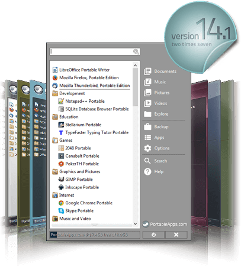

وحزمة برامج Piriform، كما تحتوي أيضا على مجموعة كبيرة من البرامج الأخرى التي تعمل بدون تثبيت.

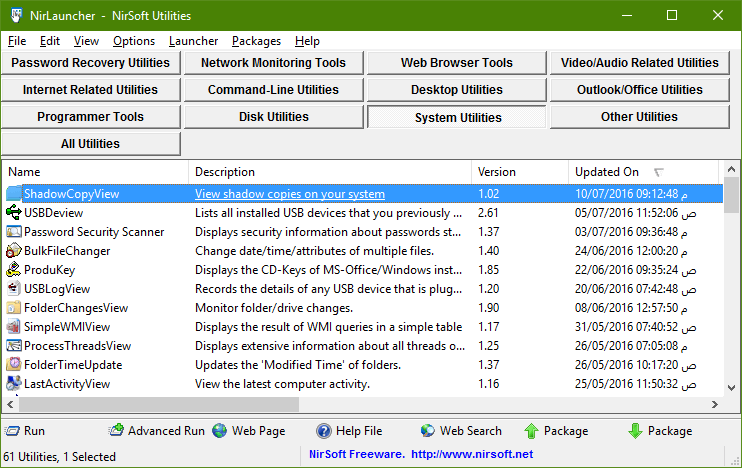

## كيفية استخدام منصة PortableApps.com

ستحتاج أولا إلى تثبيت مشغل التطبيقات [PortableApps.com](https://PortableApps.com) Platform:

1. قم بتشغيل الملف PortableApps.com_Platform_Setup_14.1.paf.exe، ستظهر لك نافذة اختيار اللغة، اختر اللغة التي تريد أن يتم تثبيت البرنامج بها.

    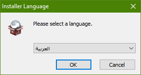

2. اضغط التالي للاستمرار.

    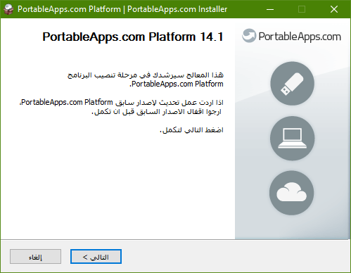

3. اختر تثبيت جديد، إذا كنت تستخدم هذا البرنامج من قبل على جهازك اختر الترقية، بعد ذلك اضغط التالي.

    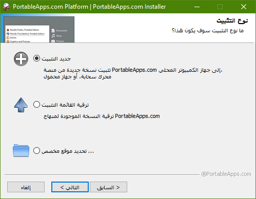

4. اختر مكان التثبيت الذي تريده، يفضل التثبيت على جهاز محمول USB أو تحديد موقع مخصص، ثم اضغط التالي.

    

5. في حالة اختيارك لموقع مخصص، قم بتحديد مجلد التثبيت ثم اضغط التالي.

    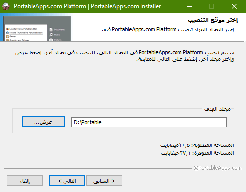

6. بعد تأكدك من جميع الاختيارات السابقة اضغط تنصيب لبدء التثبيت.

    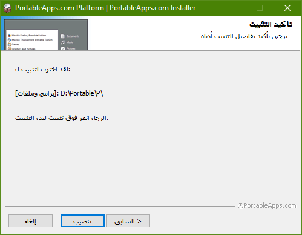

7. انتظر حتى اكتمال التثبيت، ثم اضغط انهاء.

    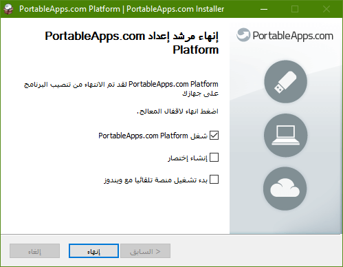

-   التعامل مع منصة PortableApps.com وإضافة برامج محمولة جديدة:
    ستظهر لك واجهة منصة PortableApps.com كما بالصورة.

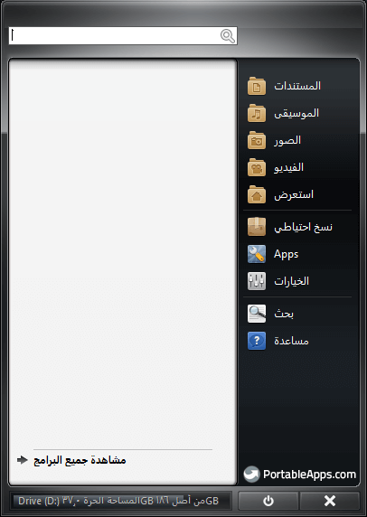

1. تحتاج الآن إلى إضافة البرامج المحمولة، ستجد الملفات المضغوطة للبرامج على ال DVD الهدية بصيغة .paf.exe وهى الصيغة الخاصة بمنصة PortableApps.com، البرامج مقسمة على ال DVD حسب استخدامها إلى Accessibility. Development. Education. Games. Graphics & Pictures. Internet. Music & Video. Office. Security. Utilities.

2. اضغط على Apps ثم من القائمة اختر تنصيب برنامج جديد.

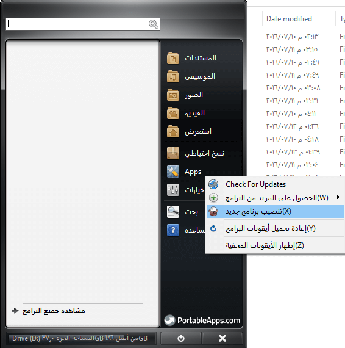

3. اختر البرنامج الذي تريد إضافته، ثم اضغط Open.

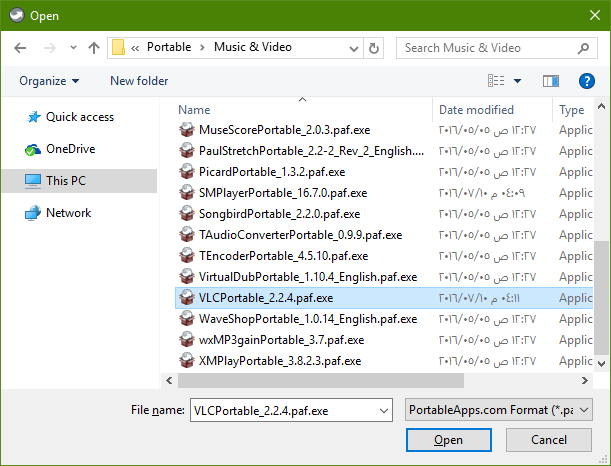

4. انتظر حتى اكتمال فك ضغط البرنامج وإضافته إلى قائمة برامجك.

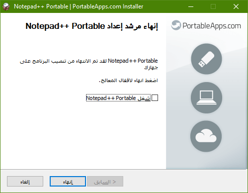

5. بعد إضافتك للعديد من البرامج ستجدها قد ظهرت كما بالصورة.

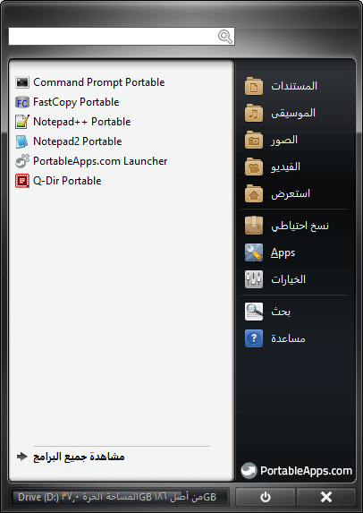

6. بمجرد الضغط على أي منها ستعمل مباشرة ويمكنك استخدامها كما تريد.
   Portable APP

7. عند إضافتك لمزيد من البرنامج يمكنك مشاهدة كل البرامج التي لديك عن طريق الضغط على "مشاهدة جميع البرامج" لتجد البرامج مصنفة حسب القسم كما بالصورة، وأعلى القائمة البرامج الأكثر استخداما.

    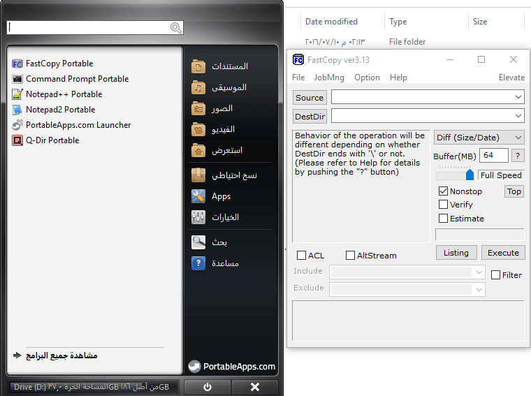

---

هذا الموضوع نُشر باﻷصل في مجلة لغة العصر العدد 188 شهر 08-2016 ويمكن الإطلاع عليه [هنا](https://drive.google.com/file/d/1P2m107ySRrnYB1tKOfZf5wgPJ0tWsoRZ/view?usp=sharing).

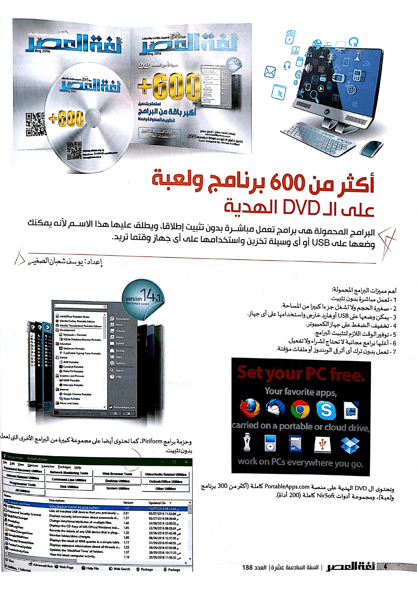

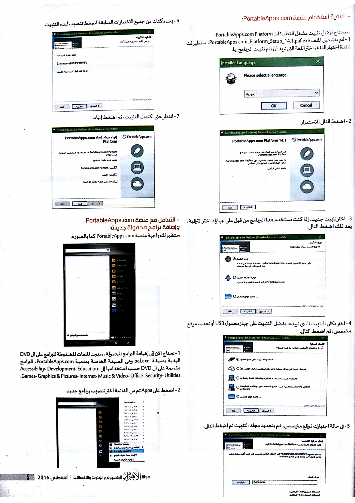

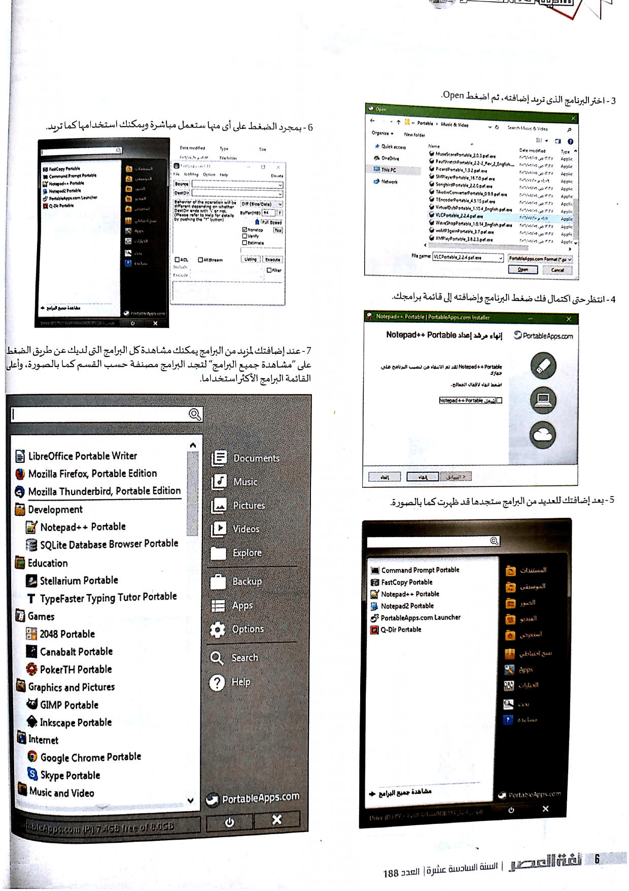

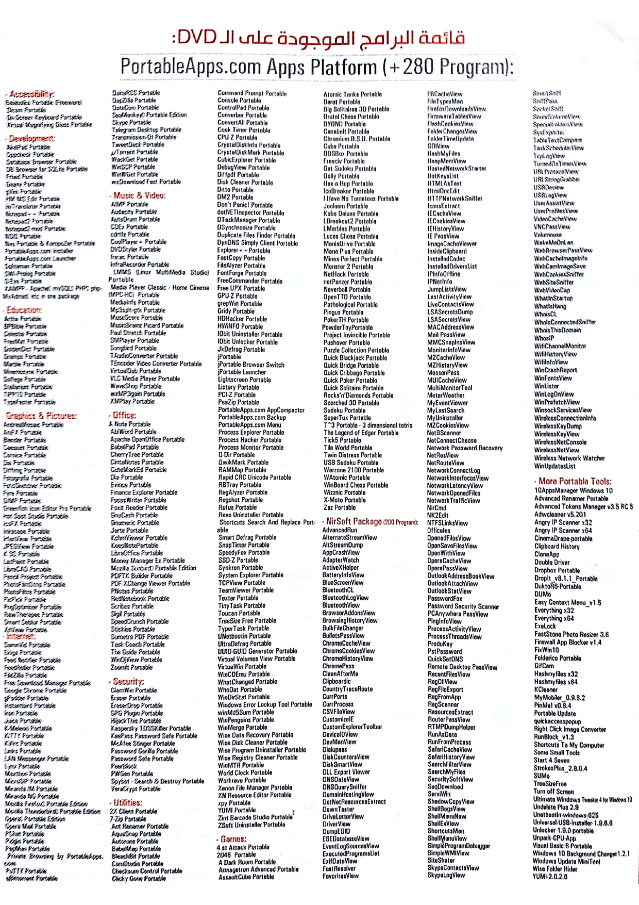
