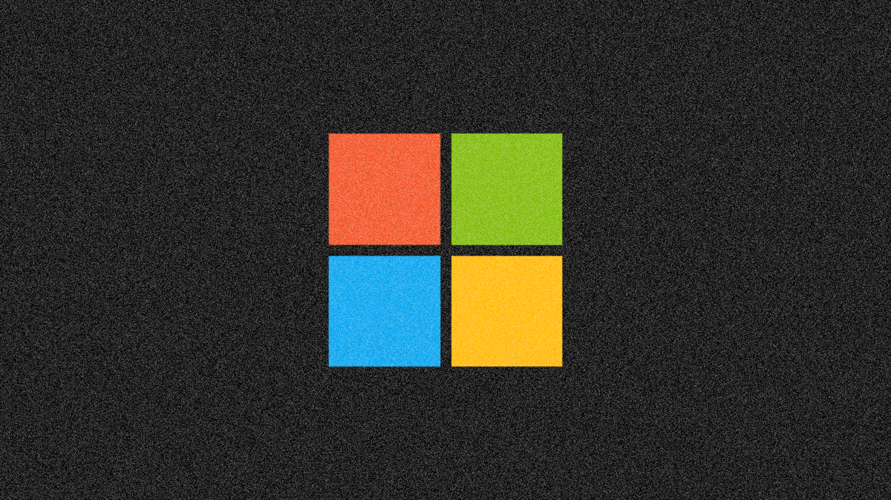

+++
title = "ما هي ثغرة PrintNightmare الجديدة في ويندوز وكيف تمنع استغلالها؟"
date = "2021-09-01"
description = "قامت مايكروسوفت شهر يونيو الماضي بتصليح مشكلة أمنية خطيرة في الويندوز تحمل الرقم CVE-2021-1675 والتي سمحت بوصول المخترقين إلى أجهزة الضحايا والتحكم فيها عن بعد من خلال استغلال مشكلة موجودة بخدمة Print Spooler في نظام الويندوز، وفي بداية شهر يوليو قام باحثون أمنيون صينيون باكتشاف ثغرة أخرى شبيهة ونشر إثبات يوضح كيفية استغلالها. تحمل الثغرة الجديدة الاسم PrintNightmare والرقم CVE-2021-34527، وقد تسبب نشر الباحثين اﻷمنيين بالخطأ لإثبات هذه الثغرة في استغلال عدد كبير من المخترقين لها باعتبارها ثغرة خطيرة من نوع zero-day في مختلف إصدارات الويندوز."
categories = ["اﻷمن الرقمي",]
tags = ["مجلة لغة العصر"]

+++
قامت مايكروسوفت شهر يونيو الماضي بتصليح مشكلة أمنية خطيرة في الويندوز تحمل الرقم CVE-2021-1675 والتي سمحت بوصول المخترقين إلى أجهزة الضحايا والتحكم فيها عن بعد من خلال استغلال مشكلة موجودة بخدمة Print Spooler في نظام الويندوز، وفي بداية شهر يوليو قام باحثون أمنيون صينيون باكتشاف ثغرة أخرى شبيهة ونشر إثبات يوضح كيفية استغلالها. تحمل الثغرة الجديدة الاسم PrintNightmare والرقم CVE-2021-34527، وقد تسبب نشر الباحثين اﻷمنيين بالخطأ لإثبات هذه الثغرة في استغلال عدد كبير من المخترقين لها باعتبارها ثغرة خطيرة من نوع zero-day في مختلف إصدارات الويندوز.

ووفقا لتقرير مايكروسوفت فيمكن استغلال الثغرة على أنظمة ويندوز 7 و8 و10 وكذلك أنظمة ويندوز سيرفر 2008 و2012 و2016 و2019. وتعتمد الثغرة المكتشفة في اﻷساس على مشكلة بخدمة Print Spooler المسؤولة عن التحكم في اﻷمور المتعلقة بجدولة الطباعة. ويمكن للمخترقين استغلال هذه الثغرة للحصول على تحكم كامل في النظام وتنفيذ مختلف اﻷوامر وتثبيت البرامج وإدارة الملفات عن بعد.

كما أوضح تقرير مايكروسوفت أن المتسللين بحاجة إلى الوصول لجهاز الضحية أولا قبل استغلال ثغرة PrintNightmare (وهذا يعني أن الشركات والمكتبات وغيرها من المنظمات التي لديها شبكات كبيرة قد تكون أكثر عرضة للضرر). وقد حدث هذا الأمر بسبب خطأ غير مقصود من الباحثين الأمنيين الصينيين بشركة Sangfor حيث قاموا بنشر إثبات استغلال ثغرة أخرى لم تحل بعد بدلًا من الثغرة التي أصلحتها مايكروسوفت في يونيو الماضي.

 وفي 6 يوليو الماضي أصدرت مايكروسوفت تحديثًا أمنيًا عاجلًا لسد هذه الثغرة التي تمثل تهديدًا على الأفراد والأعمال والمؤسسات التي لديها شبكات كبيرة، وشمل هذا التحديث كل أنظمة الويندوز بداية من 7 وحتى 10 وكذلك ويندوز سيرفر. لكن مجددًا نشرت بعض المواقع تقارير تفيد بأن تصليح مايكروسوفت يحل نصف المشكلة فقط عن طريق منع استغلال الثغرة عن بعد، لكن زال بإمكان المخترقين استغلال الثغرة محليا داخل الشبكات وتخطي تعديلات مايكروسوفت للوصول إلى صلاحيات خطيرة بخطوات إضافية بسيطة.

 كما ظهرت مشكلات مع عدد من أنواع الطابعات مثل Zebra أدت إلى عدم تمكن الويندوز من الوصول إلى الطابعات المتصلة بالجهاز وذلك بعد التحديثات الأخيرة التي أصدرتها مايكروسوفت لسد الثغرة. وقد وأقرت مايكروسوفت بوجود المشكلة، وأفادت بإمكانية حلها مؤقتاً عن طريق إلغاء تثبيت تحديث الأمان رقم KB5004945 أو إعادة تثبيت الطابعة كمسؤول.

## كيفية حماية أجهزتك من ثغرة PrintNightmare؟

على الرغم من التقارير التي تشير إلى حدوث مشاكل مع الطابعات بعد تثبيت تحديث الويندوز الذي يحل المشكلة إلا أنه لحماية أجهزتك من التعرض لخطر استغلال ثغرة PrintNightmare يجب عليك أن تقوم بتحديث النظام إلى آخر إصدار، وأن تتأكد خصوصًا من تثبيت التحديث رقم KB5004945. أيضًا عليك المواظبة على تثبيت التحديثات الأمنية بشكل دوري فمن المتوقع أن يتم إصدار مزيد من التحديثات التي تتعلق بهذه الثغرة.

ولحسن الحظ فنسبة أن تحدث مشكلة مع الطابعة بعد تثبيت للتحديث قليلة جدًا ولن تحدث إلا إذا كان لديك طابعة من بعض الأنواع التي يسبب التحديث مشكلة معها مثل Zebra، وفي حالة حدوث مشكلة مع الطابعة بعد تثبيت التحديث قم بإلغاء تثبيت التحديث مؤقتا إلى حين صدور تحديث آخر يعالج هذه المشكلة من خلال الدخول إلى الإعدادات ثم التحديثات والأمان ثم تحديثات الويندوز ثم عرض سجل التحديثات والضغط على إلغاء تثبيت التحديثات وأخيرًا اختيار التحديث رقم KB5004945.

---

هذا الموضوع نُشر باﻷصل في مجلة لغة العصر العدد 249 شهر 09-2021 ويمكن الإطلاع عليه [هنا](https://drive.google.com/file/d/1ovpFNEGB96_W2rG0fCEtRL9uRwCnGb-t/view?usp=sharing).

