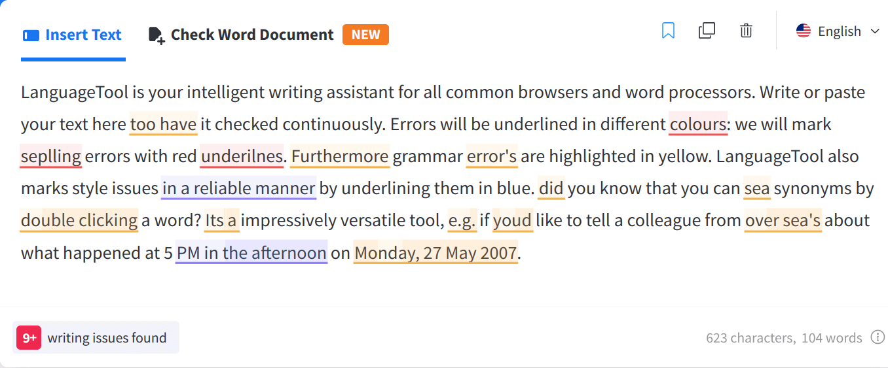
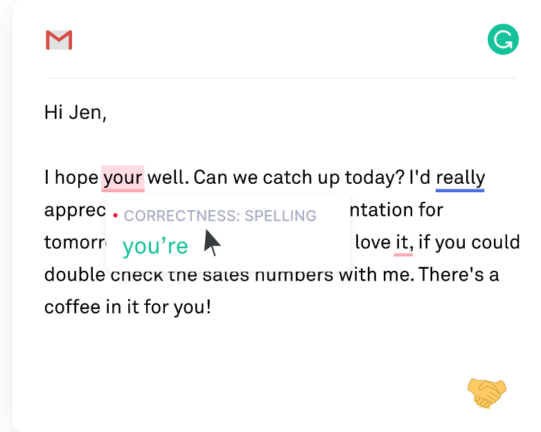
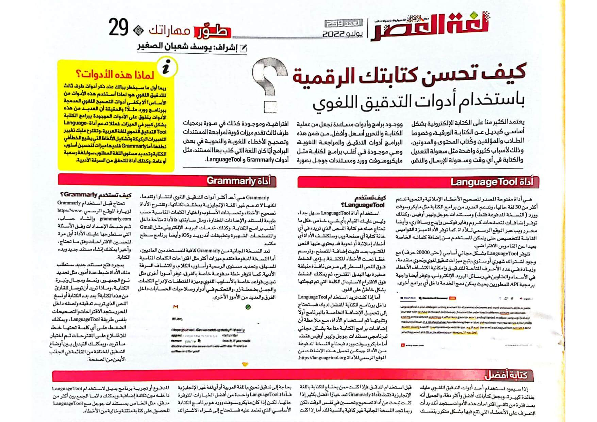

+++
title = "كيف تحسن كتابتك الرقمية باستخدام أدوات التدقيق اللغوي"
date = "2022-07-01"
description = "يعتمد الكثير منا على الكتابة الإلكترونية بشكل أساسي كبديل عن الكتابة الورقية، وخصوصا الطلاب والمؤلفون وكُتاب المحتوى والمدونون، وذلك لأسباب كثير واضحة مثل سهولة التعديل والكتابة في أي وقت وسهولة الإرسال والنشر، ووجود برامج وأدوات مساعدة تجعل من عملية الكتابة والتحرير أسهل وأفضل. من ضمن هذه البرامج أدوات التدقيق والمراجعة اللغوية، وهي موجودة في أغلب برامج الكتابة مثل مايكروسوفت وورد ومستندات جوجل بصورة افتراضية، وموجودة كذلك في صورة برمجيات طرف ثالث تقدم ميزات قوية لمراجعة المستندات وتصحيح الأخطاء اللغوية والنحوية في بعض البرامج أيًا كان اللغة التي كتب بها المستند، مثل أدوات Grammarly و LanguageTool."
categories = ["مهارات رقمية"]
tags = ["مجلة لغة العصر"]

+++

## مقدمة

يعتمد الكثير منا على الكتابة الإلكترونية بشكل أساسي كبديل عن الكتابة الورقية، وخصوصا الطلاب والمؤلفون وكُتاب المحتوى والمدونون، وذلك لأسباب كثير واضحة مثل سهولة التعديل والكتابة في أي وقت وسهولة الإرسال والنشر، ووجود برامج وأدوات مساعدة تجعل من عملية الكتابة والتحرير أسهل وأفضل. من ضمن هذه البرامج أدوات التدقيق والمراجعة اللغوية، وهي موجودة في أغلب برامج الكتابة مثل مايكروسوفت وورد ومستندات جوجل بصورة افتراضية، وموجودة كذلك في صورة برمجيات طرف ثالث تقدم ميزات قوية لمراجعة المستندات وتصحيح الأخطاء اللغوية والنحوية في بعض البرامج أيًا كان اللغة التي كتب بها المستند، مثل أدوات Grammarly و LanguageTool.

## لماذا هذه اﻷدوات؟

ربما أول ما سيخطر ببالك عند ذكر أدوات طرف ثالث للتدقيق اللغوي هو: لماذا أستخدم هذه الأدوات من اﻷساس؟ ألا يكفي أدوات التصحيح اللغوي المدمجة ببرنامج وورد مثلا؟ والحقيقة أن العديد من هذه اﻷدوات يتفوق على اﻷدوات الموجودة ببرامج الكتابة بشكل كبير في الميزات، فمثلا تدعم أداة LanguageTool التدقيق النحوي للغة العربية، وتقترح عليك تغيير التعبيرات الركيكة وتشكيل الألفاظ التي يشيع الخطأ في نطقها، أما Grammarly فلديها ميزات لتحسين أسلوب الكتابة وتحديد مستوى اللغة المطلوب سواء لغة رسمية أو عامة، وكذلك أداة للتحقق من السرقة اﻷدبية.

## أداة LanguageTool

هي أداة مفتوحة المصدر لتصحيح الأخطاء الإملائية والنحوية تدعم أكثر من 30 لغة حاليا، وتدعم العديد من برامج الكتابة مثل مايكروسوفت وورد (النسخة المدفوعة فقط) ومستندات جوجل وليبر أوفيس، وكذلك توفر إضافات لمتصفحات كروم وفايرفوكس وإيدج وسافاري، وأيضا محرر ويب عبر الموقع الرسمي للأداة. كما توفر اﻷداة ميزة القواميس القابلة للتخصيص حتى يتمكن المستخدم من إضافة كلماته الخاصة بعيدا عن القاموس الافتراضي.

تتوفر LanguageTool بشكل مجاني أساسي (حتى 20000 حرف) مع موجود اشتراك شهري أو سنوي يتيح ميزات تدقيق لغوي ونحوي متقدمة، وزيادة في عدد اﻷحرف المتاحة للتدقيق وإمكانية اكتشاف اﻷخطاء في الأسماء والعناوين في رسائل البريد اﻹلكتروني، وتوفر أيضا واجهة برمجية API للمطورين بحيث يمكن دمج الخدمة داخل أي برامج أخرى.

### كيف تستخدم LanguageTool؟

استخدام أداة LanguageTool سهل جدا وليس عليك القيام بأي شيء خاص فكل ما تحتاج عمله هو كتابة النص الذي تريده في أي خانة كتابة أي صفحة ويب وستكتشف الأداة أي أخطاء إملائية أو نحوية قد يحتوي عليها النص المكتوب بعد تثبيت إضافة المتصفح، وترسم خطًا تحت الأخطاء المكتشفة. يؤدي الضغط فوق النص المسطر إلى عرض نافذة منبثقة صغيرة بها البديل المقترح، ثم يمكنك الضغط فوق الاقتراح لاستبدال الكلمة التي تم تهجئتها بشكل خاطئ على الفور.

أما إذا كنت تريد استخدام LanguageTool داخل برنامج الكتابة المفضل لديك فستحتاج إلى تحميل اﻹضافة الخاصة بالبرنامج أولا وتثبيتها ثم استخدام اﻷداة، مع ملاحظة أن إضافات برامج الكتابة متاحة بشكل مجاني لبرنامجي مستندات جوجل وليبر أوفيس فقط، أما مايكروسوفت وورد فيحتاج النسخة المدفوعة من اﻷداة. ويمكن تحميل هذه اﻹضافات من الموقع الرسمي للأداة https://languagetool.org.

## أداة Grammarly

Grammarly هي أحد أكثر أدوات التدقيق اللغوي انتشارا وتقدما، لكنها لا تدعم غير اللغة اﻹنجليزية بمختلف لكناتها، وتقترح الأداة تصحيح اﻷخطاء وتحسينات اﻷسلوب واختيار الكلمات المناسبة حسب طبيعة المستند والإعدادات المختارة، ومثل سابقتها فاﻷداة متاحة داخل أغلب برامج الكتابة، وكذلك خدمات البريد اﻹلكتروني مثل Gmail والمتصفحات الشهيرة وتطبيقات أندرويد وiOS وأيضا برنامج سطح مكتب.

تعد النسخة المجانية من Grammarly كافية للمستخدمين العاديين، أما النسخة المدفوعة فتقدم ميزات أكثر مثل اقتراحات الكلمات المناسبة للسياق، وتحديد مستوى الرسمية وأسلوب الكلام، واكتشاف السرقة اﻷدبية. كما تتوفر خطة مدفوعة خاصة بالفرق توفر أمور أخرى مثل تعيين قواعد خاصة باﻷسلوب اللغوي وميزة المقتطفات لإدراج الكلمات والجمل بضغطة زر، والتحكم في أدوار وصلاحيات الحسابات داخل الفرق والعديد من اﻷمور اﻷخرى.

### كيف تستخدم Grammarly؟

تحتاج قبل استخدام Grammarly لزيارة الموقع الرسمي https://www.grammarly.com وإنشاء حساب، ثم ضبط اﻹعدادات وفق اﻷسئلة التي ستطرحها عليك اﻷداة أول مرة لتحسين الاقتراحات وفق ما تحتاج وأخيرا يمكنك إنشاء مستند جديد وبدء الكتابة.

بمجرد فتح مستند جديد ستطلب منك اﻷداة ضبط عدة أمور، مثل تحديد نوع الجمهور، ونمط ومجال ونبرة الكتابة، وماذا تريد أن توصل للقارئ من هذه الكتابة؟ بعد بدء الكتابة أو نسخ النص الذي تريد تدقيقه ولصقه داخل المحرر ستجد الاقتراحات والتصحيحات بنفس طريقة LanguageTool، ويمكنك الضغط على أي كلمة تحتها خط للاطّلاع على المقترحات ثم اختيار ما تريد، ويمكنك التبديل بين أوضاع التدقيق المختلفة من القائمة في الجانب اﻷيمن من الصفحة.

## ختام

إذا، سيعود استخدام أحد أدوات التدقيق اللغوي عليك بفائدة كبيرة ويجعل كتاباتك أفضل وأكثر دقة، والجميل أنه بعد فترة من تلقي اقتراحات هذه اﻷدوات ستجد أنك بدأت التعرف على اﻷخطاء التي تقع فيها بشكل متكرر بنفسك قبل استخدام المدقق. فإذا كنت ممكن يحتاج للكتابة باللغة اﻹنجليزية فقط فأداة Grammarly تعد خيارًا أفضل بكثير إذا كنت تبحث عن أداة تصحيح وتحسين في نفس الوقت، لكن ربما تجد النسخة المجانية غير كافية بالنسبة لك. أما إذا كنت بحاجة إلى تدقيق نحوي باللغة العربية أو أي لغة غير اﻹنجليزية فأداة LanguageTool واحدة من أفضل الخيارات المتوفرة حاليا، لكن إذا كان مايكروسوفت وورد هو برنامج الكتابة اﻷساسي الذي تعتمد عليه فستحتاج إلى شراء الاشتراك المدفوع أو تجربة برنامج بديل لاستخدام LanguageTool داخله دون تكلفة إضافية. ويمكنك دائما الجمع بين أكثر من مدقق، مثل الخاص بمستندات جوجل مع LanguageTool للحصول على كتابة متقنة وخالية من اﻷخطاء.

---

هذا الموضوع نُشر باﻷصل في مجلة لغة العصر العدد 256 شهر 07-2022 ويمكن الإطلاع عليه [هنا](https://drive.google.com/file/d/1H8vnWtVPhFX_-bVvq6YhitiEMlkxHHfc/view?usp=sharing).

