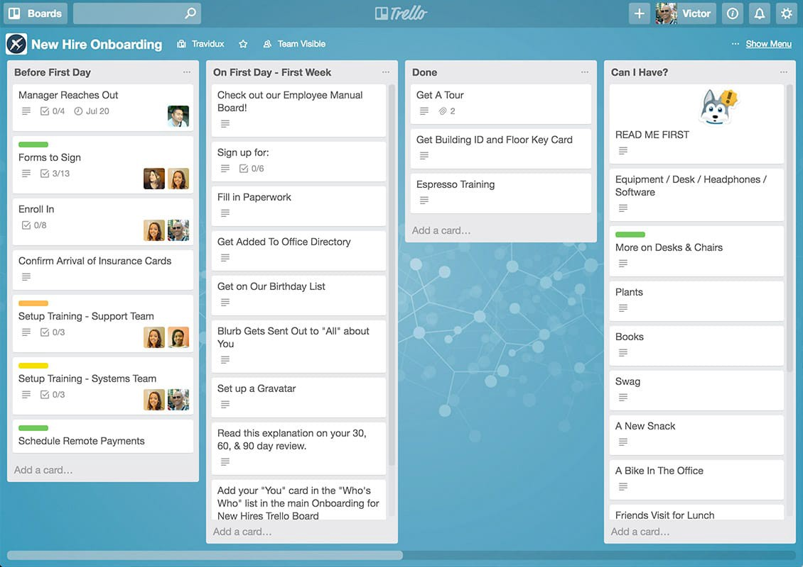

+++
title = "أدوات وبرمجيات إدارة فرق العمل عن بُعد"
date = "2020-08-01"
description = "يتجه العالم في الفترة الأخيرة إلى العمل عن بُعد بسبب جائحة كورونا، ومن المتوقع أن يستمر هذا التحول حتى بعد انتهاء انتشار الفيروس، فقد أعلن عدد من كبرى الشركات مثل جوجل وفيسبوك وتويتر استمرار عمل موظفيهم من المنزل حتى نهاية 2020 بشكل مبدئي. وتعتمد فرق العمل عن بعد على أشخاص ذوي مهارات مختلفة متواجدين في أماكن متفرقة في جميع أنحاء العالم، وهو ما يعطيها جاذبية شديدة بسبب توفير الراحة للموظف، وزيادة الإنتاجية بالنسبة للشركات، وتقليل تكلفة العمل من المكتب."
categories = ["مهارات تقنية",]
tags = ["مجلة لغة العصر"]
images = ["images/0.jpg"]

+++
يتجه العالم في الفترة الأخيرة إلى العمل عن بُعد بسبب جائحة كورونا، ومن المتوقع أن يستمر هذا التحول حتى بعد انتهاء انتشار الفيروس، فقد أعلن عدد من كبرى الشركات مثل جوجل وفيسبوك وتويتر استمرار عمل موظفيهم من المنزل حتى نهاية 2020 بشكل مبدئي. وتعتمد فرق العمل عن بعد على أشخاص ذوي مهارات مختلفة متواجدين في أماكن متفرقة في جميع أنحاء العالم، وهو ما يعطيها جاذبية شديدة بسبب توفير الراحة للموظف، وزيادة الإنتاجية بالنسبة للشركات، وتقليل تكلفة العمل من المكتب.

وعلى الرغم من الإيجابيات العديدة، فلا يخلو الأمر من الصعوبات المختلفة بداية من اتصال الإنترنت وحتى أمور قيادة الفريق بالطريقة المناسبة والتواصل فيما بينه. ولتسهيل أمور العمل للموظفين، تعمل الشركات دوما على تطبيق أدوات وبرامج جديدة لاستبدال نظام العمل التقليدي بالتكنولوجيا، مما يجعل من السهل التحكم في كيفية سير العمل وتنظيمه والوصول إلى الموظفين بشكل سهل وسريع. نستعرض فيما يلي عددا من الأدوات والبرامج المتنوعة لإدارة العمل عن بُعد والتعاون الجماعي عبر الإنترنت، لتضمن الوصول إلى أعلى مستويات الأداء.

## Slack

Slack هو أحد أكثر برامج تنظيم العمل والتواصل بين الفرق شعبية، حيث يتم استخدامه من قبل عدد كبير من الفرق، من ضمنها شركات كبري مثل IBM وAmazon، فهو أحد أفضل الأدوات المتاحة لدمج كل عضو في العمل معًا.

يسمح لك Slack بإنشاء غرف التواصل بسهولة، وضبط المناطق الزمنية، وإرسال الملفات، وإنشاء الأحداث المجدولة، واستخدام بوتات مخصصة. وهناك أيضًا عدد من الإضافات المدمجة في Slack للتكامل مع الخدمات الأخرى مثل Google Drive - Skype - MailChimp - Basecamp - Zoom وغيرها من الخدمات. كما أنه يمكنك من توزيع أدوار العمل بشكل سلس وعمل تحليل لبيانات العمل والمهام داخل شبكتك. ويتوفر Slack على مختلف أنظمة تشغيل الأجهزة المحمولة وأجهزة سطح المكتب مما يجعل نظام العمل واحدا حتى مع اختلاف أجهزة أعضاء الفريق.

## ClickUp

على الرغم من كون ClickUp أداة جديدة نسبيًا حيث لم يتجاوز عمرها 3 سنوات منذ إطلاقها إلا أنها استطاعت بجداره كسب ثقة أكثر من 100 ألف فريق من ضمنها فرق تابعة لشركات مثل جوجل وأوبر ونتفليكس.  ClickUpهي أداة لإدارة المشاريع تهدف إلى جعل حياتك المهنية أسهل، وقد بدأ هذا المشروع نتيجة لعدم رضا مطوريه عن الأدوات المتوفرة في ذلك الوقت، فكانت النتيجة النهائية هي حل سهل الاستخدام يستم بالمرونة الشديدة ويمكن استخدامه في إدارة أي نشاط تجاري أو تنظيم الحياة الشخصية.

يتميز ClickUp عن غيره من أدوات إدارة فرق العمل وتنظيم المهام باحتوائه على العديد من المميزات غير الموجودة في الأدوات المنافسة، وقابليته الشديدة للتخصيص، ووجود خطة استخدام مجانية بالكامل دون قيود على عدد المستخدمين ضمن الفريق. ويعتمد ClickUp على تقسيم العمل إلى "مساحات" والتي تمثل الأقسام المنفصلة، و"مشاريع" على هيئة مجلدات داخل المساحات، و"قوائم" لتنظيم مهام العمل، وأخير "المهام" و"المهام الفرعية".

## Asana

أداة إدارة أخرى ذات واجهة جذابة، تناسب بشكل كبير الفرق الصغيرة والمتوسطة. وتحتوي على ثلاثة عناصر رئيسية: تخزين الملفات، والتعاون بين الفريق، والتحكم في الفرق، وذلك بدون الحاجة إلى استخدام البريد الإلكتروني. يمكنك الحصول على نظرة عامة سريعة حول مختلف الأمور عن طريق لوحات المعلومات، ويمكنك كذلك الاطلاع على الجداول زمنية وخارطة طريق المشاريع المختلفة. ويتم عرض كل هذه المعلومات بشكل منفصل لكل عضو في الفريق اعتمادًا على المهام المسندة إليه وصلاحيات حسابه. 

بعد إسناد المهام إلى الموظفين، ستتمكن من متابعة تقدمهم في إنهائها ومراجعة مراحل تنقيذ العمل التي تم إعدادها مسبقًا للمشروع بشكل بسيط. وتوفر Asana نظام إشعارات يجعل من السهل مراقبة مختلف الأمور من البداية وحتى النهاية، كما تسمح لك بإعطاء "وسم" للمهام والفرق وتخصيص الاختصارات لتوفير مزيد من الراحة أثناء الاستخدام. 

 

## Trello

Trello هي أداة لتنظيم المهام عن طريق اللوحات أو ما يعرف باسم Kanban (كلمة يابانية تعني البطاقات) حيث تجمع الأداة العديد من الأمور وتعرضها في لوحة بصريًا سهلة الفهم. يتم عرض المهام على البطاقات التي يراها أعضاء الفريق، وعرض تفاصيل مثل نوع المهمة وآخر موعد لتنفيذها.

تناسب Trello إلى حد كبير مبادئ تطوير البرمجيات Agile والمهام قصيرة المدى، حيث تسمح بتعديل الهدف بسهولة اعتمادًا على احتياجات المشروع. كما يمكنك أيضًا مشاركة الملفات والصور من خلالها، وإنشاء عدد غير محدود من المهام، وإسنادها لأعضاء الفريق وكتابة تعليقات عليها، وتصفيتها بسهولة على حسب مختلف المعايير. وتشتمل الخطة المجانية للاستخدام عدد لا محدود من اللوحات الشخصية والبطاقات والقوائم، لكنها مقيدة بحجم 10 فقط للمرفقات، و10 لوحات فرق فقط.

## حزمة أدوات جوجل

أحد أفضل الأشياء حول أدوات جوجل هو أن أغلب الأشخاص يمكنهم استخدامها دون الحاجة إلى تثبيت أي برنامج، فأغلب الأشخاص لديهم حساب جوجل وبذلك يستطيعون الاستفادة من خدمات التخزين والبريد الإلكتروني والمستندات وجداول البيانات بشكل مجاني.

أما بالنسبة للشركات والفرق، فخدمات مثل Hangout وMeet وتقويم جوجل تكون ذات فائدة كبيرة، حيث يمكنهم إعداد اجتماعات مجدولة، والتحكم في الإشعارات، وقبول الدعوات للأحداث أو رفضها. وباستخدام ميزة مشاركة الملفات تستطيع فرق العمل توفير وصول سهل إلى جداول البيانات والمستندات الأخرى والتحكم في صلاحيات الأشخاص والمجموعات. وبالإضافة إلى ذلك، تفيد ميزات الحفظ التلقائي للتعديلات، وتاريخ تحرير الملفات في تفادي أي أخطاء أو فقدان للبيانات.

وجديرٌ بالذكر أن جوجل قد أتاحت خدمة Meet نهاية شهر مارس الماضي بشكل مجاني للأفراد بعد أن كانت مقصورة على الشركات والمؤسسات التعليمية فقط، فيمكن لجميع المستخدمين استضافة اجتماعات بعدد أفراد يصل إلى 100 شخص لفترة زمنية غير محدودة طوال فترة الأزمة الحالية، وبداية من أكتوبر قد يتم تحديد مدة الاجتماع إلى 60 دقيقة فقط. 

## Microsoft To Do

Microsoft To Do هو أداة جديدة من مايكروسوفت متاحة بشكل مجاني عن طريق حساب Microsoft، ومتاحة لأنظمة أندرويد وiOS وماك وويندوز 10 والويب. وتتيح لك أداة To-Do إعداد ومشاركة قوائم المهام والتذكيرات الشخصية ومزامنتها مع جميع أجهزتك.

يوفر Microsoft To Do لك قائمة مهام بسيطة وذكية تجعل التخطيط ليومك أمرا سهلاً، سواء كان التخطيط خاص بالعمل أو المنزل ليساعدك على زيادة الإنتاجية من خلال إنشاء خطة لسير العمل يومياً. حيث يمكنك تنظيم يومك باستخدام الاقتراحات الذكية التي يوفرها To Do وإكمال أهم المهام أو الأعمال الروتينية التي تحتاج إلى إنجازها كل يوم.

كما يمكنك أيضاً استخدام To Do كمنصة لتدوين الملاحظات وكتابة ملاحظات تفصيلية لكل مهمة، وجمع كل المهام والملاحظات في مكان واحد لمساعدتك على إنجاز المزيد.

## Every Time Zone

اختلاف المناطق الزمنية هو أحد المشاكل التي تواجه فرق العمل عن بُعد، ولذلك يساعدك موقع Every Time Zone على تنسيق المواعيد الزمنية عبر المحيطات والقارات. كل ما تحتاج القيام به هو اختيار وقت ما، وستعرض لك الأداة ما يقابل هذا الوقت في مختلف المناطق الزمنية حول العالم، مما يجعل عملية تحديد المواعيد وساعات العمل المناسبة أمرا سهلًا.

## Bubbl.us

تعد الخرائط الذهنية أحد الأدوات الرائعة خلال عملية العصف الذهني ووضع خطط العمل. ويتيح لك موقع Bubbl.us إنشاء خرائط ذهنية ملونة بسهولة للطباعة أو مشاركتها مع الآخرين.

وتساعد أداة الخرائط الذهنية Bubbl.us الشركات وفرق العمل عن بُعد على التعاون وعرض الأفكار بطريقة أفضل، كما يمكنك استخدامها على المستوي الفردي أيضا لتنظيم الأفكار والعادات وسير العمل.

 

إذن بينما تقدم فرق العمل عن بُعد قيمة حقيقية للعمل وتساعد في تطوير المشاريع دون التقيد بالوقت والمكان، قد تكون عملية إدارة هذه الفرق صعبة بشكل كبير، ولكن مع الاستعانة ببعض من أفضل برامج تنسيق وتنظيم العمل وتوفير تواصل جيد بين فرق العمل تُحل الكثير من المشاكل وتصبح تجربة العمل عن بُعد تجربة مميزة.

---

هذا الموضوع نُشر باﻷصل في مجلة لغة العصر العدد 1 شهر 08-2020 ويمكن الإطلاع عليه [هنا](https://drive.google.com/file/d/10tAU76dFU8hIfXHKyQeq8N1MG8B8RAXq/view?usp=sharing).

