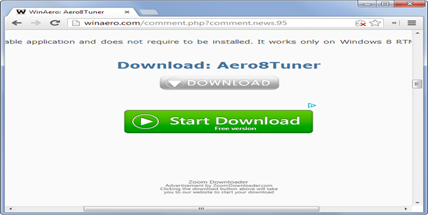
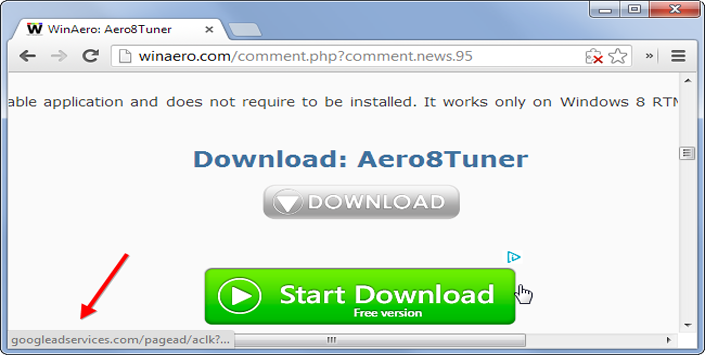
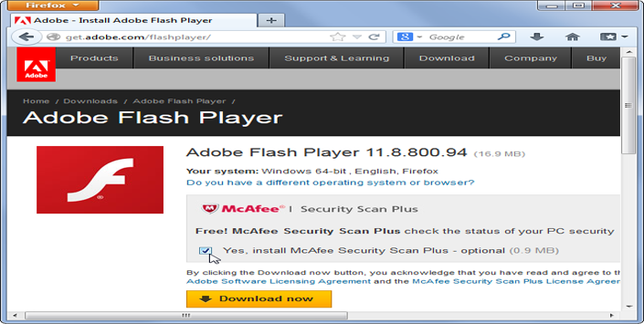
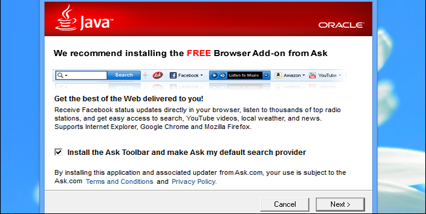
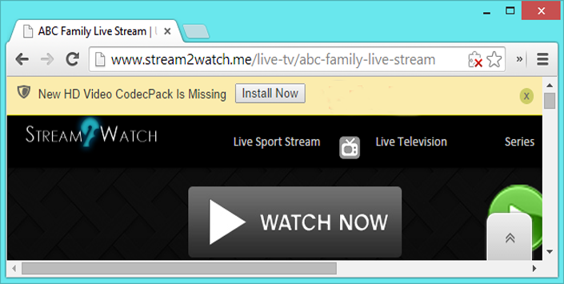
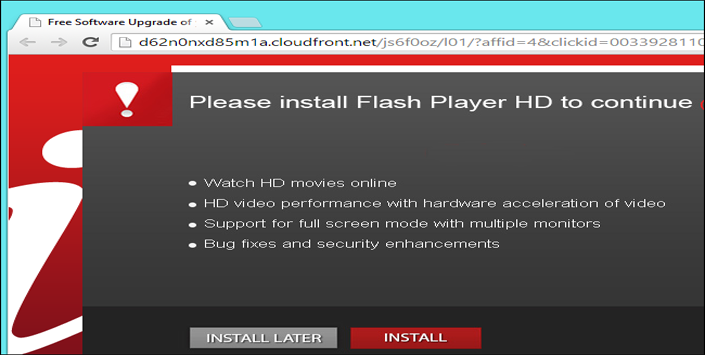
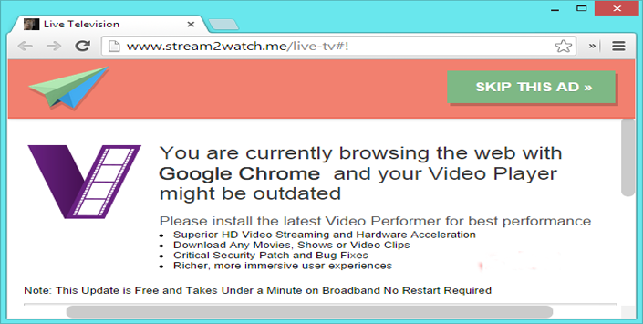
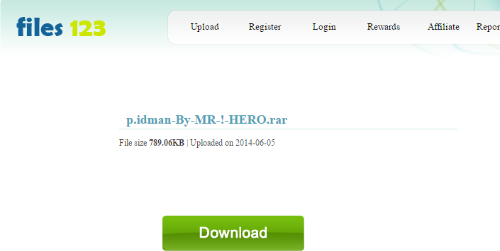

+++
title = "التخلص من الإعلانات المزعجة على الإنترنت"
date = "2014-10-26"
description = "تمتلئ شبكة الإنترنت بالبرامج الدعائية والإعلانات المزعجة وروابط التحميل المزيفة والتحذيرات الكاذبة والنوافذ المنبثقة والعديد من هذه الأشياء التي يكرها جميع مستخدمي الإنترنت نقدم لك عزيزي القارئ شرحًا كاملا لكيفية تجنب هذه الأشياء والتخلص منها نهائيا."
categories = ["مهارات رقمية",]
tags = ["موقع لغة العصر"]
images = ["images/2014-635499179814284457-428.png"]

+++
## أولا: كيفية التعرف على روابط التحميل المزيفة

عندما نقوم بالدخول على معظم مواقع التحميل أو عندما نبحث عن البرامج المجانية نجد العديد من أزرار التحميل كما بالصورة، هذه الأزرار تكون ملونة وكبيرة ولامعة حتى تخدع المستخدم، وليس هذا فقط بل وتجد مكتوب عليها Start Download/Free Download/Download Now عند الضغط على أحد هذه الأزرار يقوم الموقع بتحميل ملف غير الملف المطلوب وغالبا ما يكون ملفًا ملغمًا ذا امتدادين (.rar.exe) مثلا.

هذه الأزرار المزيفة ما هي إلا عبارة عن إعلانات لربح المال عن طريق الضغط عليها (تخيل معى كم عدد الأشخاص الذين يضغطون على مثل هذه الأزرار كل يوم مما يدر أموال طائلة على الأشخاص الذين يضعون هذه الإعلانات).

للتمييز بين هذه الأزرار وأزرار التحميل الصحيحة لاحظ الرابط الذي سيظهر عندما تقف على زر التحميل:

إذا وجدت كلمة AD في الرابط فأعلم أنه إعلان على الفور.

غالبا يجب أن يقودك الرابط الأصلي إلى الملف المرفوع على نفس الموقع.

## ثانيا: البرامج الدعائية المدمجة مع البرامج المحملة من الإنترنت

تقوم معظم البرامج المحملة من الانترنت بوضع اختيار افتراضي لتحميل برامج مساندة أخرى أو برامج موصى بها من قِبل الشركة (وهذه البرامج ما هي إلا برامج دعائية مزعجة ليس لها أي استخدام مفيد).

على سبيل المثال برنامج أدوبى فلاش:
فعندما تقوم بتحميل البرنامج من الموقع الرسمي تجد انه بشكل افتراضي سيتم تحميل برنامج McAfee Security Scan Plusإذا لم تقم بإزالة هذا الاختيار سيتم تثبيت برنامجين على جهازك.
لذلك يجب عليك عزيزي القارئ إزالة أي علامات قبل التحميل لتجنب تحميل هذا النوع من البرامج.

## ثالثا: البرامج المزعجة المدمجة مع ملفات البرامج

هذا النوع من البرامج المزعجة يقوم بتحميل شرائط وإضافات للمتصفحات والتي تقوم بدورها بعرض الإعلانات المزعجة داخل المتصفح ولعل أشهر هذه الأشرطة هو شريط ASK المزعج الذي يوجد في معظم البرامج.
على سبيل المثال برنامج الجافا:

كما ذكرت من قبل تأكد من العلامات الموضوعة ولا تقم بضغط Next دون أن تقرأ المعلومات.

## رابعا: برامج الكوديك والوسائط

احترس عزيزي القارئ كل الحذر من تحميل هذه البرامج بالكامل، فهذا النوع بالتحديد هو فيروسات وتروجان.

صور لهذا النوع:

## الحل النهائي لتجنب كل هذه المشكلات

قم بتحميل إضافة Adblock Plusلمنع ظهور الإعلانات نهائيا:

1. قم بالدخول الى موقع الإضافة [من هنا](https://adblockplus.org/en/).
2. قم باختيار المتصفح الذي تستعمله ومن ثم ثبت الإضافة.
3. بعد انتهاء تثبيت الإضافة لن تجد أي إعلانات أو ازرار تحميل مزعجة نهائيا.

هذا هو زر التحميل الحقيقي الوحيد الموجود بالموقع وباقي الأزرار قد اختفت لأنها مجرد إعلانات.

---
هذا الموضوع نٌشر باﻷصل على موقع مجلة لغة العصر.

http://aitmag.ahram.org.eg/News/2007.aspx