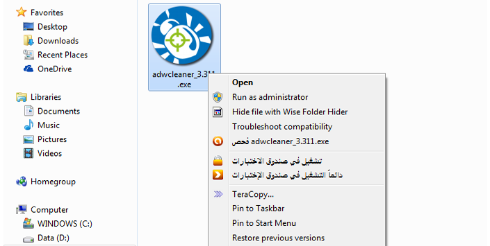
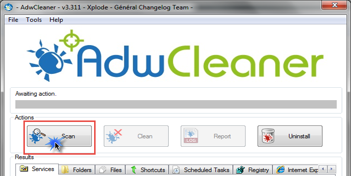
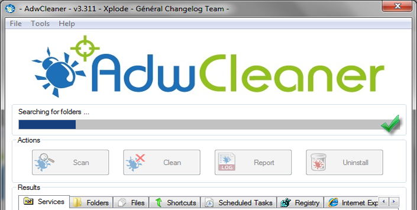
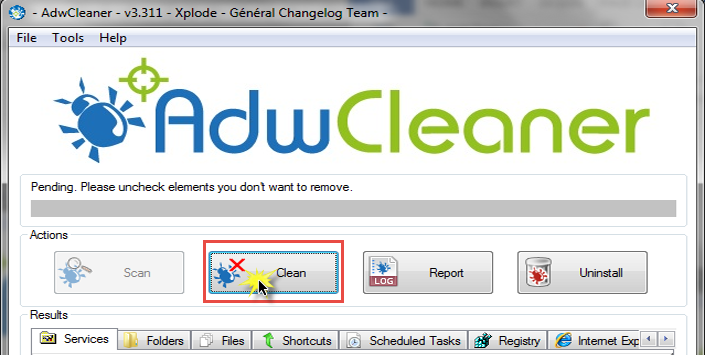
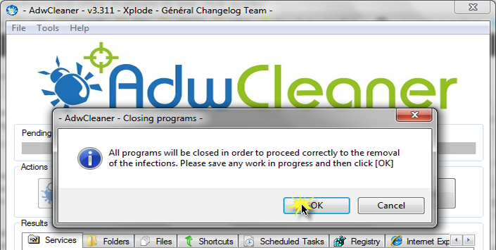

+++
title = "إزالة البرامج الخبيثة والأشرطة الدعائية من جهازك"
date = "2014-10-27"
description = "تعتبر البرامج الخبيثة والأشرطة الدعائية من أكبر المشاكل التي تواجه مستخدمي الويندوز بسبب وجود الكثير من روابط التحميل المزيفة على الإنترنت، وأيضا بسبب البرامج الدعائية التي تكون مدمجة مع البرامج التي تم تحميلها."
categories = ["مهارات رقمية",]
tags = ["موقع لغة العصر"]
images = ["images/2014-635494024762822721-282.png"]

+++
لتحميل البرنامج: [من هنا](https://toolslib.net/downloads/finish/1/)

يقوم البرنامج بإزالة كل من:

-  البرامج الضارة (Adware).
-  البرامج الدعائية (Ads Softwares).
-  البرامج غير المرغوب فيها (Potentially Undesirable Program).
-  الشرائط الدعائية الخاصة بالمتصفحات.
-  برامج وإضافات تغيير الصفحة الرئيسية للمتصفح.

## طريقة إزالة البرامج

1. قم بتحميل البرنامج من الرابط بالأعلى.
2. قم بفتح البرنامج كمسئول (Run As Administrator).

3. اضغط على زر Scan ليبدأ البرنامج بفحص جهازك.

4. ننتظر حتى البرنامج من الفحص.

5. بعد انتهاء البرنامج من الفحص يظهر اختيار Clean.

6. عند الضغط عليه يظهر البرنامج رسالة تحذيرية أنه سيتم اغلاق جميع البرامج ومتصفحات الانترنت والنوافذ المفتوحة حاليا اضغط OK.

7. سيقوم البرنامج الآن بالتنظيف وبعدها ستظهر لك رسالة أخرى تخبرك بأنه سيتم إعادة تشغيل الجهاز لإتمام عملية التنظيف اضغط OK.

8. بعد إعادة تشغيل الجهاز سيقوم البرنامج بعرض ملف Logبه العمليات التي قام بها والملفات التي قام بحذفها.

وبهذا تكون قد اكتملت عملية التنظيف بنجاح.

---
هذا الموضوع نٌشر باﻷصل على موقع مجلة لغة العصر.

http://aitmag.ahram.org.eg/News/1925.aspx