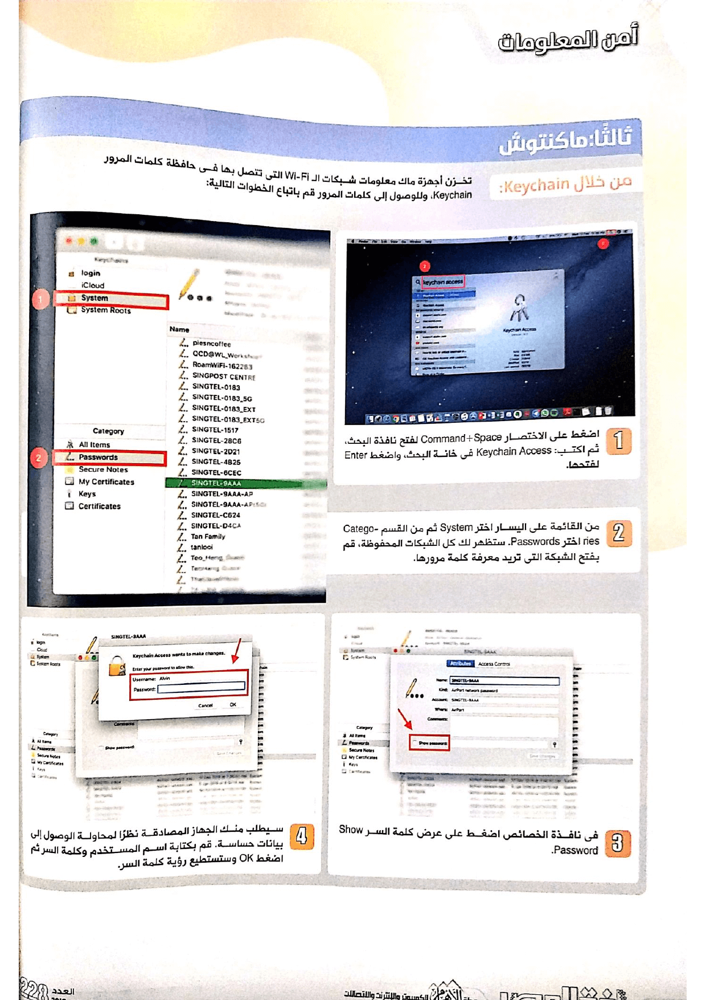

+++
title = "دليلك الشامل لاستعادة كلمة سر الـ Wi-Fi على مختلف أنظمة التشغيل"
date = "2019-12-01"
description = "كثيرا ما نقوم بتغيير كلمة سر شبكة ال Wi-Fi الخاصة بنا ثم ننسي ماذا كانت، أو نزور مكان ما ونتصل بال Wi-Fi هناك ثم نزوره مرة أخرى ونحتاج لطلب كلمة السر مجددا. في كلتا الحالتين يمكنك استعادة كلمة سر شبكة ال Wi-Fi بخطوات بسيطة حتى لا تحتاج إلى إعادة ضبط الراوتر أو طلب كلمة السر مرة أخرى. فكل أنظمة التشغيل تحتفظ بمعلومات الشبكات التي تم الاتصال بها مسبقا ضمن بيانات النظام، وتختلف طريقة الوصول إلى هذه المعلومات باختلاف نظام التشغيل المستخدم. في السطور القادمة سنستعرض كيفية الوصول إلى كلمات سر شبكات ال Wi-Fi المحفوظة على أنظمة تشغيل ويندوز ولينكس وماك وأندرويد وiOS."
categories = ["مهارات رقمية",]
tags = ["مجلة لغة العصر"]

+++
كثيرا ما نقوم بتغيير كلمة سر شبكة ال Wi-Fi الخاصة بنا ثم ننسي ماذا كانت، أو نزور مكان ما ونتصل بال Wi-Fi هناك ثم نزوره مرة أخرى ونحتاج لطلب كلمة السر مجددا. في كلتا الحالتين يمكنك استعادة كلمة سر شبكة ال Wi-Fi بخطوات بسيطة حتى لا تحتاج إلى إعادة ضبط الراوتر أو طلب كلمة السر مرة أخرى. فكل أنظمة التشغيل تحتفظ بمعلومات الشبكات التي تم الاتصال بها مسبقا ضمن بيانات النظام، وتختلف طريقة الوصول إلى هذه المعلومات باختلاف نظام التشغيل المستخدم. في السطور القادمة سنستعرض كيفية الوصول إلى كلمات سر شبكات ال Wi-Fi المحفوظة على أنظمة تشغيل ويندوز ولينكس وماك وأندرويد وiOS.

بداية وقبل الشروع في الخطوات، تحقق من كلمة السر الافتراضية لجهاز الراوتر، ففي بعض الأحيان قد نتركها كما هي ولا نقوم بتغييرها. ستجد بيانات اسم المستخدم وكلمة السر موجودة على ملصق أسفل جهاز الراوتر.

كما يمكنك تفقد دليل الاستخدام الخاص بالجهاز. أما إذا لم تجد كلمة السر في كلاهما، يمكنك تجربة البحث عن كلمة السر عبر إعدادات جهاز الراوتر، وإذا لم تعرف بيانات الدخول يمكنك البحث عنها في موقع RouterPasswords.com

## أولا: ويندوز

### من خلال إعدادات ال Wi-Fi

1. اضغط على أيقونة ال Wi-Fi الموجودة يمين شريط المهام بزر الماوس الأيمن واختر "Open Network and Internet Settings".

2. أسفل مجموعة الاختيارات "Change your network settings" اضغط على " Change Adapter Options".

3. ستجد مجموعة من طرق الاتصال بالإنترنت، منها محول ال Wi-Fi. اضغط بزر الماوس الأيمن ثم اختر "Status".

4. في نافذة خصائص اتصال ال Wi-Fi اضغط على الزر "Wireless Properties".

5. في تبويب "Security" ستجد معلومات الأمان الخاصة بالشبكة الحالية. كلمة السر موجودة في الخانة "Network Security Key" ويمكنك رؤيتها بالضغط على "Show characters".

ملاحظة: إذا كنت تستخدم ويندوز 7 قم بفتح "Network and Sharing Center" من لوحة التحكم "Control Panel" ثم اضغط على "Manage wireless networks" وأكمل الخطوات بداية من الخطوة 3. أو يمكن الوصول إلى خصائص الشبكة المتصلة حاليا بالضغط على اسمها أمام Connections.

### من خلال موجه الأوامر

1. من قائمة البداية قم بفتح موجه الأوامر بالبحث عن "Command Prompt"، ثم اضغط بزر الماوس الأيمن واختر "Run as Administrator".

2. ولإظهار شبكات ال Wi-Fi التي اتصلت بها قم بإدخال الأمر التالي
netsh wlan show profile
ستظهر لك قائمة بالشبكات كما بالصورة.

3. لعرض كلمة السر لأي شبكة في القائمة قم بإدخال الأمر التالي مع استبدال name باسم الشبكة التي تريد معرفة كلمة السر الخاصة بها.

`netsh wlan show profile "name" key=clear`

ستجد كلمة السر في السطر الذي يبدأ ب Key Content.

### من خلال أداة WirelessKeyView

WirelessKeyView هي أداة صغيرة الحجم لا تحتاج للتثبيت، تعمل على أغلب إصدارات الويندوز. يمكنك تحميلها من الموقع الرسمي https://www.nirsoft.net/utils/wireless_key.html.

بعد تحميل الأداة واستخراجها قم بتشغيلها وستجد قائمة بكل الشبكات المحفوظة وكلمات السر الخاصة بها بكل سهولة كما بالصورة.

## ثانيا: لينكس

نظرا لتعدد توزيعات لينكس، فإنه من غير الممكن إفراد كل واحدة منها بشرح منفصل، لذلك سأذكر طريقتين لاستعادة كلمة سر ال Wi-Fi، الأولى على نظام Ubuntu والثانية من خلال سطر الأوامر، علما بأن هذه الخطوات عامة ويمكن اتباعها على أغلب التوزيعات الأخرى.

### من خلال إعدادات ال Wi-Fi

1. من إعدادات النظام قم بالدخول إلى قسم ال Wi-Fi ثم من القائمة بالأعلى اضغط على الاختيار "Known Wi-Fi Networks".

2. ستظهر لك قائمة بها شبكات ال Wi-Fi التي اتصلت بها سابقا. اضغط على أيقونة الإعدادات بجانب الشبكة التي تود الاطلاع على كلمة السر الخاصة بها.

3. ومن خلال التبويب Security ستجد كلمة السر. اضغط على الاختيار Show Password لعرضها.

### من خلال سطر الأوامر

قم بفتح الطرفية Terminal من خلال قائمة البرامج أو من خلال الاختصار Ctrl+Alt+T. بعد ذلك أدخل الأمر 

`sudo grep psk= /etc/NetworkManager/system-connections/*`

سيُظهر هذا الأمر كلمة السر لكل الشبكات التي اتصلت بها سابقا. وبما أن هذا الأمر يتعامل مع ملفات النظام تحتاج إلى استخدام sudo لاستخدام صلاحيات الجذر.

## ثالثا: ماك

### من خلال Keychain

تخزن أجهزة ماك معلومات شبكات ال Wi-Fi التي تتصل بها في حافظة كلمات المرور Keychain، وللوصول إلى كلمات المرور قم بإتباع الخطوات التالية:

1. اضغط على الاختصار Command+Space لفتح نافذة البحث، ثم اكتب Keychain Access في خانة البحث، واضغط Enter لفتحها.

2. من القائمة على اليسار اختر System ثم من القسم Categories اختر Passwords. ستظهر لك كل الشبكات المحفوظة، قم بفتح الشبكة التي تريد معرفتها كلمة مرورها.

3. في نافذة الخصائص اضغط على عرض كلمة السر Show Password.

4. سيطلب منك الجهاز المصادقة نظرا لمحاولة الوصول إلى بيانات حساسة. قم بكتابة اسم المستخدم وكلمة السر ثم اضغط OK وستستطيع رؤية كلمة السر.

### من خلال سطر الأوامر

1. قم بالضغط على زر البحث الموجود أعلى يمين الشاشة ثم ابحث عن الطرفية Terminal.

2. اكتب الأمر التالي مع استبدال name باسم شبكة ال Wi-Fi.

`security find-generic-password -ga name | grep “password:”`

3. سيتم طلب المصادقة تماما مثل الطريقة السابقة.

4. ثم ستظهر كلمة السر بمجرد إدخال البيانات بشكل صحيح.

## رابعا: أندرويد

### أندرويد 10

يدعم أندرويد 10 مشاركة شبكات ال Wi-Fi عبر رموز QR، وبالتالي يمكن رؤية كلمة السر الخاصة بأي شبكة اتصلت بها بخطوات بسيطة.

1. قم بفتح تطبيق الإعدادات ثم إعدادات ال Wi-Fi، بعد ذلك اضغط على Saved networks.

2. سيظهر لك قائمة بالشبكات المحفوظة، اختر منها ما تريد.

3. بعد ذلك اضغط على الزر Share، سيطلب منك النظام المصادقة بإدخال كلمة السر أو بصمة الإصبع.

4. ثم سيظهر رمز QR يحمل كلمة مرور الشبكة وفي الأسفل كلمة السر على شكل نص.

### أندرويد 9 فأقدم

إذا كان هاتفك يعمل بالإصدار 9 من نظام أندرويد أو أقدم. فلأسف لا توجد طريقة لرؤية كلمة السر دون الاستعانة بصلاحيات الرووت.

1. قم بتثبيت تطبيق WiFi Password Viewer من متجر جوجل بلاي أو من خلال الرابط التالي.
https://play.google.com/store/apps/details?id=aws.apps.wifiKeyRecovery

2. بمجرد تثبيت التطبيق وفتحه سيطلب منك صلاحيات الرووت. اضغط على الزر Grant للسماح.

3. ثم ستظهر لك قائمة الشبكات المحفوظة وكلمات السر الخاصة بها. إذا كان لديك قائمة طويلة يمكنك استخدام زر البحث الموجود أعلى يمين الشاشة للبحث عن شبكة محددة والوصول إليها بسرعة. أيضا يمكنك نسخ كلمة سر أي شبكة من الظاهرة أمامك عن طريق الضغط عليها واختيار Copy password، أو مشاركة كلمة السر مع هاتف أو شخص آخر بالضغط على Share. كما يمكنك كذلك مشاركة الشبكة عن طريق رمز QR.

## خامسا: iOS

لا توجد أي طريقة لرؤية كلمة سر أحد شبكات ال Wi-Fi المحفوظة على هاتف iPhone بشكل مباشر، حتى مع ميزة مشاركة كلمة سر الشبكة مع صديق التي يدعمها iOS 11. لذلك يحتاج المستخدم إلى استخدام طريقة من اثنين، إما الاستعانة بجهاز ماك أو إذا كان الهاتف مكسور الحماية عن طريق عملية jailbreak فيمكن استخدام أحد تطبيقات متجر Cydia.

### الطريقة الأولى

1. تأكد من تفعيل ميزة iCloud Keychain على هاتفك عن طريق الدخول إلى تطبيق الإعدادات ثم iCloud ثم Keychain.
2. يجب أن يكون الهاتف وجهاز الماك بهما نفس حساب iCloud.
3. قم بفتح Keychain على جهاز الماك، ثم اتبع نفس الخطوات التي سبق ذكرها بالأعلى.

### الطريقة الثانية

1. قم بفتح متجر Cydia وابحث عن تطبيق WiFi Passwords، ثم اضغط على الزر Install لتثبيته. هذا التطبيق متوافق مع الإصدارات 6 و7 و8 و9 من iOS فقط.

2. بعد فتح التطبيق ستجد قائمة تعرض كافة الشبكات التي سبق استخدامها مع كلمات المرور الخاصة بها.

ويمكنك البحث عن شبكة محددة عن طريق شريط البحث الموجود بالأعلى.

---

هذا الموضوع نُشر باﻷصل في مجلة لغة العصر العدد 228 شهر 12-2019 ويمكن الإطلاع عليه [هنا](https://drive.google.com/file/d/1X4O2E4YzAfb5wKQH0UmY_KtiAi_i0h3E/view?usp=sharing).

