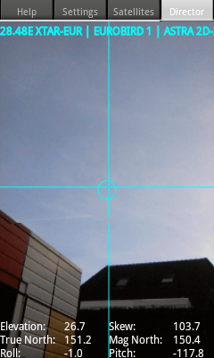

+++
title = "كيف ضبط توجيه طبق الستالايت إلى الأقمار المختلفة باستخدام الهاتف"
date = "2017-07-24"
description = "يعانى الكثير منا من مشاكل ضبط توجيه طبق الستالايت، ودائما ما نستعين بمهندسي الصيانة ليقوموا بهذه المهمة، في هذا الموضوع ستتعرف عزيزي القارئ على طريقة سحرية لضبط الهوائي الخاص بك بنفسك باستخدام هاتفك."
categories = ["مهارات رقمية",]
tags = ["موقع لغة العصر"]

+++

 يعانى الكثير منا من مشاكل ضبط توجيه طبق الستالايت، ودائما ما نستعين بمهندسي الصيانة ليقوموا بهذه المهمة، في هذا الموضوع ستتعرف عزيزي القارئ على طريقة سحرية لضبط الهوائي الخاص بك بنفسك باستخدام هاتفك.

كل ما ستحتاجه هو تحميل تطبيق Satellite Director الموجود على جوجل بلاى ويمكنك تحميله [من هنا](http://play.google.com/store/apps/details?id=zekitez.com.satellitedirector).

كما يجب أن يحتوي هاتفك على مستشعر البوصلة compass والذي يتواجد في أغلب الهواتف.

1. قم بفتح البرنامج لتجد واجهته كما بالصورة:

2. تأكد من فتح ال GPS في هاتفك وإعطاء التطبيق صلاحية استخدامه.

3. اضغط زر Reset GPS وانتظر حتى يتحول اللون إلى الأصفر أو الأخضر.

4. بعد ذلك اضغط على التبويب الثاني "Satellites” واختر القمر الذي تريد التقاطه.

5. يمكنك إيجاد ما تريد بسرعة عن طريق البحث، وكما تري في الصورة التالية يمكنك اختيار القمر المصري Nilesat.

6. بعد ذلك قم بوضع الهاتف أمام ملتقط الإشارة الخاص بالهوائي وقم بالتوجيه كما يظهر لديك بالشاشة حتى يكون شريط الإشارة أسفل الشاشة أخصر اللون.

7. كما يمكنك توجيه الهاتف إلى السماء لمعرفة اتجاه القمر في حالة كنت تقوم بتركيب هوائي لأول مرة.

كما يمكنك زيارة الموقع الرسمي للتطبيق [من هنا](http://home.caiway.nl/~fnijhuis/satdir/index.html) لمعرفة المزيد عنه.

---
هذا الموضوع نٌشر باﻷصل على موقع مجلة لغة العصر.

http://aitmag.ahram.org.eg/News/81906.aspx