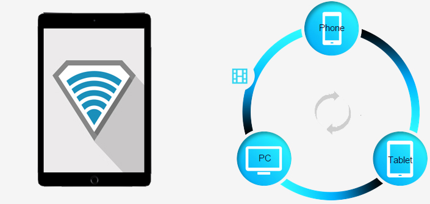
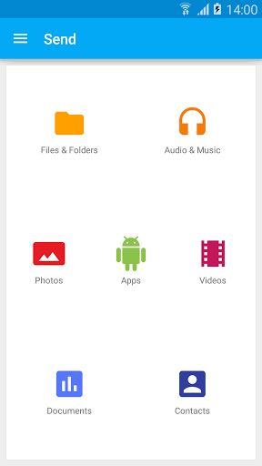
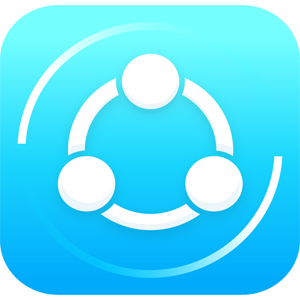
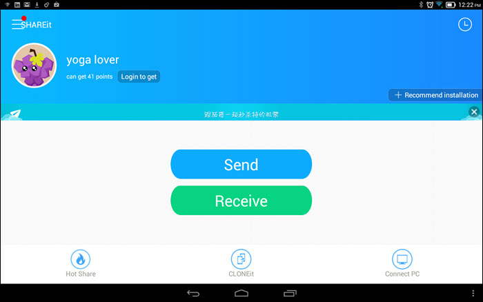
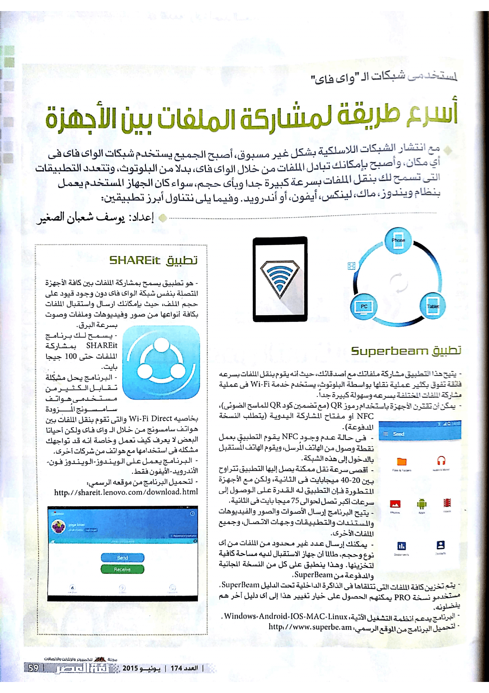

+++
title = "أسرع طريقة لمشاركة الملفات بين الأجهزة المختلفة"
date = "2015-06-01"
description = "كلما تقدمت التكنولوجيا زادت سرعتها، ومع انتشار الشبكات اللاسلكية بشكل غير مسبوق، أصبحنا جميعنا نستخدم شبكات الواي فاي في البيت وفي مقر العمل، وأصبح بإمكانك تبادل الملفات من خلال الواي فاى بدلا من البلوتوث. وتتعدد التطبيقات التي تسمح لك بنقل الملفات بسرعة كبيرة جدا وبأي حجم كان، سواء كان الجهاز المستخدم يعمل بنظام ويندوز، ماك، لينكس، أيفون، أو أندرويد."
categories = ["مهارات رقمية",]
tags = ["مجلة لغة العصر"]

+++

كلما تقدمت التكنولوجيا زادت سرعتها، ومع انتشار الشبكات اللاسلكية بشكل غير مسبوق، أصبحنا جميعنا نستخدم شبكات الواي فاي في البيت وفي مقر العمل، وأصبح بإمكانك تبادل الملفات من خلال الواي فاى بدلا من البلوتوث، وتتعدد التطبيقات التي تسمح لك بنقل الملفات بسرعة كبيرة جدا وبأي حجم كان، سواء كان الجهاز المستخدم يعمل بنظام ويندوز، ماك، لينكس، أيفون، أو أندرويد.

## التطبيق الأول Superbeam

- ​	يتيح لك هذا التطبيق مشاركة ملفاتك مع أصدقائك، حيث انه يقوم بنقل الملفات بسرعه فائقة تفوق بكثير عملية نقلها بواسطة البلوتوث إذ إن التطبيق يستخدم خدمة Wi-Fi في عملية مشاركة الملفات المختلفة بسرعه وسهولة كبيرة جداً.
- ​	الأجهزة يمكن ان تقترن باستخدام رموز QR (مع تضمين كود QR للماسح الضوئي)، NFC أو مفتاح المشاركة اليدوية (يتطلب النسخة المدفوعة).
- ​	في حالة عدم وجود NFC يقوم التطبيق بعمل نقطة وصول من الهاتف المُرسل، ويقوم الهاتف المُستقبل بالدخول إلى هذه الشبكة.
- ​	أقصى سرعة نقل ممكنة يصل إليها التطبيق تتراوح بين 20-40 ميجابايت في الثانية، ولكن مع الأجهزة المتطورة فإن التطبيق قادرة على الوصول إلى سرعات أكبر تصل لحوالي 75 ميجا بايت في الثانية.
- ​	يتيح البرنامج ارسال الأصوات والصور والفيديوهات والمستندات والتطبيقات وجهات الاتصال، وجميع الملفات الأخرى.
- ​	يمكنك إرسال عدد غير محدود من الملفات من أي نوع وحجم، طالما أن جهاز الاستقبال لديه مساحة كافية لتخزينها. وهذا ينطبق على كل من النسخة المجانية والمدفوعة من SuperBeam.
- ​	يتم تخزين كافة الملفات التي تتلقها في الذاكرة الداخلية تحت الدليل SuperBeam. المستخدمين لنسخة PRO يمكنهم الحصول على خيار تغيير هذا إلى أي دليل آخر هم يفضلونه.
- ​	البرنامج يدعم أنظمة التشغيل الآتية: Windows-Android-IOS-MAC-Linux.
- ​	لتحميل البرنامج من الموقع الرسمي: [http://www.superbe.am](http://www.superbe.am/)

## التطبيق الثاني: SHAREit

- ​	هو تطبيق يسمح لك مشاركة الملفات بين كافة الأجهزة المتصلة بنفس شبكة الواي فاي دون وجود لقيود حجم الملف؛ حيث بإمكانك ارسال واستقبال الملفات بكافة أنواعها من صور وفيديوهات وملفات وصوت بسرعة البرق.
- ​	يسمح لك برنامج SHAREit بمشاركة الملفات حتى 100 جيجا بايت.
- ​	البرنامج يحل مشكله تقابل الكثير من مستخدمي هواتف سامسونج حيث هواتف سامسونج تأتي بخاصيه Wi-Fi Direct والتي تقوم بنقل ملفات بين هواتف سامسونج عن طريق واي فاي ولكن أحيانا البعض لا يعرف كيف تعمل وخاصة أنه قد تواجهك مشكله في استخدامها مع هواتف من شركات أخري.
- ​	البرنامج يعمل على الويندوز-الويندوز فون-الأندرويد-الأيفون فقط.
- ​	لتحميل البرنامج من موقعه الرسمي  

[http://shareit.lenovo.com/download.html](http://shareit.lenovo.com/download.html)

---

هذا الموضوع نشر باﻷصل في مجلة لغة العصر العدد 174 شهر 06-2015 ويمكن الإطلاع عليه [هنا](https://drive.google.com/file/d/1zQ9GRUuyW5qzxIzkd9gA9R1EvG1isu5S/view?usp=sharing).

