+++
title = "حواسب المستقبل 1: الأجهزة أحادية اللوحة تعود من جديد"
date = "2018-03-02"
description = "(SBC) Single board Computer أو الحاسب ذو اللوحة الواحدة هو جهاز كمبيوتر كامل مبني على لوحة إلكترونية واحدة، تحتوي على معالج دقيق microprocessor وذاكرة الإدخال والإخراج، وأغلب الإمكانيات الأخرى المطلوبة في أي جهاز كمبيوتر فعال. ويتم استخدام هذه الأجهزة بكثرة كأنظمة تطوير أو كأنظمة تعليمية، أو كـ \"أنظمة مدمجة\" Embedded systems. كما تستخدم أيضا كأجهزة كمبيوتر محمولة، فنظرا لصغر حجمها تستطيع أخذها في جيبك إلى أي مكان."
categories = ["تقارير",]
tags = ["مجلة لغة العصر"]
series = ["حواسب المستقبل"]

+++

(SBC) Single board Computer أو الحاسب ذو اللوحة الواحدة هو جهاز كمبيوتر كامل مبني على لوحة إلكترونية واحدة، تحتوي على معالج دقيق microprocessor وذاكرة الإدخال والإخراج، وأغلب الإمكانيات الأخرى المطلوبة في أي جهاز كمبيوتر فعال. ويتم استخدام هذه الأجهزة بكثرة كأنظمة تطوير أو كأنظمة تعليمية، أو كـ "أنظمة مدمجة" Embedded systems. كما تستخدم أيضا كأجهزة كمبيوتر محمولة، فنظرا لصغر حجمها تستطيع أخذها في جيبك إلى أي مكان.

## تقسيم أجهزة الكمبيوتر من حيث الحجم

كما هو معلوم للجميع، تنقسم أجهزة الكمبيوتر من حيث الحجم إلى:

-   Super Computers:
    هي أجهزة الكمبيوتر الأسرع والأكبر والأكثر تكلفة، وتقوم بعدد ضخم جدا من العمليات في الثانية الواحدة، ويتم استخدامها في المهام المعقدة وخاصة المجالات العلمية والعسكرية، مثل أبحاث الطقس والمفاعلات النووية.

|            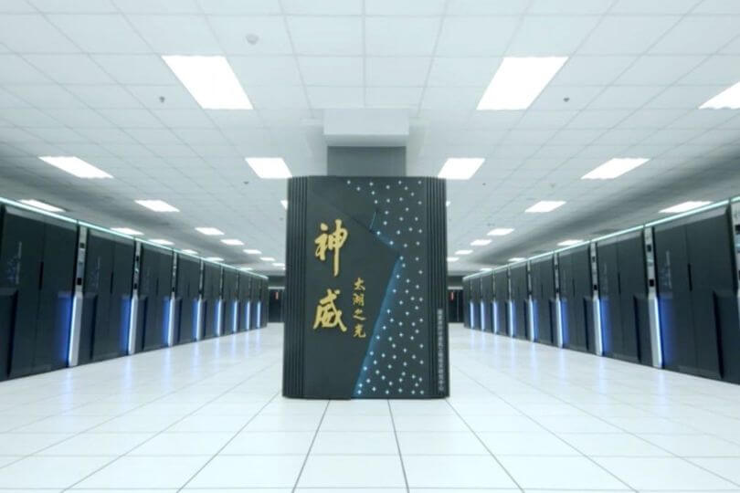             |
| :-----------------------------------------------------: |
| "الصورة لجهاز Sunway TaihuLight أقوي كمبيوتر في العالم” |

-   Mainframe Computers:
    أجهزة الكمبيوتر الضخمة أو متوسطة الحجم، أقل تكلفة من ال Super Computers، والتي غالبا ما تكون متصلة مع بعضها، وتستخدم في المؤسسات الكبيرة، وفى مهام مثل التخزين السحابي وتبادل البيانات الضخمة.

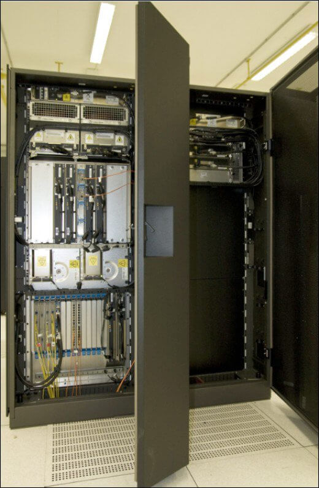

"الصورة لجهاز IBM System z9"

-   Minicomputers:
    هي أجهزة للأغراض العامة، تكلفتها أقل كثيرا من الأنواع السابقة، وتكون قدرات المعالجة بها أقل من أجهزة الـ Mainframe وأكبر من أجهزة الكمبيوتر الشخصية.

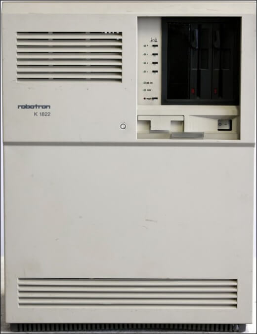

"الصورة لجهاز Prototyp عام 1990”

-   Microcomputers:
    كل أجهزة الكمبيوتر التي نستخدمها نحن الآن، من أجهزة كمبيوتر شخصية أو محمولة تندرج تحت هذا النوع من الكمبيوتر، وتتميز بصغر حجمها وانخفاض تكلفتها، وحاليا تتوافر أجهزة بمواصفات مذهلة مقارنة ببدايات هذا النوع من الكمبيوتر في التسعينيات.

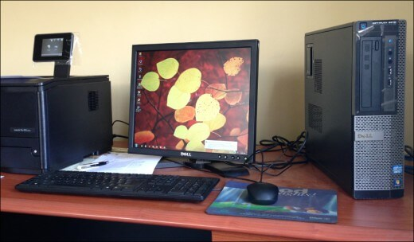

ومع توفر مزيد من التقنيات، تطلع العالم إلى أجهزة كمبيوتر أكثر قوة وأصغر حجما، وكان نتاج هذا الأمر أجهزة الكمبيوتر الواعدة "ذات اللوحة الواحدة"، والتي تندرج تحت قسم ال Microcomputers أيضا، فهي عبارة عن أجهزة تتكون من لوحة إلكترونية واحدة مثبت عليها جميع المكونات، وتكون صغيرة الحجم جدا، في حجم راحة اليد تقريبا أو بطاقة ائتمان أو أصغر!
لكن بخلاف أجهزة الكمبيوتر الشخصية، لا تعتمد أجهزة الكمبيوتر ذات اللوحة الواحدة على منافذ للتوسعة غالبا، فجميع مكوناتها مثل المعالج، والذاكرة العشوائية ومعالج الرسوميات، مدمجه في اللوحة الرئيسية وغير قابلة للترقية كما نفعل في الأجهزة الأخري.
وقد تم بناء هذه الأجهزة اعتمادا على مجموعة واسعة من المعالجات الدقيقة، بتصميمات بسطية، وذاكرة عشوائية "RAM” ثابتة، مما يجعلها منخفضة التكلفة رغم جودتها العالية وأداءها القوي.

## الفرق بين أجهزة الكمبيوتر العادية وذات اللوحة الواحدة

|    **أجهزة الكمبيوتر العادية**    |               **أجهزة الكمبيوتر ذات اللوحة الواحدة**               |
| :-------------------------------: | :----------------------------------------------------------------: |
|          تتكون من وحدات           |                         تتكون من جزء واحد                          |
| مكوناتها قابله للاستبدال والترقية |               مكوناتها لا يمكن استبدالها أو ترقيتها                |
| المعالج غير مدمج مع اللوحة دائما  | تعمل بفكرة "النظام على رقاقة" (المعالج مدمج مع اللوحة الإلكترونية) |
|     غالبا ما تكون غير محمولة      |               يمكنك حملها لأي مكان، أو وضعها في جيبك               |
|        تستهلك طاقة مرتفعة         |                     تستهلك أقل كمية من الطاقة                      |
|            سعرها مرتفع            |                          سعرها منخفض جدا                           |

## بداية الطريق

في شهر مايو من عام 1976 تم ابتكار أول جهاز كمبيوتر ذو لوحة واحدة، "dyna-micro” والذي كان مبنيا على معالج إنتل C8080A، كما استخدم أيضا أول "ذاكرة للقراءة فقط قابلة للبرمجة والمسح EPROM” من إنتل C1702A، ثم أُعيد إنتاجه على يد شركة E&L Instruments تحت اسم MMD-1، فذاعت شهرته كمثال على أجهزة الMicrocomputers، وقد اشتمل جهاز MMD-1 على جميع المكونات مثبته على لوحة إلكترونيه واحدة، بما في ذلك الذاكرة، جهاز الإدخال وحتي الشاشة، فلم يكن هناك أي شيء باستثناء وصلة الكهرباء التي كانت ضرورية بالطبع لتشغيل الجهاز.

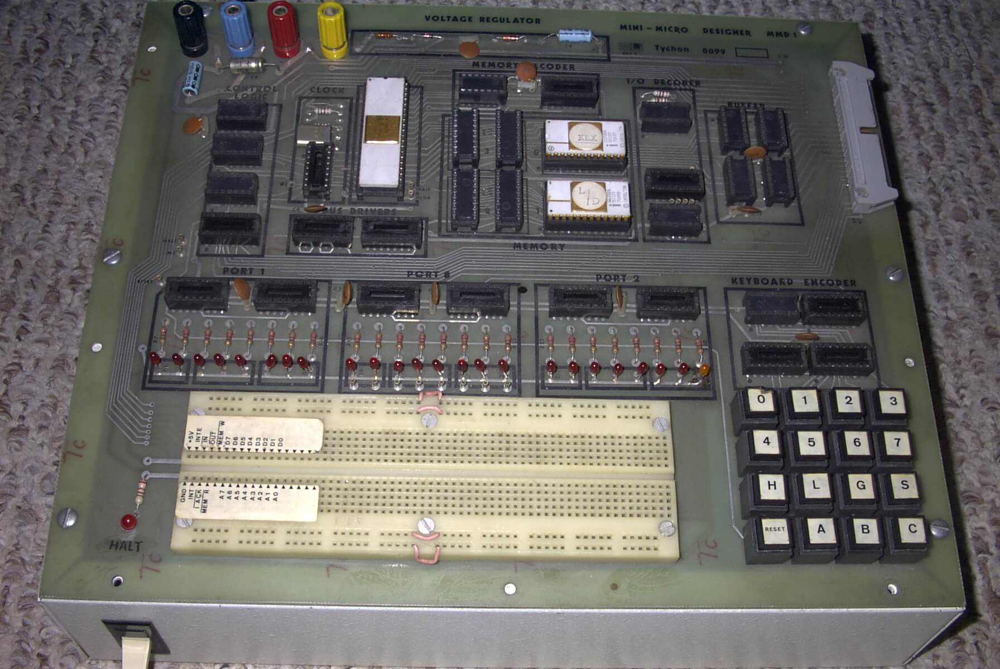

تم بيع العديد من نسخ الجهاز وشحنها إلى أماكن مختلفة، لكن مع بداية انتشار أجهزة الكمبيوتر الشخصية تضاءلت شعبية MMD1 حتي اختفت تماما، فمن الذي قد يرغب بشراء جهاز MMD1 بينما يوجد أمامه العديد من الأجهزة الشخصية التي ستوفر له كل ما يحتاج.

وعلى الرغم من ذلك، ظهر العديد من الأنواع الأخري للأجهزة ذات اللوحة الواحدة خلال الأعوام التالية منها:

-   BBC Micro الذي اعتمد على المعالج MOS Technology 6502A بسرعة 2 ميجا هرتز.
-   Ferguson Big Board II المبني على المعالج Zilog Z80 بسرعة 4 ميجا هرتز.
-   Nascom المبني على نفس المعالج السابق أيضا.

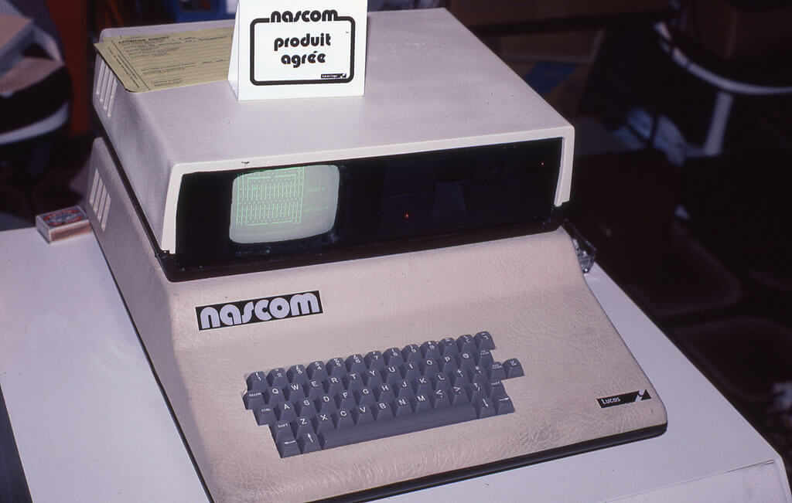

"في الصورة جهاز Nascom 2 الذي تم إنتاجه في 1981”

ومع اكتساح أجهزة الكمبيوتر الشخصية للأسواق، قُدر لأجهزة اللوحة الواحدة الاختفاء تماما، فكانت الأجهزة الشخصية تنقسم مكوناتها إلى اللوحة الأم Motherboard، والمكونات الفرعية مثل المنافذ وموصلات الأقراص الصلبة ومعالج الرسوميات.

## العودة مرة أخرى

-   ولكي يتضح لنا الفصل الحالي من قصة أجهزة الكمبيوتر ذات اللوحة الواحدة لابد لنا من الرجوع إلى عام 2005 وبالتحديد مدينة إفريا بإيطاليا، حيث كان هناك فريق من المطورين يطمحون لإنشاء "منصة تطوير" منخفضة التكلفة، سهلة التحكم، ومبنية على المعالجات الدقيقة، وكان الهدف الأساسي للمشروع هو عمل بيئة تطوير للمتحكمات الدقيقة بصورة مفتوحة المصدر مئة في المئة وتضمن هذا المشروع عمل بيئة تطوير برمجيه للمتحكمات الدقيقة لتمكين الناس من جميع المستويات من الاستفادة منها في مشاريعهم، هذه كانت بداية منصة أردوينو Arduino التي يعرفها الآن كل طلبة ومختصي مجال الإلكترونيات.

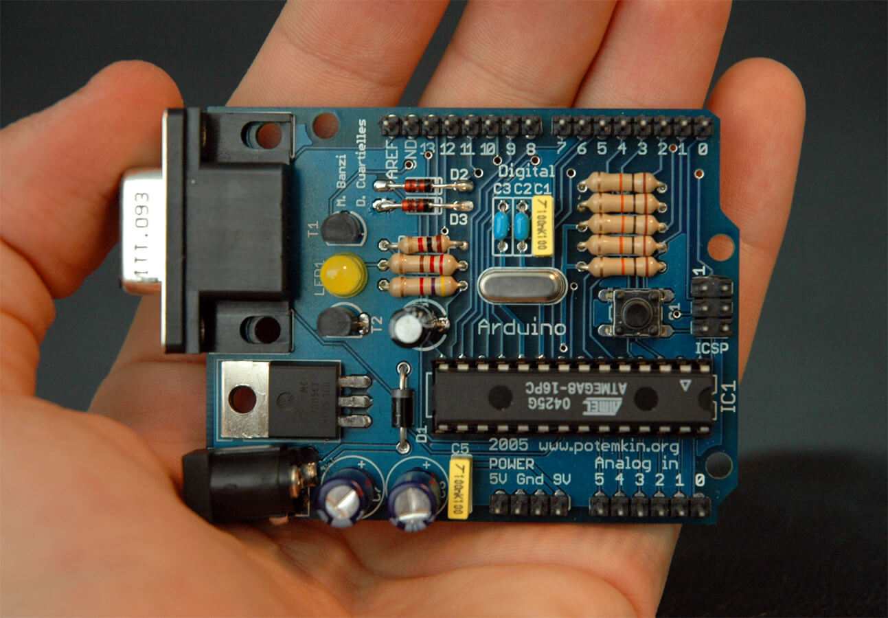

"في الصورة لوحة Arduino RS232 التي صدرت في 2005”

ومع القبول السريع والانتشار الواسع لهذه المنصة النموذجية تم تمهيد الطريق لجيل جديد من المطورين والمصممين المستعدين للدخول في سوق الإلكترونيات، فتم استخدام أردوينو من قبل الطلبة والهواة والمختصين في العديد من الأشياء، والتي كان من أبرزها مشاريع التخرج. وهكذا ظل الإقبال على الأردوينو متزايدا، وانخفضت تكلفة المعالجات الدقيقة و أجهزة الكمبيوتر ذات اللوحة الواحدة حتى أصبحت في متناول اليد.

## الانطلاقة الحقيقية

-   واحدة من محطات التطور الرئيسية التالية هي شهر يوليو 2008، والذي شهد ميلاد مؤسسة غير ربحية تحت اسم BeagleBoard.org التي وُجدت لجلب تقنيات المتحكمات الدقيقة الأحدث إلى أيدي المطورين في صورة جهاز كمبيوتر ذو لوحة واحدة هو BeagleBoard، والذي تميز بكونه مفتوح المصدر تماما ومنخفض التكلفة إلى أقصي درجة فالجهاز كان يستهدف الطلبة وهواة الإلكترونيات في المقام الأول.
-   وكان هذا الجهاز بمثابة الانطلاقة الحقيقة لأجهزة الكمبيوتر ذات اللوحة الواحدة، فاشتمل على معالج ARM Cortex A8 بسرعة 600 ميجا هرتز، وكارت جرافيك يدعم تقنية OpenGL ES 2.0 والرسوم ثلاثية الأبعاد، مما مكن الجهاز من تشغيل الفيديو بدقة HD بدون مشاكل، وليس هذا فحسب فكان هذا الجهاز فعليا أفضل بكثير من أجهزة اللاب توب القديمة، فمع هاردوير مفتوح المصدر ونظام لينكس كانت الوصفة المثالية للنجاح.

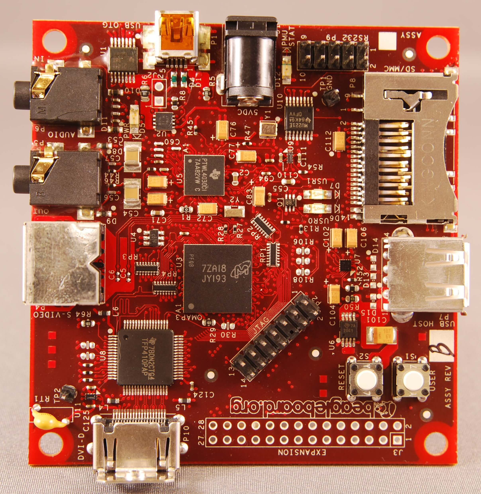

ثم تلى هذا الجهاز العديد من الإصدارات التي جاءت دائما بمزيد من التطوير:

-   BeagleBoard rev.C في مايو 2009.
-   BeagleBoard-xM في سبتمبر 2010.
-   BeagleBone في أكتوبر 2011.
-   BeagleBone Black في أبريل 2013.

وفى 2006، مجموعة من مختبر الكمبيوتر في جامعة كامبريدج قرروا النظر في موضوع الحاجة إلى منصة كمبيوتر منخفضة التكلفة، حيث تهدف إلى السماح للطلاب بتعلم كيفية البرمجة دول الحاجة إلى كمبيوتر منزلي أو شخصي ودون القلق من إمكانية تخريب الجهاز نتيجة التعلم.

فكانت النتيجة جهاز كمبيوتر ذو لوحة واحدة تكلفته 35$ هو Raspberry Pi راسبيري باي، وفى حين أنه قد صمم في البداية للمساعدة في تدريس علوم الحاسب بحيث يدمج ما بين أنظمة لينكس وعلم البرمجة والإلكترونيات وأنظمة التحكم الذكية في ذات الوقت إلا أنه قد نال اهتمام الصناع والمطورين والمصممين والطلاب وحتي المهندسين المحترفين وساعد على إثارة الطفرة الحالية في الاهتمام بأجهزة الكمبيوتر ذات اللوحة الواحدة، مما جعل هذا الحاسوب الصغير يحقق نجاح مذهل في كلا المجالين التعليمي والتطبيقي.

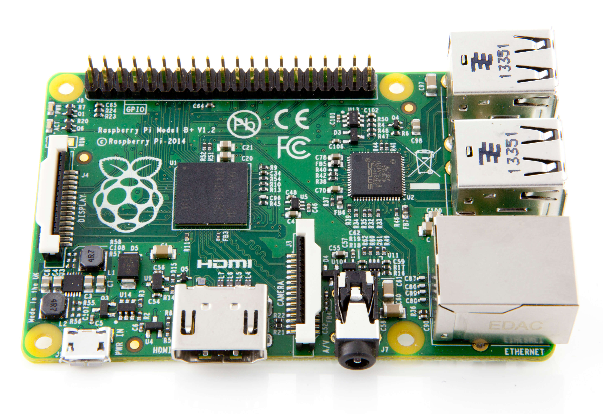

## الحاضر والمستقبل

واليوم، تنهال الطلبات على شراء أجهزة الكمبيوتر ذات اللوحة الواحدة، والتي يبدأ سعرها من 5$، وتتميز بتعدد الأنواع الموجودة وتفاوت إمكانياتها التي تلبي كافة الاحتياجات، من لوحة صغيرة لتعلم البرمجة وحتي جهاز كمبيوتر محمول في حجم كف اليد.
ونظرا للتقدم العظيم للتقنيات، أصبح العديد من أنواع هذه الأجهزة في قوة الكمبيوتر الشخصي أو ربما أفضل ! فمن المنتظر تحقيق مزيد من الإنجازات في هذا الاتجاه من صناعات الكمبيوتر، ذلك لأن الفكرة قد أثبتت جدارتها، فمن كان يتوقع أن فكرة قد بدأت في عام 1976 ستعود مرة أخري بعد 2008 لتحقق قصة نجاح تكتب في التاريخ.

---

هذا الموضوع نُشر باﻷصل في مجلة لغة العصر العدد 207 شهر 03-2018 ويمكن الإطلاع عليه [هنا](https://drive.google.com/file/d/1L2Z49tW6T_h5l6elhcMINPlf6jweLYAg/view?usp=sharing).

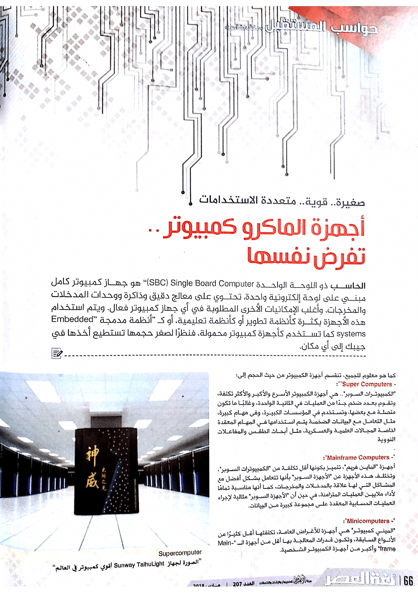

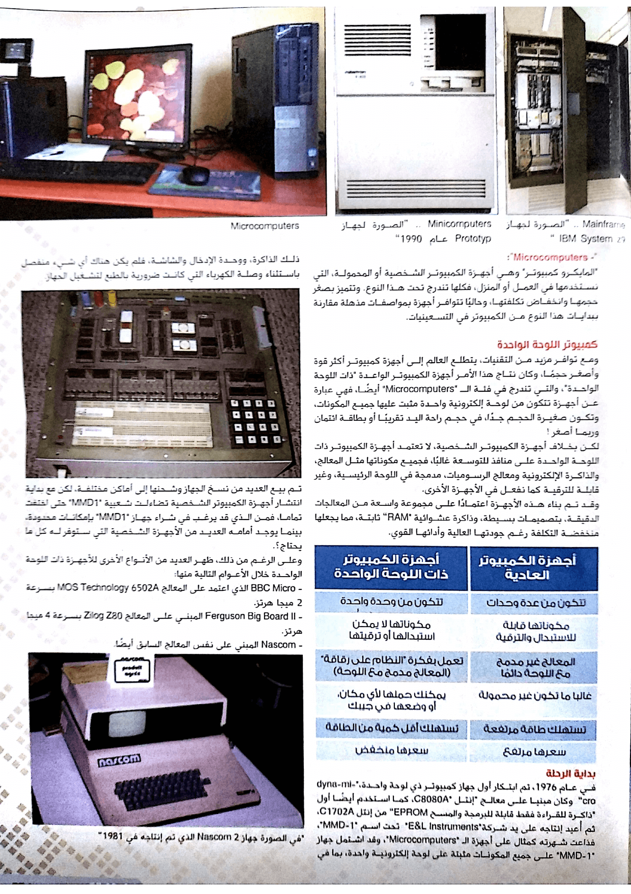

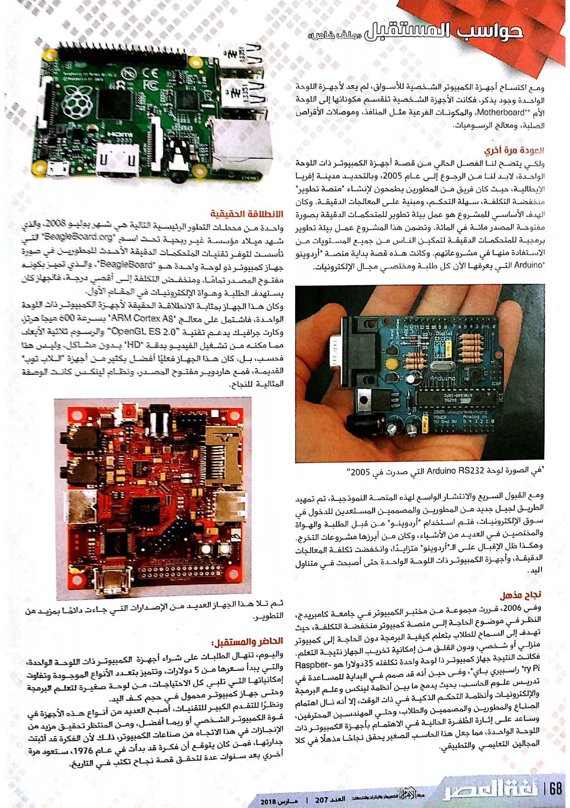
