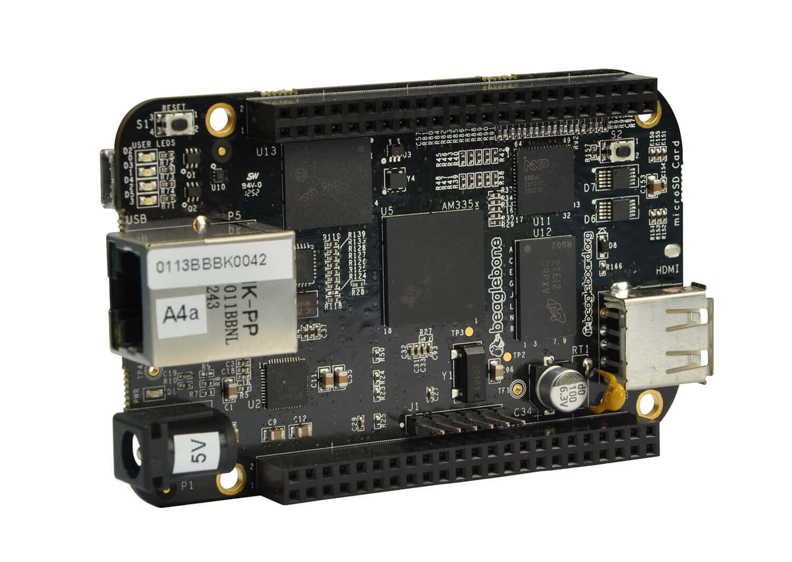

+++
title = "حواسب المستقبل 2: أنواع أجهزة الكمبيوتر أحادية اللوحة واستخداماتها"
date = "2018-03-03"
description = "الكمبيوتر أحادي اللوحة ليس مجرد نوع واحد، في الواقع يوجد العشرات من الموديلات المختلفة والتي يركز كل منها على نقطة محددة، لتوفر للمستخدمين التنوع اللازم لاختيار ما يناسبهم، بدءا من البرمجة وحتي تشغيل الألعاب، لكننا نستطيع تقسيم كل هذه الأنواع إلى عدة أنواع رئيسية."
categories = ["تقارير",]
tags = ["مجلة لغة العصر"]
series = ["حواسب المستقبل"]

+++

من بين العديد من الأجهزة المتاحة، لا يمكن إغفال الدور الهام الذي قامت به لوحتي أردوينو وراسبيري باي بموديلاتهما المختلفة، فهاتان اللوحتان تعتبران من بين أفضل الأدوات التي تبسط مجال الإلكترونيات لغير المتخصصين، بالإضافة إلى أنهما يمكنا المتخصصين من الوصول لبناء مشاريع عالية المستوى بتكاليف بسيطة وفي مدة أسرع، أما راسبيري باي فسوف نتناولها بالتفصيل في موضوع آخر، والآن نحن على موعد مع أردوينو التي أنعشت أجهزة الكمبيوتر ذات اللوحة الواحدة بعد أن ضُربت في مقتل من الأجهزة الشخصية.

Arduino هو كمبيوتر صغير الحجم بإمكانه التفاعل و التحكم في الوسط المحيط به بشكل أفضل من الكومبيوتر المكتبي Desktop. تقنيا هو منصة Platform برمجية مفتوحة المصدر تتكون من متحكم إلكتروني Micro-Controller و بيئة تطويرية تكاملية لكتابة البرمجيات IDE.
قوة الأردوينو تظهر في قدرته الكبيرة على التواصل مع القطع الإلكترونية الأخرى كالمحولات والمستشعرات، والاستفادة منها في الحصول على مختلف البيانات كدرجة الحرارة أو شدة الإضاءة و كذلك فاعليته الكبيرة في التحكم في المحركات ومصابيح LED و كثير من القطع الإلكترونية الأخرى.

ويمكن تشغيل مشاريع الأردوينو عن طريق وصله بالكمبيوتر وجعله يتعامل مع أحد البرامج الموجودة على الجهاز أو بالإمكان تشغيله باستقلالية تامة بعد برمجته، لكن لا يمكن تثبيت نظام تشغيل عليه كما هو الحال مع باقي الأجهزة التي سنذكرها، ذلك لأنه مختص في الأساس بعمل المشاريع بواسطة القطع الإلكترونية وبرمجتها بسهولة.
وبفضل ذلك تتميز الأردوينو بانخفاض سعرها مقارنة بالعديد من الأنواع الأخري، لكن ستحتاج في كثير من إلى شراء مكونات أخري وتركيبها في حالة عملك لمشاريع أكثر تعقيدا.

الموقع الرسمي لأردوينو: https://www.arduino.cc/

أما باقي الأنواع المتاحة للشراء حاليا يمكن تقسيمها بأكثر من طريقة:

## أولا: من حيث الأنواع

هناك أربعة أنواع رئيسية لأجهزة الكمبيوتر ذات اللوحة الواحدة هي:

### 1- لوحات التطوير Development Board

هو النوع الأكثر شهرة، بسبب شغف العديد من هواة ومحترفي الإلكترونيات به وانتشاره في كل أنحاء العالم، فهو يستخدم في العديد من المشروعات كما أوضحت في السطور السابقة، فهذا النوع من الأجهزة يتميز بانخفاض تكلفته وأغلبه مفتوح المصدر مما يوفر بيئة خصبة للتطوير وعمل المشروعات المتقدمة.
ومن أشهر أجهزة هذا النوع: Arduino - Raspberry Pi - BeagleBone Black - Intel Galileo

### 2- أجهزة SOM (النظام على وحدة)

System-on-module (SOM) أو أجهزة "النظام على وحدة" هي لوحات إلكترونيه تدمج وظيفة من وظائف الناظم في وحدة Module واحدة، بطريقة تشابه تقسيم العلميات في جسم الإنسان، فكل نظام له مهمة خاصة به لا يقوم بها غيره. وتعد هذه الأجهزة تطبيق نموذجي في مجال الأنظمة المدمجة Embedded systems، فهي تؤدي وظيفة خاصة بسبب كونها وحدة متكاملة من المكونات مدمجة معا بمستوي عالى من الدقة.
وهذه الأجهزة ليست "أنظمة مدمجة" كاملة فهي تحتاج إلى قاعدة أخري لتكمل دورها كجهاز كمبيوتر كامل الوظائف، وبالتالي فهي تستخدم في مجالات متقدمة مثل إنترنت الأشياء، وأجهزة الشبكة، والأجهزة الطبية.

ومن أمثلة هذه الأجهزة: المتحكمات الدقيقة Microcontrollers – المعالجات الدقيقة Microprocessors – بعض أنواع الذاكرة مثل Flash memory

### 3- أجهزة Stick PC:

هي جهاز الكمبيوتر كاملا في مفتاح صغير في حجم ال USB أو أكبر قليلا، يحتوي على منفذ HDMI لتوصيله مباشرة بالشاشة مع وجود عدد من منافذ ال USB لتوصيل الماوس ولوحة المفاتيح بالجهاز، وبمجرد توصيله يمكنك استخدامه كأي جهاز كمبيوتر مكتبي يعمل بظام ويندوز.
من هذه الأجهزة: Intel Compute Stick - Azulle Quantum Access LAN PC Stick - Lenovo Ideacentre Stick 300

### 4- الأنظمة المدمجة Embedded Computer

هو أي نظام كمبيوتر متخصص يتم تنفيذه كجزء من جهاز أكبر أو نظام ذكي، ويؤدي فقط وظائف خارجية (مثل التوجيه أو الأمن) ولكن لا يؤدي وظيفة معالجة البيانات.
ويظهر دورها بوضوح في مجال إنترنت الأشياء، بما يتيح الاتصالات بين الآلات والأشخاص والأماكن والأشياء والسحابة.

## ثانيا: من حيث المميزات

### توافر الكود المصدري

#### 1- مفتوحة المصدر

في هذا النوع يملك مستخدم الكمبيوتر أحادي اللوحة الوصول إلى كل من تصميم الهاردوير وتخطيطه، الوصول إلى الكود المصدري المستخدم في اللوحة، وكذلك البرامج الثابتة Firmware الخاصة بالجهاز. وهذا هو المثالي لكل من يرغب في تعلم التعامل مع الإلكترونيات وعلوم الحاسب والبرمجة، لأنه مع توافر كل ما سبق ذكره يمكنك بسهولة أن تفهم كيف تعمل البرمجيات والأجهزة، وكيف يمكن تعديلها لتلائم متطلبات التصميم، أو ببساطة معرف كيف تعمل قطعة معينة من الجهاز.
مثل: Raspberry Pi - Orange Pi - BeagleBone Black

#### 2- مغلقة المصدر

ومن ناحية أخري، الأنواع مغلقة المصدر قد تم تصميمها كمنتج نهائي أو كمرجع يتم تقييمه، فغالبا ما يتم استخدامها كمنتج تجاري وليس في أغراض تعليمية.
مثل: Asus Chromebit - Lenovo Ideacentre Stick

### معمارية المعالج

أجهزة الكمبيوتر ذات اللوحة الواحدة المتاحة حاليا تأتي بتشكيلة متنوعة من المعالجات، أغلبها يكون معالج الرسوميات مدمجا مع اللوحة الرئيسية.

#### 1- معالجات ARM

وهي الأكثر استخداما وشهرة، لرخص ثمنها، وتوفيرها للطاقة مع الحصول على أداء مقبول، وستجدها تقريبا في 90% من أجهزة الكمبيوتر ذات اللوحة الواحدة، وتدعم أنظمة لينكس وأندرويد ومايكروسوفت ويندوز 10 نسخة إنترنت الأشياء فقط، مما يعني أنه لا تستطيع استخدام نسخة ويندوز التقليدية عليها، لكن ستستطيع تشغيل عدد كبير من توزيعات لينكس عليها مثل Ubuntu, Fedora, Android, Debian وArch Linux وأيضا FreeBSD.
وهنا سنجد العديد من الشركات المزودة للمعالجات مثل Rockchip - (Samsung Exynos) - Allwinner - HiSilicon (Kirin) - Qualcomm (Snapdragon) - Broadcom - Freescale
ومن أمثلة هذا النوع من الأجهزة Raspberry Pi - PINE A64 - Banana Pi

#### 2- معالجات X86

وهى نفس معالجات 32 بت الموجودة في أجهزة الكمبيوتر الشخصي، مما يعني أنه يمكنك تشغيل ويندوز والبرامج المعروفة كما تريد، إلى جانب توزيعات لينكس المختلفة وأندرويد أيضا، حيث أنها تضمن لك مزيدا من الأداء في مقابل ارتفاع الثمن والطاقة المستهلكة.
وبالطبع ستكون هذه المعالجات من إنتاج أحد العملاقين Intel أو AMD.
مثل: UDOO X86 - Intel Galileo Gen 2 - Asus Chromebit

### الغرض منها

#### 1- الأغراض التعليمية

هناك العديد من أجهزة الكمبيوتر ذات اللوحة الواحدة التي وجدت في الأساس لتبسيط علوم الكمبيوتر والبرمجة للطلبة، مثل BeagleBone Black - Raspberry Pi
وهذه الأجهزة يمكنك الإطلاع على كل ما يخصها من ملفات ومستندات التوثيق والشرح إلى جانب الكود المصدري وتوافر دعم كبير جدا من المجتمع، وعدد كبير من المشروعات التي تم إنجازها بواسطة هذه الأجهزة.

#### 2- الأغراض التجارية

وهناك أيضا عدد غير قليل من الأجهزة التي تستهدف المستخدم العادي كمنتج تجاري، ولعل أبزر الأجهزة في هذا النوع هي أجهزة Stick PC التي سبق وذكرتها بالأعلى.

استخدامات أجهزة الكمبيوتر ذات اللوحة الواحدة:
بعد انفجار فقاعة الRaspberry Pi بالأخص شهد العالم موجة كبيرة من التفاعل تراوحت بين الإعجاب بالفكرة إلى المساهمة في دعمها وحتي استخدامها في العديد المشاريع التي تفاجأ حتى مصنعي الجهاز منها، فمدي تنوع الابتكارات والإبداعات كان مفاجئا للجميع.
وحاليا يتم استخدام هذه الأجهزة في العديد من الأمور، أذكر لك منها:

-   جهاز كمبيوتر محمول يمكنك أخذه في جيبك لأي مكان، فهي تعمل كأي جهاز كمبيوتر تقليدي تستطيع من خلاله تصفح الإنترنت وإرسال البريد الإلكتروني وحتى تحرير الملفات.

-   تحويل أي تلفاز عندك إلى نظام ترفيه منزلي أو Smart TV متصل بالإنترنت حتي لو كان قديما.

-   استخدامها في عمل مشروعات بواسطة القطع الإلكترونية كبديل متطور عن المتحكمات الدقيقة، مثل نظم التحكم الخاصة بالمنازل الذكية والروبوتات والغواصات وكذلك الطائرات بدون طيار، وعمل تطبيقات المراقبة مثل عمل كاميرات لبث الفيديو والصور عن بعد.

-   تعلم البرمجة من خلالها وخاصة لغات مثل Python, Java وC++ بدون الحاجة لكمبيوتر مكلف.
-   استخدامها كخادم Server يعمل بنظام لينكس.

-   حماية وتشفير اتصالك بالإنترنت في كامل شبكتك عبر تور أو حجب جميع الإعلانات عن الأجهزة المتصل بشبكتك.
-   المراقبة الأبوية والتحكم في الوصول لمواقع الإنترنت وعرض سجل الزيارات.
-   والعديد من المشروعات والاستخدامات الكثيرة التي لا يتسع المجال لذكرها.

والآن قد اتضحت لك الصورة عزيزي القارئ، هناك العديد من الأنواع المختلفة التي تستهدف فئة معينة من الناس، أغلبها منخفض التكلفة وقابل للتعديل والاستخدام في العديد من الأمور، فمع جهاز في حجم كف اليد يستطيع الطلاب تعلم الإلكترونيات والبرمجة بدون الحاجة لاستخدام كمبيوتر شخصي، كما يستطيعون عمل أكثر من ذلك من روبوتات ومشاريع عملاقة. وبالتأكيد مثل هذه الأجهزة ستساهم في زيادة المعرفة التكنولوجية لدي الطلاب وتجعلهم دائما مستعدين ومتطلعين لمزيد من التقدم التقني.

---

هذا الموضوع نُشر باﻷصل في مجلة لغة العصر العدد 207 شهر 03-2018 ويمكن الإطلاع عليه [هنا](https://drive.google.com/file/d/1L2Z49tW6T_h5l6elhcMINPlf6jweLYAg/view?usp=sharing).

