+++
title = "حواسب المستقبل 3: دليلك الشامل لشراء جهاز كمبيوتر أحادي اللوحة"
date = "2018-03-04"
description = "عزيزي القارئ، هل نالت هذه الأجهزة اهتمامك؟ ولم لا، وهي قد نالت اهتمام الملايين من الهواة والمحترفين حول العالم، في السطور التالية سنتعرف على العديد من الأنواع ومواصفاتها وأسعارها المختلفة لتحديد أي هذه الأجهزة هو المناسب لك حتي تكتمل لديك الصورة قبل اتخاذ قرار الشراء."
categories = ["تقارير",]
tags = ["مجلة لغة العصر"]
images = ["images/harrison-broadbent-1mu9gF8OhNk-unsplash.jpg"]
series = ["حواسب المستقبل"]

+++
عزيزي القارئ، هل نالت هذه الأجهزة اهتمامك؟ ولم لا، وهي قد نالت اهتمام الملايين من الهواة والمحترفين حول العالم، في السطور التالية سنتعرف على العديد من الأنواع ومواصفاتها وأسعارها المختلفة لتحديد أي هذه الأجهزة هو المناسب لك حتي تكتمل لديك الصورة قبل اتخاذ قرار الشراء.

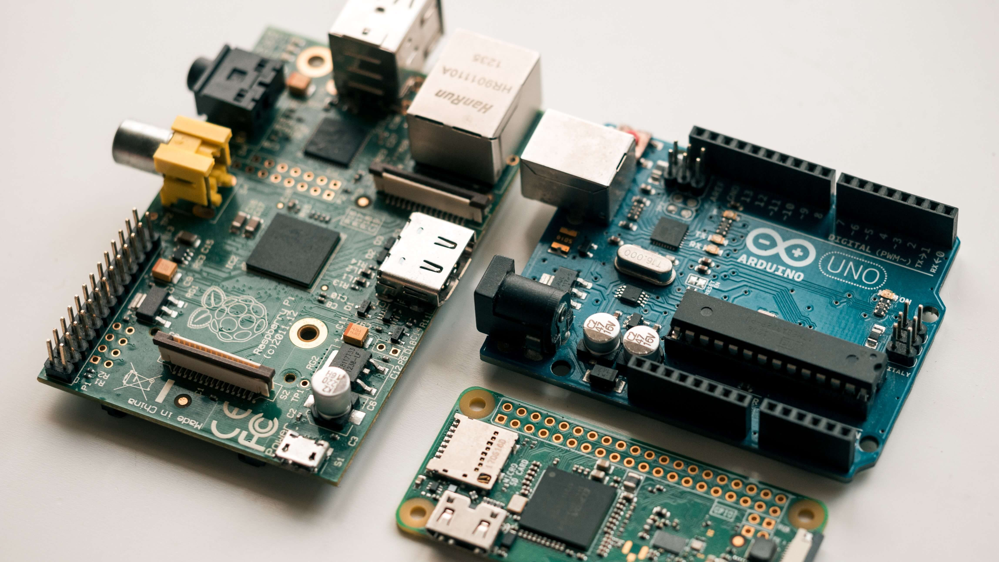

لعل ما يميز أجهزة الSBC عن غيرها هو الثمن فبعض الأنواع يبدأ سعرها من 5$ وتتفاوت الأسعار بعد ذلك وصولا إلى حاجز ال 400$ تقريبا، كما يميزها أيضا التنوع فستجد جميع العديد من المواصفات المتاحة مع تشكيلة كبيرة من المعالجات المختلفة وتنوع في حجم الذاكرة العشوائية وعدد المنافذ، والعديد من المواصفات الأخري.

للأسف الشديد لا يتوفر العديد من أنواع هذه الأجهزة في مصر، لكنك ستجد أغلب الأنواع الشهيرة مثل Raspberry Pi وArduino وOrangePi، وهذا يتيح الفرصة لمن يرغب في شراء أي من هذه الأجهزة، رغم ارتفاع سعرها نسبيا هنا مقارنة بالأسعار العالمية، لكن العديد من الناس لا يحبذ فكرة الشراء من الخارج.

ومن ناحية أخري، أعتقد شخصيا أن القرار الأفضل هو شراء احدي هذه الأجهزة من الخارج، فستجد العديد من الأسعار لنفس المنتج عليك اختيار الأفضل منها لكن يجب عليك دائما الانتباه إلى تقييم التاجر وعدد المبيعات، كما ستجد أغلب الأنواع متاحة للشراء إن لم يكن جميعها، فكل ما تحتاج إليه هو فيزا إنترنت من أي بنك ثم إيداع المبلغ بالجنيه المصري ثم الشراء.

وإليك عدد من المواقع التي يمكنك الشراء منها:

- www.aliexpress.com
- www.amazon.com
- www.ebay.com
- www.gearbest.com
- www.geekbuying.com
- www.lightinthebox.com
- www.tinydeal.com
- www.tomtop.com

والآن دعونا نتعرف على أفضل الأجهزة المتاحة للشراء:

## Banana Pi M3 ومعالج ثماني النواة

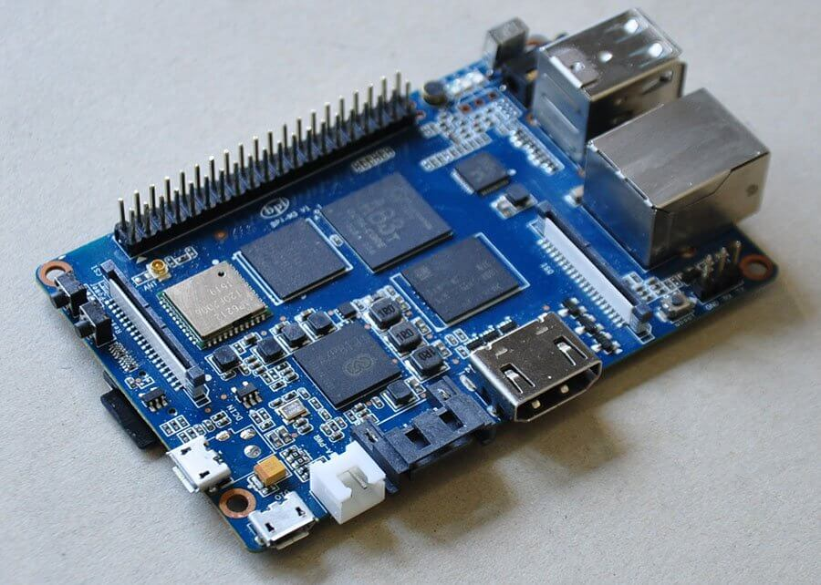

Banana Pi هي سلسلة من الأجهزة أحادية اللوحة في حجم بطاقة ائتمان أو كارت شخصي، مبنية بغرض خفض التكلفة للبرامج الداخلية وتطوير الأجهزة وتعليم البرمجيات في المدارس.

تصميمها مستوحي من جهاز Raspberry Pi، ويتم تصنيعها بواسطة شركة Shenzhen SINOVOIP Co.,Ltd الصينية.

تتميز أجهزة Banana Pi بالتوافق التام مع برمجيات Raspberry Pi وبالتالي فهي تستطيع تشغيل عدد كبير من أنظمة التشغيل مثل Ubuntu – Raspbian – Debian – Arch Linux – Android – NetBSD ويرجع ذلك إلى توافق المعالج مع معمارية بناء أنظمة لينكس “armhf”.

وتستخدم أجهزة Banana Pi معالجات Allwinner بمعمارية ARM، وهي أجهزة مفتوحة المصدر بالكامل.

ومن بين أنواع Banana Pi المختلفة لا يمكننا أن نغفل عن Banana Pi M3 التي تأتي بميزتين يتفوقا على العديد من أقرانها من الأجهزة، الأولي هي وجود معالج ثماني النواة ARM Cortex-A7 Octa-core بسرعة 2 GHz، والثانية هي وجود منفذ SATA لتوصيل الهارد ديسك مباشرة بالجهاز.

أما المواصفات الأخري فهي ذاكرة 2GB من نوع LPDDR3 SDRAM ومساحة تخزين داخلية 8 جيجا بايت، مع 40 منفذ GPIO لدعم توصيل المكونات الإلكترونية، منفذ HDMI 1.4 لتوصيل الجهاز بالشاشة مع دعم حتي دقة شاشة 1920x1080 ومنفذ لبطاقة الذاكرة Micro SD-Card وكارت شبكة وWi-Fi بمعيار802.11 b/g/n وبلوتوث 4.0، كما يوجد أيضا 2 منفذ USB ومستشعرIR Receiver.

وتتوافر العديد من الإمكانيات الأخري مثل دعم توصيل كاميرا مباشرة، ووجود ميكروفون مدمج بالجهاز مع مخرج صوت 3.5 مم، وتوجد ثلاث أزرار للتحكم في الطاقة، ويمكن تشغيل الجهاز إما عن طريق منفذ الطاقة أو منفذ ال Micro USB.

أبعاد الجهاز هي 92mm x 60mm وحجمه 45 جرام.

الموقع الرسمي: http://www.banana-pi.org/m3.html

فيديو: https://www.youtube.com/watch?v=foxnnQT58FE

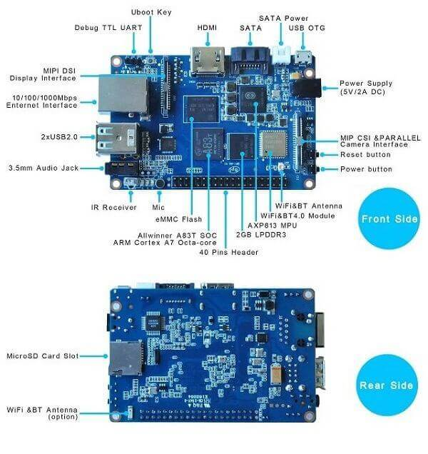

المواصفات الفنية:

| **المعالج** | A83T ARM Cortex-A7 ثماني النواة |
| --------------------------- | ------------------------------------------------------------ |
| **الذاكرة** | 2GB من نوع LPDDR3 مشتركة مع ال GPU |
| **معالج الرسوميات** | PowerVR SGX544MP1 يدعم كلا من OpenGL ES 2.0, OpenCL 1.x, DX 9_3 |
| **التخزين** | مساحة داخلية 8 جيجا بايت ودعم لكروت الذاكرة حتي 64 جيجا بايت، ووجود منفذ SATA 2.0 يدعم حتي 2 تيرا بايت |
| **منافذ** **USB** | منفذين من نوع USB 2.0 ومنفذ واحدMicro USB |
| **دعم الشبكة** | منفذ Ethernet 10/100/1000Mbps (Realtek RTL8211E/D) دعم WiFi 802.11 b/g/n دعم بلوتوث 4.0 |
| **دعم** **GPIO** | يوجد40 Pin GPIO, UART, I2C bus, I2S bus, SPI bus, PWN, +3.3v, +5v, ground |
| **المميزات** | المعالج ثماني النواة يقدم للمستخدم أداء جيد جدا، ووجود منفذ SATA يتيح توصيل أي هارد ديسك بسهولة، مع توفر مساحة داخلية 8 جيجا لاستخدام الجهاز كما تريد |
| **العيوب** | المعالج من نوع ARMv7-A والذي يعتبر قديما نوعا ما هذه الأيام |
| **السعر** | 74 دولار أمريكي |

## HiKey 960

3 جيجا ذاكرة عشوائية و 2 منفذ USB 3.0

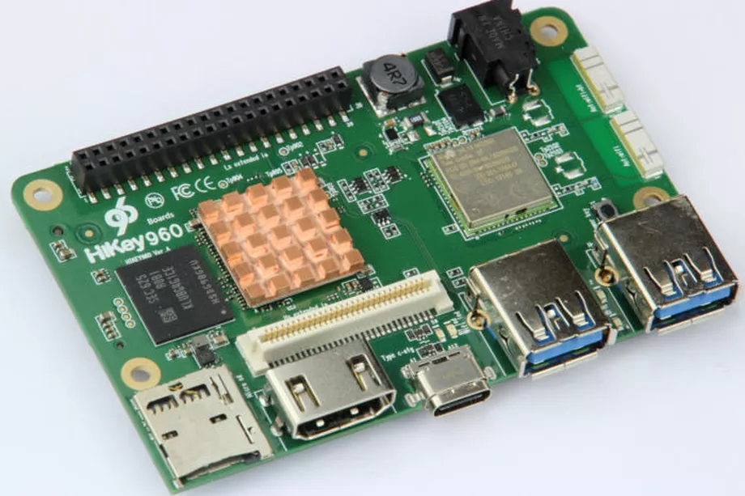

HiKey 960 هي لوحة تطوير مبنية على معالج Huawei Kirin 960 ثماني النواة بمعمارية ARM، ويتكون المعالج من 4 أنوية كبيرة ARM Cortex-A73 بسرعة 2.3 GHz و4 أنوية صغيرةCortex-A53 بسرعة تصل إلى 1.8 GHz. مع توفر 3 جيجا من الذاكرة من نوع LPDDR4 SDRAM ومساحة داخلية 32 جيجا بايت من نوع UFS 2.0 ومعالج رسوميات Mali G71 MP8 تصل سرعته إلى 900 ميجا هرتز.

كما تحتوي اللوحة على 2 منفذ USB 3.0 type A ومنفذ USB 2.0 type C OTG، ومنفذ MicroSD card يدعم كروت الذاكرة حتي 265GB وبالطبع منفذ HDMI 1.4 لتوصيلها بالشاشة، إضافة إلى دعم Wi-Fi بترددات 2.4 GHz و 5 GHz، وبلوتوث إصدار 4.1، كما يوجد كذلك زر للتحكم في الطاقة.

تستهدف هذه اللوحة مطوري نظام أندرويد، فهي تأتي مثبتا عليها النسخة الخام من نظام أندرويد AOSP مع نواة لينكس إصدار 4.4، وهي تدعم بالطبع تشغيل العديد من توزيعات لينكس.

أبعاد الجهاز هي 85mm x 55mm x 9mm ووزنه 60 جرام.

الموقع الرسمي: https://www.96boards.org/product/hikey960/

فيديو: https://www.youtube.com/watch?v=sOR8PbEu27g

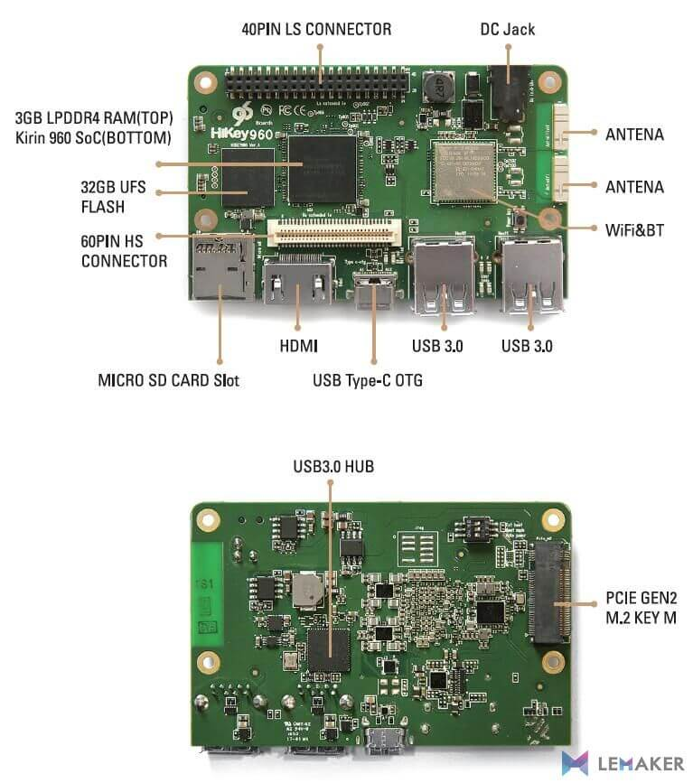

| **المعالج** | Kirin 960 ثماني النواة |
| --------------------------- | ------------------------------------------------------------ |
| **الذاكرة** | 3GB من نوع LPDDR4 SDRAM |
| **معالج الرسوميات** | Mali G71 MP8 بسرعة تصل إلى 900 ميجا هرتز |
| **التخزين** | 32GB من نوع2.0 UFS ومنفذ MicroSD card 3.0 |
| **منافذ** **USB** | منفذين من نوع USB 3.0 ومنفذ واحدMicro USB 2.0 Type C |
| **دعم الشبكة** | دعم WiFi 802.11 b/g/n دعم بلوتوث 4.1 |
| **دعم** **GPIO** | يوجد 40 pin للتوسعة بسرعة منخفضة +1.8V, +5V, DC power, GND, 2UART, 2I2C, SPI, I2S, 12xGPIO و60 pin للتوسعة بسرعة عالية 4L-MIPI DSI, I2C x2, SPI (48M), USB 2.0, 2L+4LMIPI CSI |
| **المميزات** | مع معالج ثماني النواة وذاكرة 32 جيجا بايت ستحصل على جهاز كمبيوتر أصغر من راحة اليد بمواصفات جبارة، مما يمكنك من تشغيل مقاطع الفيديو بدقة 4K بدون أي مشاكل، إلى جانب أي استخدام آخر للجهاز |
| **العيوب** | لا يوجد منفذ Ethernet – لا يوجد ميكروفون – لا يوجد مخرج صوت خارجي كما أن سعر الجهاز مرتفع مقارنة بالأجهزة الأخري |
| **السعر** | 239 دولار أمريكي |

## Intel Compute Stick

كمبيوتر كامل في حجم مفتاح USB

قدمت إنتل أول جهاز StickPC في مارس 2015، ومنذ ذلك الوقت تواصل الشركة إصدار العديد من الأنواع المختلفة لهذه الأجهزة، أحد هذه الأجهزة المميزة هو Intel Compute Stick CS125

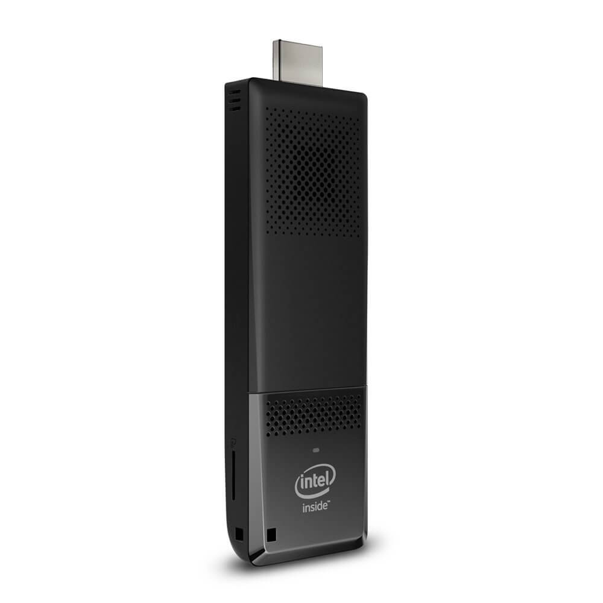

وهو جهاز كمبيوتر كامل من شركة إنتل، ورغم أنه في حجم مفتاح ال USB إلا أنه يقدم للمستخدم إمكانيات مدهشة، فهو يأتي بمعالج Intel Atom x5-Z8300 رباعي النواة بسرعة 1.44 GHz وتصل إلى 1.84 GHz، ويحتوي على معالج رسوميات Intel HD Graphics وذاكرة بحجم 2 جيجا من نوع DDR3L-1600 ومساحة تخزين 32 جيجا بايت، مع دعم بطاقات الذاكرة حتي 64 جيجا بايت.

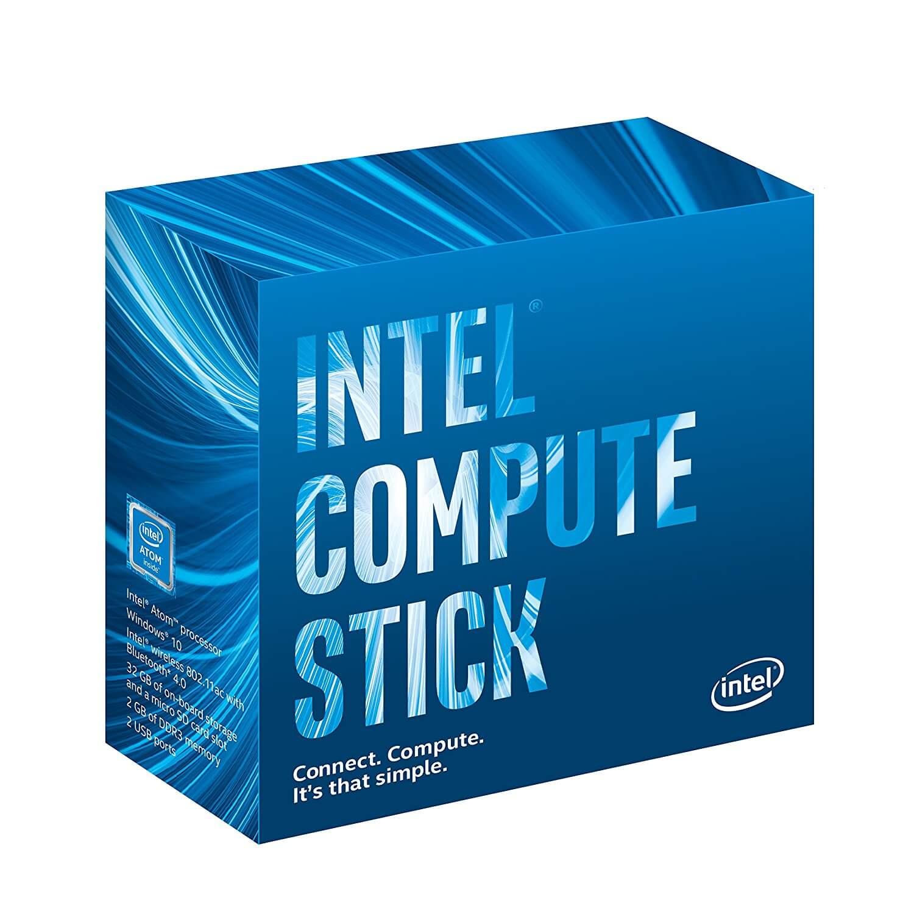

يأتي هذا الجهاز بالعديد من المنافذ رغم صغر حجمه، حيث يحتوي على منفذ HDMI 1.4b لتوصيل الجهاز بالشاشة و2 منفذ USB أحداهما الإصدار 2.0 والآخر 3.0، ومنفذ لإضافة بطاقة الذاكرة، إضافة إلى دعم الجهاز للWi-Fi عن طريق Intel Wireless-AC 7265 وبلوتوث 4.0.

هذا ويأتي هذا الجهاز الصغير ببعض تقنيات إنتل مثل Intel Virtualization Technology (VT-x) وIntel Platform Trust Technology (Intel PTT)
ويعد هذا الجهاز أحد أفضل الخيارات المتاحة للمستخدم الذي يبحث عن جهاز ذو لوحة واحدة يدعم ويندوز 10 وفى نفس الوقت صغير الحجم جدا وسهل حمله إلى أي مكان.

الموقع الرسمي:
https://ark.intel.com/products/91065/Intel-Compute-Stick-STK1AW32SC

فيديو: https://www.intel.com/content/www/us/en/compute-stick/intel-computestick-introduction-video.html
https://www.youtube.com/watch?v=rKt5oqWVJsM

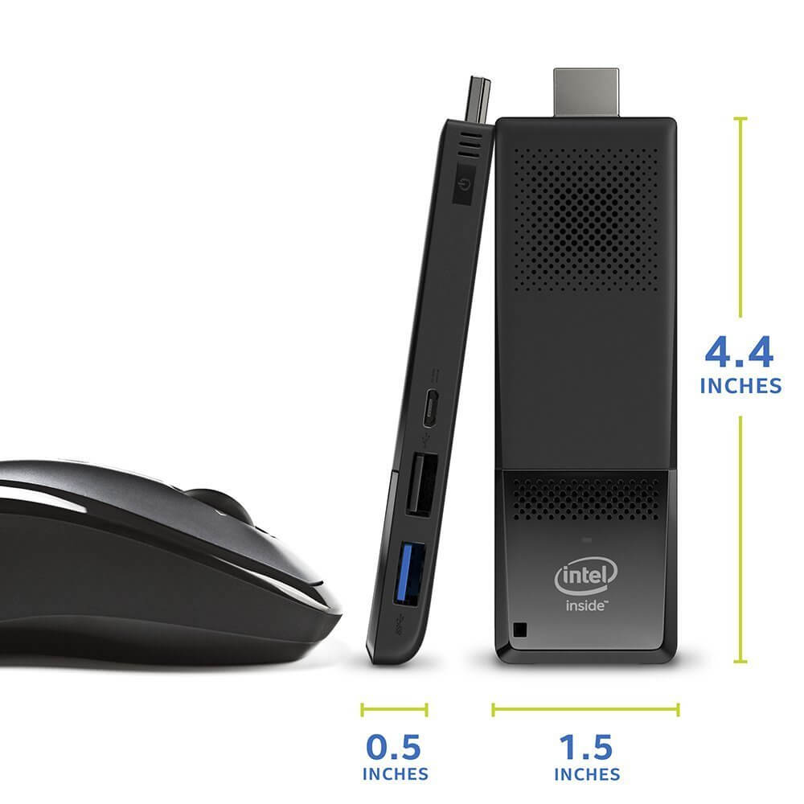

| **المعالج** | Intel Atom x5-Z8300 رباعي النواة بسرعة 1.44 GHz |
| --------------------------- | ------------------------------------------------------------ |
| **الذاكرة** | 2 جيجا من نوع DDR3L-1600 |
| **معالج الرسوميات** | Intel HD Graphics |
| **التخزين** | 32 جيجا بايت مساحة داخلية، مع دعم بطاقات الذاكرة حتي 64 جيجا بايت |
| **منافذ** **USB** | منفذ USB 2.0 ومنفذ USB 3.0 |
| **دعم الشبكة** | لا يوجد منفذ Ethernet دعم WiFi 802.11 b/g/n دعم بلوتوث 4.0 |
| **دعم** **GPIO** | لا يوجد |
| **المميزات** | حجم صغير للغاية يمكن حمله لأي مكان تعمل بنظام ويندوز 10 مما يجعلها مناسبة للمستخدم العادي |
| **العيوب** | أداء ضعيف في بعض الأحيان عند تشغيل العديد من البرامج لا توجد منافذ كافية |
| **السعر** | 150 دولار أمريكي |

## LattePanda

جهاز كمبيوتر ويندوز 10 بمواصفات مدهشة

الشركة المبتدئة LattePanda قد صنعت جهاز كمبيوتر ذو لوحة واحدة مدهش المواصفات يعمل بويندوز 10 النسخة الكاملة مثله مثل أي جهاز كمبيوتر تقليدي، متوافق مع كل المكونات المعروفة التي تعمل على جهاز الكمبيوتر المكتبي أو المحمول مثل الطابعات والكاميرات وحتي عصا التحكم. ومما يميز هذا الجهاز عن غيره هو استهلاك الطاقة المنخفض باعتباره جهاز كمبيوتر يعمل بويندوز، فهو يحتاج فقط شاحن USB تقليدي ليعمل بكفاءة عالية، في حين أن أجهزة الكمبيوتر العادية تحتاج من 2-3 أمبير لتعمل.

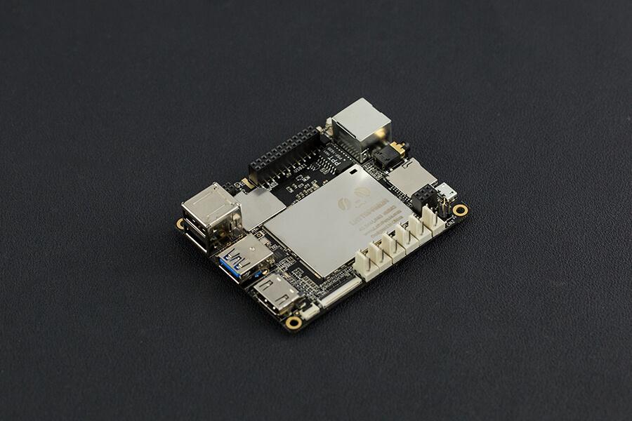

ومع وجود ويندوز كنظام رئيسي لهذا الجهاز فهو يُمكن المطورين من التعامل مع أغلب اللغات البرمجية وأدواتها المختلفة، وليس هذا فقط فجهازLattePanda يوجد به معالج مساعد متوافق مع Arduino وبالتالي تستطيع استخدامه كأي لوحة Arduino تماما للتحكم في المكونات الإلكترونية المختلفة.

يأتي الجهاز بمعالج Intel Z8350 رباعي النواة بسرعة 1.8GHz ومعالج رسوميات Intel HD Graphics بسرعة تصل إلى 500MHz وذاكرة 4 جيجا من نوع DDR3L.

أما مساحة التحزين الداخلية فهي 64 جيجا بايت مع وجود منفذ لبطاقة الذاكرة، كما يوجد منفذ USB 3.0 و2 منفذ USB 2.0. وبالنسبة للشبكات، فيوجد بالجهاز منفذ Ethernet وWi-Fi 802.11n 2.4G وبلوتوث 4.0.

ولا ننسي أيضا وجود المعالج المساعد Atmega32u4 الذي يوفر إمكانية تشغيل الجهاز كلوحة Arduino.

أبعاد الجهاز هي 88x70 mm أو 3.46x2.76 بوصة، ووزنه 100 جرام

الموقع الرسمي:
http://www.lattepanda.com/

فيديو: https://www.youtube.com/watch?v=Ov5cO4IJjX4

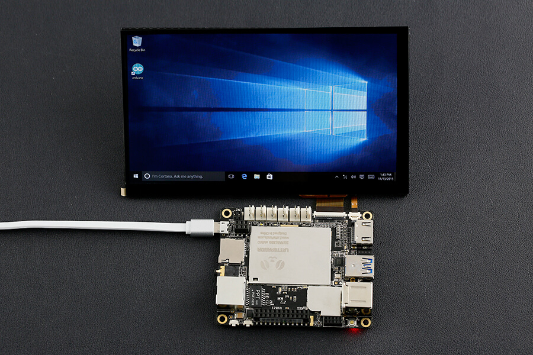

| **المعالج** | Intel Cherry Trail Z8350 رباعي النواة بسرعة تصل إلى 1.8GHz |
| --------------------------- | ------------------------------------------------------------ |
| **الذاكرة** | 4GB من نوع DDR3L |
| **معالج الرسوميات** | Intel HD Graphics |
| **التخزين** | 64GB مع وجود منفذ لإضافة بطاقة ذاكرة |
| **منافذ** **USB** | منفذين من نوع USB 2.0 ومنفذ واحد USB 3.0 |
| **دعم الشبكة** | منفذ Ethernet 10/100/1000Mbps دعم WiFi 802.11n 2.4G دعم بلوتوث 4.0 |
| **دعم** **GPIO** | 6 pin من معالج Intel 20 pin من معالج ATmega |
| **المميزات** | تأتي بنظام ويندوز 10 مثبت مسبقا وبذلك توفر على المستخدم عناء تحميل وتثبيت النظام وتكون جاهزة للعمل مباشرة المعالج المساعد ATmega32u4 يوفر إمكانية عمل الجهاز كلوحة Arduino تتعامل مع الإلكترونيات |
| **العيوب** | نظام التشغيل المدعوم رسميا هو فقط ويندوز 10 لا يوجد دعم ل HDMI-CEC |
| **السعر** | 150 دولار أمريكي |

## ODroid Xu4 ونظام تبريد مدمج

إذا كنت من المهتمين بأجهزة الكمبيوتر أحادية اللوحة نظرا لإمكانية عملها كبديل غير مكلف لأجهزة الكمبيوتر المكتبية العادية، إذا عليك التطلع إلى لوحة ODROID-XU4، فعلى الرغم من سعرها المنخفض فهي تأتي بالمعالج القوي Samsung Exynos 5422 ثماني النواة بسرعة 2GHz ومعالج رسوميات Mali-T628 MP6 يدعم كلا من OpenGL ES 3.1 وOpenCL 1.2، وذاكرة عشوائية 2GB من نوع LPDDR3.

وإضافة إلى 2 منفذ USB 3.0 ومنفذ USB 2.0، ومنفذ لإضافة بطاقة الذاكرة حتي 128 جيجا فلوحة ODROID-XU4 تدعم أيضا توصيل وحدة تخزين eMMC5.0 حتي 64 جيجا. 

أما بالنسبة لدعم الشبكات، فمنفذ Ethernet الموجود هنا مميز، فهو يدعم نقل البيانات بسرعة تصل إلى 1 جيجا، لكن للأسف لا يوجد Wi-Fi مدمج باللوحة وتحتاج لشراء لاقط منفصل.

وما يجعل لوحة ODROID-XU4 مميزة أكثر هو وجود نظام تبريد مرفق مع الجهاز وهذا شيء لن تجده في كل الأجهزة، إضافة إلى دعم العديد من توزيعات لينكس وإصدارات أندرويد بشكل رسمي.

أبعاد الجهاز هي83x58x20mm ووزنه حوالي 60 جرام.

الموقع الرسمي:

http://www.hardkernel.com/main/products/prdt_info.php

فيديو:

https://www.youtube.com/watch?v=wtqfC9v0xB0
https://www.youtube.com/watch?v=xxl4ORk4SJo

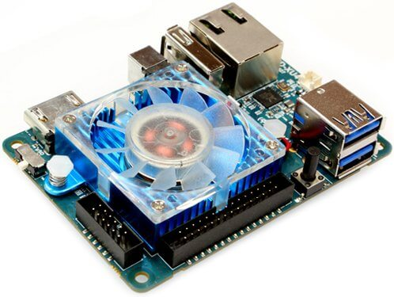

| **المعالج** | Samsung Exynos-5422 ثماني النواة بسرعة 2GHz مكون من أنوية ARM Cortex-A15 / ARM Cortex-A7 |
| --------------------------- | ------------------------------------------------------------ |
| **الذاكرة** | 2GB من نوع LPDDR3 |
| **معالج الرسوميات** | Mali-T628 MP6 يدعم OpenGL ES 3.1 / 3.0 / 2.0 / 1.1 و OpenCL 1.2 |
| **التخزين** | دعم بطاقات الذاكرة حتي 128 جيجا دعم وحدة تخزين eMMC 5.0 حتي 64 جيجا |
| **منافذ** **USB** | 2 منفذ USB 3.0 و1 منفذ USB 2.0 |
| **دعم الشبكة** | منفذ Gigabit Ethernet 10/100/1000Mbps |
| **دعم** **GPIO** | 30 pin تشمل كل من ADC – SPI – I2C - UART |
| **المميزات** | أداء قوي بفضل معالج سامسونج، مع توفر العديد من أنظمة التشغيل للاختيار بينها، كما يأتي مع الجهاز نظام تبريد للحفاظ على الجهاز من السخونة |
| **العيوب** | لا يوجد مساحة تخزين داخلية لا يوجد ميكروفون أو مخرج صوت لا يوجد دعم للWi-Fi أو البلوتوث لا يمكن تشغيلها عن طريق منفذ USB OTG وتحتاج لشراء كابل طاقة |
| **السعر** | 60 دولار أمريكي |

## PINE A64

بديل قوي منخفض التكلفة

Pine A64 هي جهاز كمبيوتر ذو لوحة واحدة صغير الحجم وقوي المواصفات ورخيص الثمن يمكنك استخدامه لأي شيء تستخدم فيه أجهزة SBC حاليا.

في الأساس تستهدف لوحة Pine A64 المشاريع الكبيرة حيث يمكن دمجها بسهولة فيها، لكنها تعمل كلوحة تطوير أيضا بكل كفاءة. تأتي اللوحة بمعالج AllWinner A64 (64-bit) رباعي النواة بسرعة 1.2GHz ومعالج رسوميات Mali-400 MP2، أما الذاكرة العشوائية فهي تختلف حسب الموديل من 512MB إلى 2GB، وحيث أن اللوحة لا تحتوي على مساحة داخلية للتخزين فإنها تستخدم بطاقات الذاكرة وتدعم حتي 256GB، إضافة إلى توفر 2 منفذ USB 2.0. يوجد باللوحة منفذ Ethernet 10/100/1000Mbps، أما لإضافة دعم الWi-Fi والبلوتوث فتحتاج لوحدة خارجية أو USB Dongle، كما يوجد أيضا مستشعر IR ومخرج صوت 3.5mm ومنفذ HDMI يدعم تشغيل حتي جودة 4K.

أنظمة التشغيل المدعومة هي Linux – Android - Windows IoT

أبعاد الجهاز هي 127mm x 79mm x 21mm ووزنه 46 جرام.

يتوفر من الجهاز ثلاثة موديلات الأول ب512MB ذاكرة عشوائية وسعره 15$، والثاني ب1GB ذاكرة عشوائية وسعره 19$ والأخير ب2GB ذاكرة وسعره 29$

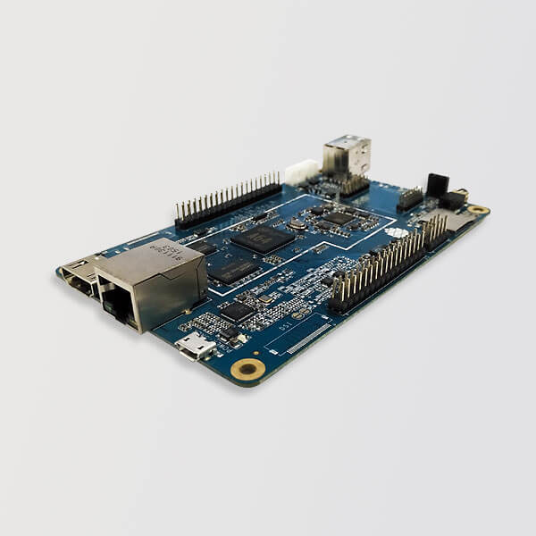

الموقع الرسمي: https://www.pine64.org/?page_id=1194

فيديو:https://www.youtube.com/watch?v=FxGeloh80RQ
https://www.youtube.com/watch?v=Z06_-Y-Y69Q

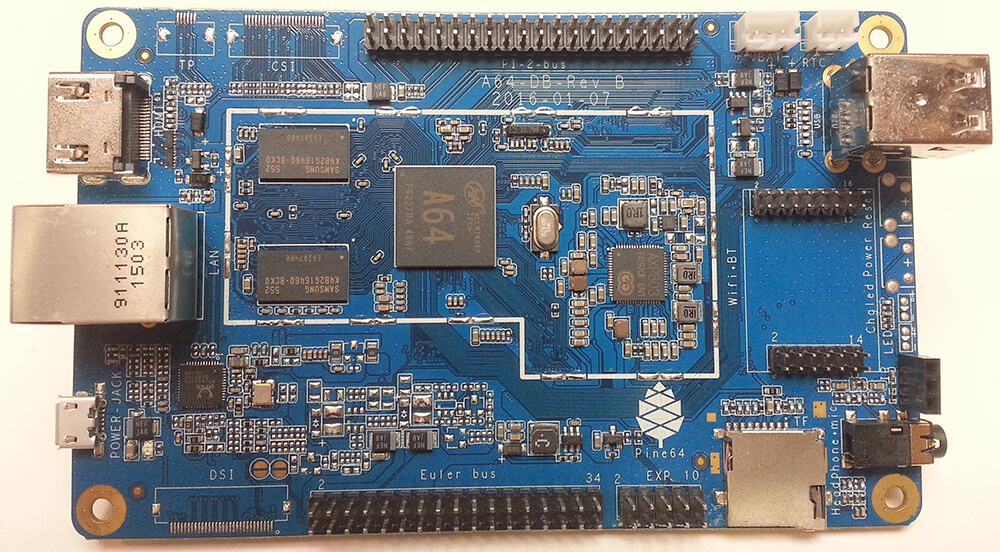

| **المعالج** | AllWinner A64 ARM Cortex-A53 (64-bit) رباعي النواة بسرعة 1.2GHz |
| --------------------------- | ------------------------------------------------------------ |
| **الذاكرة** | 512 ميجا/1 جيجا/2جيجا |
| **معالج الرسوميات** | Mali-400 MP2 |
| **التخزين** | منفذ لإضافة بطاقة ذاكرة، ولا توجد مساحة تخزين داخلية |
| **منافذ** **USB** | 2 منافذ USB 2.0 |
| **دعم الشبكة** | منفذ Ethernet 10/100Mbps |
| **دعم** **GPIO** | 40 pin تشمل كل من PWM – SPI – I2C - UART |
| **المميزات** | مواصفات رائعة بالنسبة لسعرها المنخفض وخاصة أن المعالج 64bit تدعم تشغيل مقاطع الفيديو حتي جودة 4K |
| **العيوب** | لا توجد مساحة تخزين داخلية لا يوجد Wi-Fi أو بلوتوث حجم الجهاز كبير جدا مقارنة بباقي الأجهزة |
| **السعر** | 15-29 دولار أمريكي |

## Raspberry Pi 3

لوحة ال35$ الأكثر مبيعا

قامت مؤسسة Raspberry Pi في انجلترا بتصنيع وإصدار أجهزة Raspberry Pi منذ 2012، فهي تعتبر أحد أحجار الأساس لعودة أجهزة اللوحة الواحدة إلى الأضواء، وقد واصلت المؤسسة نجاحها المبهر، فطبقا لأحدث التقارير في يوليو 2017 تم بيع 15 مليون وحدة تقريبا من لوحات Raspberry Pi.

واستكمالا لمسيرة النجاح تم إصدار لوحة Raspberry Pi 3 Model B منخفضة الثمن، والتي تأتي بمعالج رباعي النواة BCM2837 (Cortex-A53) بسرعة 1.2GHz من تصنيع Broadcom يدعم أنظمة تشغيل 64Bit، وتتضمن هذه الشريحة معالج رسوميات قوي Videocore IV بسرعة 400MHz. أما الذاكرة العشوائية فهي 1 جيجا، ولا تتوفر مساحة تخزين داخلية بالجهاز لكن يوجد منفذ لإضافة بطاقات الذاكرة حتي 32 جيجا، و 4 منافذ USB 2.0 ومنفذ USB OTG.

كما يوجد بالجهاز منفذ Ethernet، وWi-Fi وبلوتوث عن طريق شريحة BCM43438، وبالطبع يوجد منفذ HDMI لتوصيل الجهاز بالشاشة، إضافة إلى منفذ 3.5mm للصوت، ولا يوجد ميكروفون باللوحة.

تدعم اللوحة العديد من أنظمة التشغيل Linux – Android - Windows IoT
أبعاد الجهاز هي 85mm x 56mm x 20mm ووزنه 45 جرام.

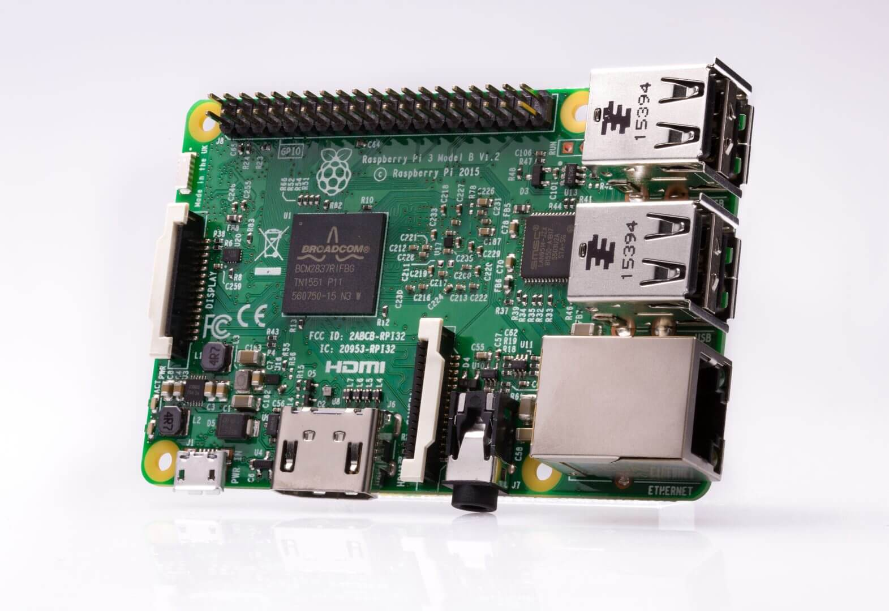

الموقع الرسمي: https://www.raspberrypi.org/products/raspberry-pi-3-model-b/

فيديو: https://www.youtube.com/watch?v=uXUjwk2-qx4
https://www.youtube.com/watch?v=T_WlF9I5EGw

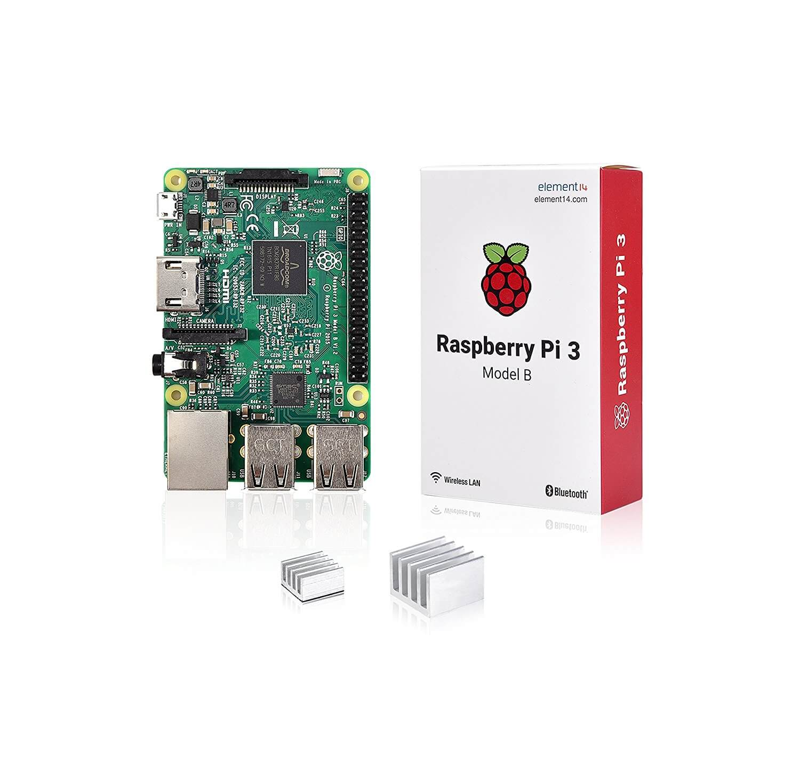

| **المعالج** | Broadcom BCM2837 ARM Cortex-A53 (64-bit) رباعي النواة بسرعة 1.2GHz |
| --------------------------- | ------------------------------------------------------------ |
| **الذاكرة** | 1 جيجا |
| **معالج الرسوميات** | VideoCore IV بسرعة 400MHz |
| **التخزين** | منفذ لإضافة بطاقة ذاكرة، ولا توجد مساحة تخزين داخلية |
| **منافذ** **USB** | 4 منافذ USB 2.0 ومنفذ USB OTG |
| **دعم الشبكة** | منفذ Ethernet 10/100Mbps دعم WiFi 802.11b/g/n دعم بلوتوث 4.1 |
| **دعم** **GPIO** | 40 pin تشمل كل من PWM – SPI – I2C - UART |
| **المميزات** | عن طريق برنامج NOOBS من مؤسسة Raspberry Pi تستطيع تثبيت أنظمة التشغيل بكل سهولة توافر دعم كبير جدا من المجتمع على الإنترنت بسبب الانتشار الواسع للجهاز في كل أنحاء العالم |
| **العيوب** | لا توجد مساحة تخزين داخلية لا يوجد ميكروفون |
| **السعر** | 35 دولار أمريكي |

## Raspberry Pi Zero W

أرخص كمبيوتر أحادي اللوحة

مرة أخري مع أحد إبداعات مؤسسة Raspberry Pi، الشقيق الأصغر ل Raspberry Pi. فبعد إطلاق النسخة الأولى من هذا الجهاز في 2015 والتي حملت اسم Raspberry Pi Zero بسعر 5$ وحصولها على اهتمام كبير تم إطلاق هذه النسخة الجديدة في بداية 2017.

تأتي هذه اللوحة بنفس مواصفات الإصدار السابق وهي معالج Broadcom BCM2835 بسرعة 1GHz ومعالج رسوميات VideoCore IV يدعم تشغيل ملفات الفيديو بدقة Full HD (60 FPS) بدون مشاكل، وذاكرة عشوائية 512MB من نوع LPDDR2 SDRAM ومنفذ إضافة بطاقة الذاكرة حتي 128GB ومنفذ واحد USB 2.0 و2 منفذ USB OTG ومنفذ HDMI ومنفذ للصوت.

أما الجديد في هذا الإصدار هو إضافة دعم الWi-Fi والبلوتوث الذي كان ينقص الإصدار السابق ويشكل مشكلة في التعامل مع الجهاز. لكن هذا قد رفع سعر الجهاز إلى 10$ بدلا من 5$ للإصدار Zero.

وبالتأكيد هذه اللوحة مناسبة للمشاريع والتعامل مع الإلكترونيات أكثر من استخدامها كجهاز كمبيوتر محمول، فهي رخيصة السعر بشكل كبير وتستهلك كميات قليلة من الطاقة مما يجعلها مؤهلة للبقاء مشغله لفترات طويلة دون مشاكل.
أبعاد الجهاز هي 65mm x 30mm x 5mm.

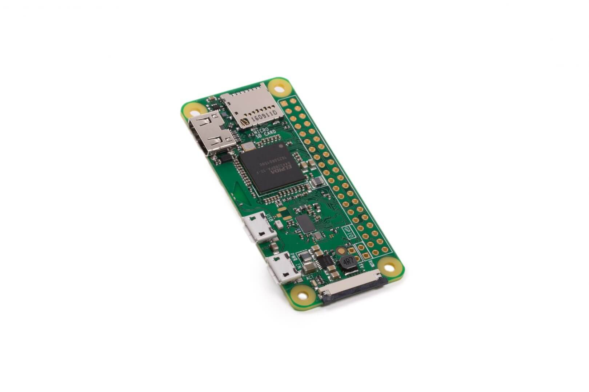

الموقع الرسمي:
https://www.raspberrypi.org/products/raspberry-pi-zero-w/

فيديو:
https://www.youtube.com/watch?v=jFoA4u4x2uk
https://www.youtube.com/watch?v=gNyvmnGoSKY

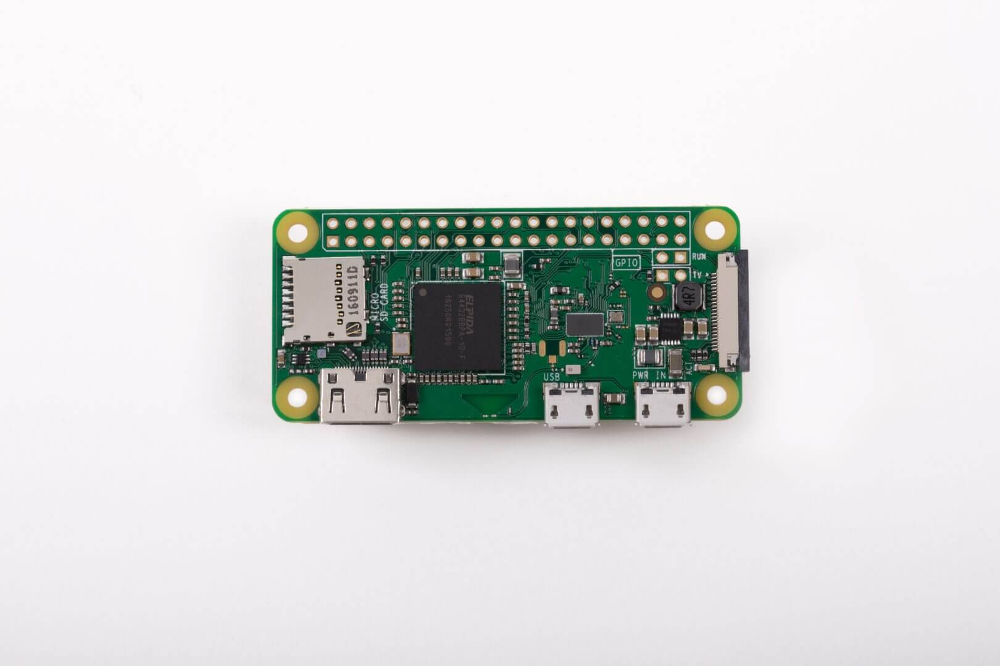

| **المعالج** | Broadcom BCM2835 أحادي النواة بسرعة 1GHz |
| --------------------------- | ------------------------------------------------------------ |
| **الذاكرة** | 1 جيجا |
| **معالج الرسوميات** | VideoCore IV يدعم تشغيل ملفات الفيديو بدقة Full HD (60 FPS) |
| **التخزين** | منفذ لإضافة بطاقة ذاكرة حتي 128 جيجا، ولا توجد مساحة تخزين داخلية |
| **منافذ** **USB** | منفذ واحد USB 2.0 و2 منفذ USB OTG |
| **دعم الشبكة** | دعم WiFi 802.11b/g/n دعم بلوتوث 4.1 |
| **دعم** **GPIO** | 40 pin تشمل كل من PWM – SPI – I2C - UART |
| **المميزات** | سعر رخيص، مناسب جدا للطلبة ولمن يبحث عن لوحة منخفضة التكلفة لعمل المشاريع بواسطتها لا تستهلك طاقة كبيرة، فهي يمكن تشغيلها حتي بواسطة PoweBank محمول دعم Wi-Fi وبلوتوث، متفوقة على الإصدار السابق في هذه النقطة |
| **العيوب** | لا توجد مساحة تخزين داخلية لا يوجد منفذ Ethernet |
| **السعر** | 10 دولار أمريكي |

## Tinker Board

ودعم ملفات الفيديو بدقة 4K

مثل أغلب الخيارات المتاحة للمستخدم والتي تعمل كجهاز كمبيوتر شخصي، أصدرت شركة Asus جهازTinker Board في أبريل 2017، وهو لوحة تطوير شبيهة ب Rasbperry Pi في الحجم، تأتي بمعالج Rockchip RK3288 (ARM Cortex-A17) رباعي النواة بتردد 1.8GHz ومعالج رسوميات Mali-T764 بسرعة 600MHz يدعم تشغيل ملفات الفيديو بدقة 1080 و 4K وكل من OpenGL ES 1.1/2.0/3.0, OpenCL 1.1، وذاكرة عشوائية 2GB من نوع LPDDR3.

كما تحتوي على أغلب المميزات الأخري مثل منفذ HDMI 2.0 الذي يدعم حتي دقة عرض 3840x2160، و4 منافذ USB 2.0 ومنفذ لإضافة بطاقات الذاكرة، ومخرج صوت 3.5mm، ومنفذ Ethernet من Gigabit وWi-Fi بمعيار 802.11 b/g/n وبلوتوث 4.0.

وتأتي اللوحة بنظام TinkerOS المبني على ديبيان لينكس، كما يمكنك تثبيت أندرويد أيضا.

أبعاد الجهاز هي 86mm x 54mm x 18mm ووزنه 55 جرام

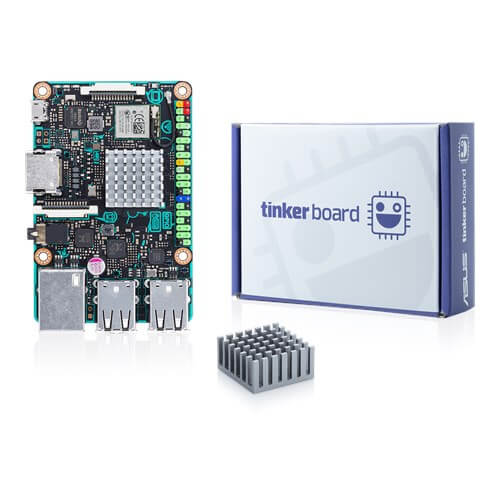

الموقع الرسمي:
https://www.asus.com/uk/Single-Board-Computer/Tinker-Board/

فيديو:
https://www.youtube.com/watch?v=8zXFyQTxM7U
https://www.youtube.com/watch?v=CS66_BbalG8

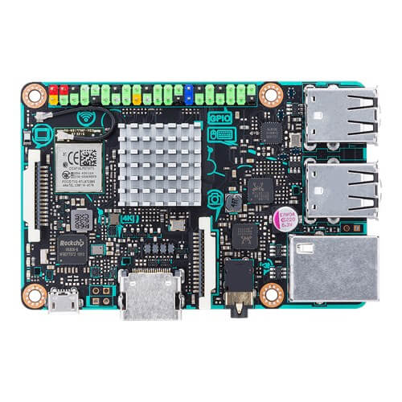

| **المعالج** | Rockchip 3288 (ARM Cortex-A17) رباعي النواة بسرعة 1.8GHz |
| --------------------------- | ------------------------------------------------------------ |
| **الذاكرة** | 2GB من نوع LPDDR3 |
| **معالج الرسوميات** | Mali-T764 يدعم تشغيل ملفات الفيديو بدقة 4K (30 FPS) |
| **التخزين** | منفذ لإضافة بطاقة ذاكرة حتي 128 جيجا، ولا توجد مساحة تخزين داخلية |
| **منافذ** **USB** | 4 منافذ USB 2.0 ومنفذ USB OTG |
| **دعم الشبكة** | منفذ Ethernet 10/100Mbps تدعم WiFi 802.11b/g/n دعم بلوتوث 4.0 |
| **دعم** **GPIO** | 40 pin تشمل كل من PWM – SPI – I2C - UART |
| **المميزات** | سعر مناسب مقارنة بالمواصفات القوية للجهاز دعم جيد لأنظمة التشغيل حجم مقارب لجهاز Raspberry Pi مما يجعلها تلائم نفس الأغطية Cases |
| **العيوب** | لا يوجد مساحة تخزين داخلية لا يوجد دعم ل HDMI-CEC |
| **السعر** | 60 دولار أمريكي |

## UDOO x86 Ultra

إمكانيات خارقة وحجم صغير

صنع فريق UDOO ضجة كبيرة على مستوي العالم عندما أعلن لأول مرة عن جهاز UDOO X86 بإصداراته المختلفة، حيث أنه -طبقا للتجارب- أقوي من Raspberry Pi 3 ب10 مرات ! وهو قادر على تشغيل ثلاث شاشات بدقة 4K في نفس الوقت، إضافة إلى أنه يتوافق مع Arduino 101 عن طريق متحكم دقيق microcontroller مدمج باللوحة.

ما يجعل هذا الجهاز له الأفضلية على كثير من الأجهزة الموجودة في المنافسة هو المواصفات المدهشة التي يأتي بها، فهو يعتمد على معالج Intel Pentium N3710 رباعي النواة بمعمارية X86 وسرعة تصل إلى 2.56GHz، ومعالج رسوميات Intel HD Graphics 405 بسرعة 700MHz وذاكرة عشوائية 8GB من نوع DDR3L Dual Channel.

إضافة إلى ذلك فهو يأتي بمساحة تخزين داخلية 32 جيجا بايت مع وجود منفذ لبطاقة الذاكرة ومنفذ SATA و 3 منافذ USB 3.0 type-A، ومدخل للصوت 3.5mm ومدخل للميكروفون، وبالتأكيد منفذ HDMI.

أما الشبكات فالجهاز يدعم كل شيء، منفذ Ethernet من Gigabit وWi-Fi بمعيار 802.11ac وبلوتوث LE.

من ضمن مميزات الجهاز أيضا أنه يحتوي على مستشعر IR ومستشعر التسارع accelerometer والgyroscope.

وهذا ما يجعل جهاز UDOO X86 من اٌقوي أجهزة الكمبيوتر أحادية اللوحة الموجودة في الأسواق.

أبعاد الجهاز هي 120mm x 85mm x 25mm

الموقع الرسمي:
https://www.udoo.org/udoo-x86/

فيديو:
https://www.youtube.com/watch?v=p-K7Kb51Fqw
https://www.youtube.com/watch?v=tpT4WGsMcvk

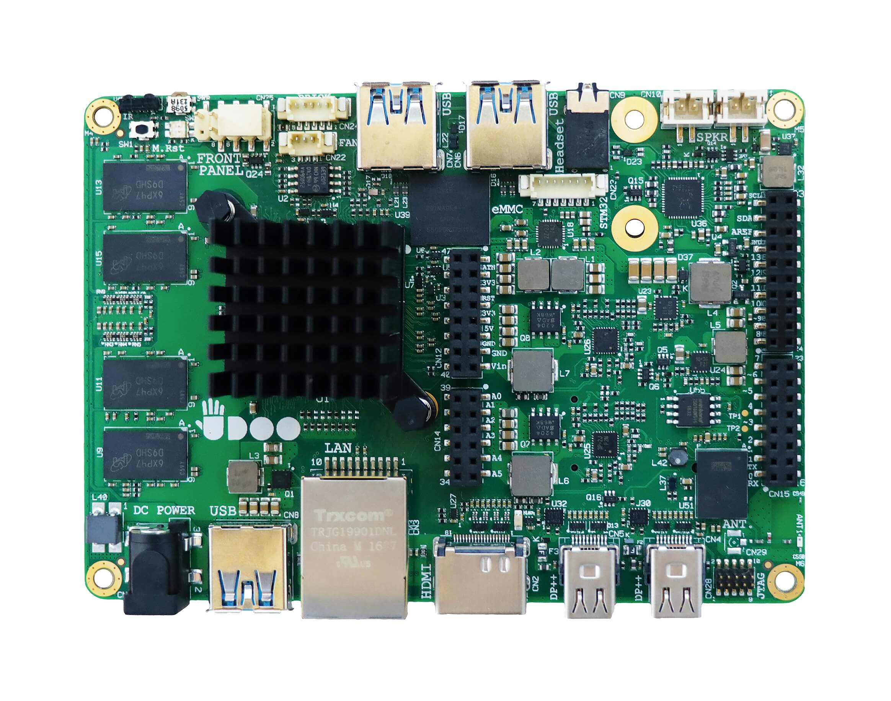

| **المعالج**         | Intel Celeron N3710 رباعي النواة بسرعة 2.56GHz               |
| ------------------- | ------------------------------------------------------------ |
| **الذاكرة**         | 8GB من نوع DDR3L Dual Channel                                |
| **معالج الرسوميات** | Intel HD Graphics 405 بسرعة 700MHz                           |
| **التخزين**         | 32 جيجا بايت مساحة تخزين داخلية مع وجود منفذ لبطاقة الذاكرة ومنفذ SATA |
| **منافذ** **USB**   | 3 منافذ USB 3.0 type-A                                       |
| **دعم الشبكة**      | منفذ Ethernet 10/100Mbps تدعم WiFi 802.11ac تدعم بلوتوث LE   |
| **دعم** **GPIO**    | 14 pin إضافة إلى 6 ADC – 14 PWM – 1 SPI – 2 I2C – 2 UART     |
| **المميزات**        | إمكانيات جبارة تجعل من هذا الجهاز بديل فعال للكمبيوتر الشخصي، كما أنه يدعم أنظمة التشغيل ويندوز ولينكس وأندرويد بسبب المعالج من إنتل دعم Arduino 101 مما يمكن الجهاز من التعامل مع المكونات الإلكترونية المختلفة |
| **العيوب**          | سعر مرتفع بالنسبة لجهاز كمبيوتر ذو لوحة واحدة مجتمع دعم صغير على الإنترنت مقارنة بالأجهزة الأخري |
| **السعر**           | 267 دولار أمريكي                                             |

**وفيما يلي مقارنة بين هذه الأجهزة:**

|                            | Banana Pi M3                        | HiKey 960                                             | Intel Compute Stick              | LattePanda                         | ODroid Xu4                                           |
| -------------------------- | ----------------------------------- | ----------------------------------------------------- | -------------------------------- | ---------------------------------- | ---------------------------------------------------- |
| **SoC**                    | AllWinner A83T                      | Huawei HiSilicon Kirin 960                            | Intel Atom Z3735F “Bay Trail”    | Intel Atom x5-Z8300 “Cherry Trail” | Samsung Exynos-5422                                  |
| **المعالج**                | ARM Cortex-A7 (32-bit) ثماني النواة | ARM Cortex-A53 + ARM Cortex-A73 (64-bit) ثماني النواة | Intel Atom (32-bit) رباعي النواة | Intel Atom (64-bit) رباعي النواة   | ARM Cortex-A15 + ARM Cortex-A7 (32-bit) ثماني النواة |
| **تردد المعالج**           | 2GHz                                | 2.3GHz                                                | 1.33GHz                          | 1.8GHz                             | 2GHz                                                 |
| **معالج الرسوميات**        | PowerVR SGX544MP1                   | Mali G71 MP8                                          | Intel HD Graphics                | Intel HD Graphics                  | Mali T628 MP6                                        |
| **الذاكرة العشوائية**      | 2GB                                 | 3GB                                                   | 2GB                              | 4GB                                | 2GB                                                  |
| **نوعها** | **LPDDR3**                 | LPDDR4 SDRAM                        | DDR3L-1600                                            | DDR3L                            | LPDDR3                             |
| **مساحة التخزين الداخلية** | 8GB                                 | 32GB                                                  | 32GB                             | 64GB                               | مدعوم                                                |
| **منفذ بطاقة الذاكرة**     | يدعم حتي 64GB                       | يدعم حتي 64GB                                         | يدعم حتي 64GB                    | يدعم حتي 64GB                      | يدعم حتي 128GB                                       |
| **منافذ USB**              | 2xUSB 2.0                           | 2xUSB 2.0                                             | 1xUSB 3.0 1xUSB 2.0              | 1xUSB 3.0 2xUSB 2.0                | 2xUSB 3.0 1xUSB 2.0                                  |
| **منفذ USB OTG**           | غير مدعوم                           | غير مدعوم                                             | غير مدعوم                        | غير مدعوم                          | غير مدعوم                                            |
| **منفذ Ethernet**          | Gigabit                             | مدعوم                                                 | مدعوم                            | 10/100/1000Mbps                    | Gigabit                                              |
| **منفذ HDMI**              | 1.4                                 | 1.4                                                   | 1.4b                             | 1.x                                | 1.x                                                  |
| **مخرج الصوت عبر HDMI**    | غير مدعوم                           | غير مدعوم                                             | غير مدعوم                        | غير مدعوم                          | غير مدعوم                                            |
| **واجهات العرض**           | MIPI DSI                            | MIPI DSI                                              | مدعوم                            | MIPI DSI                           | مدعوم                                                |
| **منفذ الكاميرا CSI**      | غير مدعوم                           | مدعوم                                                 | مدعوم                            | مدعوم                              | مدعوم                                                |
| **مخرج الصوت**             | غير مدعوم                           | مدعوم                                                 | مدعوم                            | مدعوم                              | مدعوم                                                |
| **موصل الصوت**             | 3.5mm jack                          | مدعوم                                                 | مدعوم                            | مدعوم                              | مدعوم                                                |
| **مدخل الميكروفون**        | مدعوم                               | مدعوم                                                 | مدعوم                            | مدعوم                              | مدعوم                                                |
| **الميكروفون**             | غير مدعوم                           | مدعوم                                                 | مدعوم                            | مدعوم                              | مدعوم                                                |
| **منفذ SATA**              | SATA 2.0                            | مدعوم                                                 | مدعوم                            | مدعوم                              | مدعوم                                                |
| **مستشعر IR**              | غير مدعوم                           | مدعوم                                                 | مدعوم                            | مدعوم                              | مدعوم                                                |
| **Wi-Fi**                  | 802.11b/g/n (AP6212)                | 802.11ac (2.4- & 5-GHz dual band)                     | 802.11b/g/n                      | 802.11n 2.4G                       | مدعوم                                                |
| **بلوتوث**                 | Bluetooth 4.0                       | Bluetooth 4.1                                         | Bluetooth 4.0                    | Bluetooth 4.0                      | مدعوم                                                |
| **GPIO pins**              | 40                                  | 12                                                    | مدعوم                            | 6 + 20                             | 30                                                   |
| **PWM pins**               | 1                                   | مدعوم                                                 | مدعوم                            | 6                                  | مدعوم                                                |
| **ADC pins**               | مدعوم                               | مدعوم                                                 | مدعوم                            | غير مدعوم                          | غير مدعوم                                            |
| **I2C**                    | 1                                   | 2                                                     | مدعوم                            | 4                                  | 1                                                    |
| **SPI**                    | 1                                   | 1                                                     | مدعوم                            | 3                                  | 1                                                    |
| **UART**                   | 2                                   | 2                                                     | مدعوم                            | 2                                  | 2                                                    |
| **التوافق مع Arduino**     | مدعوم                               | مدعوم                                                 | مدعوم                            | غير مدعوم                          | مدعوم                                                |
| **الجهد الكهربى**          | 5 فولت                              | 8-18 فولت                                             | 5 فولت                           | 5 فولت                             | 4.8-5.1 فولت                                         |
| **استهلاك الطاقة**         | 1-2 أمبير                           | 2 أمبير                                               | 800 مللى أمبير-2 أمبير           | 2 أمبير                            | 1-4 أمبير                                            |
| **مصدر الطاقة**            | micro USB                           | DC jack                                               | micro USB                        | DC jack                            | DC jack                                              |
| **الحجم mm**               | 92x60x17                            | 85x55x9                                               | 123x38x12                        | 88x70x18                           | 83x58x20                                             |
| **الوزن**                  | 45 جرام                             | 60 جرام                                               | 60 جرام                          | 100 جرام                           | 60 جرام                                              |
| **ويندوز**                 | مدعوم                               | مدعوم                                                 | غير مدعوم                        | غير مدعوم                          | مدعوم                                                |
| **لينكس**                  | غير مدعوم                           | غير مدعوم                                             | غير مدعوم                        | غير مدعوم                          | غير مدعوم                                            |
| **أندرويد**                | غير مدعوم                           | غير مدعوم                                             | غير مدعوم                        | غير مدعوم                          | غير مدعوم                                            |
| **السعر**                  | 74 دولار أمريكي                     | 239 دولار أمريكي                                      | 150 دولار أمريكي                 | 150 دولار أمريكي                   | 60 دولار أمريكي                                      |

| | PINE A64 | Raspberry Pi 3 | Raspberry Pi Zero W | Tinker Board | UDOO x86 Ultra |
| ------------------------------ | ---------------------------------------------------- | ---------------------------------------------------- | ---------------------------------------------- | ---------------------------------------------------- | ---------------------------------------------- |
| **SoC** | AllWinner A64 | Broadcom BCM2837 | Broadcom BCM2835 | Rockchip 3288 | Intel Celeron N3710 |
| **المعالج** | ARM Cortex-A53 (64-bit) رباعي النواة | ARM Cortex-A53 (64-bit) رباعي النواة | ARM11 (32-bit) أحادي النواة | ARM Cortex-A17 (32-bit) رباعي النواة | Braswell (64-bit) رباعي النواة |
| **تردد المعالج** | 1.2GHz | 1.2GHz | 1000MHz | 1.8GHz | 2.56GHz |
| **معالج الرسوميات** | Mali-400 MP2 | VideoCore IV | VideoCore IV | Mali T764 | Intel HD Graphics 405 |
| **الذاكرة العشوائية** | 512MB/1GB/2GB | 1GB | 512MB | 2GB | 8GB |
| **نوعها** | LPDDR3 | LPDDR2 | LPDDR2 | LPDDR3 | DDR3L Dual Channel |
| **مساحة التخزين الداخلية** | مدعوم | مدعوم | مدعوم | مدعوم | 32GB |
| **منفذ بطاقة الذاكرة** | يدعم حتي 256GB | يدعم حتي 128GB | يدعم حتي 128GB | يدعم حتي 128GB | يدعم حتي 32GB |
| **منافذ USB** | 2xUSB 2.0 | 4xUSB 2.0 | 1xUSB 2.0 | 4xUSB 2.0 | 3xUSB 3.0 |
| **منفذ USB OTG** | غير مدعوم | غير مدعوم | غير مدعوم | غير مدعوم | غير مدعوم |
| **منفذ Ethernet** | Gigabit­ | 10/100Mbps | مدعوم | 10/100Mbps | Gigabit |
| **منفذ HDMI** | 1.x | 1.x | 1.x | 2.0 | 1.x |
| **مخرج الصوت عبر HDMI** | غير مدعوم | غير مدعوم | غير مدعوم | غير مدعوم | غير مدعوم |
| **واجهات العرض** | MIPI DSI | MIPI DSI | مدعوم | 15-pin MIPI DSI | مدعوم |
| **منفذ الكاميرا CSI** | غير مدعوم | غير مدعوم | غير مدعوم | غير مدعوم | غير مدعوم |
| **مخرج الصوت** | غير مدعوم | غير مدعوم | مدعوم | غير مدعوم | غير مدعوم |
| **موصل الصوت** | 3.5mm jack | 3.5mm jack | مدعوم | 3.5mm jack | 3.5mm jack |
| **مدخل الميكروفون** | غير مدعوم | مدعوم | مدعوم | مدعوم | غير مدعوم |
| **الميكروفون** | مدعوم | مدعوم | مدعوم | مدعوم | مدعوم |
| **منفذ SATA** | مدعوم | مدعوم | مدعوم | مدعوم | غير مدعوم |
| **مستشعر IR** | غير مدعوم | مدعوم | مدعوم | مدعوم | غير مدعوم |
| **Wi-Fi** | اختياري 802.11b/g/n | 802.11b/g/n | 802.11b/g/n | 802.11b/g/n | Wi-Fi 802.11ac |
| **بلوتوث** | Bluetooth 4.0 | Bluetooth 4.1 | Bluetooth 4.0 | Bluetooth 4.0+EDR | Bluetooth BLE |
| **GPIO pins** | 40 | 40 | 40 | 40 | 14 |
| **PWM pins** | 1 | 1 | 2 | 2 | 14 |
| **ADC pins** | مدعوم | مدعوم | مدعوم | مدعوم | غير مدعوم |
| **I2C** | 2 | 1 | 1 | 2 | 2 |
| **SPI** | 2 | 1 | 1 | 2 | 1 |
| **UART** | 3 | 1 | 1 | 4 | 2 |
| **التوافق مع Arduino** | مدعوم | مدعوم | مدعوم | مدعوم | غير مدعوم |
| **الجهد الكهربي** | 5 فولت | 4.8-5.2 فولت | 4.75-5.25 فولت | 5 فولت | 3.3 فولت |
| **استهلاك الطاقة** | 800 مللى أمبير-2 أمبير | 600 مللى أمبير-1.6 أمبير | 500 مللى أمبير-1 أمبير | 1-2 أمبير | 1-3 أمبير |
| **مصدر الطاقة** | Micro USB رأسGPIO | Micro USB رأسGPIO | Micro USB رأسGPIO | micro USB | DC jack رأسGPIO |
| **الحجم mm** | 127x79x21 | 85x56x20 | 65x30x5 | 86x54x18 | 120x85x25 |
| **الوزن** | 46 جرام | 45 جرام | 9 جرام | 55 جرام | 116 جرام |
| **ويندوز** | IoT فقط | IoT فقط | مدعوم | مدعوم | غير مدعوم |
| **لينكس** | غير مدعوم | غير مدعوم | غير مدعوم | غير مدعوم | غير مدعوم |
| **أندرويد** | غير مدعوم | غير مدعوم | غير مدعوم | غير مدعوم | غير مدعوم |
| **السعر** | 15/19/29 دولار أمريكي | 35 دولار أمريكي | 10 دولار أمريكي | 60 دولار أمريكي | 267 دولار أمريكي |

---

هذا الموضوع نُشر باﻷصل في مجلة لغة العصر العدد 207 شهر 03-2018 ويمكن الإطلاع عليه [هنا](https://drive.google.com/file/d/1L2Z49tW6T_h5l6elhcMINPlf6jweLYAg/view?usp=sharing).

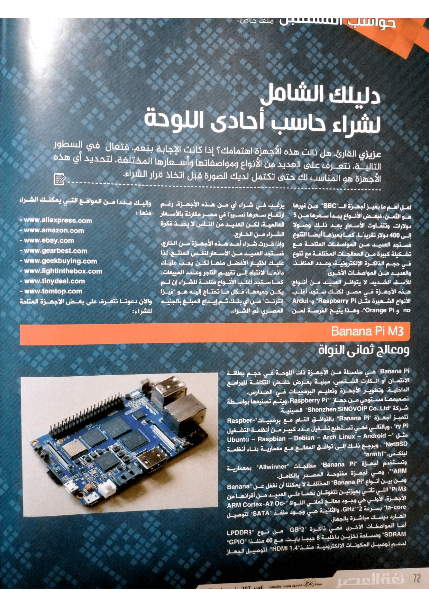

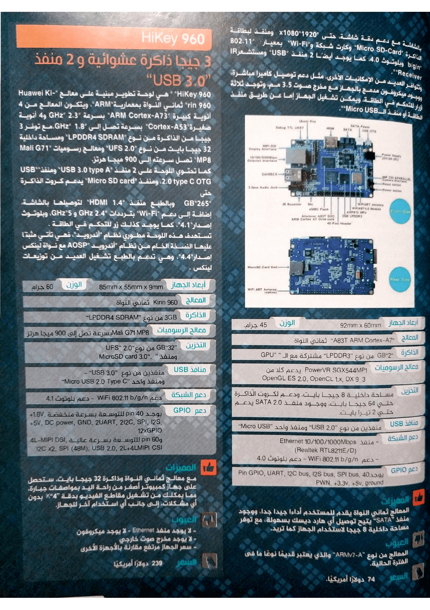

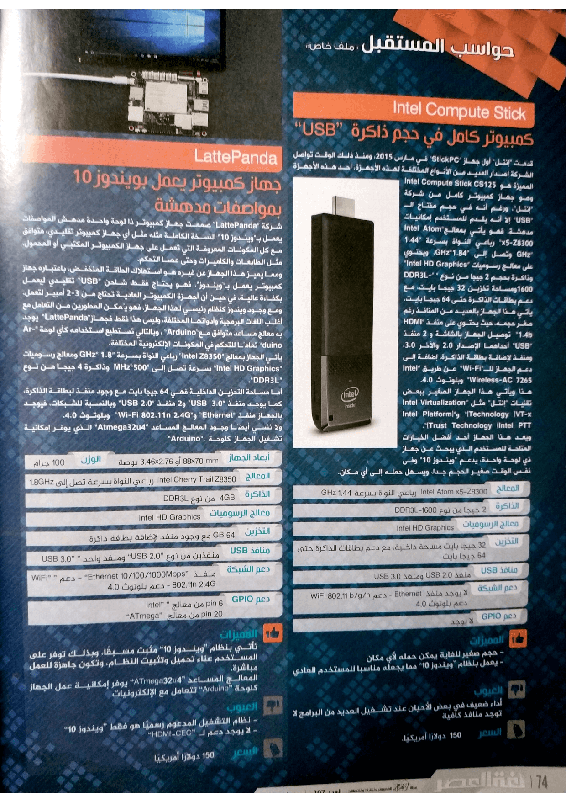

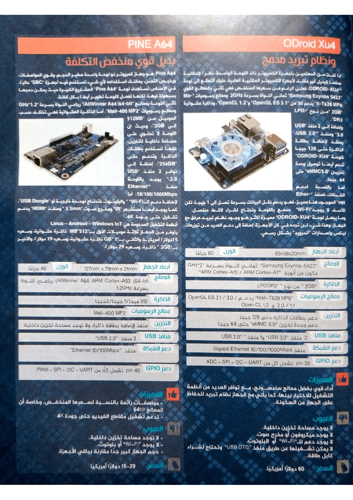

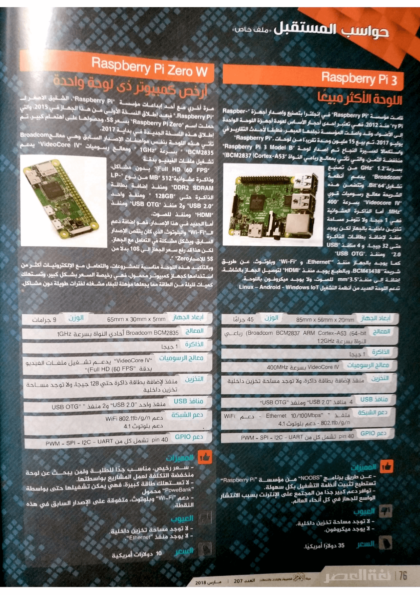

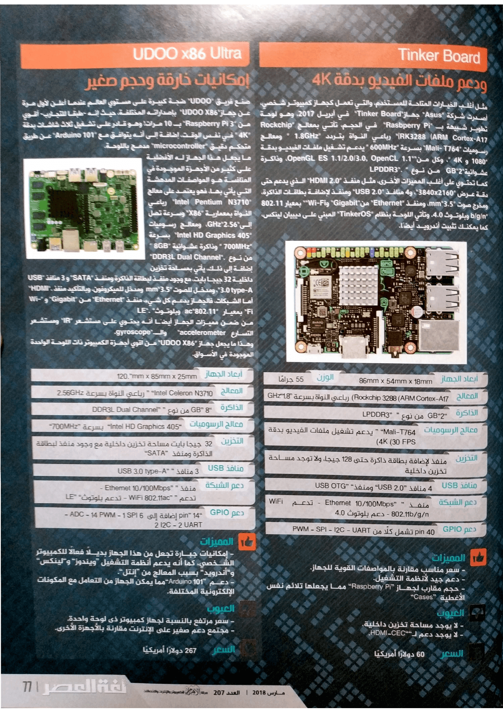

