+++
title = "حواسب المستقبل 4: Raspberry Pi.. نقطة تحول في تاريخ أجهزة الكمبيوتر"
date = "2018-03-05"
description = "دعونا نرجع بالزمن إلى عام 2006 وتحديدا إلى إنجلترا، جامعة كامبرديج قسم علوم الحاسب، في هذا الوقت أجتمع فريق من أساتذة علوم الحاسب ليناقشوا مشكلة تدني المستوي التعليمي للطلبة الجدد، فهم يفتقرون للخبرة في التعامل مع المكونات الإلكترونية وأجزاء الكمبيوتر بخلاف الطلبة السابقين حيث كان أغلب طلبة القسم من المهووسين بالإلكترونيات، فخرج هؤلاء العلماء بالحل المذهل ال Raspberry Pi."
categories = ["تقارير",]
tags = ["مجلة لغة العصر"]
series = ["حواسب المستقبل"]

+++

دعونا نرجع بالزمن إلى عام 2006 وتحديدا إلى إنجلترا، جامعة كامبرديج قسم علوم الحاسب، في هذا الوقت أجتمع فريق من أساتذة علوم الحاسب ليناقشوا مشكلة تدني المستوي التعليمي للطلبة الجدد، فهم يفتقرون للخبرة في التعامل مع المكونات الإلكترونية وأجزاء الكمبيوتر بخلاف الطلبة السابقين حيث كان أغلب طلبة القسم من المهووسين بالإلكترونيات، فخرج هؤلاء العلماء بالحل المذهل ال Raspberry Pi.

## نقطة الصفر

فكر البروفيسور Eben Upton إيبين ابتون في طريقة تساعد الطلبة الجدد على التعمق في علوم الحاسب وفهم المكونات الإلكترونية وعلم البرمجة في نفس الوقت، إضافة إلى تمكين الطلبة من صناعة وتعديل أجهزة خاصة بهم وربطها بالكمبيوتر. ومن أول المشاكل التي واجهتهم كانت كيفية توفير أجهزة كمبيوتر يمكن للطلبة التلاعب بها وتفكيكها وإضافة أجزاء جديدة دون تخريبها، فبالطبع الآباء لن يكونوا سعداء عند قيام أبناءهم بتخريب جهاز كمبيوتر غالي الثمن عند أجراء التجارب عليه !
وكان الحل إيجاد جهاز كمبيوتر صغير الحجم منخفض التكلفة يتوفر للجميع حتي يسهل عملية التعليم لجميع الطلبة.
بدأ البروفيسور إيبين بتجميع فريقه المكون من Alan Mycroft ألان مايكروفت – Jack Lang جاك لانج – Rob Mullins روب مولينز والشروع في العمل، فقام الفريق بتطوير 3 نماذج أولية خلال 5 سنوات حتي تم الاتفاق على نشر النموذج الثالث الذي خرج للعالم في أواخر 2011 بصورته النهائية، فأصبح نواة لثورة تعليمية وفكرية مذهلة.

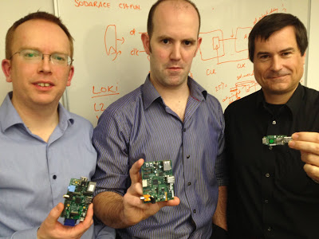

خرج النموذج الأول في مايو 2011 بحجم مذهل وسعر رخيص لكن الحجم كان أصغر من أن يصلح للتعامل معه، فقد كان ضعف حجم العملة المعدنية تقريبا، واحتوي على منفذ USB واحد ومخرج HDMI.

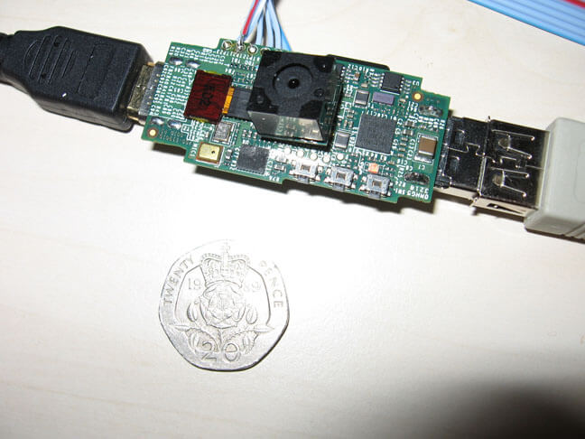

فيديو http://www.bbc.co.uk/news/technology-13292450

ثم تلاه نموذج آخر في أغسطس بحجم أكبر وتم إضافة منافذ GPIO التي تمكنك من توصيل المكونات الإلكترونية مع اللوحة، وإضافة منفذ Ethernet أيضا.

وفي ديسمبر 2011 وصل حجم اللوحة إلى نفس حجم بطاقة ائتمان، وذلك في المرحلة التجريبية للإنتاج، وتم الاتفاق على أن يتم التصنيع في انجلترا وليس الصين.

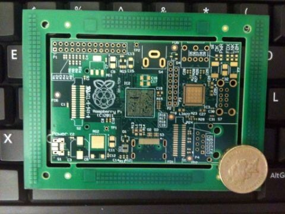

وأخيرا في 29 فبراير 2012 أصبحت اللوحة متاحة للجمهور، Model A بذاكرة 512MB وبسعر 25 دولا، عن طريق مؤسسة Raspberry Pi الخيرية التي تتولي عملية الإنتاج والتطوير. ثم الإصدارModel B بذاكرة 512MB وسعر 35 دولار في 15 أكتوبر من نفس العام.

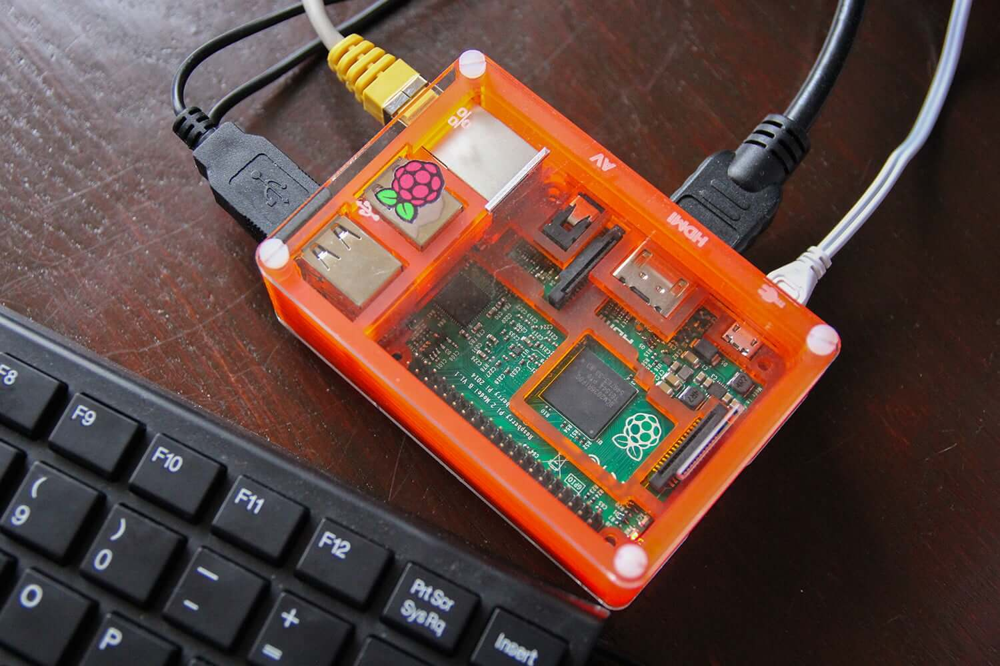

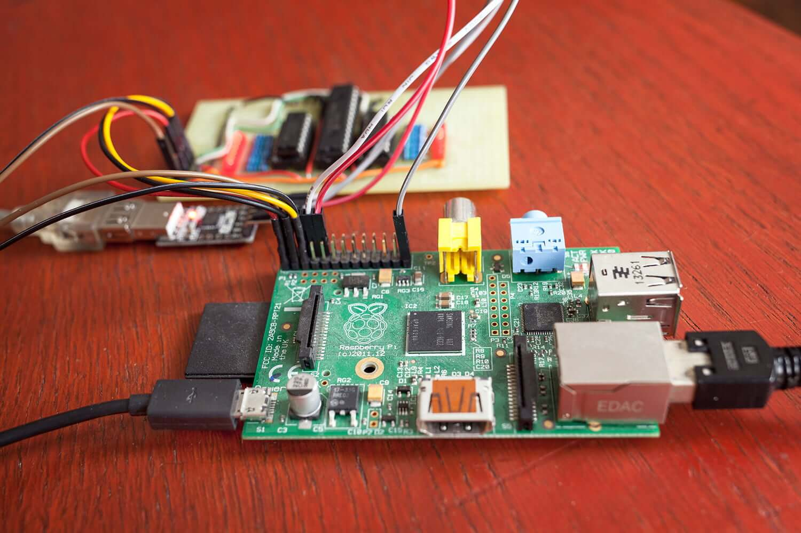

## مسيرة النجاح

من ضمن نقاط قوة أجهزة Raspberry Pi هي سهولة التعامل مع أنظمة التشغيل، فمنذ البداية تم إصدار نسختين من نظام التشغيل على موقع المؤسسة، فكان على المستخدم تحميل النسخة ووضعها على بطاقة الذاكرة والتشغيل فقط !
ولاحقا في نفس العام تم إصدار نظام Raspbian المبني على توزيعة Debian Linux والمعد خصيصا لأجهزة Raspberry Pi.

كما تم تقديم برنامج جديد هو NOOBS لتبسيط عملية تثبيت أنظمة التشغيل المختلفة في 2013، فبعد تحميل ملفات البرنامج ووضعها على بطاقة الذاكرة تقوم بتوصيل كابل الإنترنت وتحديد أنظمة التشغيل التي ترغب في تثبيتها ثم انتظر حتي انتهاء التحميل والتثبيت.

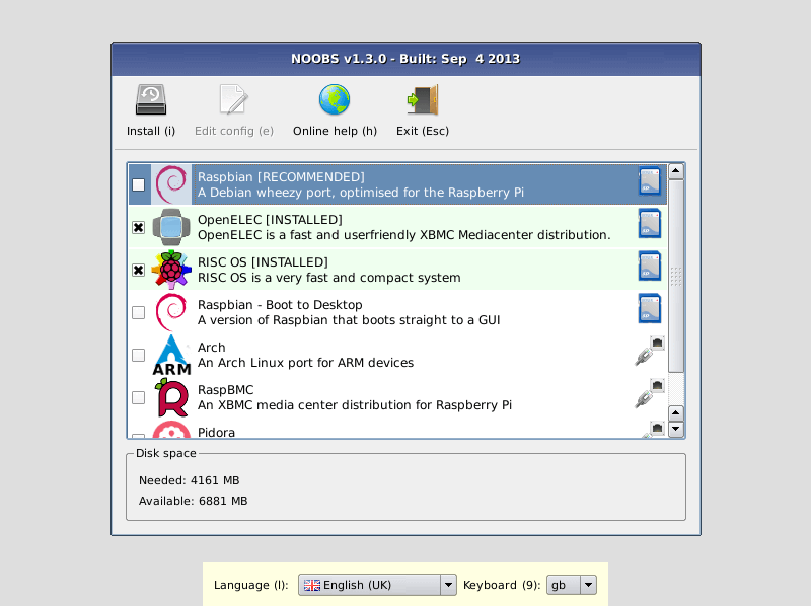

واستمرت سلسلة النجاحات المتواصلة لRaspberry Pi، ففي 2014 تم إعلان أن عدد الوحدات التي تم بيعها تجاوز 4.5 مليون جهاز، ثم تلاه إصدار النسختين المحسنتان A+ و B+ اللذان أتيا بمزيد من منافذ GPIO وطاقة لازمه أقل للعمل.

بعد ذلك في فبراير 2015 تم الإعلان عن Raspberry Pi 2 بمعالج Broadcom BCM2836 ARMv7 Cortex-A7 رباعي النواة بتردد 900MHz وذاكرة 1 جيجا، و4 منافذ USB 2.0 ومنفذ Ethernet و HDMI و40 GPIO pin.

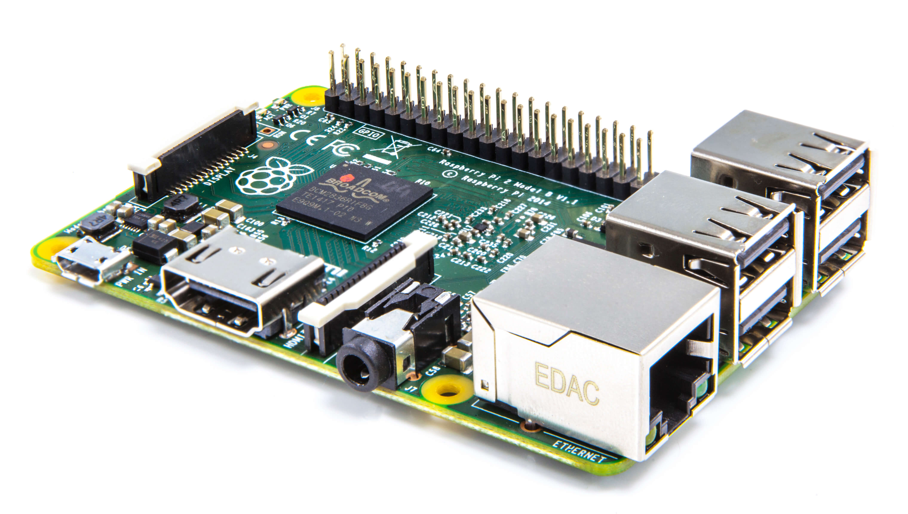

وفي نوفمبر 2015 أصدرت المؤسسة جهاز Raspberry Pi Zero أصغر وأرخص جهاز ذو لوحة واحدة في العالم، بسعر 5 دولار فقط.

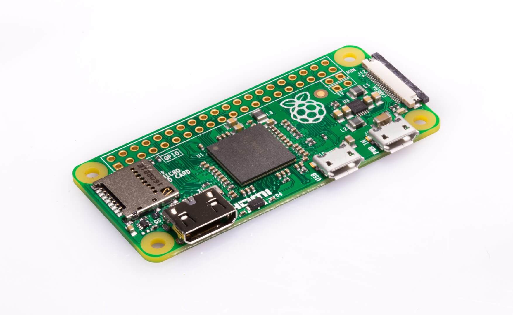

بعد ذلك العام الذهبي ل Raspberry Pi 2016، حيث تم إطلاق Raspberry Pi 3 نقله أخري في تاريخ الأجهزة ذات اللوحة الواحدة من حيث المواصفات، مع الحفاظ على مبدأ السعر المنخفض فكان سعر الجهاز مثل سابقيه 35 دولار أيضا.
ومنذ فبراير 2016 إلى نوفمبر ارتفعت كميات الأجهزة المباعة من 8 مليون إلى 11 مليون وحدة.

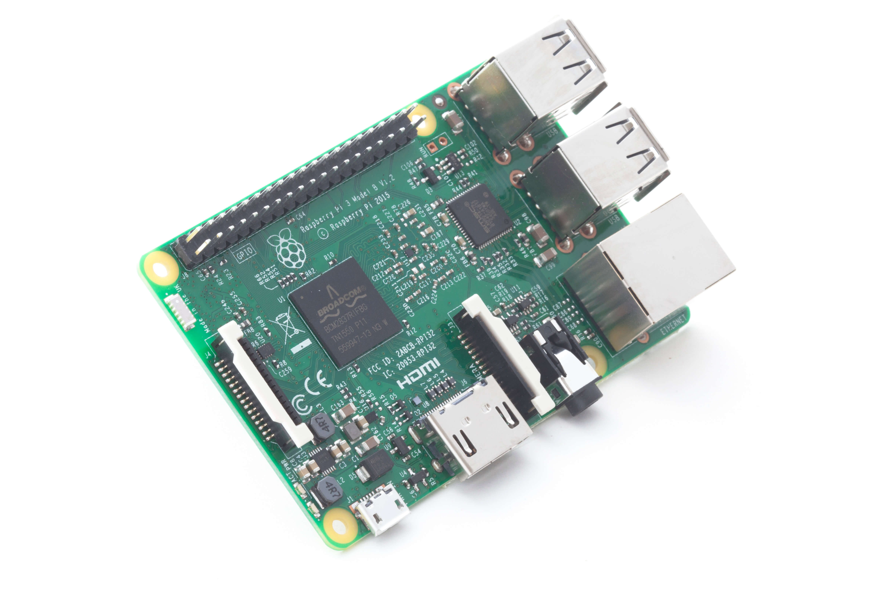

ثم أخر محطة في إصدارات Raspberry Pi، جهاز ال10دولار Raspberry Pi Zero W الذي يعد تطويرا لأخيه الصغير Raspberry Pi Zero.

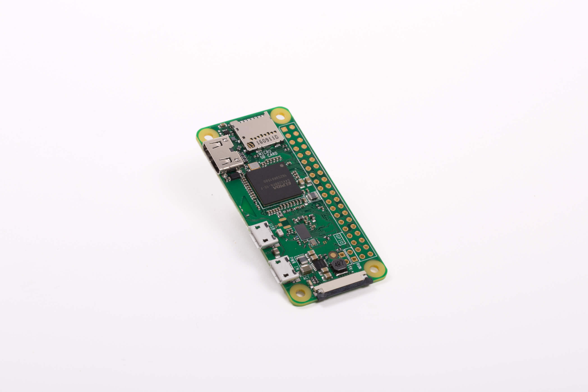

## Rasbperry Pi هي الخيار الأفضل

هناك العديد من الأسباب التي تجعلك تفضل Raspberry Pi عن غيرها من أجهزة اللوحة الواحدة، لعل أبرزها هو

### 1- دعم عدد كبير من أنظمة التشغيل

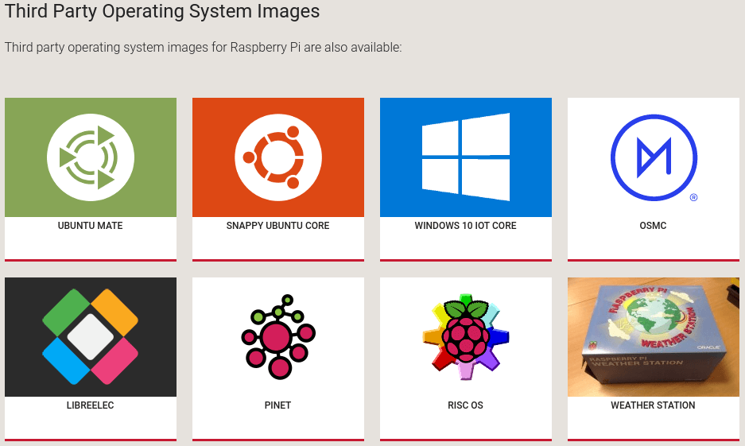

-   Raspbain: توزيعة لينكس مصممة خصيصا لأجهزة Pi مبنية على Debian، تمكنك من استخدام الجهاز مثل أي كمبيوتر كما يمكنك استخدامه في البرمجة والعديد من الأشياء الأخري.
    ويوجد العديد من توزيعات لينكس الأخري مثل Pidora – Archlinux – OpenSuse – Kali Linux – Gentoo - Ubuntu MATE – Slackware
-   Android: بتثبيتك لأندرويد على جهاز Raspberry Pi تستطيع تحويل أي شاشة أو جهاز تلفاز قديم إلى Smart TV وأكثر من ذلك، فنحن نعرف مقدار إمكانيات نظام أندرويد. ويمكنك أيضا تثبيت أنظمة أندرويد المخصصة مثل LineageOS.
-   OpenELEC وهو نظام تشغيل مخصص لاستخدامات الميديا والترفية المنزلي، مبني على Kodi Media Center الشهير، فمن خلاله تستطيع الوصول لمحتوي كبير من صوتيات وفيديو وحتي الصور، لتتمتع بتجربة فريدة.
    كما يوجد أيضا أنظمة تشغيل Xbian – OSMC اللذان يقومان بنفس الأمر.
-   Windows 10 IoT Core: يدعم نظام ويندوز 10 نسخة إنترنت الأشياء جهاز Raspberry Pi ومن خلاله يمكنك دمج اللوحة في المشاريع المختلفة والتحكم بها وبمكوناتها.
-   العديد من أنظمة التشغيل الأخري: مثل RISC OS – NetBSD – Pinet – FreeBSD – Kano - RetroPie

### 2- يمكنك فعل العديد من الأشياء باستخدامها

بعيدا عن أنظمة التشغيل التي توفر هي بذاتها العديد من الاستخدامات مثل:

-   حاسوب محمول أو مكتبي منخفض التكلفة

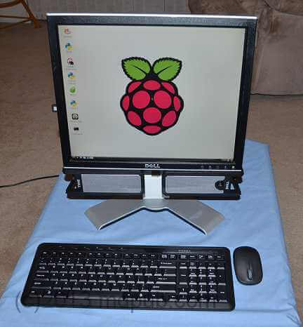

-   سيرفر استضافك موقع
-   سيرفر تخزين سحابي
-   تلفاز الذكي Smart TV
-   أداة ترفيهية عن طريق توزيعات مثل RetroPie التي تمكنك من تشغيل ألعاب أغلب المنصات القديمة من جهاز NES و Sega وحتي أجهزة PSP و Wii.
-   أداة تعليمية لتعلم البرمجة والتعامل مع الإلكترونيات

فيمكنك عمل العديد من المشاريع بواسطة Raspberry Pi التي يمكنك إيجاد المئات بل الآلاف منها عن طريق بحث بسيط على جوجل "Raspberry Pi Projects” وأذكر لك من هذه المشاريع:

-   تصميم نظم التحكم الخاصة بالمنازل الذكية
-   وحدة إدارة نظام الإضاءة المنزلية
-   وحدة إدارة حماية المنزلية
-   صناعة الروبوتات والغواصات وكذلك الطائرات بدون طيار

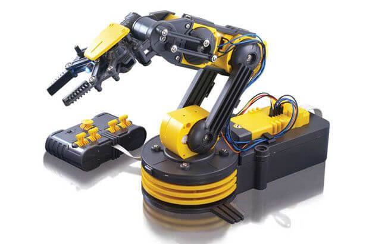

-   تطبيقات المراقبة مثل عمل كاميرات لبث الفيديو والصور عن بعد
-   المراقبة البيئية مثل عمل نظام لمراقبة درجات الحرارة والرطوبة عن بعد

والعديد من الأشياء الأخري التي لا يتسع المقام لذكرها بالتفصيل، والتي سيتم تغطيتها بالتفصيل في العديد من الموضوعات القادمة.

## المستقبل

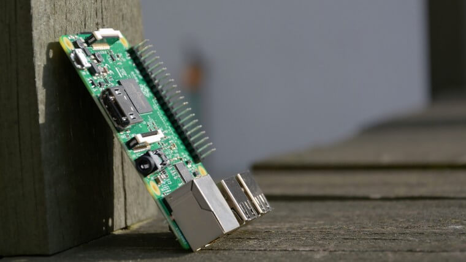

أفادت بعض التقارير في الآونة الأخيرة عن شراكة جوجل مع مؤسسة راسبيري باي، مما سيجعل الإصدار الجديد من الجهاز أفضل بكثير، لكن في نفس الوقت صرح المؤسس Eben Upton بأنه لا إصدارات جديدة من Pi قبل 2019 على أقل تقدير، فقد استمرت Pi 1 لثلاث سنوات ثم Pi 2 لسنة واحدة وPi 3 سوف تستمر ثلاث سنوات أيضا.

إذا لا مشكلة، فمستوي Raspberry Pi الحالي يؤهلها للاستمرار حتي 2019، وحينها دعونا نري ما سيتم تقديمه هذه المرة، فربما يكون نقطة ثورية جديدة في تاريخ أجهزة الكمبيوتر.

---

هذا الموضوع لم ينشر مجلة لغة العصر العدد 207 شهر 03-2018 نظرًا لضيق عدد الصفحات.
