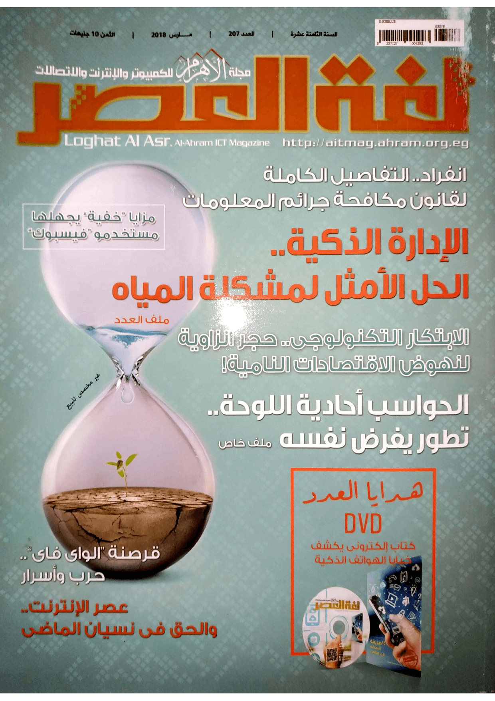
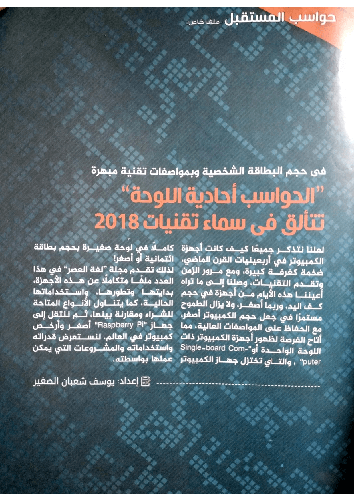

+++
title = "أجهزة الكمبيوتر أحادية اللوحة تتألق في سماء تقنيات 2018"
date = "2018-03-01"
description = "لعلنا نتذكر جميعا كيف كان حجم أجهزة الكمبيوتر في أربعينيات القرن الماضي، ضخمة كغرفة كبيرة، ومع مرور الزمن وتقدم التقنيات وصلنا إلى ما تراه أعيننا هذه الأيام من أجهزة في حجم اليد وربما أصغر،، ولا يزال الطموح مستمرا في جعل حجم الكمبيوتر أصغر مع الحفاظ على المواصفات العالية، مما أتاح الفرصة لظهور أجهزة الكمبيوتر ذات اللوحة الواحدة أو Single-board Computer والتي تختزل جهاز الكمبيوتر كاملًا في لوحة صغيرة بحجم بطاقة ائتمانية أو أصغر!"
categories = ["تقارير",]
tags = ["مجلة لغة العصر"]
series = ["حواسب المستقبل"]
featured = true
+++
لعلنا نتذكر جميعا كيف كان حجم أجهزة الكمبيوتر في أربعينيات القرن الماضي، ضخمة كغرفة كبيرة، ومع مرور الزمن وتقدم التقنيات وصلنا إلى ما تراه أعيننا هذه الأيام من أجهزة في حجم اليد وربما أصغر،، ولا يزال الطموح مستمرا في جعل حجم الكمبيوتر أصغر مع الحفاظ على المواصفات العالية، مما أتاح الفرصة لظهور أجهزة الكمبيوتر ذات اللوحة الواحدة أو Single-board Computer والتي تختزل جهاز الكمبيوتر كاملًا في لوحة صغيرة بحجم بطاقة ائتمانية أو أصغر!

لذلك تقدم "مجلة لغة العصر" في هذا العدد ملفا متكاملا عن هذه الأجهزة، بدايتها وتطورها، واستخداماتها الحالية، كما يتناول أيضا الأنواع المتاحة للشراء ومقارنة بينها، ثم ننتقل إلى جهاز Raspberry Pi، أصغر وأرخص كمبيوتر في العالم، نستعرض قدراته واستخداماته والمشاريع التي يمكن عملها بواسطته.

نظرًا لضخامة محتوى هذا الملف فقد نشرته مقسمًا إلى أجزاء ويمكنك قراءته عبر الروابط التالية:

1. ## [الأجهزة أحادية اللوحة تعود من جديد](/ar/posts/single-board-computers-1/)

2. ## [أنواع أجهزة الكمبيوتر أحادية اللوحة واستخداماتها](/ar/posts/single-board-computers-2/)

3. ## [دليلك الشامل لشراء جهاز كمبيوتر أحادي اللوحة](/ar/posts/single-board-computers-3/)

4. ## [Raspberry Pi.. نقطة تحول في تاريخ أجهزة الكمبيوتر](/ar/posts/single-board-computers-4/)

---

هذا الموضوع نُشر باﻷصل في مجلة لغة العصر العدد 207 شهر 03-2018 ويمكن الإطلاع عليه [هنا](https://drive.google.com/file/d/1L2Z49tW6T_h5l6elhcMINPlf6jweLYAg/view?usp=sharing).

