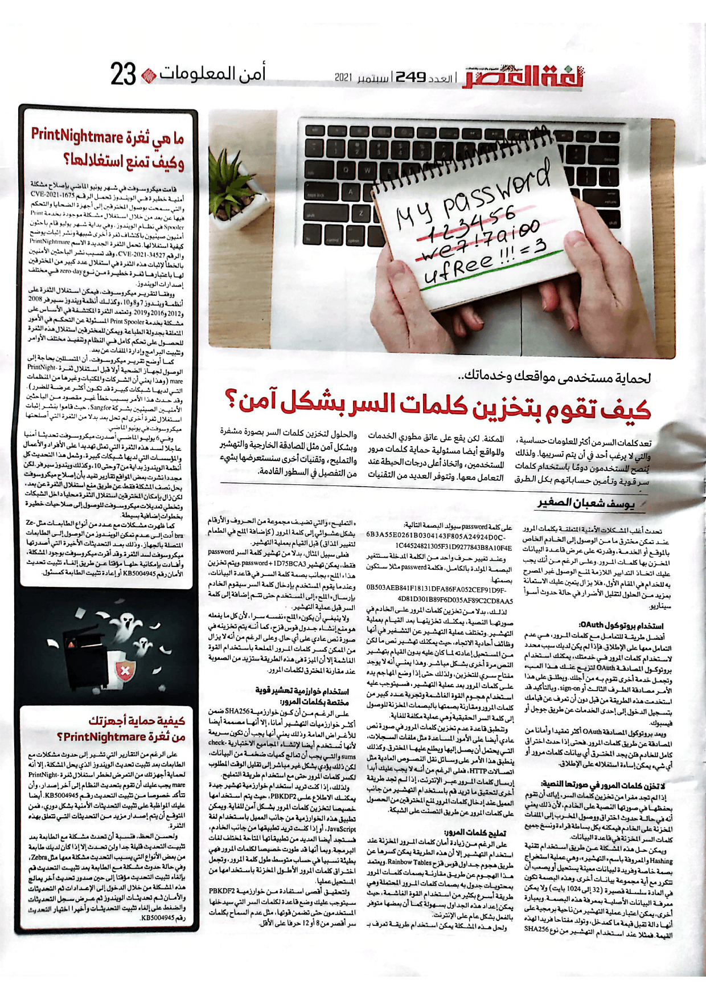

+++
title = "كيف تقوم بتخزين كلمات السر بشكل آمن؟"
date = "2021-09-01"
description = "تعد كلمات السر من أكثر المعلومات حساسية والتي لا يرغب أحد في أن يتم تسريبها. ولذلك ينصح المستخدمين دومًا باستخدام كلمات سر قوية وتأمين حساباتهم بكل الطرق الممكنة. لكن أيضا يقع على عاتق مطوري الخدمات والمواقع مسؤولية حماية كلمات مرور المستخدمين واتخاذ أعلى درجات الحيطة عند التعامل معها. وتتوفر العديد من التقنيات والحلول لتخزين كلمات السر بصورة مشفرة وبشكل آمن مثل المصادقة الخارجية والتهشير والتمليح، وتقنيات أخرى سنستعرضها بشيء من التفصيل في السطور القادمة."
categories = ["اﻷمن الرقمي",]
tags = ["مجلة لغة العصر"]

+++

تعد كلمات السر من أكثر المعلومات حساسية والتي لا يرغب أحد في أن يتم تسريبها. ولذلك ينصح المستخدمين دومًا باستخدام كلمات سر قوية وتأمين حساباتهم بكل الطرق الممكنة. لكن أيضا يقع على عاتق مطوري الخدمات والمواقع مسؤولية حماية كلمات مرور المستخدمين واتخاذ أعلى درجات الحيطة عند التعامل معها. وتتوفر العديد من التقنيات والحلول لتخزين كلمات السر بصورة مشفرة وبشكل آمن مثل المصادقة الخارجية والتهشير والتمليح، وتقنيات أخرى سنستعرضها بشيء من التفصيل في السطور القادمة.

تحدث أغلب المشاكل الأمنية المتعلقة بكلمات المرور عند تمكن مخترق ما من الوصول إلى الخادم الخاص بالموقع أو الخدمة، وقدرته على عرض قاعدة البيانات المخزن بها كلمات المرور. وعلى الرغم من أنك يجب عليك اتخاذ التدابير اللازمة لمنع الوصول غير المصرح به للخدام في المقام الأول، فلا يزال يتعين عليك الاستعانة بمزيد من الحلول لتقليل الأضرار في حالة حدوث أسوأ سيناريو.

## استخدام برتوكول OAuth

أفضل طريقة للتعامل مع كلمات المرور، هي عدم التعامل معها على الإطلاق. فإذا لم يكن لديك سبب محدد لاستخدام كلمات المرور في خدمتك، يمكنك استخدام بروتوكول المصادقة OAuth لتزيح عنك هذا العبء وتجعل خدمة أخرى تقوم به من أجلك. ويطلق على هذا الأمر مصادقة الطرف الثالث أو sign-on، وبالتأكيد قد استخدمت هذه الطريقة من قبل دون أن تعرف عن قيامك بتسجيل الدخول إلى إحدى الخدمات عن طريق جوجل أو الفيسبوك.

ويعد بروتوكول المصادقة OAuth أكثر تعقيدًا وأمانًا من المصادقة عن طريق كلمات المرور. فحتى إذا حدث اختراق كامل للخادم فلن يجد المخترق أي بيانات كلمات مرور أو أي شيء يمكن إساءة استغلاله على الإطلاق.

## لا تخزن كلمات المرور في صورتها النصية

إذا لم تجد مفرًا من تخزين كلمات السر، إياك أن تقوم بحفظها في صورتها النصية على الخادم، لأن ذلك يعني أنه في حالة حدوث اختراق ووصول المخرب إلى الملفات المخزنة على الخادم فيمكنه بكل بساطة قراءة ونسخ جميع كلمات السر المخزنة في قاعدة البيانات.

ويمكن حل هذه المشكلة عن طريق استخدام تقنية Hashing والمعروفة باسم "التهشير"، وهي عملية استخراج بصمة خاصة وفريدة لبيانات معينة يستحيل أو يصعب أن تتكرر مع أية مجموعة بيانات أخرى. وهذه البصمة تكون في العادة سلسلة قصيرة (32 إلى 1024 بايت) ولا يمكن معرفة البيانات الأصلية بمعرفة هذه البصمة.

وبعبارة أخرى، يمكن اعتبار عملية التهشير من ناحية برمجية على أنها دالة تقبل قيمة ما كمدخل، وتولد مفتاح فريد لهذه القيمة. فمثلًا عند استخدام التهشير من نوع SHA256 على كلمة password سيولد البصمة التالية:

6B3A55E0261B0304143F805A24924D0C1C44524821305F31D9277843B8A10F4E
وعند تغيير حرف واحد من الكلمة المدخلة ستتغير البصمة المولدة بالكامل، فكلمة passwerd مثلا ستكون بصمتها:

0B503AEB841F18131DFA86FA052CEF91D9F4D81D301B89F6D035AF89C2CD8AA5
لذلك، بدلاً من تخزين كلمات المرور على الخادم في صورتها النصية، يمكنك تخزينها بعد القيام بعملية التهشير. وتختلف عملية التهشير عن التشفير في أنها وظائف أحادية الاتجاه، حيث يمكنك تهشير نص ما لكن من المستحيل إعادته لما كان عليه بدون القيام بتهشير النص مرة أخرى بشكل مباشر. وهذا يعني أنه لا يوجد مفتاح سري للتخزين، ولذلك حتى إذا وضع المهاجم يده على كلمات المرور بعد عملية التهشير، فسيتوجب عليه استخدام هجوم القوة الغاشمة وتجربة عدد كبير من كلمات المرور ومقارنة بصمتها بالبصمات المخزنة للوصول إلى كلمة السر الحقيقية وهي عملية مكلفة للغاية.

وتنطبق قاعدة عدم تخزين كلمات المرور في صورة نص عادي أيضًا على الأمور المساعدة مثل ملفات السجلات، التي يحتمل أن يصل إليها ويطلع عليها المخترق. وكذلك ينطبق هذا الأمر على وسائل نقل النصوص العادية مثل اتصالات HTTP، فعلى الرغم من أنه لا يجب عليك أبدًا إرسال كلمات المرور عبر الإنترنت، إذا لم تجد طريقة أخرى لتحقيق ما تريد قم باستخدام التهشير من جانب العميل عند إدخال كلمات المرور لمنع المخترقين من الحصول على كلمات المرور عن طريق التصنت على الشبكة.

## تمليح كلمات المرور

على الرغم من زيادة أمان كلمات المرور المخزنة عند استخدام التهشير إلا أن هذه الطريقة يمكن كسرها عن طريق هجوم جداول قوس قزح Rainbow Tables. ويعتمد هذا الهجوم عن طريق مقارنة بصمات كلمات المرور بمحتويات جدول به بصمات كلمات المرور المحتملة وهي طريقة أسرع بكثير من استخدام القوة الغاشمة حيث يمكن إعداد هذه الجداول بسهولة كما أن بعضها متوفر بالفعل بشكل عام على الإنترنت.

ولحل هذه المشكلة يمكن استخدام طريقة تعرف ب "التمليح" والتي تضيف مجموعة من الحروف والأرقام بشكل عشوائي إلى كلمة المرور (كإضافة الملح في الطعام لتغيير المذاق) قبل القيام بعملية التهشير.

فعلى سبيل المثال، بدلا من تهشير كلمة السر password فقط، يمكن تهشير password + 1D75BCA3. ويتم تخزين هذا "الملح" بجانب بصمة كلمة السر في قاعدة البيانات، وعندما يقوم المستخدم بإدخال كلمة السر سيقوم الخادم بإرسال "الملح" إلى المستخدم حتى تتم إضافة إلى كلمة السر قبل عملية التهشير.

ولا ينبغي أن يكون "الملح" نفسه سرًا، لأن كل ما يفعله هو منع إنشاء جدول قوس قزح. كما أنه يتم تخزينه في صورة نص عادي على أي حال. وعلى الرغم من أنه لا يزال من الممكن كسر كلمات المرور المملحة باستخدام القوة الغاشمة إلا أن الميزة هذه الطريقة ستزيد من الصعوبة عند مقارنة المخترق لكلمات المرور.

## استخدام خوارزمية تهشير قوية مختصة بكلمات المرور

على الرغم من أن كون خوارزمية SHA256 ضمن أكثر خوارزميات التهشير أمانا، إلا أنها مصممة أيضًا للأغراض العامة. وذلك يعني أنها يجب أن تكون سريعة لأنها تُستخدم أيضًا لإنشاء المجاميع الاختبارية checksums والتي يجب أن تعالج كميات ضخمة من البيانات. لكن ذلك يؤدي بشكل غير مباشر إلى تقليل الوقت المطلوب لكسر كلمات المرور حتى مع استخدام طريقة التمليح.

ولذلك، إذا كنت تريد استخدام خوارزمية تهشير جيدة يمكنك الاطلاع على PBKDF2، حيث يتم استخدامها خصيصًا لتخزين كلمات المرور بشكل آمن للغاية. ويمكن تطبيق هذه الخوارزمية من جانب العميل باستخدام لغة JavaScript، أو إذا كنت تريد تطبيقها من جانب الخادم، فستجد أيضًا العديد من تطبيقاتها المتاحة لمختلف لغات البرمجة. وبما أنها قد طورت خصيصًا لكلمات المرور فهي بطيئة نسبيًا في حساب متوسط طول كلمة المرور، وتجعل اختراق كلمات المرور الأطول المخزنة باستخدامها من المستحيل عمليًا.

ولتحقيق أقصى استفادة من خوارزمية PBKDF2 سيتوجب عليك وضع قاعدة لكلمات السر التي سيدخلها المستخدمون حتى تضمن قوتها، مثل عدم السماح بكلمات سر أقصر من 8 أو 12 حرف على الأقل.

---

هذا الموضوع نُشر باﻷصل في مجلة لغة العصر العدد 249 شهر 09-2021 ويمكن الإطلاع عليه [هنا](https://drive.google.com/file/d/1ovpFNEGB96_W2rG0fCEtRL9uRwCnGb-t/view?usp=sharing).

