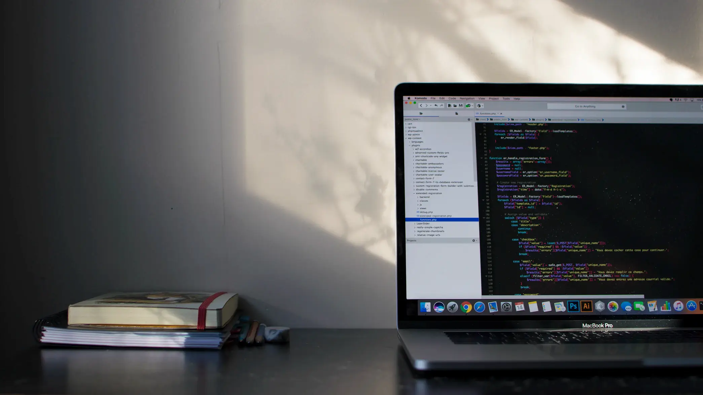
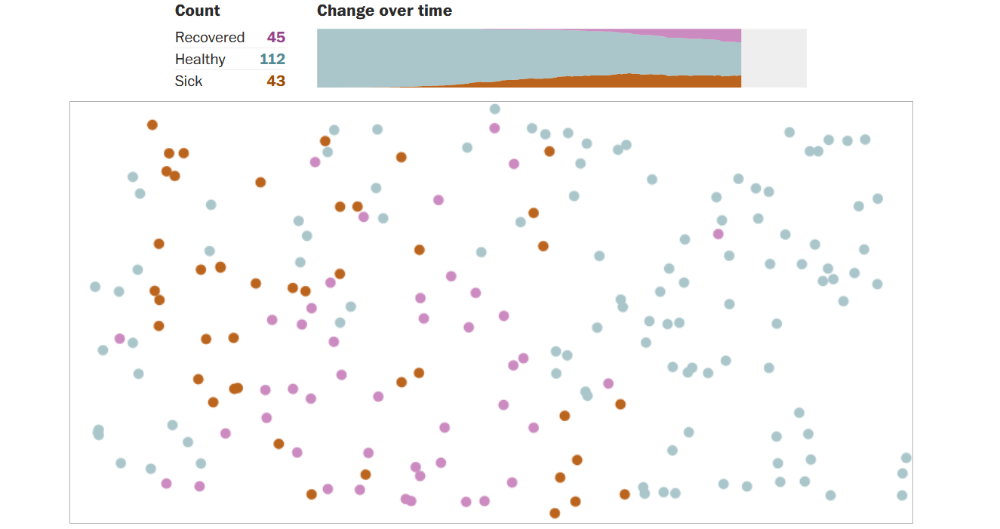
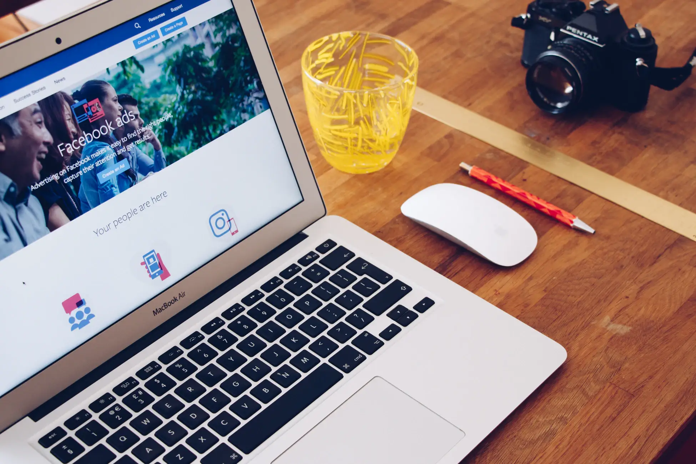
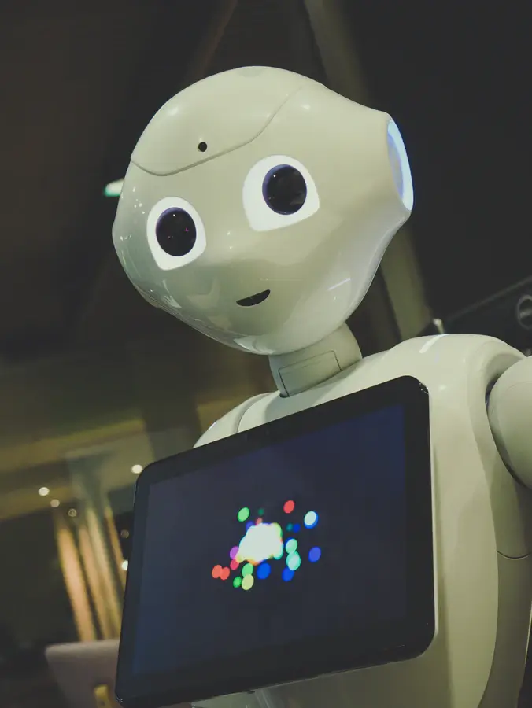
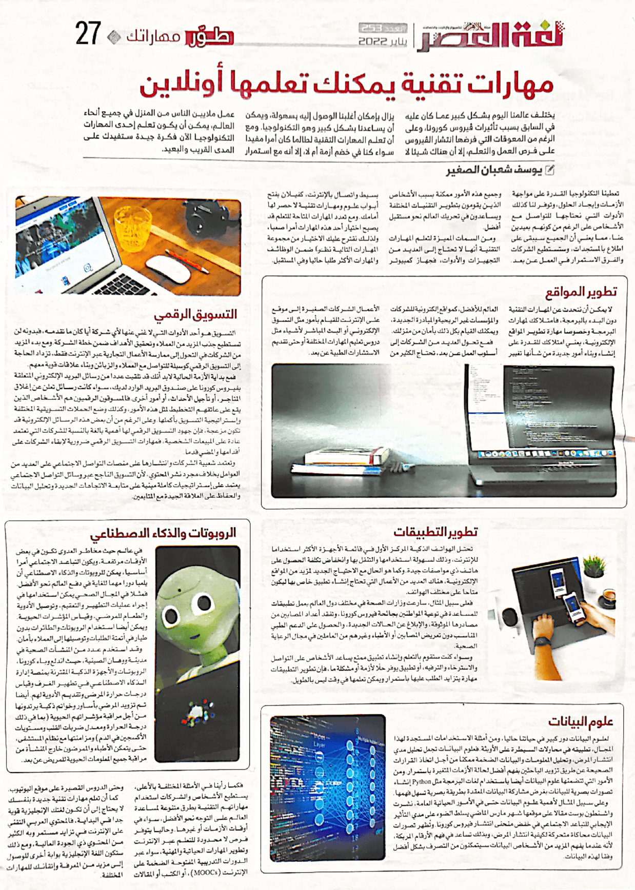

+++
title = "مهارات تقنية يمكنك تعلمها أونلاين"
date = "2022-01-01"
description = "يختلف عالمنا اليوم بشكل كبير عما كان عليه في السابق بسبب تأثيرات فيروس كورونا. وعلى الرغم من المعوقات التي فرضها انتشار الفيروس على فرص العمل والتعلم إلا أن هناك شيء لا يزال بإمكان أغلبنا الوصول إليه بسهولة، ويمكن أن يساعدنا بشكل كبير وهو التكنولوجيا. ومع أن تعلم المهارات التقنية لطالما كان أمرًا مفيدًا سواء كنا في خضم أزمة أم لا، إلا أنه مع استمرار عمل الملايين من الناس من المنزل في جميع أنحاء العالم، يمكن أن يكون تعلم إحدى مهارات التكنولوجيا الآن فكرة جيدة ستفيدك على المدي القريب والبعيد."
categories = ["مهارات رقمية",]
tags = ["مجلة لغة العصر"]

+++

يختلف عالمنا اليوم بشكل كبير عما كان عليه في السابق بسبب تأثيرات فيروس كورونا. وعلى الرغم من المعوقات التي فرضها انتشار الفيروس على فرص العمل والتعلم إلا أن هناك شيء لا يزال بإمكان أغلبنا الوصول إليه بسهولة، ويمكن أن يساعدنا بشكل كبير وهو التكنولوجيا. ومع أن تعلم المهارات التقنية لطالما كان أمرًا مفيدًا سواء كنا في خضم أزمة أم لا، إلا أنه مع استمرار عمل الملايين من الناس من المنزل في جميع أنحاء العالم، يمكن أن يكون تعلم إحدى مهارات التكنولوجيا الآن فكرة جيدة ستفيدك على المدي القريب والبعيد.

# مقدمة

تعطينا التكنولوجيا القدرة على مواجهة الأزمات وإيجاد الحلول، وتوفر لنا كذلك الأدوات التي نحتاجها للتواصل مع الأشخاص على الرغم من كونهم بعيدين عنا، مما يعني أن الجميع سيبقى على اطلاع بالمستجدات وستستطيع الشركات والفرق الاستمرار في العمل عن بعد. وجميع هذه الأمور ممكنة بسبب الأشخاص الذين يقومون بتطوير التقنيات المختلفة ويساعدون في تحريك العالم نحو مستقبل أفضل.

ومن السمات المميزة لتعلم المهارات التقنية أنها لا تحتاج إلى العديد من التجهيزات والأدوات، فجهاز كمبيوتر بسيط واتصال بالإنترنت كفيلان بفتح أبواب علوم ومهارات تقنية لا حصر لها أمامك. ومع تعدد المهارات المتاحة للتعلم قد يصبح اختيار أحد هذه المهارات أمرا صعبا، ولذلك نتقرح عليك الاختيار من مجموعة المهارات التالية نظرا ضمن الوظائف والمهارات الأكثر طلبا حاليا وفي المستقبل.

# تطوير المواقع

لا يمكن أن نتحدث عن المهارات التقنية دون البدء بالبرمجة، فامتلاكك لمهارات البرمجة وخصوصا مهارة تطوير المواقع الإلكترونية، يعني امتلاكك للقدرة على إنشاء وبناء أمور جديدة من شأنها تغيير العالم للأفضل، كمواقع إلكترونية للشركات والمؤسسات غير الربحية والمبادرة الجديدة، ويمكنك القيام بكل ذلك بأمان من منزلك.

فمع تحول العديد من الشركات إلى أسلوب العمل عن بعد، تحتاج الكثير من الأعمال الشركات الصغيرة إلى موقع على الإنترنت للقيام بأمور مثل التسوق الإلكتروني أو البث المباشر لأشياء مثل دروس تعليم المهارات المختلفة أو حتى تقديم الاستشارات الطبية عن بعد.

# تطوير التطبيقات

تحتل الهواتف الذكية المركز الأول في قائمة الأجهزة الأكثر استخداما للإنترنت وذلك لسهولة استخدامها والتنقل بها وانخفاض تكلفة الحصول على هاتف ذو مواصفات جيدة. وكما هو الحال مع الاحتياج الجديد لمزيد من المواقع الإلكترونية، هناك العديد من الأعمال التي تحتاج إنشاء تطبيق خاص بها ليكون متاحا على مختلف الهواتف.

فعلى سبيل المثال، سارعت وزارات الصحة في مختلف دول العالم بعمل تطبيقات للمساعدة في توعية المواطنين بجائحة فيروس كورونا وتفقد أعداد المصابين من مصادرها الموثوقة والإبلاغ عن الحالات الجديدة والحصول على الدعم الطبي المناسب دون تعريض المصابين أو الأطباء وغيرهم من العاملين في مجال الرعاية الصحية.

وسواء كنت ستقوم بالتعلم وإنشاء تطبيق ممتع يساعد الأشخاص على التواصل والاسترخاء والترفيه، أو تطبيق يوفر حلًا لأزمة أو مشكلة ما، فإن تطوير التطبيقات مهارة يتزايد الطلب عليها باستمرار ويمكن تعلمها في وقت ليس بالطويل.

# علوم البيانات

لعلوم البيانات دور كبير في حياتنا حاليًا، ومن أمثلة الاستخدامات المستجدة لهذا المجال، تطبيقه في محاولات السيطرة على الأوبئة. فعلوم البيانات تجعل تحليل مدي انتشار المرض، وتحليل المعلومات والبيانات الضخمة ممكنا من أجل اتخاذ القرارات الصحيحة عن طريق تزويد الباحثين بفهم أفضل لحالة الأزمات المتغيرة باستمرار. ومن الأمور التي تتضمنها علوم البيانات أيضا باستخدام لغات البرمجة مثل Python إنشاء تصورات بصرية للبيانات بغرض مشاركة البيانات المعقدة بطريقة بصرية تسهل فهمها.

وعلى سبيل المثال لأهمية علوم البيانات حتى في الأمور الحياتية العامة، نشرت واشنطون بوست مقالًا على موقعها شهر مارس الماضي يسلط الضوء على مدي التأثير الإيجابي للتباعد الاجتماعي في خفض منحنى انتشار فيروس كورونا. وتُظهر تصورات البيانات محاكاة متحركة لكيفية انتشار المرض وبذلك تساعد في فهم الأرقام المربكة، لأنه عندما يفهم المزيد من الأشخاص البيانات سيتمكنون من التصرف بشكل أفضل وفقًا لهذه البيانات.

# التسويق الرقمي

التسويق هو أحد الأدوات التي لا غني عنها لأي شركة أيًا كان ما تقدمه، فبدونه لن تستطيع جذب المزيد من العملاء وتحقيق الأهداف ضمن خطة الشركة. ومع بدء المزيد من الشركات في التحول إلى ممارسة الأعمال التجارية عبر الإنترنت فقط، تزداد الحاجة إلى التسويق الرقمي كوسيلة للتواصل مع العملاء والزبائن وبناء علاقات قوية معهم.

فمع بداية الأزمة الحالية لا بد أنك قد تلقيت عددا من رسائل البريد الإلكتروني المتعلقة بفيروس كورونا على صندوق البريد الوارد لديك، سواء كانت رسائل تعلن عن إغلاق المتاجر، أو تأجيل الأحداث، أو أمور أخرى. فالمسوقون الرقميون هم الأشخاص الذين يقع على عاتقهم التخطيط لمثل هذه الأمور، وكذلك وضع الحملات التسويقية المختلفة واستراتيجية التسويق بأكملها. وعلى الرغم من أن بعض هذه الرسائل الإلكترونية قد تكون مزعجة، فإن جهود التسويق الرقمي لها أهمية بالغة بالنسبة للشركات التي تعتمد عادةً على المبيعات الشخصية، فمهارات التسويق الرقمي ضرورية لإبقاء الشركات على أقدامها والمضي قدمًا.

وتعتمد شعبية الشركات وانتشارها على منصات التواصل الاجتماعي على العديد من العوامل بخلاف مجرد نشر المحتوي، لأن التسويق الناجح عبر وسائل التواصل الاجتماعي يعتمد على استراتيجيات كاملة مبنية على متابعة الاتجاهات الجديدة وتحليل البيانات والحفاظ على العلاقة الجيدة مع المتابعين.

# الروبوتات والذكاء الاصطناعي

في عالم حيث مخاطر العدوى تكون في بعض الأوقات مرتفعة ويكون التباعد الاجتماعي أمرًا أساسيًا، يمكن للروبوتات والذكاء الاصطناعي أن يلعبا دورًا هامًا للغاية في دفع العالم نحو الأفضل. فمثلا في المجال الصحي يمكن استخدامها في إجراء عمليات التطهير والتعقيم، وتوصيل الأدوية والطعام للمرضي، وقياس المؤشرات الحيوية. ويمكن أيضا استخدام الروبوتات والطائرات بدون طيار في أتمتة الطلبات وتوصيلها إلى العملاء بأمان.

وقد استخدم عدد من المنشئات الصحية في مدينة ووهان الصينية، حيث اندلع وباء كورونا، الروبوتات والأجهزة الذكية المقترنة بمنصة إدارة الذكاء الاصطناعي في تطهير الغرف وقياس درجات حرارة المرضى وتقديم الأدوية لهم. أيضا تم تزويد المرضي بأساور وخواتم ذكية يرتدونها من أجل مراقبة مؤشراتهم الحيوية (بما في ذلك درجة الحرارة ومعدل ضربات القلب ومستويات الأكسجين في الدم) ومزامنتها مع نظام المستشفى حتى يتمكن الأطباء والممرضين خارج المنشأة من مراقبة جميع المعلومات الحيوية للمريض عن بعد.

# خاتمة

كما رأينا في الأمثلة المختلفة بالأعلى، يستطيع الأشخاص والشركات استخدام مهاراتهم التقنية بطرق متنوعة لمساعدة العالم على التوجه نحو الأفضل، سواء في أوقات الأزمات أو غيرها. وحاليا يتوفر فرص لا محدودة للتعلم عبر الإنترنت وتطوير المهارات الحياتية والمهنية، سواء عبر الدورات التدريبية المفتوحة الضخمة على الإنترنت (MOOCs)، أو الكتب أو المقالات وحتى الدروس القصيرة على موقع اليوتيوب.

كما أن تعلم مهارات تقنية جديدة بنفسك لا يحتاج إلى أن تكون لغتك الإنجليزية قوية جدا في البداية، فالمحتوي العربي التقني على الإنترنت في تزايد مستمر وبه الكثير من المحتوي ذو الجودة العالية، ومع ذلك ستكون اللغة الإنجليزية بوابة أخرى للوصول إلى مزيد من المعرفة وإتقانك للمهارات المختلفة.

---

هذا الموضوع نُشر باﻷصل في مجلة لغة العصر العدد 253 شهر 01-2022 ويمكن الإطلاع عليه [هنا](https://drive.google.com/file/d/1sG1Z8Uukgy41SQ1QoiFK27BM7iXO25MS/view?usp=sharing).

