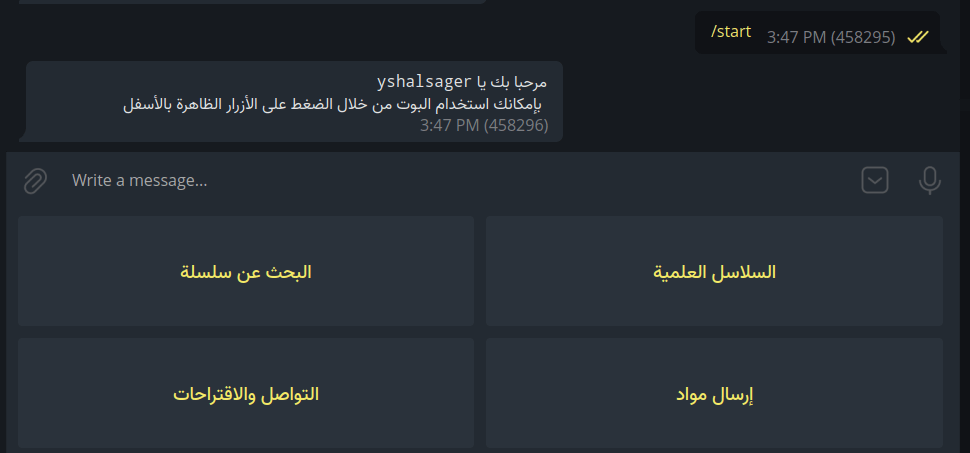

+++
author = "yshalsager"
title = "بوتات الدروس العلمية والعلوم الشرعية على تليجرام: طريقة لجعل حياة الناس أسهل"
date = "2022-03-24"
description = "إذا لم تكن قد سمعت به من قبل، فتليجرام هو واحد من أفضل منصات التواصل الموجودة حاليًا بسبب الميزات الكثيرة التي يقدمها واحترام المستخدم عكس أغلب المنصات اﻷخرى. وبسبب هذه الميزات تجد على تليجرام العديد من القنوات والمجموعات والبوتات المهتمة بالعلوم الشرعية لتسهيل وصول الناس إلى المحتوى وتقديمه بطريقة مرتبة ومنظمة. وهنا يأتي دور بوتات تليجرام التي يمكنها القيام بأي شيء تقريبا يحدده المطور وتقديم خدمة لها هدف محدد للأشخاص على المنصة. سأستعرض معكم في السطور التالية بعض هذه البوتات ولماذا تجعل حياة الناس أسهل، ولماذا عملت على بوت مفتوح المصدر لعرض الدروس العلمية."
categories = ["مشاريعي"]
tags = ["المدونة",]

+++

إذا لم تكن قد سمعت به من قبل، ف[تليجرام](https://telegram.org/?setln=a) هو واحد من أفضل منصات التواصل الموجودة حاليًا بسبب الميزات الكثيرة التي يقدمها واحترام المستخدم عكس أغلب المنصات اﻷخرى. وبسبب هذه الميزات تجد على تليجرام العديد من القنوات والمجموعات والبوتات المهتمة بالعلوم الشرعية لتسهيل وصول الناس إلى المحتوى وتقديمه بطريقة مرتبة ومنظمة. وهنا يأتي دور بوتات تليجرام التي يمكنها القيام بأي شيء تقريبا يحدده المطور وتقديم خدمة لها هدف محدد للأشخاص على المنصة. سأستعرض معكم في السطور التالية بعض هذه البوتات ولماذا تجعل حياة الناس أسهل، ولماذا عملت على بوت مفتوح المصدر لعرض الدروس العلمية.

## ما هي البوتات؟

وفقًا [لموقع تليجرام](https://telegram.org/faq?setln=ar#h) فإن:

> البوتات هي كالبرامج الصغيرة، تعمل مباشرةً داخل تيليجرام. يتم صناعتها من قبل مطورين مستقلين عن تيليجرام باستخدام واجهة تيليجرام البرمجية الخاصة بالبوتات.

باختصار، هي حسابات داخل تليجرام يستطيع أي مطور إنشاءها وتوفير أي أمر يريده للمستخدمين، سواء كان إرسال تنبيهات بالطقس، أو بيع المنتجات، أو إدارة المجموعات، أو معرفة أسعار تحويل العملات، أو البحث عن الملفات، أو التواصل مع أعضاء المجموعات والقنوات دون استخدام الحساب الشخصي إلخ.

## نماذج من البوتات

هناك العديد من البوتات المفيدة على تليجرام، ولكن موضوعنا اليوم يقتصر على البوتات التي تقدم خِدْمَات ذات صلة بالعلوم الشرعية والدروس العلمية، ومن أفضل البوتات التي جربتها على تليجرام والتي تقدم هذه الخِدْمَات:

|                            البوت                             |                     الخدمة التي يقوم بها                     |
| :----------------------------------------------------------: | :----------------------------------------------------------: |
|      [بوت القرآن الكريم](https://t.me/IslamicQuranBot)       |           الاستماع إلى القرآن الكريم بصوت أي قارئ.           |
|    [بوت موسوعة القرآن الكريم](https://t.me/AlTafseerBot)     |    محرك بحث عن آيات القرآن مع إمكانية عرض تفاسير مختلفة.     |
|        [بوت الباحث القرآني](https://t.me/AlQurannBot)        |       عرض تفاسير ومعاني وإعرابات وصوتيات وصور الآيات.        |
|      [بوت الموسوعة الحديثية](https://t.me/AlHadithBot)       | البحث عن الأحاديث النبوية الشريفة ومعرفة درجة الصحة مع الراوي والمصدر. |
|      [بوت البوابة الحديثية](https://t.me/HadithGateBot)      | مثل السابق، يبحث في موقع [الدرر السنية](https://dorar.net).  |
|        [بوت الباحث الشامل](https://t.me/albaahthbot)         |   البحث داخل مئات قنوات الكتب والكتب الصوتية على تليجرام.    |
| [بوت الدروس العلمية \(تابع للباحث الشامل\)](https://t.me/Droossbot) | البحث داخل مئات آلاف الدروس العلمية لعلماء أهل السنة والجماعة في مختلف التخصصات الشرعية بالاعتماد على قنوات [مشروع علم](https://t.me/Elmm11). |

## لماذا تجعل هذه البوتات حياة الناس أسهل؟

أظن أن استعراض هذه النماذج القليلة السابقة قد أعطاك فكرة عن مدى قوة ما يمكن أن تقوم به هذه البوتات. فقط مثال واحد هو بوت الباحث الشامل - والذي أعدك أنه سيعجبك بمجرد أن تستخدمه - يوفر طريقة سهلة لمئات الآلاف من المستخدمين للوصول إلى عدد ضخم من الكتب دون عناء، ودون إعلانات ولا أي إزعاج.

فيمكن للمطورين باﻹعتماد على اﻷدوات التي توفرها منصة تليجرام بناء بوتات تقوم بكل اﻷمور المعقدة التي يمكنك تخيلها، وتوفير الوصول إلى هذه اﻷمور لعدد كبير من المستخدمين بسهولة ودون تعقيد إذ لا يتطلب تطوير بوتات تليجرام إلا بعض الخبرة في البرمجة، ويمكن للمطور كتابة البوتات باللغة التي يريدها، وهناك العديد من مكتبات اﻷكواد التي توفر طريقة سهلة للتعامل مع واجهة تطوير بوتات تليجرام.

## مشروع بوت الدروس العلمية

بوت الدروس العلمية هو [مشروع مفتوح المصدر](https://github.com/yshalsager/droos_bot) بدأت العمل عليه منذ شهر ونصف تقريبًا غرضه توفير طريقة منظمة وسهلة لعرض المواد العلمية لبعض المشايخ، وفي نفس الوقت تكون سهلة التعديل بالنسبة إلى المشرفين على البوت.

وكما هي عادة مشاريعي السابقة: فهذا البوت مكتوب بلغة بايثون أيضا :) ويستخدم عددًا من المكتبات البرمجية مثل:

- [python-telegram-bot](https://github.com/python-telegram-bot/python-telegram-bot/)
- [python-telegram-bot-pagination](https://github.com/ksinn/python-telegram-bot-pagination)
- [gspread](https://github.com/burnash/gspread)
- [gspread-pandas](https://github.com/aiguofer/gspread-pandas)

### كيفية استخدام البوت

يمكن للمستخدم بدأ استخدام البوت عن طريق الضغط على زر start أو البَدْء، ثم استخدم لوحة اﻷزرار لاستخدام وظائف البوت المختلفة مثل "السلاسل العلمية - البحث عن سلسلة - إرسال مواد - التواصل والإقتراحات".

**ملاحظة:** في نهاية الموضوع هناك نموذج لبوت يستخدم هذا المشروع إن أحببت أن تجربه :)

### كيف يعمل هذا البوت؟

 يعتمد البوت على [Google Sheet](https://docs.google.com/spreadsheets/d/1o2016c9JQDROnhAhveKq70pF07_FozozP2xF7ekijTM/edit?usp=sharing) يقوم المشرفين والمتطوعين بوضع معلومات الدروس العلمية داخلها بالشكل التالي:

| slug        | id        | series           | lecture      | book                                             | main                                             | video                                            | voice                                            | text                                             | summary |
| ----------- | --------- | ---------------- | ------------ | ------------------------------------------------ | ------------------------------------------------ | ------------------------------------------------ | ------------------------------------------------ | ------------------------------------------------ | ------- |
| كود السلسلة | كود الدرس | اسم السلسلة      | رقم المحاضرة | كتاب                                             | أهم المحاور                                      | مرئي                                             | صوتي                                             | تفريغ                                            | تلخيص   |
| har_nwt     | har_nwt1  | سلسلة دروس تفسير | 1            | [https://t.me/channel/4](https://t.me/channel/4) | [https://t.me/channel/4](https://t.me/channel/4) | [https://t.me/channel/4](https://t.me/channel/4) | [https://t.me/channel/4](https://t.me/channel/4) | [https://t.me/channel/4](https://t.me/channel/4) |         |

- slug: كود السلسلة: معرف فريد لكل سلسلة دروس.
- id: كود الدرس: يولد تِلْقائيًا من كود السلسلة + رَقَم المحاضرة
- series: اسم السلسلة: اسم سلسلة الدروس
- lecture: رقم المحاضرة: رقم الدرس داخل سلسلة الدروس
- book: الكتاب: رابط تليجرام لملف PDF الكتاب الذي يشرح في السلسلة أو صوت أو فيديو أو مستند به أهم محاور الدرس
- main: أهم المحاور: رابط تليجرام لصورة أو صوت أو فيديو أو مستند به أهم محاور الدرس
- video: مرئي: رابط تليجرام لنسخة الفيديو من الدرس
- voice: صوتي: رابط تليجرام للنسخة الصوتية من الدرس
- text: تفريغ: رابط تليجرام لمستند تفريغ الدرس
- summary: تلخيص: رابط تليجرام لمستند ملخص الدرس

ثم يقرأ البوت هذه البيانات ويعرضها مقسمة إلى صفحات، ويرسل المواد مباشرة للمستخدم عن طريق ال id الخاص بكل مِلَفّ دون
الحاجة لرفع الملفات كل مرة يرسل فيها.

#### تحدي

التحدي الأكبر كان جلب المعرف id الخاص بالملفات، إذ يبدو أن تليجرام يعين file id مختلف لكل ملف بكل حساب أو بوت.

وحلت المشكلة عن طريق:

- إضافة وظيفة للبوت تقوم عندما يرسل حساب مشرف البوت ملف إليه سيرد البوت بال file id الخاص بهذا الملف.
- عمل أداة لأتمتة حساب شخصي، يقرأ روابط الملفات الموجودة على تليجرام من نفس Google Sheet ثم يرسلها للبوت ويقرأ رد البوت ثم يستبدل الرابط بالid داخل Google Sheet، وربط هذه اﻷداة بأمر لتحديث بيانات البوت `/update` بحيث لا يضطر المشرف على البوت لتشغيل أي أكواد بنفسه.

### ميزات البوت

- عرض سلاسل الدروس العلمية مهما كان عددها بطريقة منظمة ومقسمة إلى صفحات تشبه نتائج محركات البحث.
- عرض محتوى كل سلسلة بنفس الطريقة، مع أزرار لإرسال النسخ الصوتية والمرئية وتفريغات وتلخيصات الدروس.
- البحث عن السلاسل العلمية.
- التواصل مع المشرفين.
- إرسال مواد لمشرفي البوت.
- الوصول السريع لوظائف البوت عن طريق لوحة مفاتيح أزرار.
- الرد على المستخدمين بالرد على رسائلهم داخل مجموعة استلام الرسائل.
- إحصائيات مستخدمي البوت وأكثر السلاسل والدروس طلبا (للمشرفين فقط). [`/stats`]
- إرسال رسالة لكل المشتركين في البوت (للمشرفين فقط). [`/broadcast` في رد على رسالة]
- إمكانية إعادة تشغيل البوت لتحميل البيانات مرة أخرى من التليجرام مباشرة (للمشرفين فقط). [`/restart`]
- إمكانية تحديث بيانات ال Google Sheet الخاصة بمعرفات الملفات مباشرة بواسطة البوت (يجب أن تشغل أداة التحويل يدويا لمرة واحدة قبل استخدام هذه الميزة) [`/update`]

### كيف يمكنك استخدام هذا المشروع في بناء بوتات لعرض المواد العلمية

- أولا: لا بد من وجود بعض الخبرة في التعامل مع الحاسوب لديك، ﻷن عملية إعداد البوت مملة بعض الشيء. وكذلك وجود سيرفر يستضاف به البوت.

- ثانيًا: يجب إعداد Google Sheet بنفس الطريقة الموضحة في قسم كيف يعمل هذا البوت باﻷعلى ووضع روابط الدروس المرفوعة على تليجرام بها.
- وأخيرًا: إكمال خطوات إعداد البوت الموجودة [هنا](https://github.com/yshalsager/droos_bot/blob/master/README.md#%D8%A5%D8%B9%D8%AF%D8%A7%D8%AF-%D8%A7%D9%84%D8%A8%D9%88%D8%AA-%D9%84%D9%84%D9%85%D8%B7%D9%88%D8%B1%D9%8A%D9%86).

وإذا كان الأمر صعبًا عليك ولديك مواد قيمة ترغب في عمل بوت لعرضها فبإمكانك [التواصل معي](/ar/contact/) وأنا سأساعد إن شاء الله.

## نموذج لبوت مبني على مشروع بوت الدروس العلمية

كان أحد أسباب إنشاء هذا الموضوع أن حدثني بعض اﻷصدقاء بفكرة إنشاء بوت على تليجرام يجمع مواد [الشيخ حسين عبد الرازق](https://t.me/hazemhajji1984) ([قناة الشيخ على يوتيوب](https://www.youtube.com/channel/UCxik2NdZbi-_Zsi16ZBHnng)) وكان يفكر في عمل الموضوع بشكل يدوي من خلال بعض البوتات التي توفر إمكانية بناء بوتات بسيطة على تليجرام دون برمجة، لكني أخبرته بإمكانية توسيع الفكرة قليلاً لعمل شيء ديناميكي غير مرتبط بشخص معين، وسهل الاستخدام بالنسبة للأشخاص، وسهل التعديل بالنسبة للمشرفين. وبعد نقاش حول الفكرة اتفقنا على الآلية التي يعمل بها [بوت الدروس العلمية](https://github.com/yshalsager/droos_bot) واستخدام Google Sheet لتخزين البيانات لتكون سهلة التعديل وبدأنا العمل.

وقد يسر الله اﻷمور وقام عدد من المتطوعين بجمع روابط المواد وفهرستها حتى يستخدمها البوت بينما أنهي أنا العمل عليه. وأخيرًا بفضل الله منذ يومين أطلق أول بوت فعلي متاح للمستخدمين مبني على كود مشروع [بوت الدروس العلمية](https://github.com/yshalsager/droos_bot) وهو [بوت أرشيف مواد الشيخ حسين عبد الرازق](https://t.me/Archive_Hussein_bot).

التعريف بالبوت من [قناة عون](https://t.me/awnalbenaa/508):

> قال ابن الجوزي رحمه الله:
> "من أحبّ أن ﻻ ينقطع عمله بعد موته فلينشر العلم.." 
> إيمانا منا بفضل وعظم ثواب نشر العلم النافع، وتيسيرا على طلبة العلم، جاءت فكرة هذا البوت
>
> والذي يعد أرشيفاً مجمعاً لدورات وسلاسل ودروس ولقاءات الشيخ حسين عبدالرّازق حفظه الله مع كل سلسلة نسخة مرئية وصوتية بحجم صغير والتفريغات والمخلصات المنشورة لهذه المواد وكذلك إن كان كتاب مشروح أو ترشيحات مذكورة 
>
> 🌹 كل هذا مرتب ومنظم بشكل يسهل كثيراً الوصول إلى أي مادة تحتاجها وكذلك لمن أراد البحث عن سلسلة معينة 🌿
>
> 🌹 وتوجد أيقونات خاصة بمنهجيات لمتابعة مواد الشيخ والتدرج في بعض العلوم كعلم الحديث ودراسة التفسير وقراءة تراث الأئمة المحققين
>
> 📍 مع التحديث الدائم لهذا البوت بالمواد الداعمة والجديدة... وفي انتظار مشاركاتكم

ويمكن مشاهدة [هذا الفيديو](https://t.me/awnalbenaa/505) لمعرفة كيفية استخدام البوت.

الحمد لله خلال يوم ونصف من إطلاق البوت بدأه (إضافة فقط دون استخدام فعلي) أكثر من 1640 مستخدم، وقد استخدمه بالفعل أكثر من 740 شخص لإرسال أكثر من 2480 مادة.

## أفكار للتحسينات

- يمكن إضافة دعم أكثر من لغة إلى البوت لاستخدامه بهذه اللغات (باستخدام gettext مثلا)
