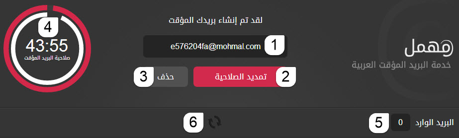

+++
title = "طريقة عمل بريد الكتروني مؤقت"
date = "2015-01-18"
description = "نحتاج في كثير من الأحيان الى التسجيل في بعض المواقع ولكن المشكلة تكمن في الرسائل الدعائية نقدم لك عزيزي القارئ طريقة عمل بريد الكتروني مؤقت لاستخدامه عند التسجيل في المواقع."
categories = ["مهارات رقمية",]
tags = ["موقع لغة العصر"]
+++

نحتاج في كثير من الأحيان الى التسجيل في بعض المواقع ولكن المشكلة تكمن في الرسائل الدعائية التي تصلنا بعد التسجيل في هذه المواقع، أو لا نريد التسجيل بواسطة البريد الالكتروني الشخصي فيكون الحل هو انشاء بريد الكتروني جديد.

نقدم لك طريقة عمل بريد الكتروني مؤقت لاستخدامه عند التسجيل في المواقع.

## ما هو البريد المؤقت؟

هو بريد إلكتروني تنتهي صلاحيته بعد مدة معينة من إنشائه ويمكنك استخدامه خلال هذه المدة. أيضا يمكنك استخدامه عند الاشتراك في أي موقع لكي لا تضطر إلى وضع بريدك الشخصي ليمتلئ فيما بعد بالرسائل الدعائية المزعجة، تنتهي صلاحية استخدام البريد بعد إنشائه بمدة وقدرها 45 دقيقة قابلة للتمديد، وبعد انتهاء مدة صلاحية البريد المؤقت الذي قمت بإنشائه فإن جميع رسائلك سوف يتم حذفها من ذلك البريد لكي لا يتمكن أي مستخدم آخر من الاطلاع عليها في حال تم إنشاء بريد باستخدام نفس الاسم الذي قمت أنت باختياره سابقاً.

أولا: قم بالدخول الى رابط الموقع [من هنا](http://www.mohmal.com/)

ثانيا: قم بالضغط على إنشاء بريد عشوائي.

يظهر لك الموقع كما بالصورة:

1. هذا هو اسم البريد الالكتروني الخاص بك (الذي ستستخدمه في التسجيل).
2. إذا أردت تمديد المدة (صلاحية البريد المؤقت) اضغط على هذا الزر ليعيد المهلة إلى بدايتها.
3. إذا انتهيت من استخدام البريد وترغب في حذفه اضغط على هذا الزر.
4. تظهر لك هنا المدة المتبقية على حذف البريد.
5. يظهر لك هنا عدد الرسائل الواردة الى بريدك المؤقت.
6. إذا تأخر وصول الرسائل الى البريد اضغط على هذا الزر ليعيد تحديث البريد.

---

هذا الموضوع نٌشر باﻷصل على موقع مجلة لغة العصر.

http://aitmag.ahram.org.eg/News/4119.aspx
