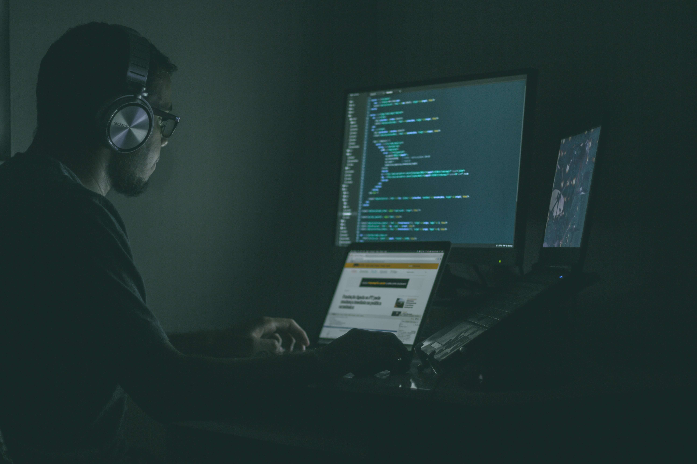
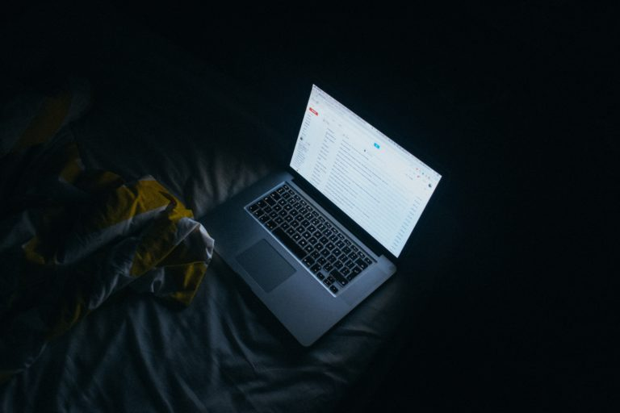
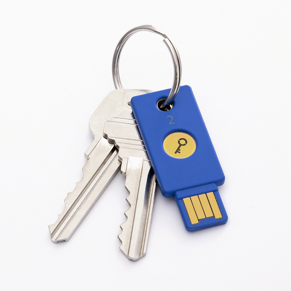
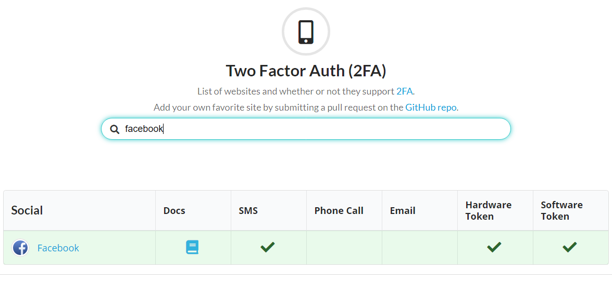
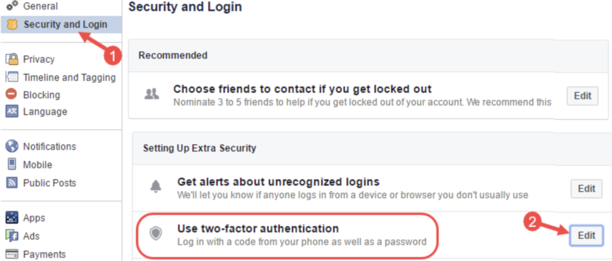
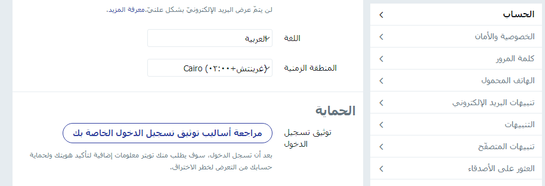
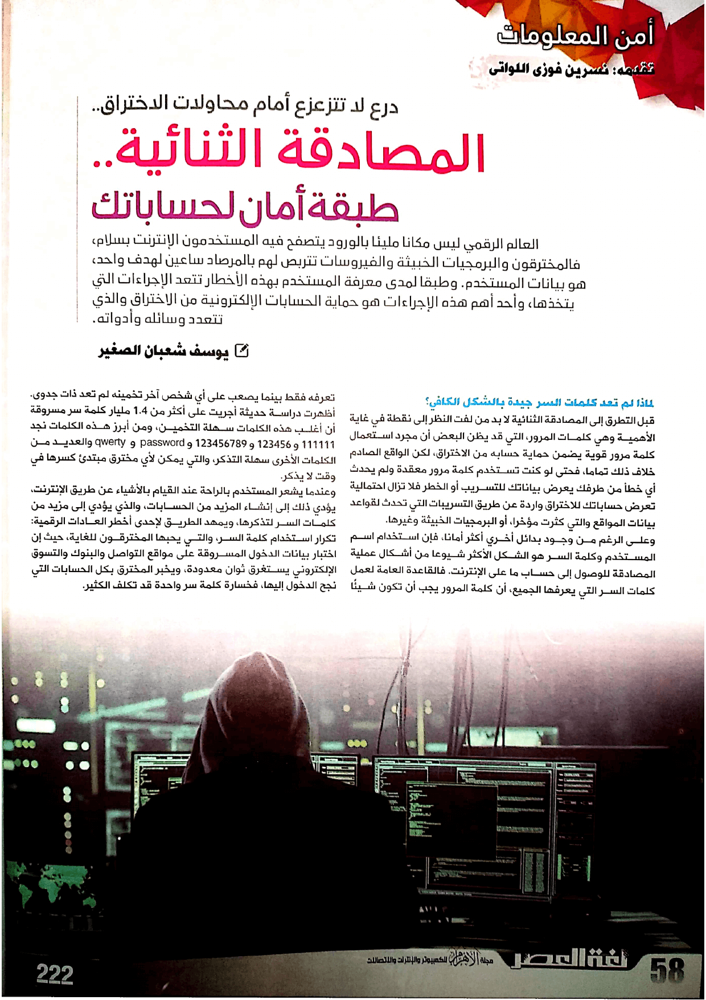
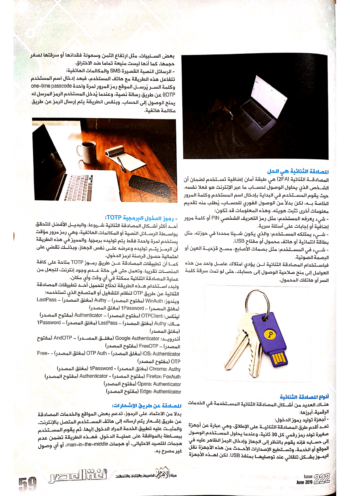
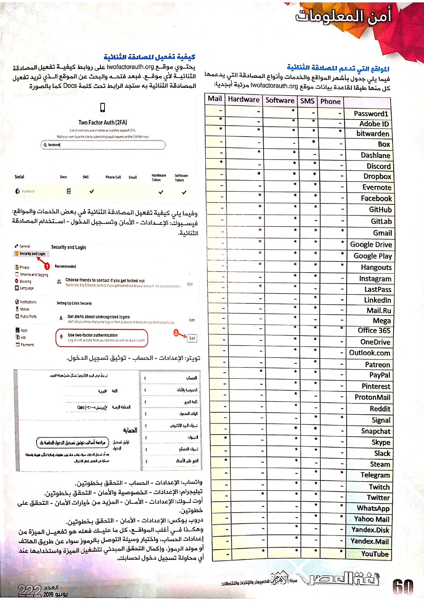

+++
title = "المصادقة الثنائية.. طبقة أمان لا غني عنها لحساباتك"
date = "2019-06-01"
description = "العالم الرقمي ليس مكانا مليئا بالورود يتصفح فيه المستخدمون الإنترنت بسلام، فالمخترقين والبرمجيات الخبيثة والفيروسات تتربص لهم بالمرصاد ساعين لهدف واحد، هو بيانات المستخدم. وطبقا لمدى معرفة المستخدم بهذه الأخطار تتعد الإجراءات التي يتخذها، وأحد أهم هذه الإجراءات هو حماية الحسابات الإلكترونية من الاختراق والذي تتعدد وسائله وأدواته."
categories = ["اﻷمن الرقمي",]
tags = ["مجلة لغة العصر"]

+++
العالم الرقمي ليس مكانا مليئا بالورود يتصفح فيه المستخدمون الإنترنت بسلام، فالمخترقين والبرمجيات الخبيثة والفيروسات تتربص لهم بالمرصاد ساعين لهدف واحد، هو بيانات المستخدم. وطبقا لمدى معرفة المستخدم بهذه الأخطار تتعد الإجراءات التي يتخذها، وأحد أهم هذه الإجراءات هو حماية الحسابات الإلكترونية من الاختراق والذي تتعدد وسائله وأدواته.

## لماذا لم تعد كلمات السر جيدة كفاية؟

قبل التطرق إلى المصادقة الثنائية لا بد من لفت النظر إلى نقطة في غاية الأهمية وهي كلمات المرور، التي قد يظن البعض أن مجرد استعمال كلمة مرور قوية يضمن حماية حسابه من الاختراق، لكن الواقع الصادم خلاف ذلك تماما، فحتى لو كنت تستخدم كلمة مرور معقدة ولم يحدث أي خطأ من طرفك يعرض بياناتك للتسريب أو الخطر فلا تزال احتمالية تعرض حساباتك للاختراق واردة عن طريق التسريبات التي تحدث لقواعد بيانات المواقع والتي كثرت مؤخرا، أو البرمجيات الخبيثة وغيرها.

وعلى الرغم من وجود بدائل أخري أكثر أمانا، فإن استخدام اسم المستخدم وكلمة السر هو الشكل الأكثر شيوعا من أشكال عملية المصادقة للوصول إلى حساب ما على الإنترنت. فالقاعدة العامة لعمل كلمات السر التي يعرفها الجميع، أن كلمة المرور يجب أن تكون شيئًا تعرفه فقط بينما يصعب على أي شخص آخر تخمينه لم تعد ذات جدوى.

أظهرت دراسة حديثة أجريت على أكثر من 1.4 مليار كلمة سر مسروقة أن أغلب هذه الكلمات سهلة التخمين، ومن أبزر هذه الكلمات نجد 111111 – 123456 – 123456789 – password – qwerty والعديد من الكلمات الأخرى سهلة التذكر، والتي يمكن لأي مخترق مبتدئ كسرها في وقت لا يذكر.

وعندما يشعر المستخدم بالراحة عند القيام بالأشياء عن طريق الإنترنت، يؤدي ذلك إلى إنشاء المزيد من الحسابات، والذي يؤدي إلى مزيد من كلمات السر لتذكرها، ويمهد الطريق لأحد أخطر العادات الرقمية: تكرار استخدام كلمة السر، والتي يحبها المخترقون للغاية، حيث أن اختبار بيانات الدخول المسروقة على مواقع التواصل والبنوك والتسوق الإلكتروني يستغرق ثوان معدودة، ويخبر المخترق بكل الحسابات التي نجح الدخول إليها، فخسارة كلمة سر واحدة قد تكلف الكثير.

## المصادقة الثنائية هي الحل

المصادقة الثنائية (2FA) هي طبقة أمان إضافية تستخدم لضمان أن الشخص الذي يحاول الوصول لحساب ما عبر الإنترنت هو فعلا نفسه. حيث يقوم المستخدم في البداية بإدخال اسم المستخدم وكلمة المرور الخاصة به، لكن بدلاً من الوصول الفوري للحساب، يُطلب منه تقديم معلومات أخرى تثبت هويته. وهذه المعلومات قد تكون:

- شيء يعرفه المستخدم: مثل رمز التعريف الشخصي PIN أو كلمة مرور إضافية أو إجابات على أسئلة سرية.
- شيء يمتلكه المستخدم: والذي يكون شيء محدد في حوزته، مثل بطاقة ائتمانية أو هاتف محمول أو مفتاح USB.
- شيء في المستخدم: مثل بصمات الأصابع، مسح قزحية العين أو البصمة الصوتية.

فباستخدام المصادقة الثنائية لن يؤدي امتلاك عامل واحد من هذه العوامل إلى منح صلاحية الوصول إلى حسابك، حتى لو تم سرقة كلمة السر أو هاتفك المحمول.

## أنواع المصادقة الثنائية

هناك العديد من أشكال المصادقة الثنائية المستخدمة في الخدمات الرقمية، أبزرها:

### أجهزة توليد رموز الدخول

تعد أقدم طرق المصادقة الثنائية على الإطلاق، وهي عبارة عن أجهزة صغيرة تولد رمز رقمي كل 30 ثانية، وعندما يحاول المستخدم الوصول إلى حسابه فإنه يقوم بالنظر إلى الجهاز وإدخال الرمز الظاهر عليه في الموقع أو الخدمة، وتستطيع الإصدارات الأحدث من هذه الأجهزة نقل الرموز بشكل تلقائي عند توصليها بمنفذ USB. لكن لهذه الأجهزة بعض السلبيات، مثل ارتفاع الثمن وسهولة فقدانها أو سرقتها لصغر حجمها، كما أنها ليست منيعة تماما ضد الاختراق.

### الرسائل النصية القصيرة SMS والمكالمات الهاتفية

تتفاعل هذه الطريقة مع هاتف المستخدم، فبعد إدخال اسم المستخدم وكلمة السر يُرسل الموقع رمز المرور لمرة واحدة one-time passcode (OTP) عن طريق رسالة نصية، وعندما يُدخل المستخدم الزمر المرسل له يمنح الوصول إلى الحساب. وبنفس الطريقة يتم إرسال الرمز عن طريق مكالمة هاتفية.

### رموز الدخول البرمجية TOTP

أحد أكثر أشكال المصادقة الثنائية شيوعا، والبديل الأفضل للتحقق بواسطة الرسائل النصية أو المكالمات الهاتفية، وهي رمز مرور مؤقت يستخدم لمرة واحدة فقط يتم توليده برمجيا. والمميز في هذه الطريقة أن الرمز يتم توليده وعرضه على نفس الجهاز، وبذلك تقضي على احتمالية حصول قرصنة لرمز الدخول.

كما أن تطبيقات المصادقة عن طريق رموز TOTP متاحة على كافة المنصات تقريبا، وتعمل حتى في حالة عدم وجود إنترنت، لتجعل من عملية المصادقة الثنائية ممكنة في أي وقت وأي مكان.

ولبدء استخدام هذه الطريقة تحتاج لتحميل أحد تطبيقات المصادقة الثنائية عن طريق OTP لنظام التشغيل أو المتصفح الذي تستخدمه:

- ويندوز: WinAuth (مفتوح المصدر) – Authy (مغلق المصدر) – LastPass (مغلق المصدر) – 1Password (مغلق المصدر)
- لينكس: OTPClient (مفتوح المصدر) – Authenticator (مفتوح المصدر)
- ماك: Authy (مغلق المصدر) – LastPass (مغلق المصدر) – 1Password (مغلق المصدر)
- أندرويد: Google Authenticator (مغلق المصدر) – AndOTP (مفتوح المصدر) – FreeOTP (مفتوح المصدر)
- iOS: Authenticator (مغلق المصدر) - OTP Auth (مغلق المصدر) - FreeOTP (مفتوح المصدر)
- Chrome: Authy (مغلق المصدر) - 1Password (مغلق المصدر)
- Firefox: FoxAuth (مفتوح المصدر) - Authenticator (مفتوح المصدر)
- Opera: Authenticator (مفتوح المصدر)
- Edge: Authenticator (مفتوح المصدر)

### المصادقة عن طريق الإشعارات

بدلا من الاعتماد على الرموز، تدعم بعض المواقع والخدمات المصادقة عن طريق إشعار يتم ارساله إلى هاتف المستخدم المتصل بالإنترنت، والمثبت عليه تطبيق الخدمة المراد الدخول إليها، ثم يقوم المستخدم ببساطة بالموافقة على عملية الدخول. فهذه الطريقة تضمن عدم هجمات للتصيد الاحتيالي، أو هجمات man-in-the-middle، أو أي وصول غير مصرح به.

## المواقع التي تدعم المصادقة الثنائية

فيما يلي جدول بأشهر المواقع والخدمات وأنواع المصادقة التي يدعمها كل منها طبقا لقاعدة بيانات موقع twofactorauth.org مرتبة أبجديا:

| | Phone | SMS | Software | Hardware | Mail |
| :------------------: | :---: | :--: | :------: | :------: | :--: |
| **1Password** | - | - | * | - | - |
| **Adobe ID** | - | * | * | - | * |
| **Bitwarden** | * | * | * | * | * |
| **Box** | - | * | - | - | - |
| **Dashlane** | - | - | * | * | - |
| **Discord** | - | * | * | - | * |
| **Dropbox** | - | * | * | * | - |
| **Evernote** | - | * | * | - | - |
| **Facebook** | - | * | * | * | - |
| **GitHub** | - | * | * | * | - |
| **GitLab** | - | - | * | * | - |
| **Gmail** | * | * | * | * | - |
| **Google Drive** | * | * | * | * | - |
| **Google Play** | * | * | * | * | - |
| **Hangouts** | * | * | * | * | - |
| **Instagram** | - | * | * | - | - |
| **LastPass** | - | - | * | * | - |
| **LinkedIn** | - | * | - | - | - |
| **Mail.Ru** | - | * | * | - | - |
| **Mega** | - | - | * | - | - |
| **Office 365** | * | * | * | - | - |
| **OneDrive** | - | * | * | - | - |
| **Outlook.com** | - | * | * | - | - |
| **Patreon** | - | * | - | - | - |
| **PayPal** | - | * | * | * | - |
| **Pinterest** | - | * | * | - | - |
| **ProtonMail** | - | - | * | - | - |
| **Reddit** | - | - | * | - | - |
| **Signal** | * | * | - | - | - |
| **Snapchat** | - | * | * | - | - |
| **Skype** | - | * | * | - | * |
| **Slack** | - | * | * | - | - |
| **Steam** | - | - | * | - | * |
| **Telegram** | * | * | - | - | - |
| **Twitch** | - | * | * | - | - |
| **Twitter** | - | * | * | * | - |
| **WhatsApp** | * | * | - | - | - |
| **Yahoo Mail** | * | * | - | - | - |
| **Yandex.Disk** | - | - | * | - | - |
| **Yandex.Mail** | - | - | * | - | - |
| **YouTube** | * | * | * | * | - |

## كيفية تفعيل المصادقة الثنائية

يحتوي موقع twofactorauth.org على روابط كيفية تفعيل المصادقة الثنائية لأي موقع. فبعد فتحه والبحث عن الموقع الذي تريد تفعيل المصادقة الثنائية به ستجد الرابط تحت كلمة Docs كما بالصورة

وفيما يلي كيفية تفعيل المصادقة الثنائية في بعض الخدمات والمواقع:
- فيسبوك: الإعدادات - الأمان وتسجيل الدخول - استخدام المصادقة الثنائية.

- تويتر: الإعدادات - الحساب - توثيق تسجيل الدخول.

- واتس اب: الإعدادات - الحساب - التحقق بخطوتين.
- تيليجرام: الإعدادات - الخصوصية والأمان - التحقق بخطوتين.
- أوت لوك: الإعدادات - الأمان - المزيد من خيارات الأمان - التحقق على خطوتين.

- دروب بوكس: الإعدادات - الأمان - التحقق بخطوتين.

وهكذا في أغلب الموقع، كل ما عليك فعله هو تفعيل الميزة من إعدادات الحساب، واختيار وسيلة التوصل بالرموز سواء عن طريق الهاتف أو مولد الرموز، وإكمال التحقق المبدئي لتشغيل الميزة واستخدامها عند أي محاولة تسجيل دخول لحسابك.

---

هذا الموضوع نُشر باﻷصل في مجلة لغة العصر العدد 222 شهر 06-2019 ويمكن الإطلاع عليه [هنا](https://drive.google.com/file/d/1qjxDPvUHQbIEbk481Z2F67fdrAul47IH/view?usp=sharing).

