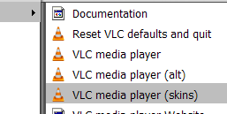
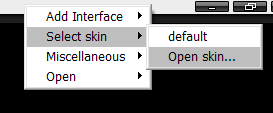
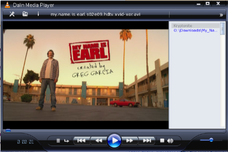

+++
title = "طريقة تغيير شكل برنامج VLC Media Player"
date = "2015-04-16"
description = "برنامج VLC Media Player هو مشغل مفتوح المصدر من أفضل المشغلات الموجودة التي تدعم كل الصيغ الموجودة تقريبًا، ومن أفضل المميزات الموجودة به هي دعمه للثيمات التي تغير شكله تماما"
categories = ["مهارات رقمية",]
tags = ["موقع لغة العصر"]

+++

برنامج VLC Media Player هو مشغل مفتوح المصدر من أفضل المشغلات الموجودة التي تدعم كل الصيغ الموجودة تقريبًا، ومن أفضل المميزات الموجودة به هي دعمه للثيمات التي تغير شكله تماما.

تستطيع تحميل البرنامج من موقعه الرسمي [من هنا](http://www.videolan.org/vlc/).

على الموقع الرسمي ستجد العديد من [الثيمات](http://www.videolan.org/vlc/skins.php) الجاهزة للبرنامج وكمثال يمكنك تجربة ثيم [Windows Media Player](http://www.videolan.org/vlc/download-skins2.go.php?url=WMP11.vlt) 11.

**طريقة تثبيت الثيمات:**

1. قم بفتح البرنامج على وضع VLC media player (skinned) من مجلد البرنامج في قائمة البداية.

2. اضغط بزر الفأرة الأيمن في أي مكان من شاشة البرنامج، من القائمة Select skin اختر Open skin ثم اختر الملف الذي قمت بتحميله.

سيصبح شكل البرنامج كما بالصورة:

ملاحظة: يجب عليك إذا أردت تشغيل البرنامج بشكله الجديد فتحه من الملف VLC media player (skinned)1.

---

هذا الموضوع نٌشر باﻷصل على موقع مجلة لغة العصر.

http://aitmag.ahram.org.eg/News/9941.aspx
