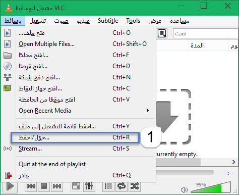
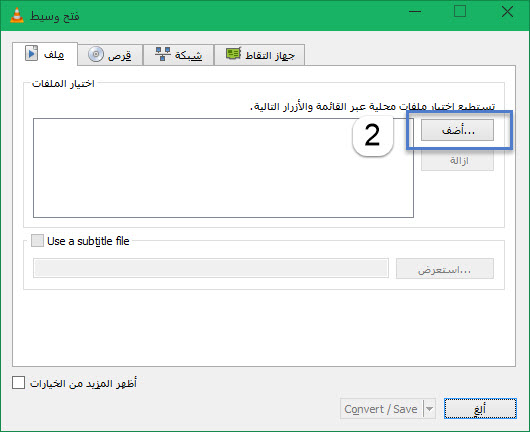
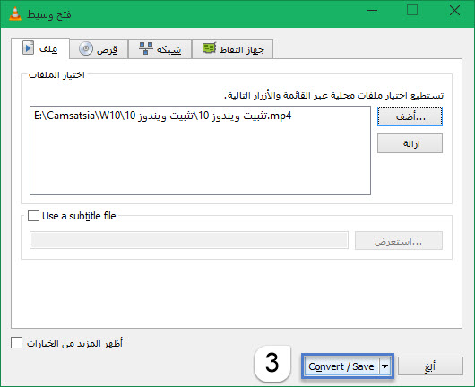
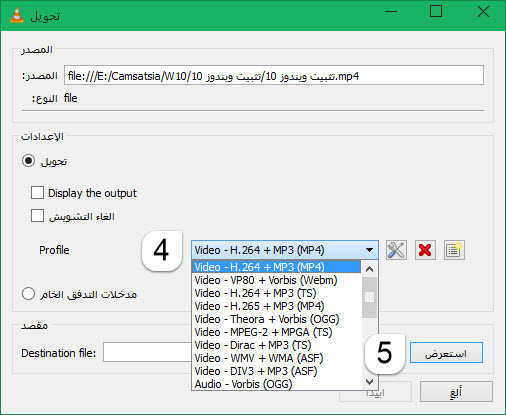

+++
title = "طريقة تحويل ملفات الصوت والفيديو باستخدام برنامج VLC"
date = "2015-05-13"
description = "هل تعلم عزيزي القارئ أنه يمكنك استخدام برنامج VLC مشغل الوسائط الشهير لتحويل صيغ ملفات الصوت والفيديو، يتميز البرنامج ببساطته وسرعته الشديدة في التحويل، اليكم الطريقة."
categories = ["مهارات رقمية",]
tags = ["موقع لغة العصر"]
images = ["images/2015-635671489230566756-56.jpg"]

+++

هل تعلم عزيزي القارئ أنه يمكنك استخدام برنامج VLC مشغل الوسائط الشهير لتحويل صيغ ملفات الصوت والفيديو، يتميز البرنامج ببساطته وسرعته الشديدة في التحويل، اليكم الطريقة.

1. من قائمة "وسائط Media" قم باختيار "حوّل/احفظ Convert/Save".

2. قم بالضغط على الزر "أضف Add" كما بالصورة.

3. قم باختيار الملف الذي تريد تحويله، ثم اضغط Convert/Save.

4. قم باختيار الصيغة المراد التحويل لها، ستجد العديد من الاختيارات.

5. قم بالضغط على استعراض واختيار المكان الذي سيتم حفظ الملف الناتج فيه.
6. اضغط "ابدأ" لبدأ تحويل الملف.

---
هذا الموضوع نٌشر باﻷصل على موقع مجلة لغة العصر.

http://aitmag.ahram.org.eg/News/15254.aspx