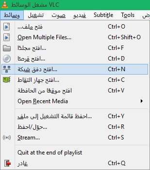

+++
title = "طريقة مشاهدة فيديوهات اليوتيوب عن طريق برنامج VLC"
date = "2015-05-18"
description = "إذا كنت لا تزال تعتقد أن برنامج VLC هو مجرد مشغل وسائط فأنت مخطئ، فيمكنك تغير شكل هذا البرنامج، أو تحويل صيغ الفيديوهات والأصوات من خلاله، نكشف لك عزيزي القارئ سرا جديدا من أسرار هذا البرنامج، اليك طريقة مشاهدة فيديوهات اليوتيوب عن طريق برنامج VLC."
categories = ["مهارات رقمية",]
tags = ["موقع لغة العصر"]

+++

إذا كنت لا تزال تعتقد أن برنامج VLC هو مجرد مشغل وسائط فأنت مخطئ، فيمكنك تغير شكل هذا البرنامج، أو تحويل صيغ الفيديوهات والأصوات من خلاله، نكشف لك عزيزي القارئ سرا جديدا من أسرار هذا البرنامج، إليك طريقة مشاهدة فيديوهات اليوتيوب عن طريق برنامج VLC.

تعمل هذه الطريقة على كلا الموقعين الشهيرين YouTube وDaily Motion.
مميزات استخدام هذه الطريقة:

1. تستطيع مشاهدة الفيديوهات بدون إعلانات أو مضايقات.
2. تستطيع استخدام الزر Loop لتكرار تشغيل الفيديو.
   3.تستطيع زيادة أو إنقاص سرعة تشغيل الفيديو.
3. تستطيع التقاط صور للفيديو.

**أولا: طريقة مشاهدة الفيديوهات:**

1. قم بفتح موقع اليوتيوب ثم توجه الى الفيديو الذي تريد فتحه، قم بنسخ الرابط.
2. قم بفتح برنامج VLC اضغط على قائمة File ثم اختر Open Network.

3. قم بلصق رابط الفيديو واضغط Play.

**ثانيا: طريقة مشاهدة قوائم التشغيل:**

1. يجب عليك تثبيت هذه الإضافة، قم [بالضغط هنا](http://addons.videolan.org/content/show.php/?content=149909) لفتح صفحة التحميل.
2. ستجد زر تحميل إضافة playlist_youtube.lua.
3. قم بنسخ الإضافة ثم قم بلصقها في المسار
   C:\Program Files\VideoLAN\VLC\lua\playlist
4. قم بفتح برنامج VLC اضغط على قائمة File ثم اختر Open Network.
5. قم بلصق رابط قائمة التشغيل واضغط Play.

---

هذا الموضوع نٌشر باﻷصل على موقع مجلة لغة العصر.

http://aitmag.ahram.org.eg/News/15640.aspx
