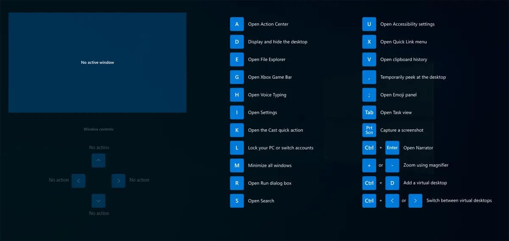

+++

title = "ما هي أدوات PowerToys لتخصيص الويندوز وتحسين تجربة الاستخدام؟"
date = "2024-05-12"
description = "أدوات PowerToys من مايكروسوفت هي مجموعة من الأدوات المساعدة للمستخدمين المحترفين لتحسين تجربة استخدام الويندوز وتحقيق إنتاجية أكبر في العمل. ظهرت هذه المجموعة من الأدوات أول مرة في ويندوز 95 وطورت بشكل بسيط في ويندوز XP ثم اختفت من الويندوز حتى عادت مرة أخرى عام 2019 في صورة مجموعة أدوات مفتوحة المصدر يصل عددها حاليًا أكثر من 20، نستعرض بعضًا منها وكيفية استخدامها والاستفادة منها في السطور القادمة."
categories = ["ويندوز",]
tags = ["مجلة لغة العصر"]

+++

## مقدمة

أدوات PowerToys من مايكروسوفت هي مجموعة من الأدوات المساعدة للمستخدمين المحترفين لتحسين تجربة استخدام الويندوز وتحقيق إنتاجية أكبر في العمل. ظهرت هذه المجموعة من الأدوات أول مرة في ويندوز 95 وطورت بشكل بسيط في ويندوز XP ثم اختفت من الويندوز حتى عادت مرة أخرى عام 2019 في صورة مجموعة أدوات مفتوحة المصدر يصل عددها حاليًا أكثر من 20، نستعرض بعضًا منها وكيفية استخدامها والاستفادة منها في السطور القادمة.

منذ بداية تطويرها صممت أدوات PowerToys للمستخدمين المحترفين الذين يرغبون في تغيير بعض أليات عمل الأمور في الويندوز، فأتاحت تعديل كثير من الأمور بسهولة حتى في إصدارات ويندوز القديمة مثل TweakUI لتعديل الإعدادات الخفية، وأدوات FlexiCD و Xmouse 1.2. وعلى مر السنين وإصدارات ويندوز المختلفة، أضافت مايكروسوفت عددًا من الأدوات إلى المجموعة وحذفت بعضها حتى وصلنا إلى 24 أداة متاحة حاليًا لمستخدمي ويندوز 10 و11.

## كيفية التثبيت والتشغيل

متطلبات تشغيل الأدوات هي نظام ويندوز 11 (جميع الإصدارات) أو ويندوز 10 الإصدار 2004 (19041) أو أحدث، وتعمل على معماريات النظام x64 وArm64.

يمكن تنزيل وتثبيت PowerToys:

- من متجر مايكروسوفت <https://apps.microsoft.com/store/detail/XP89DCGQ3K6VLD>
- أو عبر أداة التثبيت المتوفرة على موقع GitHub <https://github.com/microsoft/PowerToys/releases/latest>
- أو عبر أداة إدارة الحزم WinGet: `winget install Microsoft.PowerToys`

بمجرد تثبيت PowerToys، يمكنك تشغيلها من قائمة البداية. ستعرض لك الشاشة الرئيسية لوحة المعلومات يمكن من خلالها تفعيل أو تعطيل أي من الأدوات المدمجة حسب احتياجاتك.

تعمل PowerToys بعد ذلك في كل مرة يعمل فيها النظام بشكل افتراضي، وستجد أيقونة خاصة بها في المنطقة المخصصة يسار الساعة تعرض الوحدات المفعلة وتوفر طريقة سهلة لتشغيل هذه الوحدات دون الحاجة لتذكر اختصارات لوحة المفاتيح.

## أدوات PowerToys

تتعدد اختصاصات الأدوات المتاحة ضمن حزمة PowerToys، فمنها ما هو مفيد لكل المستخدمين، ومنها الخاص بنوع معين مثل المصممين والمطورين والمستخدمين المحترفين، ويمكنك بعد تثبيت الأداة تجربة كل منها واستكشاف مدى الفائدة لها.

- أداة Always On Top: لتثبيت أي نافذة فوق أي من النوافذ الأخرى عبر الاختصار Win+Ctrl+T.

- أداة Awake: لإبقاء الجهاز يعمل ومنعه من الدخول في وضع النوم دون الحاجة إلى تغيير إعدادات الطاقة، وهي مفيدة عند تشغيل المهام التي تستغرق وقتًا طويلًا.

- أداة Color Picker: للتعرف على أي لون من أي مكان على الشاشة عبر الاختصار Win+Shift+C ونسخ كود اللون إلى الحافظة، كما تحتوي على محرر يعرض الألوان التي نسختها سابقًا ونسخ الأشكال المختلفة لأي من هذه الألوان.

- أداة Command Not Found: وهي مكون إضافة لطرفية Power Shell 7 للتعرف على أخطاء الأوامر غير المتوفرة والمساعدة في العثور على الحزمة التي توفر هذا الأمر عبر برنامج WinGet.

- أداة Crop and Lock: لإنشاء نافذة جديدة عبارة عن اقتصاص أو صورة مصغرة لنافذة أخرى.

- أداة Environment Variables: تقدم طريقة سهلة ومريحة لإدارة متغيرات بيئة النظام حيث يمكنك إنشاء ملفات تعريف لإدارة مجموعة من المتغيرات معًا.

- أداة FancyZones: مدير نوافذ يمكنك من إنشاء تخطيطات معقدة للنوافذ ووضع كل نافذة على الشاشة في المكان المراد ضمن هذه التخطيطات بسهولة.

- أدوات File Explorer add-ons: مجموعة إضافات لمستعرض الملفات مثل المعاينة وعرض الصور المصغرة لمجموعة متنوعة من أنواع الملفات.

- أداة File Locksmith: إمتداد لصدفة ويندوز للتحقق من الملفات المستخدمة بواسطة العمليات التي تُجري على النظام، وتعمل عبر الصغط بزر الماوس الأيمن على أي ملف في مدير الملفات واختيار Unlock with File Locksmith.

- أداة Hosts File Editor: لتحرير ملف المضيفين الذي يحتوي على أسماء النطاقات وعناوين IP الخاصة بكل نطاق.

- أداة Image Resizer: إمتداد لصدفة ويندوز لتغيير حجم الصور عبر قائمة زر الماوس الأيمن، ويعمل مع صورة واحدة أو مجموعة صور.

- أداة Keyboard Manager: لإدارة لوحة المفاتيح وتخصيصها لتكون أكثر إنتاجية عبر إعادة تعيين وظائف المفاتيح وإنشاء اختصارات خاصة.

- أداة Mouse utilities: تضيف وظائف لتحسين الماوس والمؤشر، مثل البحث عن الماوس Find My Mouse لتحديد موضع الماوس بسرعة باستخدام ضوء موضعي يركز على المؤشر، وMouse Highlighter الذي يعرض مؤشرات مرئية عند النقر فوق أزرار الماوس الأساسية، وكذلك Mouse Jump الذي يوفر طريقة للتنقل السريع على الشاشات الكبيرة.

- أداة Mouse Without Borders: لاستخدام نفس الماوس ولوحة المفاتيح مع أكثر من جهاز كمبيوتر في الوقت نفسه وكذلك مشاركة الحافظة والملفات بين الأجهزة بسلاسة.

- أداة Paste as Plain Text: توفر طريقة سهلة للصق النص بلا تنسيق عبر الاختصار لوحة المفاتيح Win+Ctrl+Alt+V.

- أداة Peek: لمعاينة محتوى الملفات المختلفة دون فتحها من خلال الاختصار Ctrl+Space.

- أداة PowerRename: لإعادة تسمية أكثر من ملف في نفس الوقت وتطبيق خيارات متقدمة على الأسماء مثل البحث والاستبدال واستخدام التعبيرات الإعتيادية Regex وتحديد نوع محدد من الملفات واستعراض النتيجة قبل تطبيقها.

- أداة PowerToys Run: مشغل سريع للبحث عن التطبيقات والملفات وفتحها فوريًا عبر الاختصار Alt+Space.

- أداة Quick Accent: توفر طريقة سهلة لكتابة الأحرف المعلمة في بعض اللغات الأجنبية، وهي مفيدة عندما لا تتوفر هذه الأحرف في لوحة المفاتيح.

- أداة Registry Preview: لعرض وتحرير ملفات السجل في ويندوز.

- أداة Screen Ruler: لقياس الأشياء داخل الشاشة بالبيكسل عبر الاختصار Win+Shift+M.

- أداة Shortcut Guide: لعرض دليل الاختصارات للشاشة الحالية عبر الاختصار Win+Shift+/ أو Win+? أو الضغط مع الاستمرار على زر الويندوز.

- أداة Text Extractor: طريقة سهلة لنسخ النصوص من أي مكان في الشاشة عبر الاختصار Win+Shift+T.

- أداة Video Conference Mute: طريقة سريعة لكتم صوت الميكروفون والكاميرا على مستوى الجهاز كله عبر الاختصار Win+Shift+Q أثناء المكالمات الجماعية.

وتوفر مايكروسوفت دليلًا للتعرف على كل هذه الأدوات بالتفصيل مع كيفية استخدامها وتخصيص كل خياراتها على موقعها الرسمي <https://learn.microsoft.com/en-us/windows/powertoys/>.

## خاتمة

تعمل مايكروسوفت باستمرار على إضافة أدوات جديدة مع كل تحديث ل PowerToys، مما يجعل تجربة مستخدمي ويندوز أفضل. فكما رأينا، كل أداة من هذه الأدوات تركز على شيء واحد صغير، لكن يحسن تجربة الاستخدام بشكل كبير جدًا مثل أدوات Run و Peek وPowerRename، وبعد أن تعتاد على استخدام أي منها ستصبح PowerToys ضمن أول البرامج التي تثبتها على أي جهاز ويندوز تستخدمه.

---

هذا الموضوع نُشر باﻷصل في مجلة لغة العصر العدد 349 شهر 05-2024 ويمكن الإطلاع عليه [هنا](https://drive.google.com/file/d/19fTh8f6RqITI3wtaHNYmRB8hOCYEP7hE/view?usp=drive_link).

