+++
title = "ما الجديد في تحديث iOS 12؟"
date = "2018-12-05"
description = "بعد بضعة أشهر من إطلاق النسخ التجريبية، أعلنت شركة أبل رسميًا عن التحديث الجديد لنظام iOS والذي يحمل الرقم 12. وعلى الرغم من أنه لم يتم إصداره في الحدث الرئيسي لـ أبل في سبتمبر، فقد أصبح متاحًا للتنزيل بدءًا من 17 من نفس الشهر. ويدعم التحديث عددا كبيرا من الأجهزة، ابتداء من iPhone SE و5، وiPad Pro وAir وMini 2، إضافة لجهاز iPod Touch الجيل السادس."
categories = ["تقارير",]
tags = ["مجلة لغة العصر"]

+++
بعد بضعة أشهر من إطلاق النسخ التجريبية، أعلنت شركة أبل رسميًا عن التحديث الجديد لنظام iOS والذي يحمل الرقم 12. وعلى الرغم من أنه لم يتم إصداره في الحدث الرئيسي لـ أبل في سبتمبر، فقد أصبح متاحًا للتنزيل بدءًا من 17 من نفس الشهر.
ويدعم التحديث عددا كبيرا من الأجهزة، ابتداء من iPhone SE و5، وiPad Pro وAir وMini 2، إضافة لجهاز iPod Touch الجيل السادس.

ولتحميل التحديث، ستحتاج إلى التأكد من نسخ جميع بياناتك احتياطيًا أولا، ثم الدخول إلى الإعدادات ثم القسم عام، ثم تحديثات النظام، وستجد تحديث iOS 12 متاحا للتنزيل. وإذا لم تجد اختيار التحديث فقد يكون جهازك غير مدعوم.

أما أهم المميزات الجديدة التي جاء بها التحديث فهي:

## مكالمات فيس تايم الجماعية

تسمح لك مكالمات فيس تايم الجماعية بالدردشة مع ما يصل إلى 32 شخصًا في وقت واحد. وحيث أنها مدمجة الآن مع iMessage يمكنك بسهولة إعداد مكالمة فيس تيم جماعية من خلال نافذة دردشة iMessage الجماعية. كما يوجد أيضًا خيارات إضافة تأثيرات مثل الملصقات والرموز التعبيرية أثناء إجراء المكالمات.

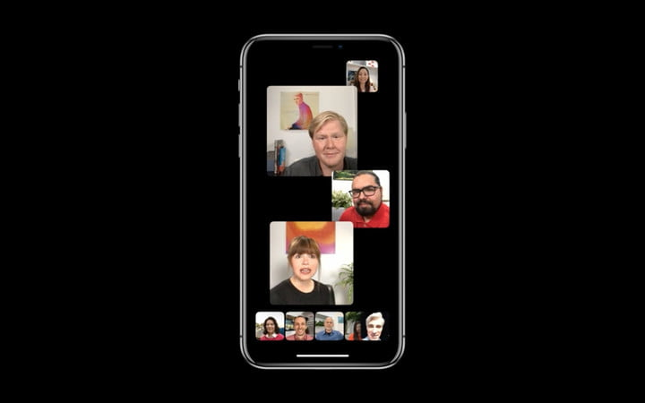

وتعمل هذه الميزة على iPhone وiPad وMac. بالنسبة لمستخدمي Apple Watch، ستتمكن من الإجابة على المكالمات عبر FaceTime Audio. 
لكن لن يتم إصدار هذه الميزة مع الإطلاق الأوليّ لنظام التشغيل iOS 12 وتخطط Apple لإضافة هذه الميزة لمستخدميها في وقت لاحق من الخريف.

## اختصارات Siri

مع اختصارات Siri، يمكن لـ Siri عمل أشياء أكثر من خلال إجراءات سريعة يمكن تعيينها عن طريق تطبيق الاختصارات الجديد. فعلى سبيل المثال، سترى اقتراحات للتطبيقات على شاشة التأمين. وإذا كنت متأخراً، ستقترح عليك Siri مراسلة منظم الاجتماع. وسيتمكن المستخدمون من استخدام اختصارات Siri ليس فقط على هواتف iPhone الخاصة بهم ولكن أيضًا على HomePods وساعات Apple.

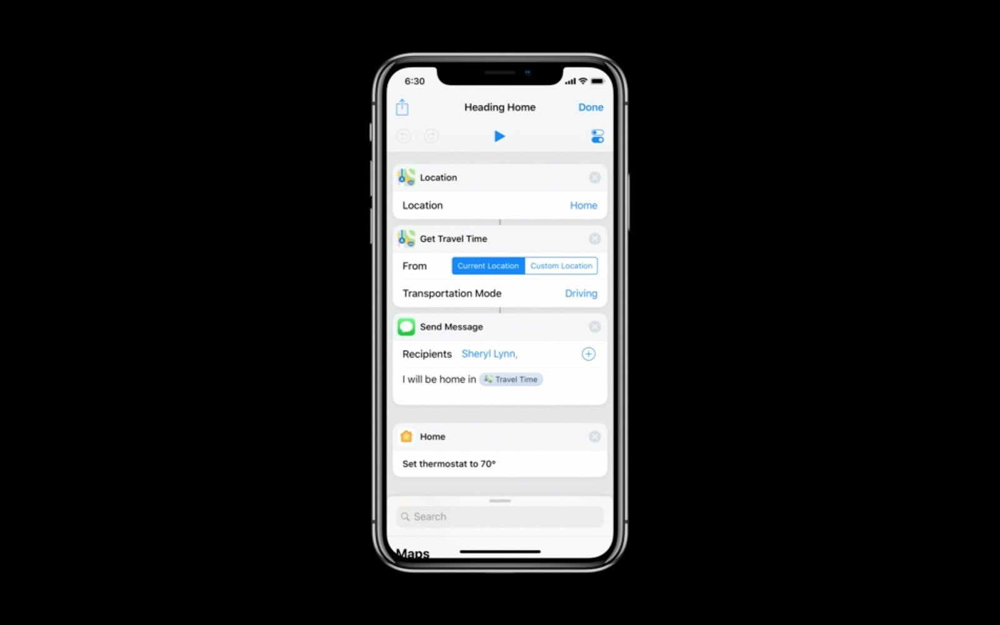

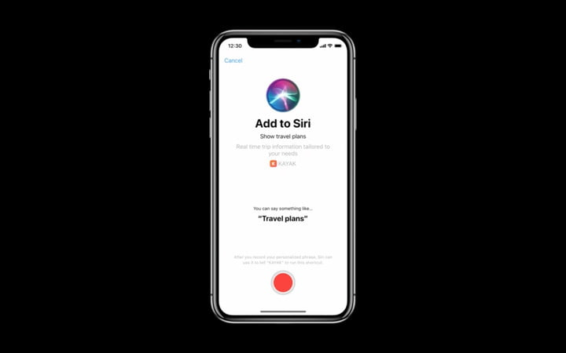

أحد الميزات التي لم تذكرها Apple في WWDC كانت "التنبيهات الحرجة”. حيث ستتمكن من الحصول على الإشعارات المهمة حتى مع تشغيل وضع "عدم الإزعاج"، وبالتأكيد سيكون هذا مفيدًا في العديد من الأوقات للمستخدم.

## اﻹيموجى المتحركة

في حين أن هذه الميزة قد تم تقديمها لأول مرة مع iPhone X، يأتي iOS 12 بالعديد من الإيموجى الجديدة، إلى جانب إمكانية إضافة بعض المؤثرات مثل الغمز للإيموجى.

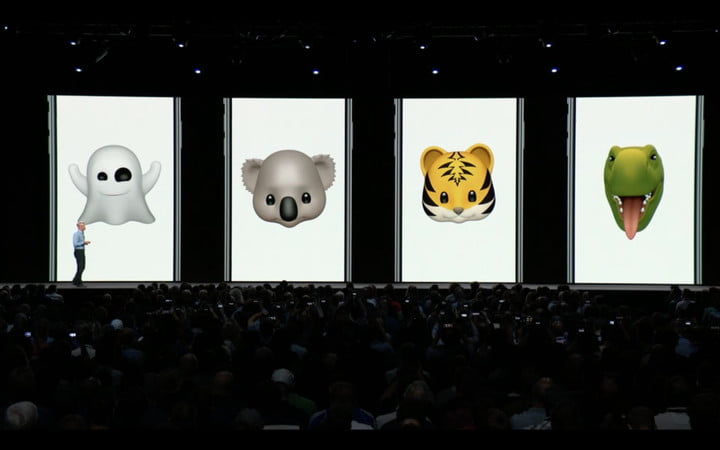

وليس هذا كل شيء، فـ Apple قد قدمت ميزة جديدة تحت اسم Memoji يمكنك من خلالها إنشاء شخصية خاصة بك، ويمكنك تخصيصها بشكل كامل كما تريد، ويشمل هذا لون العين وشكل الشعر والعديد من السمات المميزة الأخرى.

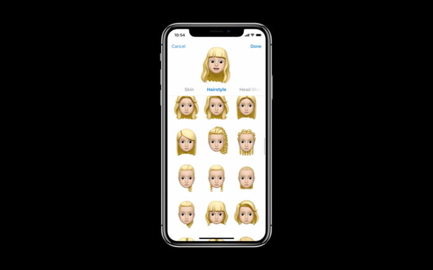

كما يمكن للمستخدمين الآن تسجيل ما يصل إلى 30 ثانية من الإيموجى المتحركة بدلا من 10 فقط.

## معلومات استخدام بيانات الهاتف على مستوى التطبيقات

في السابق كان بإمكان المستخدم الوصول إلى معلومات مفصلة حول التطبيقات التي تستهلك البطارية فقط، لكن مع التحديث الجديد يمنك الآن معرفة كمية البيانات التي يستهلكها كل تطبيق على حدي، عن طريق الإعدادات ثم Cellular.

## تطبيق خرائط مُحّسن

استعدادا لتقديم خرائط أفضل، قامت Apple بعمل تغييرات كبيرة في تطبيق الخرائط، حيث تم إضافة خرائط مفصلة تحتوي على المعالم العامة والعديد من المعلومات الأخرى، لكن تظهر هذه الميزات الجديدة في مناطق محددة فقط، على أن يتم تعميمها خلال العام القادم.

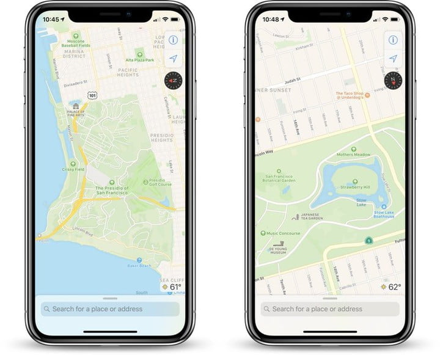

## مشاركة موقع الهاتف في حالة الطوارئ:

يحتوي iOS 12 على ميزة جديدة تجعل من تحديد موقع الهاتف أسهل في حالات الطوارئ، حيث يتم مشاركة معلومات الموقع الحالي للهاتف بمجرد الاتصال بالطوارئ. وتستخدم Apple تقنيتين مختلفتين هما HELO – التي تقّدر الموقع اعتمادا على أبراج الشبكة - وRapidSOS -التي تعتمد على الـ GPS واتصال الـWi-Fi – حتى تضمن الحصول على الموقع الدقيق للجهاز.

## تحسين التقاط الشاشة على iPhone X:

بعد حوالي عام من إطلاق الجهاز، تم حل واحدة من أكبر المشاكل إزعاجا للمستخدمين "التقاط الشاشة بالخطأ"، فعلى مدار العام الماضي اشتكى العديد من المستخدمين من أخذ لقطات للشاشة بشكل غير مقصود عند إخراج الهاتف من الجيب. ولأخذ لقطة من الشاشة في iOS 12 تحتاج إلى أن يكون الجهاز مفتوحا وتم إلغاء القفل حتى تعمل هذه الميزة.

## قارئ QR Code أفضل

تم تقديم قارئ رمز الاستجابة السريعة QR ﻷول مرة مع نظام iOS 11، وقد أدخل iOS 12 العديد من التحسينات عليه. فبدلاً من توجيه الكاميرا إلى الرمز سيقوم iOS 12 بتمييزه لك لمعرفة أنه قد تم اكتشافه. ولتسهيل الوصول إلى هذه الميزة، يمكنك إضافتها الآن إلى مركز التحكم لديك. لذلك عندما تريد مسح رمز QR ضوئيًا، كل ما عليك فعله هو سحب "مركز التحكم" والضغط على المربع لتشغيل الميزة.

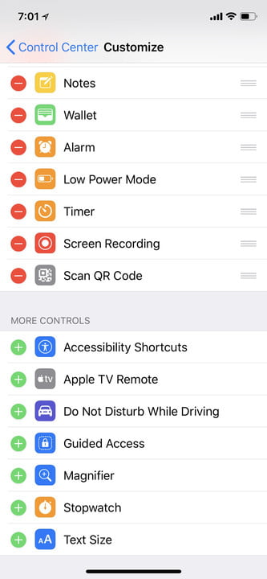

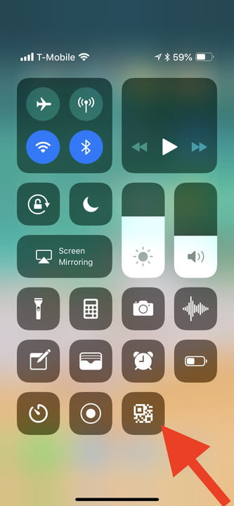

## تبديل أسهل بين التطبيقات

ستلاحظ بعد تثبيت iOS 12 أنك لم تعد تحتاج إلى الضغط المطول على بطاقة التطبيق ثم زر الحذف في مبدل التطبيقات لإغلاق تطبيق ما. كل ما عليك فعله الآن هو السحب لأعلى للدخول لمبدل التطبيقات ثم سحب أي تطبيق لأعلى للخروج منه.

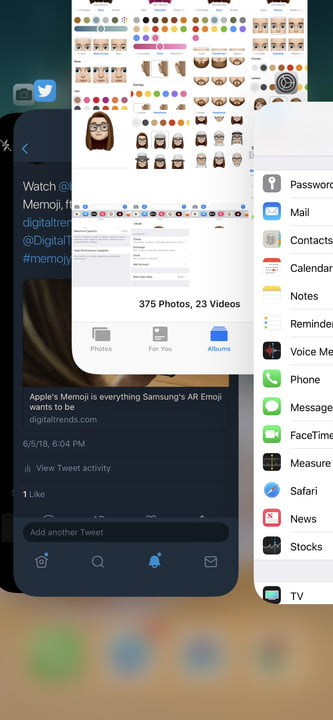

## إيماءات iPhone X على أجهزة iPad

مع وجود شائعات بأن Apple ستزيل قريبًا زر الرئيسية من جميع أجهزتها، كان تحديث iOS 12 دليلاً إضافيًا. فبعد تحديث أي جهاز iPad إلى iOS 12 ستلاحظ أنك تستخدم نفس الإيماءات الموجودة في iPhone X. يمكنك التمرير سريعًا لأعلى من أسفل الشاشة للوصول إلى الشاشة الرئيسية، وللوصول إلى مركز التحكم قم بالتمرير لأسفل من الزاوية العلوية اليمنى.

## مزيد من المعلومات عن البطارية

بداية من iOS 11.3 أصبح بالإمكان الحصول على معلومات حول صحة البطارية، وذلك عن طريق التحقق من مقدار الطاقة التي تستخدم بواسطة تطبيقات معينة. فعن طريق الانتقال إلى الإعدادات ثم البطارية، ستجد رسوم بيانية تعرض استخدام البطارية خلال آخر 24 ساعة وآخر يومين. وفي الأسفل ستجد استخدام البطارية بالنسبة لكل تطبيق ووقت الاستخدام.

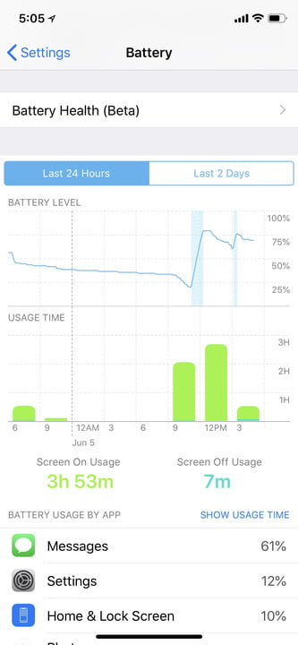

وعن طريق القسم "صحة البطارية" يمكنك رؤية سعة البطارية القصوى الخاصة بك مقارنة بالبطارية الجديدة.

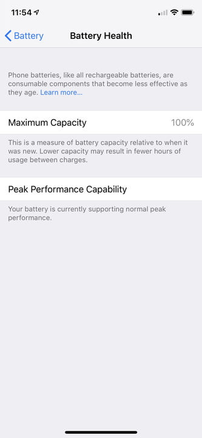

## تحسينات في وضع البورتريه

حصل تطبيق الكاميرا على تحديث كبير، ويتمثل التغيير الرئيسي في تحسين وضع البورتريه، حيث يقوم التطبيق بعمل Mask للشخص لفصله عن المشهد عند معالجة الصورة.
بالإضافة إلى أنه يمكنك أيضًا استيراد الصور بتنسيق RAW من الكمبيوتر أو الكاميرا حيث سمحت Apple للمستخدمين بتحرير ملفات صور RAW على جهاز iPad Pro.

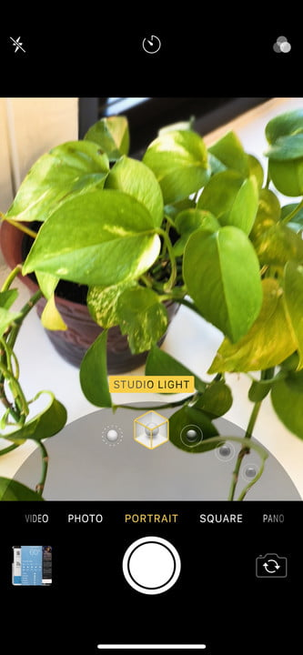

## إدارة أفضل لكلمات المرور

أضاف iOS 12 مجموعة متنوعة من ميزات كلمات المرور الجديدة. فبإمكان النظام الآن عرض كلمات المرور من تطبيقات إدارة كلمات المرور من الجهات الخارجية في اقتراحات QuickType على جهازك، كما سيتمكن المستخدمون أيضًا من مشاركة كلمات المرور بسهولة بين أجهزة iOS وMac إذا كانوا قريبين من بعضهم البعض.

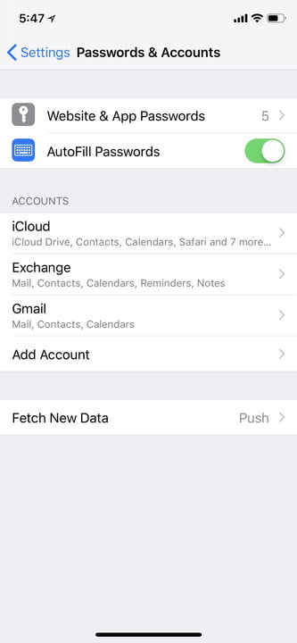

كما زادت Apple من الأمان عند إنشاء كلمات المرور. فإذا كنت تنشئ كلمة مرور سبق لك استخدامها في حساب آخر، فسيتم وضع علامة عليها وتذكيرك بعدم إعادة استخدام كلمة المرور. كما سيعمل النظام أيضًا على إنشاء كلمة مرور قوية وتخزينها في Keychain.

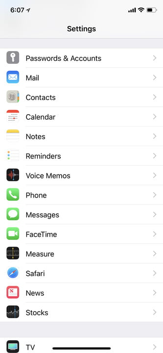

أيضا سيكون بإمكان Siri مساعدتك في كلمات المرور، وعلى الرغم من عدم وجود الكثير من المعلومات حول كيفية عمل هذه الميزة، على ما يبدو أن Siri ستتمكن من مساعدتك في البحث عن كلمات المرور في المستقبل.

## FaceID يصبح أفضل

من أفضل التغييرات التي حدثت في iOS 12، فيمكنك الآن إضافة ملفين مختلفين لمعرف الوجه.

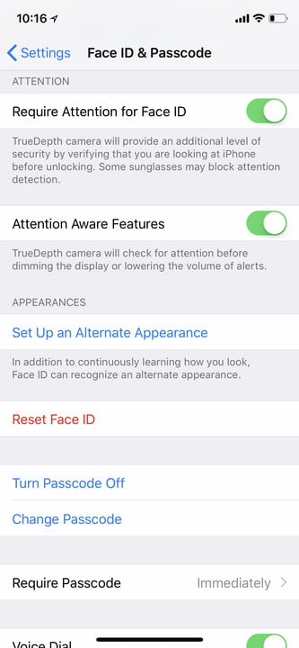

كما أصبح من الأسهل إعادة فحص وجهك إذا لم يتعرف Face ID عليك في المحاولة الأولى. تحتاج ببساطة إلى التمرير السريع من شاشة إلغاء القفل إذا فشلت ميزة Face ID في المحاولة الأولى. هذا التحسين البسيط نسبيًا، يجعل من استخدام Face ID أكثر ملاءمة.

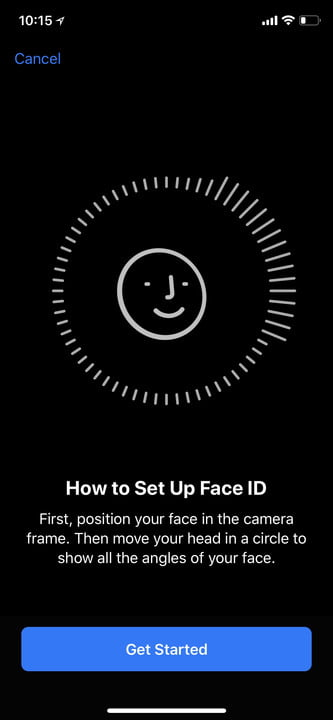

## تغييرات أخري

* دعم صيغة USDZ الجديدة لملفات الواقع المعزز AR.
* إضافة تطبيق Measure الجديد لقياس الأشياء.
* إضافة دعم ARKit 2.0.
* تطبيق Photos يحصل على ميزة اقتراحات البحث، واقتراحات المشاركة، وتبويب جديد لعرض الصور المختارة من أجلك. 
* وضع عدم الإزعاج يمكن تفعيله تلقائيا في أوقات النوم.
* تجميع الإشعارات على شريط المهام بدلا من عرضها منفردة.
* عرض إحصائيات مفصلة عن الوقت الذي تقضيه على الهاتف عن طريق ميزة App Limits.
* التحكم في تليفزيون Apple عن طريق مركز التحكم.
* تحديث العديد من التطبيقات مثل الأخبار، والملاحظات، والكتب.

---

هذا الموضوع نُشر باﻷصل في مجلة لغة العصر العدد 216 شهر 12-2018 ويمكن الإطلاع عليه [هنا](https://drive.google.com/file/d/18TzxpJ64gqA7SWZsUk-s9GLsvVYcz0sc/view?usp=sharing).

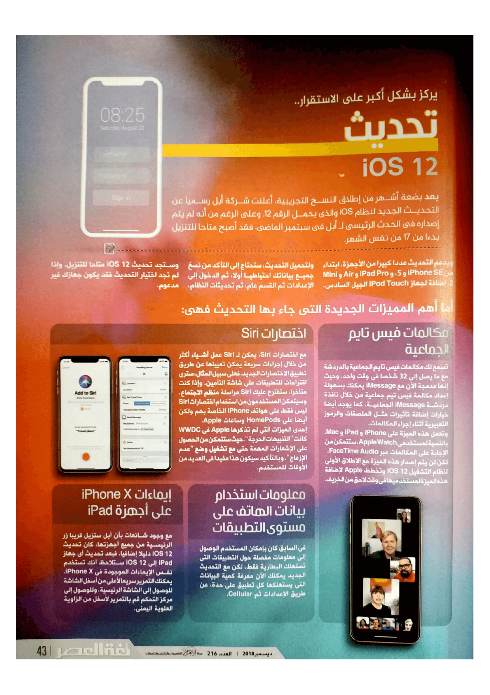

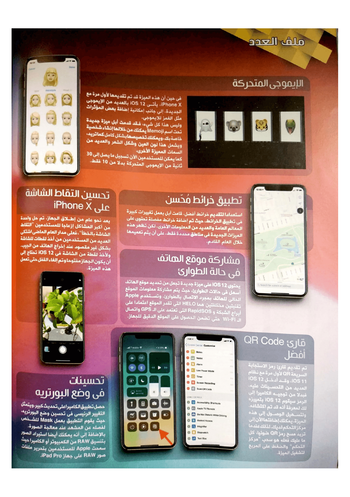

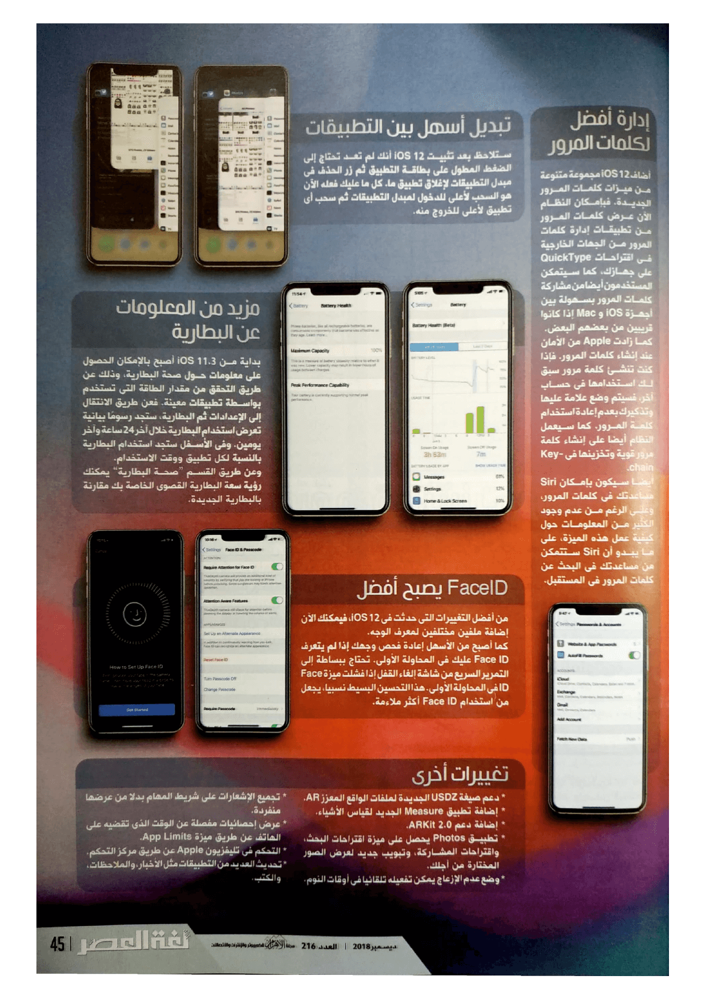
