+++
title = "تحديث macOS Mojave.. أفضل تجربة للمستخدم"
date = "2018-12-04"
description = "جاء تحديث macOS Mojave الجديد بالعديد من المميزات المتنوعة، والتي يركز أغلبها على تحسين أداء المستخدم أثناء استخدامه للنظام، إضافة إلى عدد كبير من التغييرات البصرية التي تعد الأكبر منذ عدة سنوات. تشمل هذه التغييرات إضافة الوضع المظلم الذي طال انتظاره، وميزة سطح المكتب الديناميكي التي تُغّير الخلفية خلال اليوم بشكل احترافي، ومجموعة أخري من التغييرات التي سنتعرف عليها في السطور التالية."
categories = ["تقارير",]
tags = ["مجلة لغة العصر"]

+++
جاء تحديث macOS Mojave الجديد بالعديد من المميزات المتنوعة، والتي يركز أغلبها على تحسين أداء المستخدم أثناء استخدامه للنظام، إضافة إلى عدد كبير من التغييرات البصرية التي تعد الأكبر منذ عدة سنوات. تشمل هذه التغييرات إضافة الوضع المظلم الذي طال انتظاره، وميزة سطح المكتب الديناميكي التي تُغّير الخلفية خلال اليوم بشكل احترافي، ومجموعة أخري من التغييرات التي سنتعرف عليها في السطور التالية.

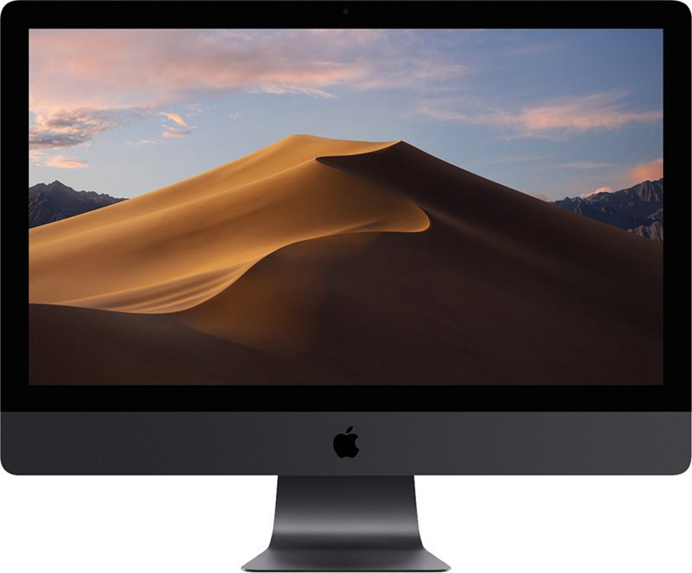

> تغييرات بصرية ومميزات جديدة

يتوافق التحديث الجديد مع كل أجهزة MacBook ابتداء من 2015، وأجهزة MacBook Air منذ 2012، إضافة إلى جميع إصدارات MacBook Pro - Mac mini - iMac وMac Pro منذ آخر 2013.
وقد استمرت أبل في إصدار العديد من النسخ التجريبية للنظام منذ بداية يونيو وحتى آخر سبتمبر، وأخيرا صدرت النسخة المستقرة في 24 من نفس الشهر والتي تحمل الرقم 10.14.

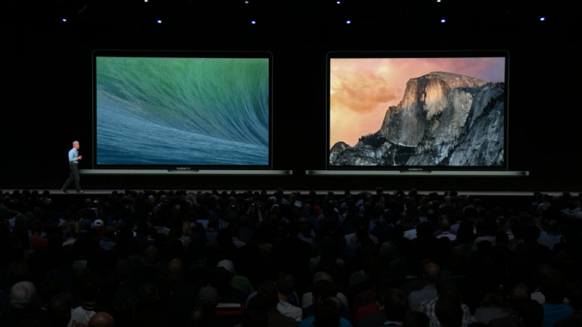

## أهم المميزات الجديدة

### الوضع المظلم

يستخدم نظام MacOS Mojave شريط قوائم وdocker داكن اللون، كما يوفر الوضع المظلم على مستوى النظام بأكمله، ليشمل القوائم والنوافذ وتطبيقات النظام، ويمتد ليشمل تطبيقات الطرف الثالث.

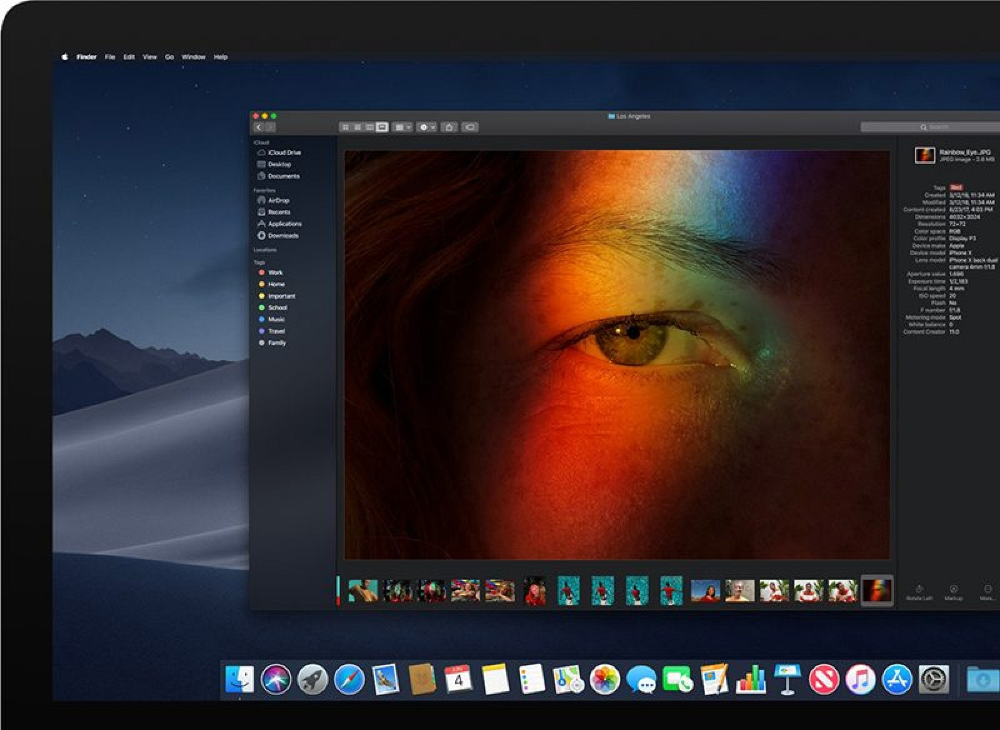

ويعتبر الوضع المظلم أحد الإضافات المُميِّزة للتحديث الجديد، حيث تقول أبل أن العديد من المستخدمين المحترفين يفضلونه، وذلك لأنه يجعل الصور والفيديوهات والعروض التقديمية وحتى المستندات تبرز على الشاشة.
يمكن تفعيل المظهر الجديد من خلال الإعدادات ثم القسم عام، أما إن كنت ضمن من لا يعجبهم هذا التغيير، فلا تقلق لأنه لا يزال بإمكانك اختيار المظهر العادي بكل سهولة من نفس المكان داخل الإعدادات.

## سطح المكتب الديناميكي

ميزة جديدة تم تصميمها من أجل خلفيات سطح المكتب، تعمل على تغيير الخلفية خلال اليوم في أوقات محددة، لتتغير إلى مظهر جديد في الصبح والظهر والليل، ويتضمن النظام حاليا وضع واحد فقط هو صحراء موهافي، ومن المتوقع أن تقوم أبل لإضافة المزيد قريبا.

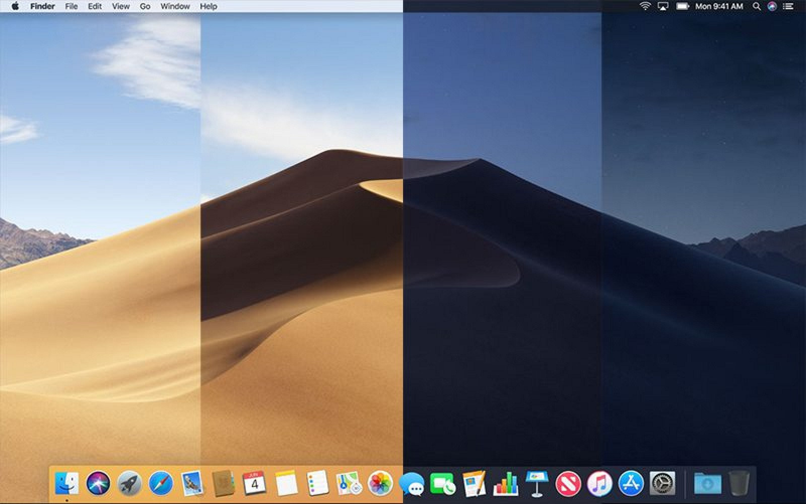

ولاستخدام هذه الميزة الجديدة تحتاج إلى تفعيل خدمات الموقع، حتى يتمكن النظام من معرفة التوقيت المحلى لديك وتغيير العرض كما ينبغي.

## الأكوَام Stacks

الأكوَام أو Stacks هي أحد الميزات الأبرز في تحديث Mojave، حيث تمكن المستخدم من تنظيم سطح المكتب بشكل متميز، عن طريق تجميع الملفات في "كومة" اعتمادا على نوع الملف أو التاريخ او حتى التسمية، مما يحل مشكلة الفوضى التي تحدث على سطح المكتب دائما.

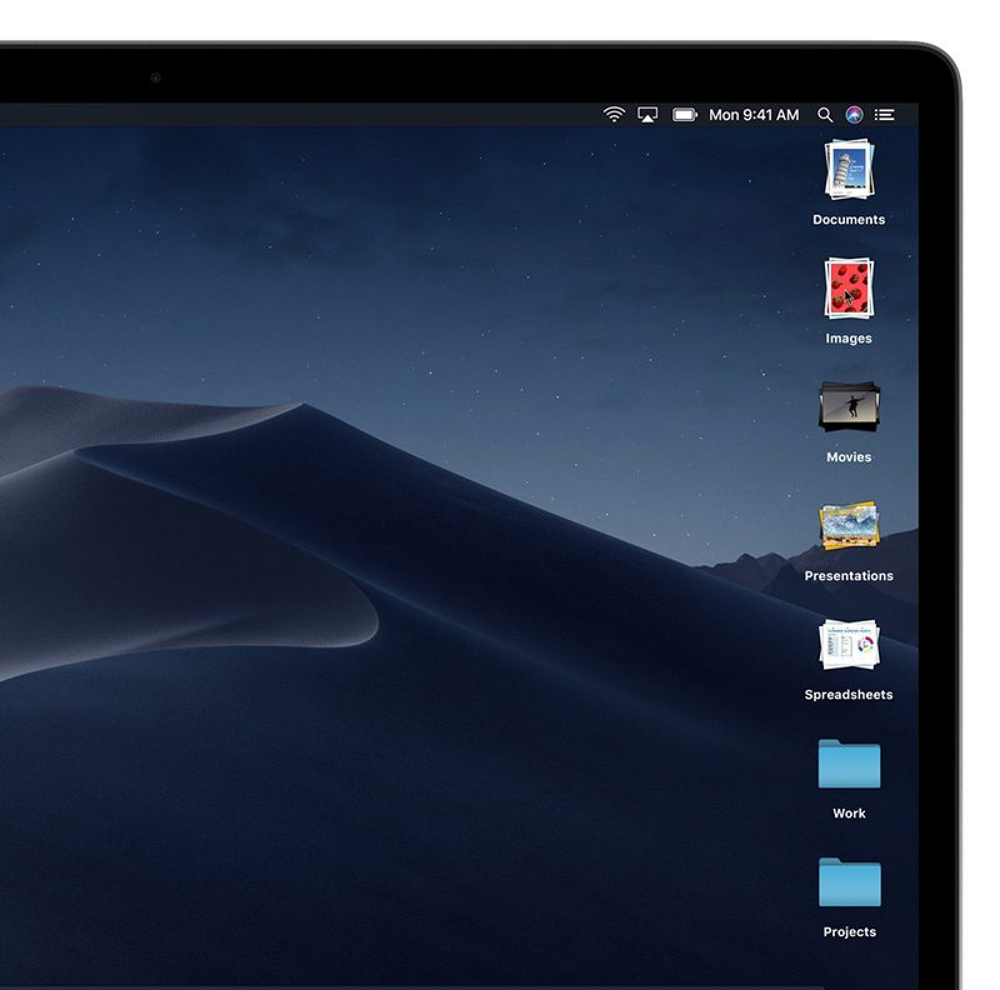

وعند الضغط على أحد الأكوام، يمكنك التقليب في محتوياتها عن طريق تمرير الماوس، وبالضغط عليها مرة أخري تستطيع تصفح محتوياتها.
ولتجربة الميزة الجديدة تحتاج لتفعيل الاختيار Use Stacks من قائمة View الخاصة بالمكتشف Finder.

## المكتشف يصبح أفضل

حصل المكتشف على العديد من التحسينات، مثل طريقة العرض الجديدة "المعرض"، والتي تعرض معاينة كبيرة للملف في الأعلى والمصغرة بالأسفل، وهي مثالية لعرض الصور والعروض التقديمية ومستندات PDF.

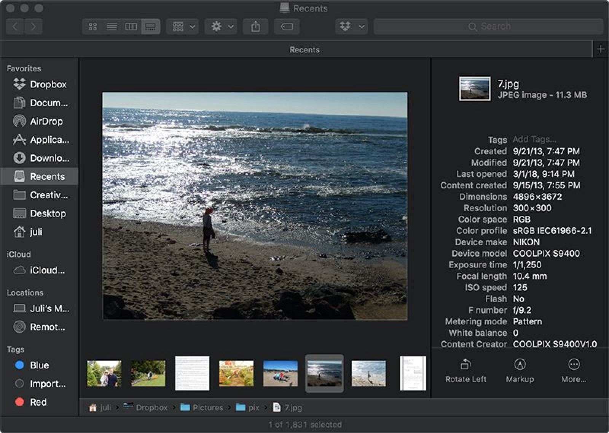

أما بالنسبة للشريط الجانبي، فبإمكانه الآن عرض البيانات الوصفية الخاصة بملفاتك، فعلى سبيل المثال سيعرض كافة معلومات الصور، مثل الأبعاد والدقة، والكاميرا المستخدمة وسرعة ال ISO والعديد من البيانات الأخرى.
كما تم إضافة بعض الميزات الجديدة مثل "الإجراءات السريعة" التي تمكنك من إجراء التعديلات على الملفات بشكل أسرع، وتتغير هذه الخيارات حسب نوع الملفات التي تعمل عليها.

## والتقاط الشاشة أيضا

كما جاء iOS 11 بأدوات جديدة لالتقاط الشاشة، حصل تحديث Mojave على نفس الأدوات، فعند الضغط على Shift + Command + 3 تظهر لقطة الشاشة في نافذة صغيرة أسفل الشاشة، وعند الضغط عليها ستفتح في المحرر حيث يمكنك التعديل والاقتصاص تغيير الحجم وإضافة أشكال أو توقيع أو نصوص كما تشاء.

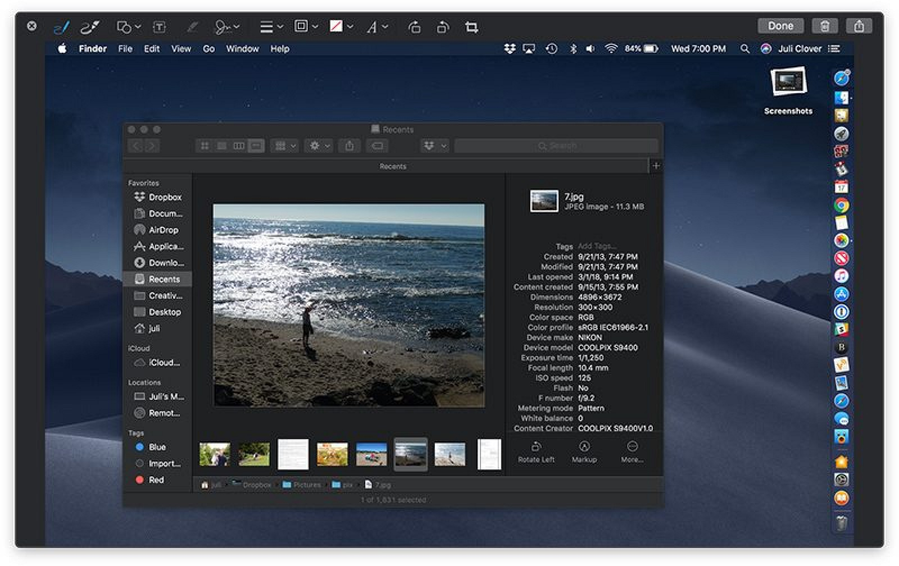

أما إذا قمت بالضغط على Shift + Command + 5 فستفتح أداة التقاط الشاشة الجديدة، ويمكنك من خلالها أخذ لقطة كاملة للشاشة، أو لنافذة محددة أو منطقة معينة. كما يمكنك تسجيل الشاشة من خلال نفس النافذة أيضا.

## تطبيقات جديدة وتطبيقات محدثة

أطلقت أبل مع MacOS Mojave مشروعًا جديدًا يهدف إلى جلب بعض تطبيقات iOS إلى نظام التشغيل Mac من خلال إطار عمل. حيث أن الهدف النهائي هو تسهيل الأمر على مطوري التطبيقات لتشغيل تطبيقات iOS إلى نظام Mac، وذلك بحلول 2019. وكاختبار مبكر لهذه الميزة، قامت أبل بنقل أربعة من تطبيقات iOS إلى Mac وهي الأخبار، والأسهم، والمنزل، والمذكرات الصوتية.

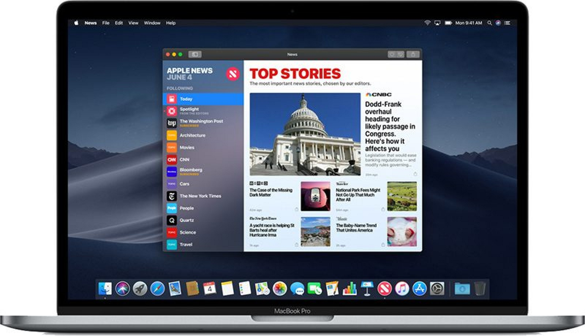

كما تم تحديث عدد من التطبيقات، مثل FaceTime الذي تم إضافة دعم المكالمات الجماعية له بشكل مماثل ل iOS 12. وتطبيق iBooks وهو عبارة عن إعادة إطلاق لتطبيق Books القديم.

## إعادة تصميم متجر التطبيقات

قامت أبل بالعديد من التغييرات في المتجر مع التحديث الجديد، ابتداء من الواجهة وحتى التفاصيل الصغيرة، كما تم إضافة التبويب "اكتشف" الذي يعرض مجموعة من أفضل التطبيقات المتوفرة، واختيار المحررين، وجداول أفضل التطبيقات.

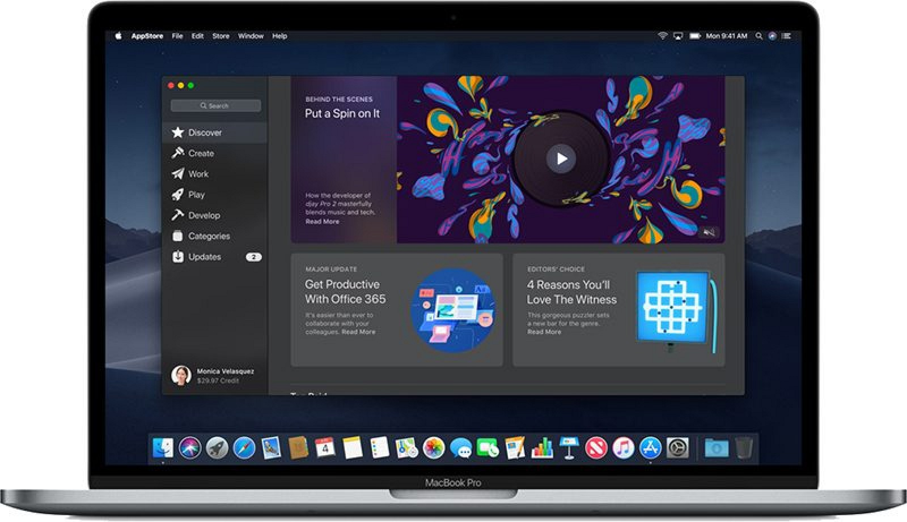

كما تم إضافة مجموعة من التبويبات المنفصلة للوصول للمحتوي الذي لا يتلاءم مع الأقسام الرئيسية. وحصلت صفحة منتجات أبل على عدد من التغييرات التي تشمل التشغيل التلقائي للفيديو وعرض العديد من المعلومات حول المنتج.

## تحكم أفضل بالخصوصية:

قامت أبل توسيع خيارات الخصوصية في التحديث الجديد لتشمل الكاميرا والميكروفون وبيانات المستخدم الحساسة الأخرى التي تتضمن قاعدة بيانات البريد، ومحفوظات الرسائل، وبيانات Safari، ونسخ Time Machine الاحتياطية، والنسخ الاحتياطية لأجهزة iTunes، وبيانات المواقع، وملفات تعريف الارتباط.

ستحتاج التطبيقات إلى موافقة صريحة من المستخدم لاستخدام ال API والوصول المباشر إلى هذه الموارد. ويمكن للمستخدمين الوصول إلى إعدادات الأمان في قسم الأمان في تفضيلات النظام.

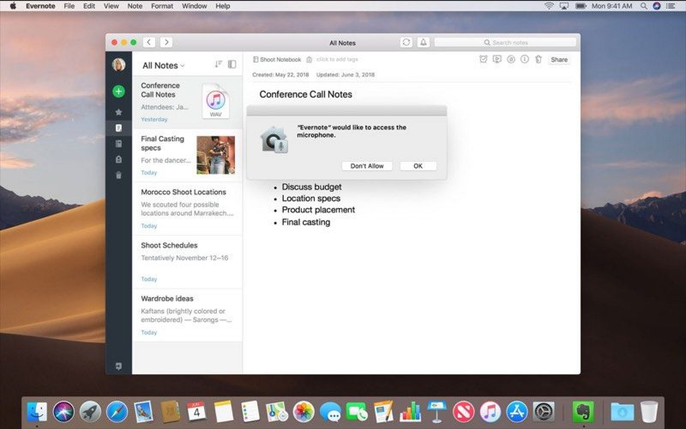

## تغييرات أخرى

كما توجد العديد من التغييرات الصغيرة الموجودة في التحديث الجديد، منها:
    • دعم تبويبات متصفح Safari لعرض أيقونات المواقع.
    • تطبيق البريد يوفر اقتراحات ذكية لتخزين الرسائل طبقا لإعداداتك الخاصة.
    • مزيد من السرعة في عملية الاستيقاظ من وضع Sleep.
    • إعادة تصميم نافذة تسجيل الدخول.
    • تغيير مكان التحديثات إلى قسم منفصل داخل الإعدادات بدلا من وجوده داخل المتجر.
    • إمكانية تفعيل معاينة الإشعارات من خلال إعدادات النظام.
    • إزالة خاصية "حسابات الإنترنت" من الإعدادات، إلى جانب إزالة أدوات المشاركة المباشرة إلى هذه الخدمات.

---

هذا الموضوع نُشر باﻷصل في مجلة لغة العصر العدد 216 شهر 12-2018 ويمكن الإطلاع عليه [هنا](https://drive.google.com/file/d/18TzxpJ64gqA7SWZsUk-s9GLsvVYcz0sc/view?usp=sharing).

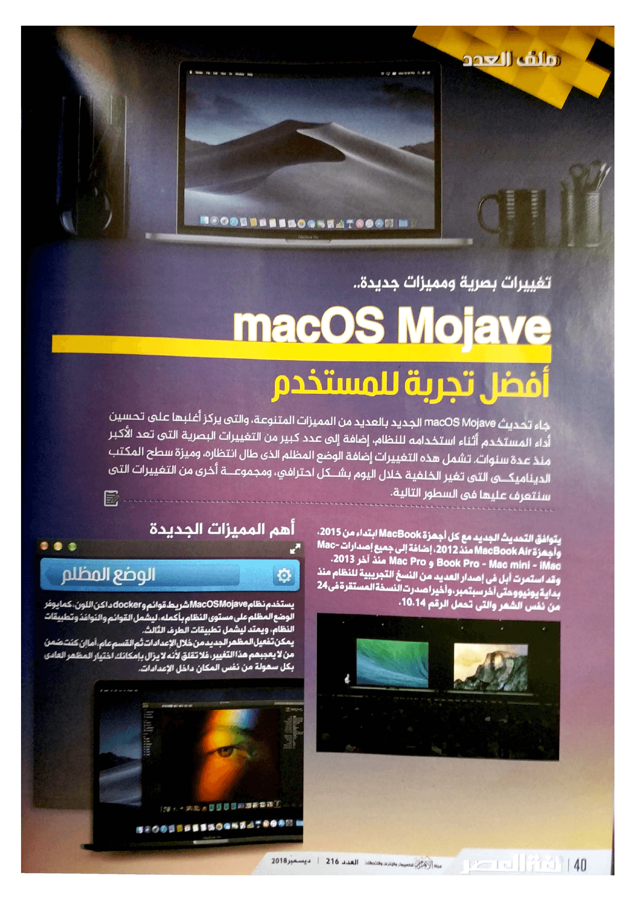

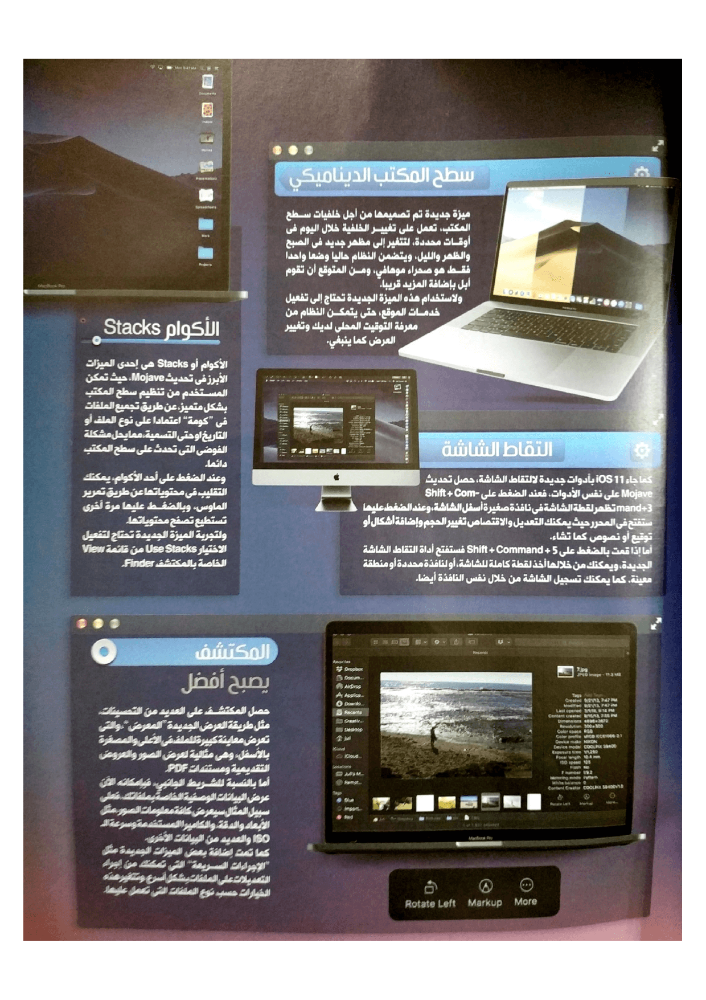

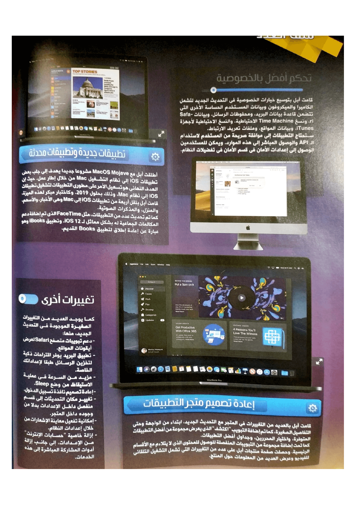
