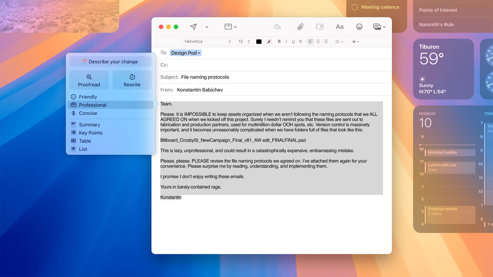

+++

title = "ما الجديد في تحديث macOS 15 Sequoia؟"
date = "2024-09-29"
description = "أصدرت أبل الإصدار الجديد من نظام iOS 18 وكذلك نظام macOS يوم الإثنين 16 سبتمبر في وقت أبكر من المعتاد كل عام، ويسمى التحديث الجديد Sequoia وهو اسم أحد أطول الأشجار في العالم الموجودة في حديقة Redwood الوطنية في كاليفورنيا، ويأتي بالعديد من الميزات الجديدة ومجموعة من تعديلات الواجهة وإصلاحات الأخطاء."
categories = ["تقارير"]
tags = ["مجلة لغة العصر"]

+++

## مقدمة

أصدرت أبل الإصدار الجديد من نظام iOS 18 وكذلك نظام macOS يوم الإثنين 16 سبتمبر في وقت أبكر من المعتاد كل عام، ويسمى التحديث الجديد Sequoia وهو اسم أحد أطول الأشجار في العالم الموجودة في حديقة Redwood الوطنية في كاليفورنيا، ويأتي بالعديد من الميزات الجديدة ومجموعة من تعديلات الواجهة وإصلاحات الأخطاء.

## الأجهزة المتوافقة مع الإصدار الجديد

- iMac بداية من 2019 وأحدث
- Mac Pro بداية من 2019 وأحدث
- iMac Pro بداية من 2017
- Mac Studio بداية من 2022 وأحدث
- MacBook Air بداية من 2020 وأحدث
- Mac mini بداية من 2018 وأحدث
- MacBook Pro بداية من 2018 وأحدث

ستدعم أجهزة أبل العاملة بشريحة M1 أو M2 أو M3-series فقط ميزات الذكاء الاصطناعي الجديدة "Apple Intelligence" مثل:

- iMac بداية من 2021 وأحدث
- Mac Pro بداية من 2023
- Mac Studio بداية من 2022 وأحدث
- MacBook Air بداية من أواخر 2020 وأحدث
- Mac mini بداية من أواخر 2020 وأحدث
- MacBook Pro بداية من أواخر 2020 وأحدث

## كيفية التثبيت

لتثبيت التحديث الجديد في حال كان جهازك يدعمه، افتح إعدادات النظام System Settings وانتقل إلى عام General ثم تحديث النظام Software Update ثم سيتحقق النظام من أي تحديثات متاحة ويرشدك خلال عملية تثبيتها.

## الميزات الجديدة

### انعكاس شاشة آيفون

انعكاس شاشة أيفون هو تحسين جديد في ميزة الاستمرارية Continuity، تتيح التحكم في هاتف أيفون عبر جهاز ماك حتى عندما يكون جهاز آيفون مقفلاً عند تسجيل الدخول إلى كلَا الجهازين بنفس حساب أبل.

لاستخدام الميزة الجديدة تحتاج فقط فتح التطبيق ثم تسجيل الدخول، ثم يمكنك ضبط حجم نافذة انعكاس شاشة الأيفون على الحجم الفعلي لشاشة الهاتف أو أصغر أو أكبر كما تريد. ستظهر  إشعارات أيفون على جهاز الماك حتى تتفاعل معها وترد عليها، كما يمكنك فتح جميع تطبيقاتك واستخدامها وإرسال الرسائل إلخ. وتستطيع استخدام لوحة مفاتيح الماك أو لوحة اللمس أو الماوس مع جهاز الآيفون، ويمكنك سحب وإفلات الملفات والصور ومقاطع الفيديو بين الجهازين.

تخطط أبل لإضافة ميزة انعكاس شاشة الأيفون في وقت لاحق من عام 2024، ولن تكون متاحة عند إطلاق macOS Sequoia أول مرة، وستعمل الميزة مع الهواتف التي تعمل بنظام iOS 18 بشرط أن تكون مزودة بشريحة Apple silicon أو شريحة أمان T2 مثل الموجودة في أحدث طرازات Intel، كما تتطلب الميزة أن تكون أجهزتك قريبة من بعضها ويجب تشغيل البلوتوث و الـ Wi-Fi.

### تنظيم النوافذ

يوفر macOS Sequoia طريقة جديدة أسهل وأفضل لترتيب النوافذ على الشاشة، بحيث يسحب المستخدم نافذة إلى حافَة الشاشة ليعرض النظام مكانًا لوضع تلك النافذة فيه، مما يسهل ترتيب النوافذ جنبًا إلى جنب بسرعة بحيث يعرض عدد أكبر من التطبيقات على الشاشة، كما يمكن استخدام اختصارات لوحة مفاتيح وقائمة الأوامر لتنظيم النوافذ بشكل أسرع.

### تحسينات مكالمات الفيديو

عند مشاركة الشاشة في مكالمة سيعرض النظام معاينة للمحتوى المشارك قبل مشاركته فعليًا حتى تتحقق من عدم عرض معلومات مهمة بالخطأ، وستعمل هذه الميزة مع تطبيقات FaceTime وZoom وغيرها، كما أصبح من الممكن استخدام مجموعة من الخلفيات المدمجة والتدرجات اللونية في المكالمات عبر تطبيقات مكالمات الفيديو المختلفة.

### متصفح Safari 18

يحتوي الإصدار الجديد من متصفح Safari العديد من الميزات مثل ميزة Highlights التي تساعد المستخدمين على اكتشاف المعلومات في مواقع الإنترنت مثل الاتجاهات وساعات العمل وقوائم المطاعم وأسعار المنتجات، وميزة Reader لتقليل عوامل التشتيت عند قراءة المقالات وعرض ملخص وفهرس المحتويات.

وعندما تحتوى صفحة ويب على فيديو، سيضع المتصفح هذا المقطع في منتصف الشاشة، وسيستطيع المستخدم التحكم في المقطع عبر عناصر التحكم في شريط النظام، كما يمكن تغيير كيفية عرض الفيديو إلى نمط صورة داخل صورة.

وهناك أيضًا ميزة التحكم في المشتتات، التي توفر طريقة لتقليل العناصر المشتتة للانتباه على صفحات الويب مثل نوافذ تسجيل الدخول، والنوافذ المنبثقة وخيارات ملفات تعريف الارتباط، وإشعارات اللائحة العامة لحماية البيانات GDPR، ولافتات الاشتراك في النشرات الإخبارية، ومقاطع الفيديو التي يتم تشغيلها تلقائيًا، وغيرها.

### تطبيق كلمات المرور الجديد

يضيف التحديث الجديد تطبيقًا مخصصًا لإدارة كلمات المرور ورموز الوصول لمرة واحدة للمصادقة الثنائية، وكلمات سر الـ Wi-Fi ومفاتيح المرور، كما يحتوي على أقسام مخصصة للتنبيهات الأمنية ومعرفة كلمات المرور القصيرة جدًا أو التي أعيد استخدامها أو عثر عليها في تسريبات أحد الاختراقات.

يمكنك كذلك مشاركة كلمات المرور مع الأصدقاء والعائلة عن طريق إنشاء مجموعة كلمات مرور مشتركة، ويمكنك إضافة معلومات تسجيل الدخول عبر زر الإضافة +، وستضاف كلمات المرور إلى التطبيق تلقائيًا عند استخدام ميزة الحفظ الآلي.

يحتوي التطبيق على شريط بحث في الأعلى للوصول السريع معلومات تسجيل الدخول التي تبحث عنها، وعند الضغط على إحدى كلمات المرور يمكنك تغييرها أو إضافة ملاحظات أو إعداد رمز التحقق.

وإذا فعلت التدوين التلقائي من خيارات النظام يمكن لتطبيق كلمات المرور توفير بيانات تسجيل الدخول للتطبيقات ومواقع الإنترنت بسهولة. ويمكنك مزامنة كلمات المرور عبر أجهزة أبل المختلفة وكذلك أجهزة ويندوز عبر تطبيق iCloud.

### ميزات جديدة أخرى

- تطبيق الرسائل: جدولة الإرسال حتى وقت أسبوعين مقدمًا، ودعم تنسيق النصوص وإضافة تأثيرات بصرية إلى النص.
- تطبيق التقويم: إدارة التذكيرات إلى جانب الأحداث والمهام.
- تطبيق الملاحظات: تسجيل الصوت داخل الملاحظات وتحويل الصوت إلى كلام، ودعم المعادلات الرياضية.
- تطبيق الآلة الحاسبة: إضافة عرض الحسابات السابقة وتحويل الوحدات.

## ميزات الذكاء الاصطناعي

من المتوقع أن يصدر تحديث آخر للنظام برقم 15.1 في أكتوبر القادم ليضيف ميزات الذكاء الاصطناعي Apple Intelligence التي ستتكامل مع تطبيقات النظام الأساسية مثل أدوات تحسين الكتابة والتدقيق اللغوي والتلخيص وإعادة الصياغة والردود الذكية، وأدوات توليد الصور والرموز التعبيرية، وأدوات البحث السياقي والتكامل مع ChatGPT.

---

هذا الموضوع نُشر باﻷصل في مجلة لغة العصر العدد 368 شهر 09-2024 ويمكن الإطلاع عليه [هنا](https://drive.google.com/file/d/1d6uHFzElLPYSjT2CUjtUOIEMDXCxZuLF/view?usp=drive_link).

