+++
title = "ما الجديد في تحديث ويندوز 11 24H2؟"
date = "2024-10-05"
description = "أصدرت مايكروسوفت التحديث السنوي الكبير لويندوز 11 للأجهزة التي تعمل بإصدارات 22H2 و23H2 وأجهزة Copilot+، ويأتي بتغييرات تشمل البنية الأساسية لميزات الذكاء الاصطناعي وتحسينات الأداء وتوفير الطاقة ودعم صوت بلوتوث LE وخلفيات HDR وشبكات Wi-Fi 7."
images = ["images/featured.jpg"]
categories = ["ويندوز"]
tags = ["مجلة لغة العصر"]
+++

# ما الجديد في تحديث ويندوز 11 24H2؟

أصدرت مايكروسوفت منذ أيام التحديث السنوي الكبير لويندوز 11 لكل الأجهزة التي تعمل بإصدارات 22H2 و23H2 من ويندوز 11، وأجهزة Copilot+، ويأتي التحديث الجديد بتغييرات تشمل كامل نظام التشغيل لتضيف البنية الأساسية لميزات الذكاء الاصطناعي التي ستضاف في تحديثات لاحقة في آخر 2024، وتحسينات الأداء وتوفير الطاقة، ودعم صوت بلوتوث LE وخلفيات HDR وشبكات Wi-Fi 7 وغيرها من أمور.

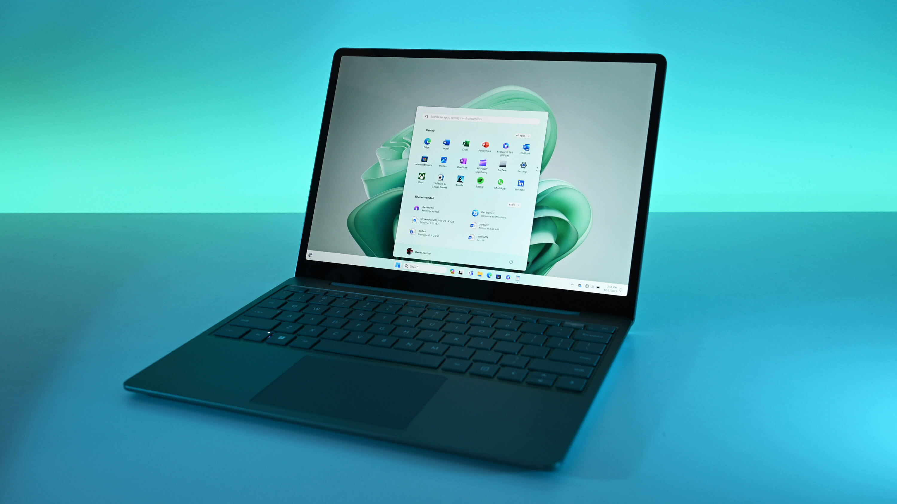

## كيف تحدث إلى الإصدار الجديد؟

بدأ وصول التحديث الجديد للأجهزة المؤهلة التي تعمل بإصداري 22H2 و23H2 من ويندوز 11، للمستخدمين الذين اختاروا مسبقًا أن يكونوا من بين أول من يجرب التحسينات الجديدة عبر خيار "الحصول على آخر التحديثات بمجرد توفرها" في قسم التحديثات من تطبيق الإعدادات.

وأوضحت مايكروسوفت أنها إذا اكتشفت أن جهازًا ما غير مؤهل للتحديث الجديد ستضعه في وضع الانتظار حتى تحل المشكلة المرتبطة به مثل إصدارات البرامج أو برامج التشغيل غير المتوافقة.

ويتوفر الإصدار الجديد 24H2 أيضًا عبر خدمات تحديث Windows Server (بما في ذلك Configuration Manager) وWindows Update for Business ومركز إدارة Microsoft 365، وتقترح مايكروسوفت أن تبدأ الشركات بالتحديث التدريجي لضمان توافق تطبيقاتها وأجهزتها وبنيتها التحتية مع الإصدار الجديد.

كما صدرت النسخة طويلة الدعم Long-Term Servicing Channel (LTSC) من التحديث الجديد المخصصة للمجالات التي تتطلب استقرارًا ممتدًا للتحديثات مثل التصنيع والرعاية الصحية، حيث ستدعم مايكروسوفت هذه النسخة لمدة خمس سنوات، في حين أنها ستدعم نسخة Windows 11 IoT Enterprise LTSC 2024 لمدة عشر سنوات.

## ميزات حصرية لأجهزة Copilot+

يأتي التحديث الجديد بميزات حصرية لأجهزة Copilot+ التي تعمل بويندوز 11 وتحتوي على وحدة معالجة عصبية تستطيع معالجة 40 تريليون عملية في الثانية الواحدة لتكون مناسبة لأداء عمليات المعالجة عبر الذكاء الاصطناعي مثل الترجمة في الوقت الفعلي وتوليد الصور.

وذكرت مايكروسوفت أن هذه الميزات الحصرية ستصل إلى أجهزة Copilot+ بداية من شهر نوفمبر، وستتاح لاحقًا للأجهزة التي تستخدم معالجات AMD و Intel لاحقًا في تحديثات أخرى.

وتشمل الميزات بجانب ما سنذكره أمورًا مثل: اقتراحات الأوامر في القائمة المختصرة، والبحث المحسن في مستكشف الملفات، وتحسين جودة الصور، والملء والمسح التوليدي في برنامج الرسام.

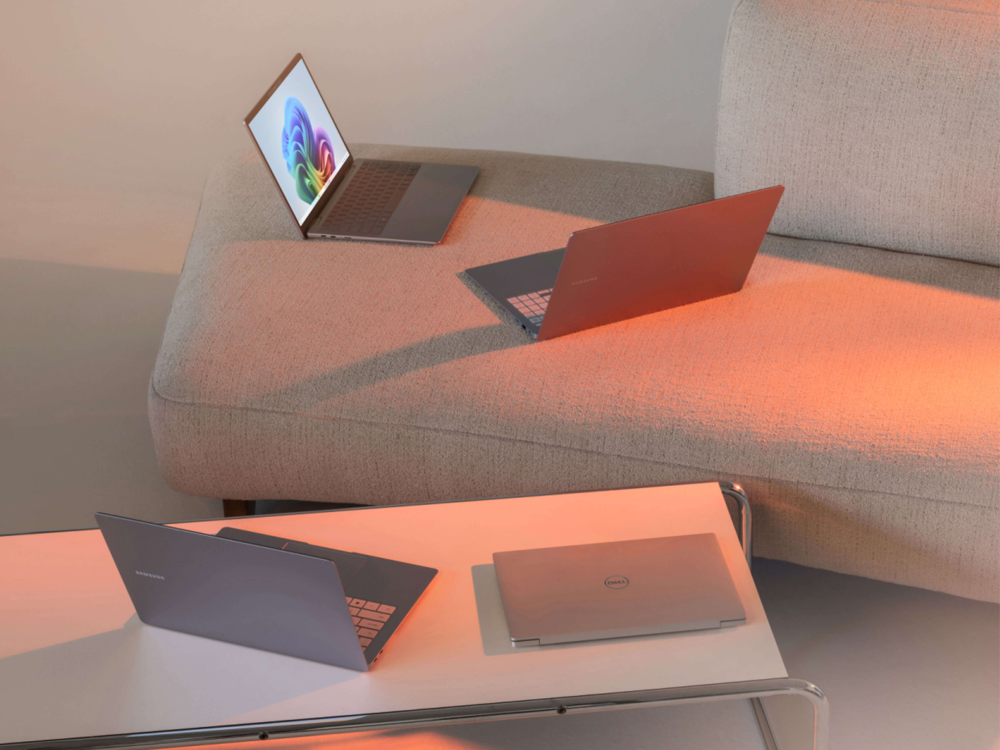

### التذكير Recall

ميزة التذكير Recall هي أحد أبرز الميزات الجديدة ومن المتوقع إطلاقها في وقت لاحق من هذا العام. وهي تطبيق يعمل في الخلفية ويلتقط صور كل ما يظهر على الشاشة حتى يستطيع المستخدم البحث عن أي شيء قام به على جهازه باستخدام اللغة الطبيعية، فمثلا يمكنك سؤال التطبيق "ابحث عن صورة الكتاب التي أرسلها لي فلان على واتساب" ليحضر لك الذكاء الاصطناعي اللقطة التي وصلتك تلك الصورة فيها.

وتؤكد مايكروسوفت أن جميع البيانات التي يتعامل معها تطبيق التذكير تعالج محليًا على الجهاز، ولا يرسل أي منها إلى سيرفرات خارجية للمعالجة، وأن البيانات لا تستخدم لتدريب أي نماذج ذكاء اصطناعي، كما يمكن للمستخدم إيقاف تشغيل الميزة في أي وقت إذا لم يكن يرغب في استخدامها.

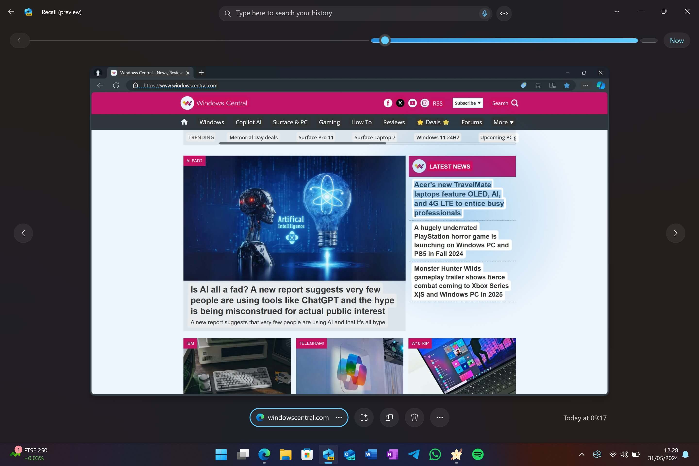

### تأثيرات الاستديو Studio Effects

توفر هذه الميزة طريقة سهلة لتحسين الفيديو والصوت عبر الذكاء الاصطناعي بغض النظر عن التطبيق المستخدم مثل Teams - Skype - Zoom - Slack - Google Meet أو تطبيق الكاميرا نفسه، عبر مركز التحكم في شريط المهام، فيمكن إضافة تأثيرات مثل ضبابية الخلفية، وتصحيح العين، والتأثيرات المتحركة والكرتونية.

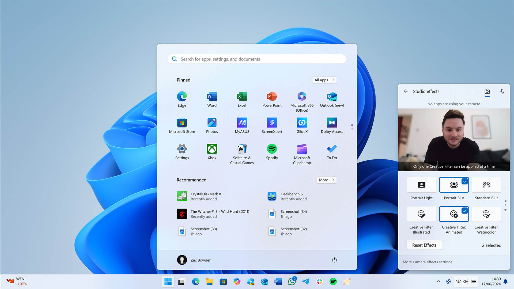

### التسميات التوضيحية المباشرة Live Captions

أحد أكثر الميزات فائدة في هذا التحديث، وتستخدم الذكاء الاصطناعي لتحويل وترجمة الصوت المباشر أو المُسجل مسبقًا في الوقت الفعلي إلى أكثر من 40 لغة مختلفة مباشرة على الجهاز، ويمكن الوصول إليها من مركز التحكم.

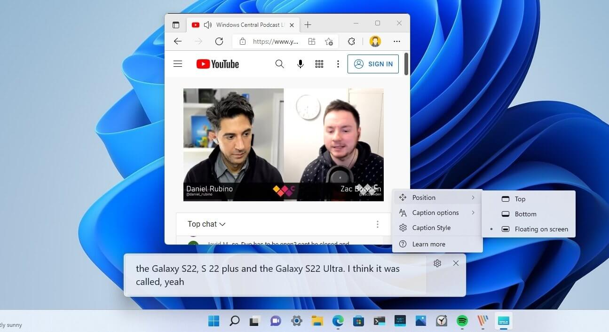

## الميزات الجديدة لكل الأجهزة

### Copilot

أضافت مايكروسوفت مجموعة من التغييرات لتطبيق Copilot، فأصبح الآن تطبيق ويب متكامل يمكن تحريكه في أي مكان في الشاشة مثل أي تطبيق عادي، كما حصل على واجهة مستخدم مُحدثة بها مساحة مخصصة للدردشة وشريط جانبي يعرض المحادثات السابقة وأزرار للوصول إلى المكونات الإضافية ودفتر الملاحظات من الشريط الجانبي.

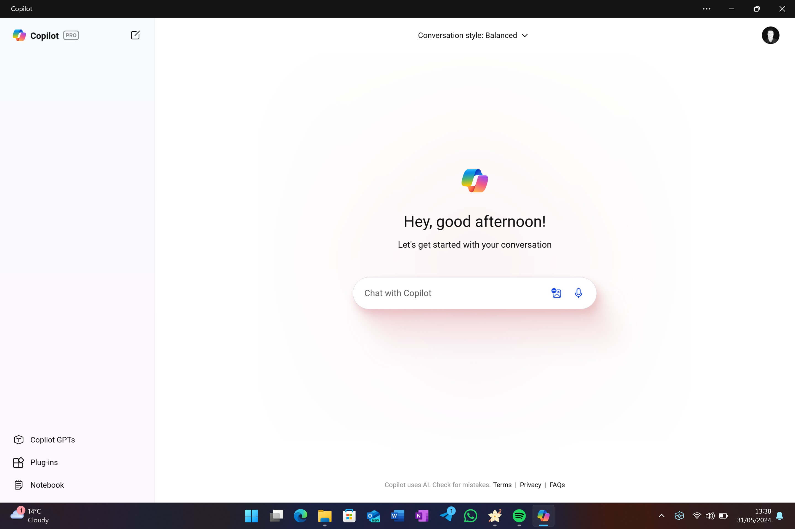

### تحسينات مستكشف الملفات

حدثت مايكروسوفت القائمة المختصرة لمستكشف الملفات بحيث تظهر أزرار الأوامر الشائعة مثل النسخ واللصق والقص في الجزء العلوي بشكل أكبر مما يجعلها أسهل في الوصول إليها.

ويمكن للمستخدمين في النسخة الجديدة من مستكشف الملفات إنشاء ملفات مضغوطة بتنسيقات 7Zip وTAR وZIP بعد أن كان من الممكن استخراجها فقط بداية من إصدار ويندوز 11 23H2، كما أصبح أداء مستكشف الملفات أفضل عند فتح ملفات ZIP كبيرة.

كما يمكن سحب الملفات بين المسارات في شريط العناوين، وعرض وتعديل بيانات تعريف ووصف وتسميات الصور بصيغة PNG، وأضيف قسم جديد للملفات المشتركة في الشاشة الرئيسية لمستكشف الملفات.

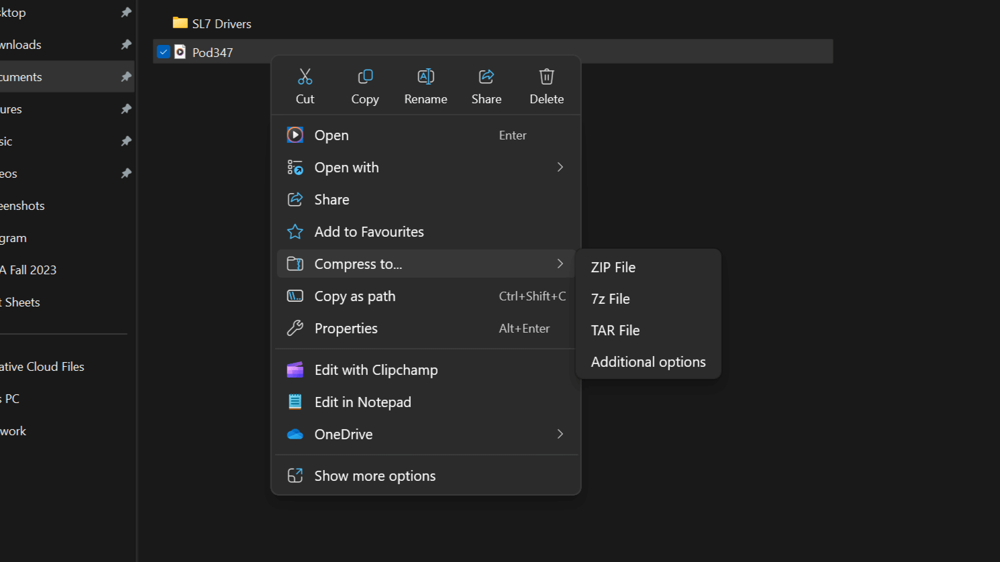

### تحسينات تشغيل البرامج على معالجات ARM

يأتي التحديث الجديد بتغيير جذري في طبقة المحاكاة لتشغيل البرامج المصممة للعمل على معمارية x86 على معالجات ARM، مع تحسين في عمر البطارية والأداء عمومًا يصل إلى 10%.

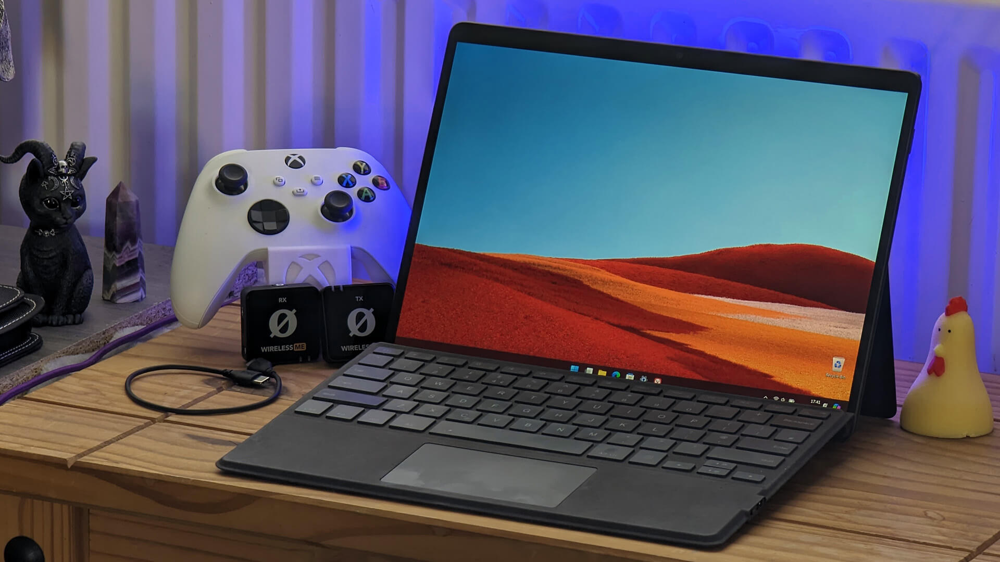

### تغييرات الإعدادات السريعة

أصبحت واجهة الإعدادات السريعة مُقسّمة إلى صفحات، ولا يزال بالإمكان تخصيص موضع الإعدادات بالضغط عليها وسحبها، كما أضيف زر التحديث إلى قائمة شبكات Wi-Fi، وحسنت واجهة إدارة VPN.

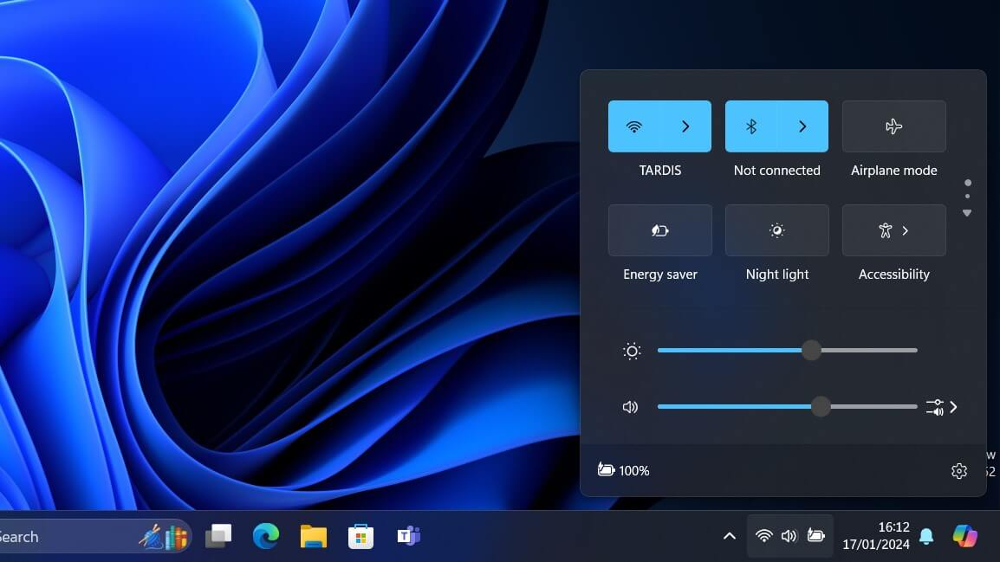

### الربط بالهاتف

أضافت مايكروسوفت العديد من التحسينات إلى ميزة ربط هواتف أندرويد بأجهزة ويندوز، فهناك الآن تطبيق جديد لإدارة الهواتف المحمولة يتيح لك ربط الهاتف خارج تطبيق Phone Link للحصول على أمور مثل الإشعارات والصور، واستخدام كاميرا هاتفك على جهاز الكمبيوتر.

ولا يزال تطبيق Phone Link القديم موجودًا ويقدم أفضل طريقة لمزامنة الرسائل والإشعارات بين الهاتف والكمبيوتر، كما أضيف تكامل جديد لتطبيق ربط الهاتف إلى قائمة البداية يعرض حالة الهاتف وإشعاراته.

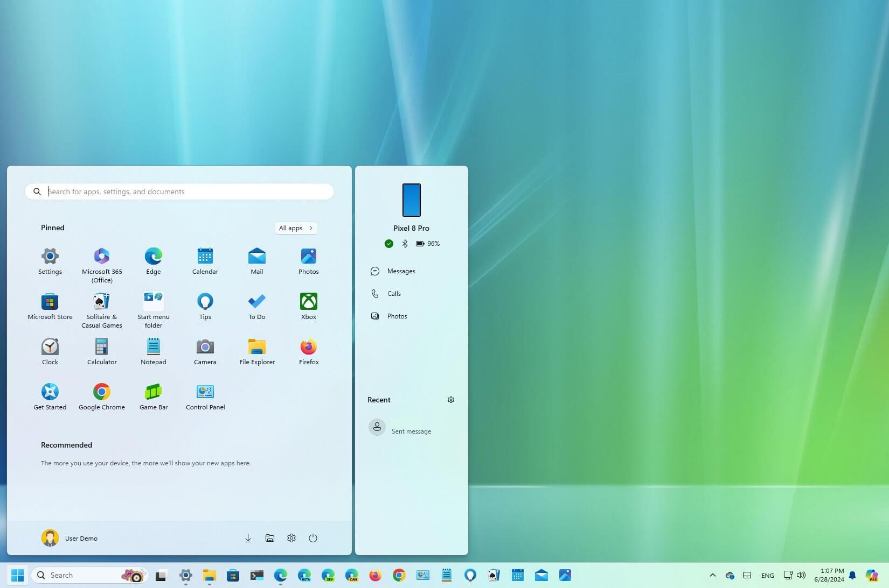

### تحسين جودة الصوت

يضيف التحديث الجديد ميزة تحسين جودة صوت الميكروفون عبر الذكاء الاصطناعي التي تزيل ضوضاء الخلفية خلال المكالمات وتسجيل الصوت. وكانت هذه الميزة سابقًا حصرية لأجهزة Surface المجهزة بوحدة معالجة عصبية (NPU)، لكنها متوفرة الآن لجميع أجهزة الكمبيوتر التي تعمل بنظام ويندوز 11 دون الحاجة إلى شريحة NPU.

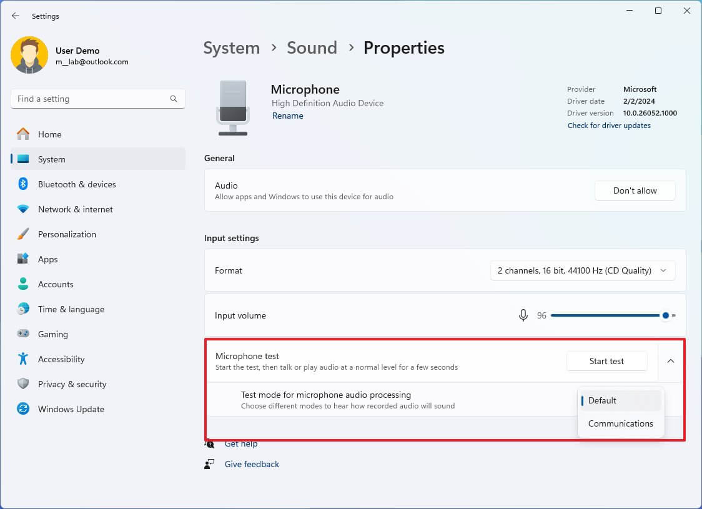

### توفير الطاقة

أعادت مايكروسوفت هيكلة آلية توفير الطاقة وخياراتها في التحديث الجديد، وأضافت وضع توفير الطاقة الجديد الذي يُخفّض الاستهلاك عبر تقليل أداء النظام، مما يُطيل عمر بطارية الحواسيب المحمولة ويُقلل الاستهلاك في الأجهزة المكتبية.

كما أضافت مايكروسوفت خيارات أخرى للتحكم بالطاقة ضمن قسم الطاقة والبطارية في تطبيق الإعدادات، حيث أصبح بالإمكان ضبط إعدادات غطاء الجهاز وزر الطاقة، وتحديد وقت دخول الجهاز في وضع السبات، وكانت هذه الإعدادات سابقًا موجودة فقط في لوحة التحكم التقليدية.

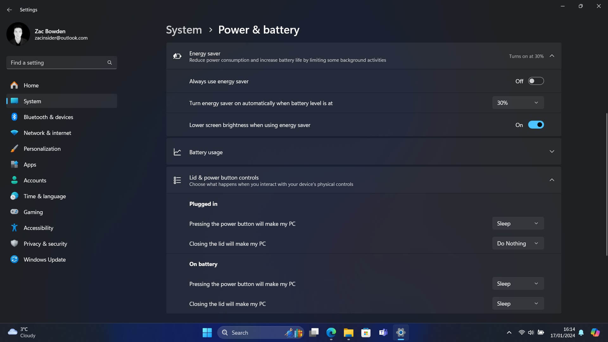

### أمر sudo في موجه الأوامر

يضيف التحديث الجديد أمر sudo (superuser do) الشهير في أنظمة لينكس، الذي يسمح بتنفيذ الأوامر بصلاحيات أعلى عبر سطر الأوامر، ويوفر sudo عدة خيارات للتحكم في تشغيل الأوامر:

- التشغيل في نافذة جديدة
- تنفيذ الأمر في نفس النافذة مع تعطيل الإدخال
- التنفيذ ضمن نفس النافذة مما يحاكي تجربة sudo في الأنظمة الأخرى

وحرصًا على الأمان فإن ميزة sudo مُعطّلة افتراضيًا ويُمكن تفعيلها عبر تطبيق الإعدادات.

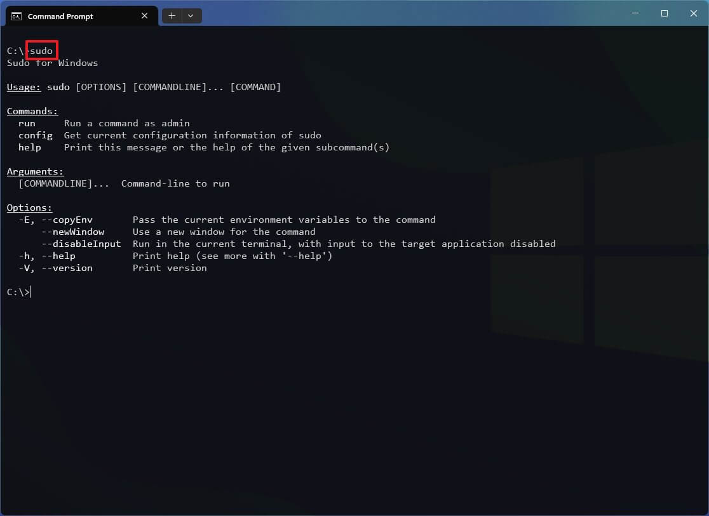

### تغييرات أخرى

هناك العديد من التحسينات العامة التي يضيفها التحديث الجديد مثل:

- واجهة جديدة لتثبيت النظام دون اتصال بالإنترنت بمظهر عصري
- زر "تثبيت برامج التشغيل" خلال الإعداد الأولي لتسهيل تثبيت النظام دون برامج تشغيل مُسبقة
- أزالت مايكروسوفت بعض التطبيقات مثل Cortana والبريد والتقويم والخرائط وجهات الاتصال والأفلام والتلفزيون، وستزيل برنامج WordPad لاحقًا
- إمكانية تثبيت التصحيحات الأمنية دون الحاجة لإعادة التشغيل
- دعم USB4 بسرعة نقل بيانات تصل إلى 80Gbps
- دعم لغة Rust في نواة النظام
- تفعيل تشفير BitLocker افتراضيًا في نسخ ويندوز Home وPro بغض النظر عن وجود حساب مايكروسوفت، لضمان أمان البيانات
- إضافة ومشاركة شبكات Wi-Fi عبر رموز QR

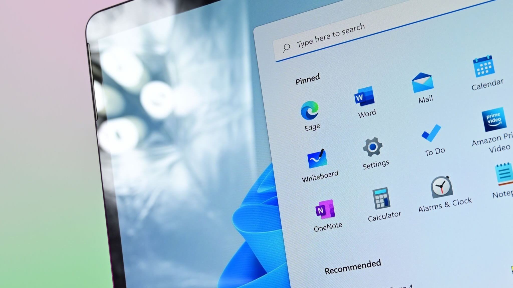
