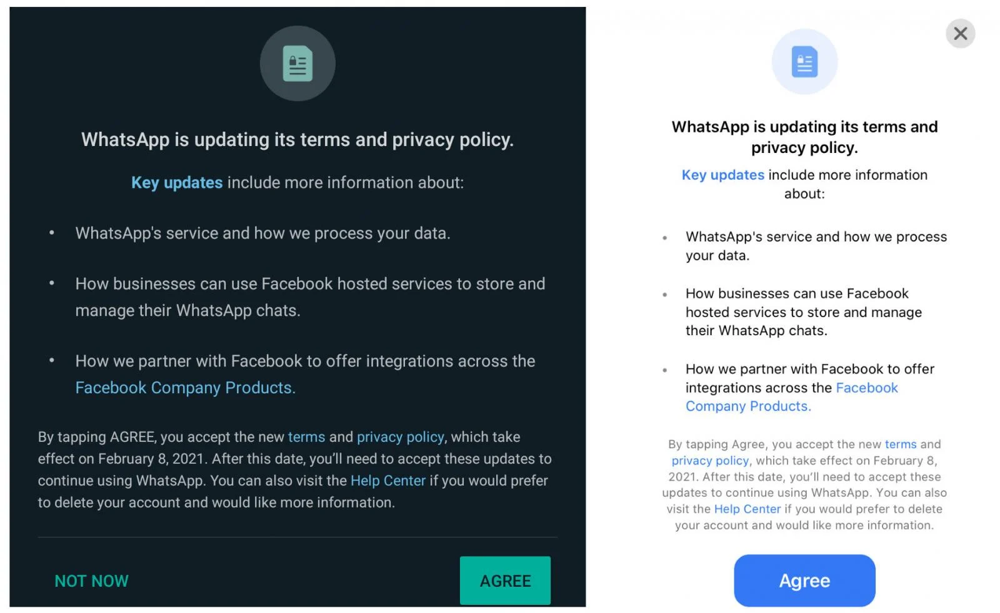
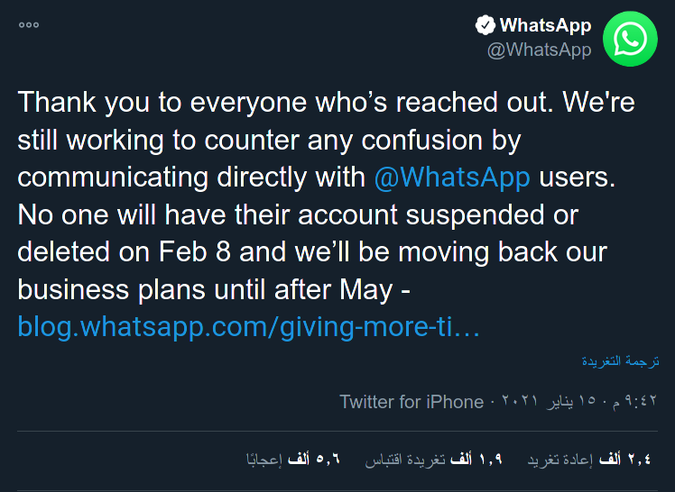
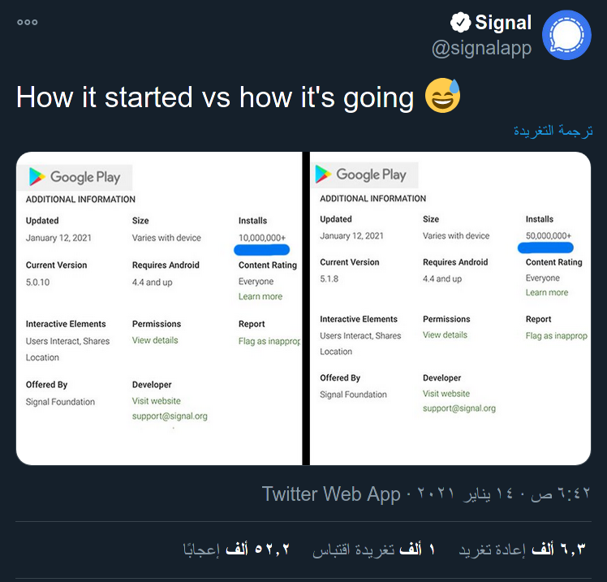
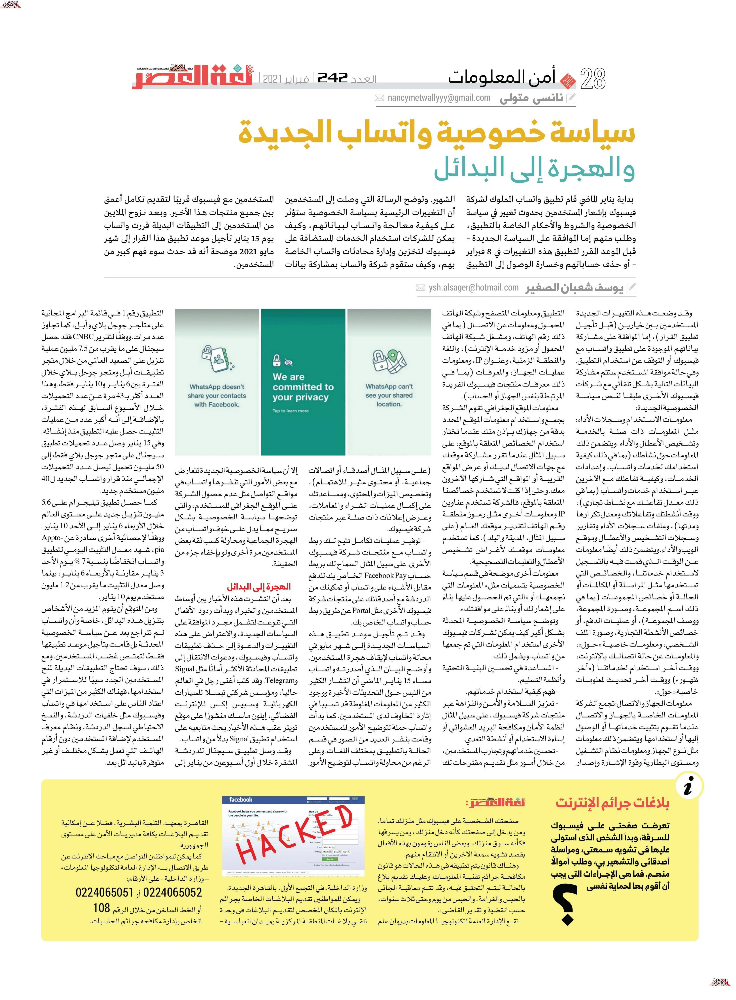

+++
title = "سياسة خصوصية واتساب الجديدة والهجرة إلى البدائل"
date = "2021-02-01"
description = "بداية يناير الماضي قام تطبيق الواتساب المملوك لشركة فيسبوك بإشعار المستخدمين بحدوث تغيير في سياسة الخصوصية والشروط والأحكام الخاصة بالتطبيق، وطلب منهم إما الموافقة على السياسة الجديدة – قبل الموعد المقرر لتطبيق هذه التغييرات في 8 فبراير – أو حذف حساباتهم وخسارة الوصول إلى التطبيق الشهير. وتوضح الرسالة التي وصلت إلى المستخدمين أن التغييرات الرئيسية بسياسة الخصوصية ستؤثر على كيفية معالجة الواتساب لبياناتهم، وكيف يمكن للشركات استخدام الخدمات المستضافة على الفيسبوك لتخزين وإدارة محادثات الواتساب الخاصة بهم، وكيف ستقوم شركة واتساب بمشاركة بيانات المستخدمين مع الفيس بوك قريبًا لتقديم تكامل أعمق بين جميع منتجات هذا الأخير. وبعد نزوح الملايين من المستخدمين إلى التطبيقات البديلة قررت واتساب يوم 15 يناير تأجيل موعد تطبيق هذا القرار إلى شهر مايو 2021 موضحة أنه قد حدث سوء فهم كبير من المستخدمين."
categories = ["تقارير",]
tags = ["مجلة لغة العصر"]

+++

بداية يناير الماضي قام تطبيق الواتساب المملوك لشركة فيسبوك بإشعار المستخدمين بحدوث تغيير في سياسة الخصوصية والشروط والأحكام الخاصة بالتطبيق، وطلب منهم إما الموافقة على السياسة الجديدة – قبل الموعد المقرر لتطبيق هذه التغييرات في 8 فبراير – أو حذف حساباتهم وخسارة الوصول إلى التطبيق الشهير. وتوضح الرسالة التي وصلت إلى المستخدمين أن التغييرات الرئيسية بسياسة الخصوصية ستؤثر على كيفية معالجة الواتساب لبياناتهم، وكيف يمكن للشركات استخدام الخدمات المستضافة على الفيسبوك لتخزين وإدارة محادثات الواتساب الخاصة بهم، وكيف ستقوم شركة واتساب بمشاركة بيانات المستخدمين مع الفيس بوك قريبًا لتقديم تكامل أعمق بين جميع منتجات هذا الأخير. وبعد نزوح الملايين من المستخدمين إلى التطبيقات البديلة قررت واتساب يوم 15 يناير تأجيل موعد تطبيق هذا القرار إلى شهر مايو 2021 موضحة أنه قد حدث سوء فهم كبير من المستخدمين.

## التغييرات الجديدة

وقد وضعت هذه التغييرات الجديدة المستخدمين بين خيارين (قبل تأجيل تطبيق القرار)، إما الموافقة على مشاركة بيانتهم الموجودة على تطبيق الواتساب مع الفيسبوك أو التوقف عن استخدام التطبيق. وفي حالة موافقة المستخدم ستتم مشاركة البيانات التالية بشكل تلقائي مع شركات الفيسبوك الأخرى طبقا لنص سياسة الخصوصية الجديدة:

-   معلومات الاستخدام وسجلات الأداء: مثل المعلومات ذات صلة بالخدمة وتشخيص الأعطال والأداء. ويتضمن ذلك المعلومات حول نشاطك (بما في ذلك كيفية استخدامك لخدمات الواتساب، وإعدادات الخدمات، وكيفية تفاعلك مع الآخرين عبر استخدام خدمات الواتساب (بما في ذلك معدل تفاعلك مع نشاط تجاري)، ووقت أنشطتك وتفاعلاتك ومعدل تكرارها ومدتها)، وملفات سجلات الأداء وتقارير وسجلات التشخيص والأعطال وموقع الويب والأداء. ويتضمن ذلك أيضًا معلومات عن الوقت الذي قمت فيه بالتسجيل لاستخدام خدماتنا، والخصائص التي تستخدمها مثل المراسلة أو المكالمات أو الحالة أو خصائص المجموعات (بما في ذلك اسم المجموعة، وصورة المجموعة، ووصف المجموعة)، أو عمليات الدفع، أو خصائص الأنشطة التجارية، وصورة الملف الشخصي، ومعلومات خاصية "حول"، والمعلومات عن حالة اتصالك بالإنترنت، ووقت آخر استخدام لخدماتنا ("آخر ظهور") ووقت آخر تحديث لمعلومات خاصية "حول".
-   معلومات الجهاز والاتصال: تجمع الشركة المعلومات الخاصة بالجهاز والاتصال عندما تقوم بتثبيت خدماتها أو الوصول إليها أو استخدامها. ويتضمن ذلك معلومات مثل نوع الجهاز ومعلومات نظام التشغيل ومستوى البطارية وقوة الإشارة وإصدار التطبيق ومعلومات المتصفح وشبكة الهاتف المحمول ومعلومات عن الاتصال (بما في ذلك رقم الهاتف، ومشغل شبكة الهاتف المحمول أو مزود خدمة الإنترنت)، واللغة والمنطقة الزمنية، وعنوان IP، ومعلومات عمليات الجهاز، والمعرفات (بما في ذلك معرفات منتجات فيسبوك الفريدة المرتبطة بنفس الجهاز أو الحساب).
-   معلومات الموقع الجغرافي. تقوم الشركة بجمع واستخدام معلومات الموقع المحدد بدقة من جهازك بإذن منك عندما تختار استخدام الخصائص المتعلقة بالموقع، على سبيل المثال عندما تقرر مشاركة موقعك مع جهات الاتصال لديك أو عرض المواقع القريبة أو المواقع التي شاركها الآخرون معك. وحتى إذا كنت لا تستخدم خصائصنا المتعلقة بالموقع، فالشركة تستخدم عناوين IP ومعلومات أخرى مثل رموز منطقة رقم الهاتف لتقدير موقعك العام (على سبيل المثال، المدينة والبلد). كما تستخدم معلومات موقعك لأغراض تشخيص الأعطال والتعليمات التصحيحية.
-   معلومات أخرى موضحة في قسم سياسة الخصوصية بتسميات مثل "المعلومات التي نجمعها" أو "التي تم الحصول عليها بناءً على إشعار لك أو بناءً على موافقتك".

وتوضح سياسة الخصوصية المحدثة بشكل أكبر كيف يمكن لشركات الفيسبوك الأخرى استخدام المعلومات التي تم جمعها من الواتساب. ويشمل ذلك:

-   المساعدة في تحسين البنية التحتية وأنظمة التسليم.
-   فهم كيفية استخدام خدماتهم.
-   تعزيز السلامة والأمن والنزاهة عبر منتجات شركة الفيسبوك، على سبيل المثال أنظمة الأمان ومكافحة البريد العشوائي أو إساءة الاستخدام أو أنشطة التعدي.
-   تحسين خدماتهم وتجارب المستخدمين، من خلال أمور مثل تقديم مقترحات لك (على سبيل المثال أصدقاء أو اتصالات جماعية، أو محتوى مثير للاهتمام)، وتخصيص الميزات والمحتوى، ومساعدتك على إكمال عمليات الشراء والمعاملات، وعرض إعلانات ذات صلة عبر منتجات شركة فيسبوك.
-   توفير عمليات تكامل تتيح لك ربط الواتساب مع منتجات شركة الفيسبوك الأخرى. على سبيل المثال السماح لك بربط حساب Facebook Pay الخاص بك للدفع مقابل الأشياء على الواتساب أو تمكينك من الدردشة مع أصدقائك على منتجات شركة الفيسبوك الأخرى مثل Portal عن طريق ربط حساب الواتساب الخاص بك.

وقد تم تأجيل موعد تطبيق هذه السياسات الجديدة إلى شهر مايو في محالة الواتساب لإيقاف هجرة المستخدمين. وأوضح البيان الذي أصدرته واتساب مساء 15 يناير الماضي أن انتشار الكثير من اللبس حول التحديثات الأخيرة ووجود الكثير من المعلومات المغلوطة قد تسببا في إثارة المخاوف لدى المستخدمين. كما بدأت الواتساب حملة لتوضيح الأمور للمستخدمين وقامت بنشر العديد من الصور في قسم الحالة بالتطبيق بمختلف اللغات. وعلى الرغم من محاولة الواتساب لتوضيح الأمور إلا أن سياسة الخصوصية الجديدة تتعارض مع بعض الأمور التي تنشرها واتساب في مواقع التواصل مثل عدم حصول الشركة على الموقع الجغرافي للمستخدم، والتي توضحها سياسة الخصوصية بشكل صريح مما يدل على خوف الواتساب من الهجرة الجماعية ومحاولة كسب ثقة بعض المستخدمين مرة أخرى ولو بإخفاء جزء من الحقيقة.

## الهجرة إلى البدائل

بعد أن انتشرت هذه الأخبار بين أوساط المستخدمين والخبراء وبدأت ردود الأفعال التي تنوعت لتشمل مجرد الموافقة على السياسات الجديدة، والاعتراض على هذه التغييرات والدعوة إلى حذف تطبيقات الواتساب والفيسبوك، ودعوات الانتقال إلى تطبيقات المحادثة الأكثر أمانًا مثل Signal وTelegram. وقد كتب أغنى رجل في العالم حاليا، ومؤسس شركتي تيسلا للسيارات الكهربائية وسبيس إكس للإنترنت الفضائي، إيلون ماسك منشورًا على موقع تويتر عقب هذه الأخبار يحث متابعيه على استخدام تطبيق Signal بدلاً من الواتساب.

وقد وصل تطبيق سيجنال للدردشة المشفرة خلال أول أسبوعين من يناير إلى التطبيق رقم 1 في قائمة البرامج المجانية على متاجر جوجل بلاي وأبل، كما تجاوز عدد مرات. ووفقًا لتقرير CNBC فقد حصل سيجنال على ما يقرب من 7.5 مليون عملية تنزيل على الصعيد العالمي من خلال متجر تطبيقات أبل ومتجر جوجل بلاي خلال الفترة بين 6 يناير و10 يناير فقط. وهذا العدد أكثر بـ 43 مرة عن عدد التحميلات خلال الأسبوع السابق لهذه الفترة، بالإضافة إلى أنه أكبر عدد من عمليات التثبيت حصل عليه التطبيق منذ إنشائه. وفي 15 يناير وصل عدد تحميلات تطبيق سيجنال على متجر جوجل بلاي فقط إلى 50 مليون تحميل ليصل عدد التحميلات الإجمالي منذ قرار الواتساب الجديد ل 40 مليون مستخدم جديد.

كما حصل تطبيق تيليجرام على 5.6 مليون تنزيل جديد على مستوى العالم خلال الأربعاء 6 يناير إلى الأحد 10 يناير. ووفقًا لإحصائية أخرى صادرة عن Apptopia، شهد معدل التثبيت اليومي لتطبيق الواتساب انخفاضًا بنسبة 7٪ يوم الأحد 3 يناير مقارنة بالأربعاء 6 يناير، بينما وصل معدل التثبيت ما يقرب من 1.2 مليون مستخدم يوم 10 يناير.

ومن المتوقع أن يقوم المزيد من الأشخاص بتنزيل هذه البدائل، خاصة وأن الواتساب لم تتراجع بعد عن سياسة الخصوصية المحدثة بل قامت بتأجيل موعد تطبيقها فقط لتمتص غضب المستخدمين. ومع ذلك، سوف تحتاج التطبيقات البديلة لمنح المستخدمين الجدد سببًا للاستمرار في استخدامها، فهناك الكثير من الميزات التي اعتاد الناس على استخدامها في الواتساب والفيسبوك مثل خلفيات الدردشة، والنسخ الاحتياطي لسجل الدردشة، ونظام معرف المستخدم لإضافة المستخدمين دون أرقام الهاتف التي تعمل بشكل مختلف أو غير متوفرة بالبدائل بعد.

---

هذا الموضوع نُشر باﻷصل في مجلة لغة العصر العدد 242 شهر 02-2021 ويمكن الإطلاع عليه [هنا](https://drive.google.com/file/d/1CtqW1EUkpwpoPLtfUDXT1z5yBzZ4KNWo/view?usp=sharing) أو [هنا](https://gate.ahram.org.eg/News/2627846.aspx).

