+++
title = "لماذا يجب الانتقال إلى استخدام البرمجيات الحرة؟"
date = "2017-08-01"
description = "هل تعرف نظام لينكس؟ ربما تساءلت يوما عن سبب تطوره السريع، ولماذا بدأت العديد من الشركات والمؤسسات الاعتماد عليه واستخدامه؟ ذلك لأن نظام لينكس هو نظام تشغيل حر ومفتوح المصدر، وبالتالي يمكن لأي شخص استخدامه مجانا وتطويره والتعديل عليه بما يتلاءم مع استخدامه! وذلك لأنه لا توجد قيود في عالم البرمجيات الحرة، حيث أن الكود المصدري متوفر للتعديل والمشاركة والنشر."
categories = ["لينكس", "برمجيات حرة",]
tags = ["مجلة لغة العصر"]
featured = true

+++

هل تعرف نظام لينكس؟ ربما تساءلت يوما عن سبب تطوره السريع، ولماذا بدأت العديد من الشركات والمؤسسات الاعتماد عليه واستخدامه؟ ذلك لأن نظام لينكس هو نظام تشغيل حر ومفتوح المصدر، وبالتالي يمكن لأي شخص استخدامه مجانا وتطويره والتعديل عليه بما يتلاءم مع استخدامه! وذلك لأنه لا توجد قيود في عالم البرمجيات الحرة، حيث أن الكود المصدري متوفر للتعديل والمشاركة والنشر.

## البرمجيات الحرة

Free/Open Source Software أوFOSS اختصارا، هي البرمجيات التي تحترم حرية المستخدمين والمجتمع. بصورة تقريبية، يملك المستخدمون الحرية في تشغيل ونسخ وتوزيع ودراسة وتعديل وتحسين البرمجيات، فكلمة "حرة" نطاقها أوسع بكثير من "مجانية" حيث أن هناك العديد من البرامج المجانية التي لا تعطي مستخدمها حرية الإطلاع على الكود المصدري للبرنامج أو تعديله.

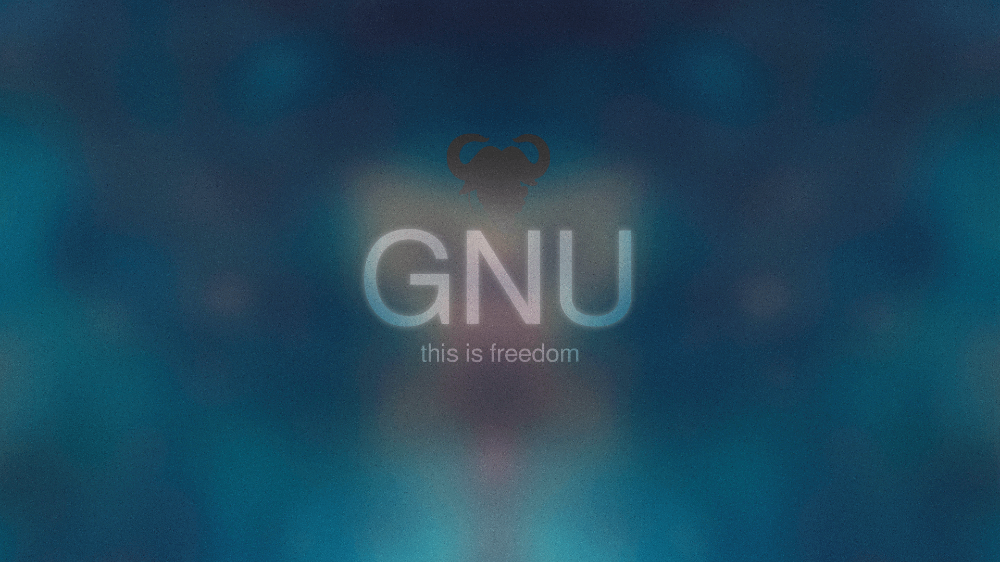

يكون البرنامج حرًا إذا امتلك مستخدموه الحريات اﻷربع الأساسية:

### 1- حرية تشغيل البرنامج، لأي غرض كان.

وهذا يضمن للمستخدم أن لا تقوم بعض الشركات مثلا بمنع المستخدم من تشغيل البرنامج في أغراض معينة.

### 2- حرية دراسة كيفية عمل البرنامج، وتعديله ليعمل وفق رغباتك.

فمع البرمجيات الحرة لا يوجد شيئا يستطيع المبرمج أو الشركة المطورة أن تخفيه عنك، فالجميع يستطيع أن يصلوا إلى الشفرة المصدرية للبرنامج، والمستخدم يستطيع أن يطوع البرنامج بإضافة مميزات جديدة يرغب بها.

### 3- حرية إعادة توزيع نسخ من البرنامج لتتمكن من مساعدة جارك أو صديقك.

فهذا الشرط يضمن للمستخدم النهائي حرية نسخ وإعادة توزيع البرنامج لأسرته و جيرانه وأصدقائه من دون قيد، كما هو الحال في بعض البرامج المدفوعة ومغلقة المصدر.

### 4- حرية توزيع نسخ من إصداراتك المعدَّلة للآخرين.

وبذلك يمكنك أن تمنح المجتمع بأسره فرصة الاستفادة من تعديلاتك. الوصول إلى الشفرة المصدرية شرط لازم لهذا.

فبعد أن عدلت البرنامج الحر لاحتياجاتك الخاصة وقمت بتخصيصه لمتطلباتك، فهذه الحرية تضمن لك القدرة على نشر تعديلاتك وتوزيعها من دون أخذ الإذن من المطور الأول.

### أمثلة للبرمجيات الحرة

هناك العديد من البرمجيات الحرة الشهيرة التي رسخت مكانها وسط البرامج المختلفة والتي قد تكون تستخدمها دون معرفة أنها برمجيات حرة، أذكر لك منها:

-   نظام التشغيل لينكس GNU/Linux

-   متصفح الإنترنت Mozilla Firefox

-   مدير التحميل Free‬‬ ‫‪Download‬‬ ‫‪Manager‬‬

-   مشغل الوسائط VLC

-   محرر الأكواد ‫‪Notepad‬‬ ‫‪++‬‬

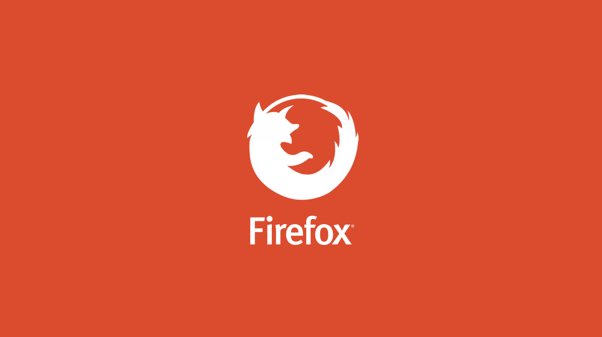

## لماذا تنتقل لاستخدام البرمجيات الحرة بدلا من مغلقة المصدر؟

يمر العالم الرقمي بفترة تغييرات مهمة بعد تسريب مجموعة الثغرات Valut7 التابعة للاستخبارات الأمريكية NSA، والتي أدت بعد ذلك بفترة قصيرة لظهور الجيل الجديد من برمجيات الفدية التي تستهدف نظام ويندوز، ثم بعد ذلك استيقظنا على خبر تسريب جزء من الكود المصدري لويندوز 10 بعد اختراق مايكروسوفت، وهنا أدرك العديد من خبراء أمن المعلومات أن القادم قد يكون أسوء لمستخدمي ويندوز، هذا من الناحية الأمنية، ومن ناحية الخصوصية فلا يخفي على أحد من مستخدمي ويندوز 10 أن مايكروسوفت قد دمجت برنامج خاص بها لتسجيل ما يقوم المستخدم بكتابته وذلك بغرض تحسين الويندوز، كما لدينا أيضا العديد من الشركات الأخري التي تقوم بنفس الشيء من تجميع للمعلومات مثل برامج مضادات الفيروسات الشهيرة Avast و AVG.

وبعد كل هذا ألم يحن الوقت عزيزي القارئ لنسلط الضوء على البديل لكل هذا؟ دعونا نتعرف أكثر على ما تقدمه البرمجيات الحرة:

## ما الذي تقدمه البرمجيات الحرة؟

### 1- الحرية

-   فكما أوضحت بالأعلى، تعد الحرية الميزة الأقوى بالبرمجيات المفتوحة، فالحرية التي تتيحها البرمجيات الحرة مفتوحة المصدر لا تجعلنا فقط قادرين على قراءة الأكواد البرمجية بل أيضاً دراستها وتعديلاها بالشكل الذي يلائم كل بيئة، مما يدفع عجلة تطوير البرمجيات الحرة بشكل سريع جدا مقارنة بالبرامج مغلقة المصدر.

-   إلى جانب أنه لا يوجد عقد أو اتفاق عليك مراجعته قبل استخدام البرنامج والاهتمام بعدم الإخلال بشروطه أثناء استخدامك، مثلما الحال في البرمجيات المغلقة.

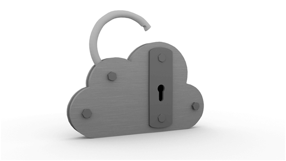

### 2- الأمان

-   هنا في عالم البرمجيات الحرة لا يوجد ما يمكن إخفائه عن المستخدم، فلا وجود لبرامج التجسس الضارة التي تنقل كل بيانات المستخدم إلى طرف خارجي، وبالتالي فقد لا تحتاج لبرامج محاربة الفيروسات طالما أنك تعرف ما تقوم بفعله.

-   ولا يوجد أيضا فيروسات كما في الويندوز فلا حاجة للقلق على بياناتك من فيروسات الفدية أو الفيروسات العادية التي تنتقل عبر الUSB الخاص بك، أو عن طريق التحميلات وإعلانات الإنترنت.

-   لكن هذا لا يعني الأمان المطلق، فكون البرمجيات الحرة مفتوحة المصدر يكون في بعض الأحيان مشكلة، فقد يطلع بعض المخربين على الكود المصدري ويقوم باستغلال بعض الثغرات الموجودة به، لكن لحسن الحظ نسبة المخربين تكاد تكون لا تذكر لأنه بمجرد اكتشاف أي ثغرة يقوم المطورين بإصدار تصحيح للمشكلة يقوم بسد الثغرة في أسرع وقت ممكن وذلك لأن أي شخص يمكنه الإطلاع على الكود المصدري، حيث أن أغلب ثغرات لينكس على سيبل المثال يتم سدها عن طريق التحديثات خلال أقل من يوم!

### 3- الجودة

-   تقدم البرمجيات مفتوحة المصدر لمستخدميها كفاءة وجودة وسرعة لا تتأثر ولا تضعف مع مرور الوقت، ويرجع ذلك أيضا إلى توفر المصدر البرمجي للجميع فيستطيع الجميع سواء المبرمجين أو المستخدمين العاديين قراءة ومراجعة وتجربة الأكواد البرمجية وإفادة مطوري البرامج بأي ملاحظات مما يزيد من جودة هذه البرمجيات بشكل ملحوظ عن غيرها.

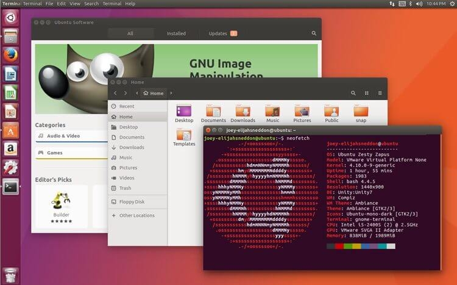

### 4- التكلفة المنخفضة

-   تصل تكلفة استخدام البرمجيات الحرة إلى الصفر تقريبًا، وهذا يمنحها ميزة اقتصادية هائلة بالمقارنة بغيرها من البرمجيات المغلقة، فبدلا من التكاليف الباهظة التي يتم دفعها للحصول على نظام تشغيل أصلي غير مقرصن مغلق المصدر يمكن استخدام نظام لينكس مفتوح المصدر.

-   ولكن هذا لا يعني أن البرمجيات الحرة غير قادرة على الربح، بل على العكس فبسبب مميزاتها والأساليب غير التقليدية في الربح فهي تحقق أرباح عالية، أحد أفضل الأمثلة لهذا هي شركة ريدهات.

-   قامت العديد من الدول بالتحول إلى استخدام البرمجيات الحرة لخفض التكاليف وضمان الأمان والخصوصية مثل ألمانيا وروسيا والبرازيل وفنزويلا وكذلك البرلمان والشرطة الفرنسية.

### 5- المرونة

-   طالما يتوافر الكود المصدري للبرنامج فإنه لن يموت، هذه أحدي أهم نقاط قوة البرمجيات الحرة، فعلي سيبل المثال حينما قررت أوبنتو مؤخرا إيقاف تطوير واجهة Unity 8 قام مجموعة من المطورين بنسخ الكود المصدري والبدء في استكمال تطوير الواجهة بأنفسهم تحت اسم Yunit.

-   فالبرمجيات مفتوحة المصدر ليست كغيرها، فأنت تستطيع تشكيلها كما تريد بالشكل الذي يلائمك، ولن تحتاج إلى الالتزام بالتغييرات التي تقرها الشركة إذا لم تعجبك، فلا أحد يفرض عليك التحديث إلى إصدار لا يعجبك.

-   ولذلك تجد أن نظام لينكس مثلا يستطيع حتى الآن العمل على أجهزة قديمة جدا حتى لو كانت تعمل على معالج Intel Pentium 3!

### 6- الاستقلالية والتشاركية

ولأن الجميع بإمكانهم تعديل البرامج كما يريدون، فأنت غير مضطر مثلا لانتظار الشركة لتطويربرنامجها وإصلاح الأخطاء، فالأمر في البرمجيات مفتوحة المصدر تشاركي وفعال بشكل أفضل بكثير، حيث الآلاف من المبرمجين من مختلف دول العالم يعملون على علاج أي مشكلة أو ثغرة قد تظهر ببرنامج معين خلال وقت قياسي.

### 7- الاستقرار وسهولة الاستخدام

-   لا تعتقد عزيزي القارئ أن الانتقال إلى استخدام البرمجيات الحرة سيكلفك الكثير من الوقت للتعلم، أو أن هذه البرمجيات معقدة وصعبة الاستخدام، حيث أن هناك الكثير من الناس لديهم انطباع خاطئ عن لينكس مثلا، فهم يعتقدون أنه مجرد شاشة سوداء تُكتب بها الأكواد!

-   لكن الواقع هو العكس تماما، فالبرمجيات الحرة تتنوع وتتطور بشكل كبير مما يجعلها سهلة الاستخدام حتى بالنسبة لطفل صغير في المدرسة، إلى جانب توفيرها لمجموعة كبيرة من الاختيارات والتسهيلات التي توفر الوقت والجهد للمستخدمين، ولا تنس أيضا ميزة عدم تعطل المستخدمين عند الإصابة بالفيروسات أو تعطل البرامج أو نسخ الويندوز.

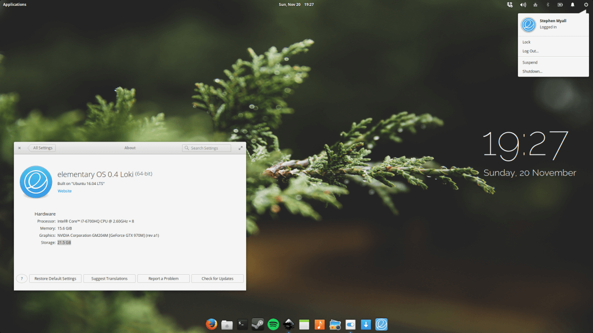

### 8- المجتمع

-   لا يتوقف الأمر فقط على المطورين والمبرمجين في عالم البرمجيات الحرة، فالمستخدمين الآخرين يشكلون مجتمعات مختلفة على الإنترنت تجد بها نقاشات واقتراحات وحلول لأغلب المشاكل التي تواجه المستخدم سواء المبتدئ أو حتى المستخدم المتقدم.

-   دعني أذكر لك أمثلة من هذه المجتمعات، لدينا موقع askubuntu الذي تجد به كل ما يخص توزيعة أوبنتو من استفسارات وأسئلة، وهناك قسم linux4noobs على موقع Reddit الذي يهتم بالمستخدمين المبتدئين، ولا أنسي موقع الويكي الخاص بتوزيعة أرش لينكسArchWiki الذي دائما ما أرجع له عندما تواجهني مشكلة ما بنظام لينكس، وغالبا ما أجد الحل بهذا الموقع.

## اﻹنتقال إلى البرمجيات الحرة

إذا كيف تنتقل إلى استخدام البرمجيات الحرة؟

بداية دعني أوضح لك أن التحول من استخدام البرامج المغلقة إلى البرمجيات الحرة ليس بالصعوبة التي تتصورها، فأنت ستجد بدائل لكل البرمجيات التي تستخدمها، وأيضا لن تواجه مشاكل في مشاركة الملفات مع مستخدمي البرمجيات الغير الحرة.

يمكنك اختيار احدي طريقين:

-   التخلي عن الويندوز والبرامج المغلقة والانتقال مباشرة إلى لينكس والبرامج الحرة.

-   استبدال البرامج المغلقة ببرامج حرة تعمل على ويندوز وبعد الاستقرار والتعود على استخدامها تنتقل إلى لينكس.

### أولا: لماذا لينكس؟

كما أوضحت سابقا، لينكس نظام تشغيل حر ومفتوح المصدر، يقوم الناس من مختلف أنحاء العالم بتطويره ويستخدمه الملايين من الناس حول العالم، وهو يتطور بسرعة رهيبة ويتميز بالمجانية والتنوع ودرجة الأمان العالية.

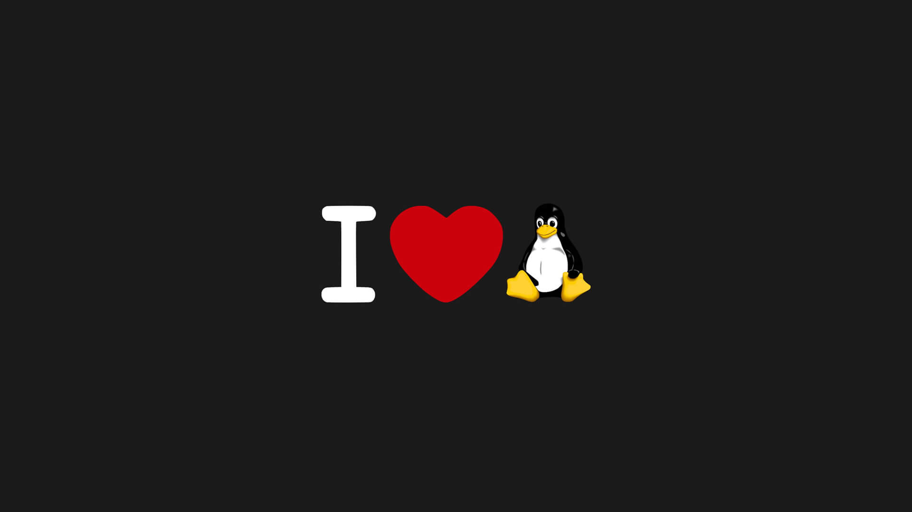

قد تتساءل عزيزي القارئ: لماذا أنتقل إلى لينكس طالما أن ويندوز يفي بالغرض؟

دعني أجيبك عن هذا السؤال:

1. الكثير من مستخدمي ويندوز لا يقومون بشراءه، بل يقومون بتحميل نسخة مقرصنة من الإنترنت مما يجعلهم عرضة لمشاكل الفيروسات والاختراق.

2. حتى وإن كنت تملك نسختك الخاصة من ويندوز، فأنت ملتزم باتفاقية بأنه لا يحق لك تثبيت هذه النسخة على أكثر من جهاز أو نسخها وتوزيعها.

3. مع امتلاك الويندوز لنصيب الأسد من حصة أنظمة التشغيل، وكونه مغلق المصدر فإنه أصبح الهدف الأول للفيروسات والمشاكل الأمنية، وللأسف في كثير من الأحيان يتأخر إصدار التصليح أو سد الثغرة.

4. باستخدامك للبرمجيات الحرة المتاحة داخل لينكس لن تحتاج إلى شراء برامج بأثمان باهظة أو تحميل "الكراكات" لتفعيل البرامج بطريقة غير شرعية.

5. حتى تأخذ صورة أكثر وضوحا عن نظام لينكس، أنصحك بالعودة إلى سلسلة دروس نظام لينكس التي سبق ونشرتها مجلة لغة العصر ابتداء من العدد 181، والتي تجدها متوفرة على موقع المجلة الإلكتروني أيضا.

### ويندوز ضد لينكس!

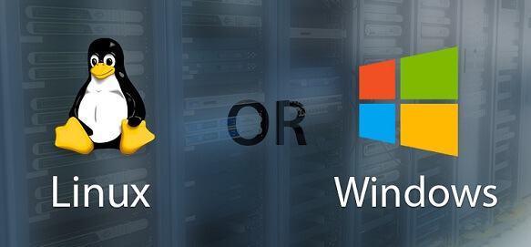

|                         |                                                                                                   ويندوز                                                                                                   |                                                                                                    لينكس                                                                                                     |
| :---------------------: | :--------------------------------------------------------------------------------------------------------------------------------------------------------------------------------------------------------: | :----------------------------------------------------------------------------------------------------------------------------------------------------------------------------------------------------------: |
|       **البداية**       |                                                                        اطلق الإصدار الأول من ويندوز في 1985 وحمل الرقم Windows 1٫0                                                                         |                                                                           اطلق الإصدار الأول من نواة لينكس في 1991 وحمل الرقم 0٫01                                                                           |
| **المسئول عن التطوير**  |                                                                             يتم تطوير الويندوز بشكل كامل من طرف مايكروسوفت فقط                                                                             |               يتم تطوير نواة لينكس بشكل أساسي من مخترعها لينوس تورفالدز والمطورين المساهمين من جميع أنحاء العالم، وأما التوزيعات فيوجد عدد كبير جدا من الشركات والمطورين الذين يقومون بتطويرها               |
|      **التوزيعات**      |                                                      يوجد عدد محدود من نسخ الويندوز مع رفع الدعم عن النسخ القديمة بشكل تدريجي ودعم النسخ الأخيرة فقط                                                       |                                       يوجد عدد كبير جدا من توزيعات لينكس التي تستهدف كل منها فئة أو غرض معين، كما يتوفر دعم حتى للتوزيعات القديمة سواء كان رسمي أم لا                                        |
| **توافر الكود المصدري** | الويندوز مغلق المصدر، باستثناء بعض الأجزاء التي تشاركها مع مصنعي الأجهزة لتقوم بتوفير التعريفات، إلى جانب أن شروط استخدام مايكروسوفت ويندوز تحظر على المستخدم إعادة نسخ أو تعديل أو تطوير أو توزيع النظام. |  لينكس كان ولا زال و سيبقي مفتوح المصدر ويمكن لأي شخص بان يقوم بالتعديل عليه و عمل توزيعة خاص به و لذلك ستجد العديد من التوزيعات المختلفة ومنها العربية، إلى جانب إمكانية إعادة نسخ وتوزيع ومشاركة النظام.   |
|        **السعر**        |                                                                                   يتراوح سعر ويندوز 10 من 100$ إلى 200$                                                                                    |                                        أغلب توزيعات لينكس مجانية بالكامل، باستثناء بعض التوزيعات التجارية مثل RedHat و Suse أو ذات الدعم المدفوع مثلZorin OS Ultimate                                        |
|   **متطلبات التشغيل**   |                                              يحتاج ويندوز إلى إمكانيات محددة لتشغيل النسخ الأحدث، وربما تحتاج لترقية مكونات جهازك لتشغيل أحدث إصدارات ويندوز                                               |                                                  لا يتطلب لينكس مواصفات عالية ليعمل على جهازك، فجهاز مع معالج Intel Pentium 4 سيعمل عليه لينكس بكفاءة عالية                                                  |
|     **توفر الدعم**      |                                                        دعم ويندوز كبير ولديه مجتمعات مختلفة على الإنترنت لكن يبقي مصدر الدعم الرئيسي مايكروسوفت فقط                                                        |                                    لينكس له مجتمع ودعم كبير على الإنترنت إلى جانب توفر مصادر مختلفة للوثائق والدروس مما يجعل المستخدم قادرا على التعامل مع أي موقف يواجهه                                    |
|   **أسطوانة التثبيت**   |                                                                              يمكنك تثبيت ويندوز فقط باستخدامك لل DVD الخاص به                                                                              |                                             أما في لينكس يمكنك تجربة التوزيعات بشكل كامل من خلال DVD للتحقق من الهاردوير أو استكشاف النظام ومن ثم يمكنك التثبيت                                              |
|       **الأمان**        |                              في ويندوز أنت المستخدم الـ Administrator افتراضيا، هذه النقطة يستغلها أغلب البرمجيات الخبيثة في ويندوز، كما تستهدف الفيروسات الويندوز بشكل أساسي                              | لا يعمل لينكس افتراضيا بصلاحيات المدير، وبذلك يمنع أي برامج من عمل تغييرات في النظام، وتكاد تنعدم نسبة استهداف الفيروسات لنظام لينكس، طالما أن المستخدمي يعرف ما يفعله ولا يعطي صلاحيات المدير لبرامج خارجية |
|    **الشكل والمظهر**    |                                                             تصميم ويندوز موحد ويمكن تغييره عن طريق الثيمات، لكن يظل تغيير الشكل الكلى غير ممكن                                                             |                                   توزيعات لينكس عددها كبير جدا وذلك يؤدي لاختلاف التصميم و واجهة المستخدم في كل توزيعه، ويمكن للمستخدم تخصيص النظام وتغيير كل شيء كما يريد                                   |
|         الأداء          |                    يستطيع ويندوز تشغيل العديد من البرامج دفعة واحده وتتميز بالسرعة إلى حد ما، لكن بعد مرور وقت على التثبيت يصبح النظام أقل سرعة وقد تظهر بعض المشاكل مثل الشاشة الزرقاء                    |                                                 لا يحتاج لينكس إلى إمكانيات كبيرة للعمل بكفاءة، ولن تواجه به مشاكل مثل التشنجات أو الحاجة إلى إعادة التشغيل                                                  |
|      **التحديثات**      |                                  التحديثات في ويندوز أصبحت إجبارية، ويجب عليك في كثير من الأحيان إعادة التشغيل لتطبيق التحديثات وقد يقوم الويندوز بإعادة التشغيل بنفسه !                                   |                                التحديثات في لينكس اختياريه، ولن تحتاج إلى إعادة التشغيل إلا إذا أردت استخدام الإصدار الأحدث من النواة، ولكن يجب عليك التحديث دائما لتظل آمنا                                 |
|    **توفر البرامج**     |                                                                      لا خلاف على أن ويندوز هو أفضل أنظمة التشغيل من حيث توافر البرامج                                                                      |                    لكن لينكس به نقطة أخري تميزه، وجود مراكز البرمجيات Software Center الذي من خلاله تستطيع تثبيت ما تريد بنقرة زر، إلى جانب أنك تستطيع استخدام سطر الأوامر لتثبيت البرامج                    |
|   **مجانية البرامج**    |                                                        أغلب برامج الويندوز القوية مدفوعة ويجب على المستخدم الالتزام باتفاقيات تمنعه من نسخ البرنامج                                                        |                                                         أغلب برامج لينكس مجانية، ويمكنك نسخها وتوزيعها كما تشاء، باستثناء القليل من البرامج المدفوعة                                                         |
|     **دعم الألعاب**     |                                          دعم ويندوز للألعاب لا نظير له، وذلك بسبب Microsoft DirectX فأغلب الألعاب الحديثة إن لم تكن كلها تصدر بشكل أساسي للويندوز                                          |                                    ومن ناحية أخري لينكس قد تطور عن الأيام السابقة، فبإمكانك تشغيل أغلب ألعاب منصة Steam بشكل كامل، فالألعاب أيضا لها مكانها في نظام لينكس                                    |

### ثانيا: بدائل البرمجيات المغلقة

يوجد عدد كبير جدا من البرمجيات الحرة التي تعمل على ويندوز ولينكس وماك، أذكر لك منها:

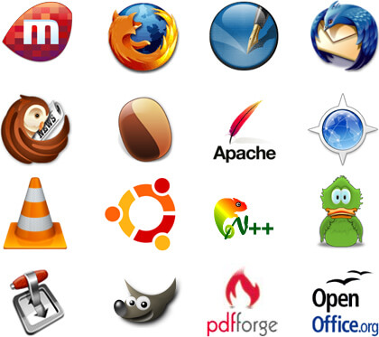

-   متصفحات الإنترنت Firefox و Chromium

-   مدير تحميل Xtreme Download Manager و ‫‪Free‬‬ ‫‪Download‬‬ ‫‪Manager‬‬

-   مشغل وسائط‫ متعددة‬ VLC و Kodi

-   برامج مكتبيةLibreOffice و ‫‪Sumatra‬‬ ‫‪PDF‬‬

ويمكنك الإطلاع على قائمة البرامج الحرة التي تحتوي أكثر من 100 برنامج على موقعنا من خلال قراءة رمز Qr Code.

إلى هنا نصل عزيزي القارئ إلى ختام موضوعنا، إذا كان لديك أي استفسارات حول نظام لينكس أو البرمجيات الحرة لا تتردد في التواصل معنا عبر موقنا الإلكتروني أو مواقع التواصل الاجتماعي المختلفة، وإلى اللقاء في موضوع جديد.

| برامج الإنترنت              |                                                      |                                                                             |
| --------------------------- | ---------------------------------------------------- | --------------------------------------------------------------------------- |
| متصفحات                     |                                                      |                                                                             |
| 1                           | Firefox                                              | ‫‪[www.firefox.com](http://www.firefox.com/)                                |
| 2                           | Chromium                                             | ‬‫‪‬‬ ‫‪[www.chromium.org](http://www.chromium.org/)‬‬                      |
| 3                           | Midori                                               | ‫‪‬‬ ‫‪[www.twotoasts.de](http://www.twotoasts.de/)                         |
| 4                           | Brave                                                | https://www.brave.com/                                                      |
| 5                           | QupZilla                                             | http://www.qupzilla.com/                                                    |
| مدير تحميل                  |                                                      |                                                                             |
| 1                           | Xtreme Download Manager                              | xdman.sourceforge.net                                                       |
| 2                           | ‫‪Free‬‬ ‫‪Download‬‬ ‫‪Manager‬‬                    | ‫‪[www.freedownloadmanager.org](http://www.freedownloadmanager.org/)        |
| 3                           | Uget                                                 | ‫‪‬‬ ‫‪uget.visuex.com‬‬                                                    |
| 4                           | Jdownloader                                          | ‫‪‬‬ ‫‪[www.jdownloader.org](http://www.jdownloader.org/)‬‬                 |
| 5                           | FreeRapid‬‬ ‫‪Downloader‬‬                           | ‫‪ ‫‪[www.wordrider.net/freerapid](http://www.wordrider.net/freerapid)‬‬    |
| 6                           | DownThemAll                                          | ‫‪‬‬ ‫‪[www.downthemall.net](http://www.downthemall.net/)‬‬                 |
| قارئ بريد                   |                                                      |                                                                             |
| 1                           | ‫‪Thunderbird‬‬                                      | ‫‪[www.mozilla.org/ar/thunderbird](http://www.mozilla.org/ar/thunderbird)‬‬ |
| 2                           | ‫‪Zimbra‬‬                                           | ‫‪www.zimbra.com‬‬                                                          |
| محادثة فورية                |                                                      |                                                                             |
| 1                           | ‫‪Pidgin‬‬                                           | ‫‪www.pidgin.im‬‬                                                           |
| 2                           | Spark                                                | http://www.igniterealtime.org/projects/spark/                               |
| 3                           | ‫‪Jitsi‬‬                                            | ‫‪www.jitsi.org‬‬                                                           |
| 4                           | ‫‪Instantbird‬‬                                      | ‫‪www.instantbird.com‬‬                                                     |
| 5                           | ‫‪HexChat‬‬                                          | ‫‪www.hexchat.org‬‬                                                         |
| مشاركة ملفات                |                                                      |                                                                             |
| 1                           | ‫‪Deluge‬‬                                           | ‫‪www.deluge-torrent.org‬‬                                                  |
| 2                           | ‫‪Vuze‬‬                                             | ‫‪www.vuze.com‬‬                                                            |
| 3                           | ‫‪FrostWire‬‬                                        | ‫‪www.frostwire.com‬‬                                                       |
| 4                           | qBittorrent                                          | https://www.qbittorrent.org                                                 |
| أخري                        |                                                      |                                                                             |
| 1                           | ‫‪FileZilla‬‬                                        | ‫‪www.‬‬ ‫‪filezilla-project.org‬‬                                          |
| 2                           | ‫‪Hotot‬‬                                            | ‫‪www.hotot.org‬‬                                                           |
| 3                           | ‫‪RSSOwl‬‬                                           | ‫‪www.rssowl.org‬‬                                                          |
| 4                           | ‫‪RetroShare‬‬                                       | http://retroshare.sf.net/                                                   |
| 5                           | ‫‪Minitube‬‬                                         | ‫‪flavio.tordini.org/minitube‬‬                                             |
| 6                           | ‫‪Sismics‬‬ ‫‪Reader‬‬                               | ‫‪www.sismics.com/reader‬‬                                                  |
| وسائط ‫متعددة‬ ‫‬           |                                                      |                                                                             |
| مشغل وسائط‫ متعددة‬         |                                                      |                                                                             |
| 1                           | VLC                                                  | ‫‪www.videolan.org/vlc/‬‬                                                   |
| 2                           | ‫‪Miro‬‬                                             | ‫‪www.getmiro.com‬‬                                                         |
| 3                           | ‫‪Kodi‬‬                                             | https://kodi.tv/download                                                    |
| 4                           | ‫‪UMPlayer‬‬                                         | ‫‪www.umplayer.com‬‬                                                        |
| 5                           | ‫‪Media‬‬ ‫‪Player‬‬ ‫‪Classic‬‬ ‫‪Home‬‬ ‫‪Cinema‬‬ | http://www.free-codecs.com/download/k_lite_mega_codec_pack.htm              |
| مشغل‫ صوتيات‬ ‫‬            |                                                      |                                                                             |
| 1                           | ‫‪Songbird‬‬                                         | ‫‪www.getsongbird.com‬‬                                                     |
| 2                           | ‫‪Audacious‬‬                                        | ‫‪www.audacious-media-player.org‬‬                                          |
| محول ‫وسائط‬‬               |                                                      |                                                                             |
| 1                           | ‫‪MVC‬‬                                              | ‫‪www.mirovideoconverter.com‬‬                                              |
| 2                           | ‫‪MMC‬‬                                              | ‫‪miksoft.net/mobileMediaConverter.php‬‬                                    |
| محرر ‫صوتيات                |                                                      |                                                                             |
| 1                           | ‫‪Audacity‬‬                                         | ‫‪audacity.sf.net‬‬                                                         |
| 2                           | ‫‪Jokosher‬‬                                         | ‫‪www.jokosher.org‬‬                                                        |
| 3                           | ‫‪Ardour‬‬                                           | http://ardour.org                                                           |
| 4                           | ‫‪HydrogenAudio‬‬                                    | http://www.hydrogenaudio.org                                                |
| محرر‫ مرئيات‬ ‫‬            |                                                      |                                                                             |
| 1                           | ‫‪VLMC‬‬                                             | ‫‪www.videolan.org/vlmc/‬‬                                                  |
| 2                           | ‫‪Avidemux‬‬                                         | ‫‪avidemux.sf.net‬‬                                                         |
| 3                           | ‫‪Aegisub‬‬                                          | ‫‪www.aegisub.org‬‬                                                         |
| 4                           | ‫‪EasyTag‬‬                                          | ‫‪projects.gnome.org/easytag/‬‬                                             |
| 5                           | Kdenlive                                             | https://www.kdenlive.org/                                                   |
| تصميم‫ ورسوميات‬ ‫‬         |                                                      |                                                                             |
| تصميم ثنائي الأبعاد         |                                                      |                                                                             |
| 1                           | GIMP                                                 | ‫‪www.gimp.org‬‬                                                            |
| 2                           | ‫‪Inkscape‬‬                                         | ‫‪www.inkscape.org‬‬                                                        |
| 3                           | Krita                                                | http://krita.org/                                                           |
| 4                           | Paint.NET                                            | http://www.getpaint.net/                                                    |
| 5                           | ‫‪Synfig‬‬                                           | ‫‪www.synfig.org‬‬                                                          |
| 6                           | ‫‪Pencil‬‬ ‫‪Animation‬‬                             | ‫‪www.pencil-animation.org‬‬                                                |
| 7                           | ‫‪MyPaint‬‬                                          | ‫‪mypaint.intilinux.com‬‬                                                   |
| 8                           | ‫‪Pencil‬‬ ‫‪Project‬‬                               | ‫‪pencil.evolus.vn‬‬                                                        |
| 9                           | ‫‪Phatch‬‬                                           | ‫‪photobatch.stani.be‬‬                                                     |
| 10                          | ‫‪Hugin‬‬                                            | ‫‪hugin.sf.net‬‬                                                            |
| 11                          | ‫‪PosteRazor‬‬                                       | ‫‪posterazor.sf.net‬‬                                                       |
| تصميم ثلاثي الأبعاد         |                                                      |                                                                             |
| 1                           | ‫‪Blender‬‬                                          | ‫‪www.blender.org‬‬                                                         |
| 2                           | FreeCAD                                              | http://free-cad.sourceforge.net/                                            |
| 3                           | LibreCAD                                             | http://librecad.org/                                                        |
| 4                           | Sweet Home 3D                                        | http://www.sweethome3d.com/                                                 |
| تصميم وتطوير المواقع        |                                                      |                                                                             |
| 1                           | ‫‪BlueGriffon‬‬                                      | ‫‪www.bluegriffon.org‬‬                                                     |
| 2                           | ‫‪Aptana‬‬ ‫‪Studio‬‬                                | ‫‪www.aptana.com‬‬                                                          |
| 3                           | ‫‪Bluefish‬‬                                         | ‫‪bluefish.openoffice.nl‬‬                                                  |
| برامج مكتبية                |                                                      |                                                                             |
| حزم مكتبية                  |                                                      |                                                                             |
| 1                           | ‫‪LibreOffice‬‬                                      | ‫‪www.libreoffice.com‬‬                                                     |
| 2                           | OpenOffice                                           | www.openoffice.org                                                          |
| 3                           | OnlyOffice                                           | http://www.onlyoffice.org/                                                  |
| أدوات مكتبية متنوعة         |                                                      |                                                                             |
| 1                           | ‫‪Sumatra‬‬ ‫‪PDF‬‬                                  | ‫‪blog.kowalczyk.info/software/sumatrapdf‬‬                                 |
| 2                           | ‫‪Dia‬‬                                              | ‫‪projects.gnome.org/dia‬‬                                                  |
| 3                           | ‫‪FocusWriter‬‬                                      | ‫‪www.gottcode.org/focuswriter‬‬                                            |
| 4                           | ‫‪Getting‬‬ ‫‪Things‬‬ ‫‪GNOME‬‬                     | ‫‪www.gtgnome.net‬‬                                                         |
| 5                           | ‫‪Calibre‬‬                                          | ‫‪www.calibre-ebook.com‬‬                                                   |
| 6                           | ‫‪ProjectLibre‬‬                                     | ‫‪www.projectlibre.org‬‬                                                    |
| 7                           | ‫‪AbiWord‬‬                                          | ‫‪www.abisource.com‬‬                                                       |
| أدوات متنوعة                |                                                      |                                                                             |
| ‫محاكيات‬                   |                                                      |                                                                             |
| 1                           | ‫‪VirtualBox‬‬                                       | ‫‪www.virtualbox.org‬‬                                                      |
| 2                           | ‫‪PCSX2‬‬                                            | ‫‪www.pcsx2.net‬‬                                                           |
| 3                           | ‫‪PCSX‬‬                                             | ‫‪www.pcsx.net‬‬                                                            |
| 4                           | ‫‪JPCSP‬‬                                            | ‫‪www.jpcsp.org‬‬                                                           |
| 5                           | ‫‪Dolphin‬‬                                          | ‫‪www.dolphin-emulator.com‬‬                                                |
| برامج‫ تعليمية‬ وثقافية‬ ‫‬ |                                                      |                                                                             |
| 1                           | ‫‪Stellarium‬‬                                       | ‫‪www.stellarium.org‬‬                                                      |
| 2                           | ‫‪Celestia‬‬                                         | ‫‪worldwind.arc.nasa.gov‬‬                                                  |
| 3                           | ‫‪World‬‬ ‫‪Wind‬‬                                   | ‫‪www.shatters.net/celestia‬‬                                               |
| 4                           | ‫‪Kiwix‬‬                                            | ‫‪www.kiwix.org‬‬                                                           |
| أخري                        |                                                      |                                                                             |
| 1                           | ‫‪InfraRecorder‬‬                                    | ‫‪www.infrarecorder.org‬‬                                                   |
| 2                           | ‫‪XMind‬‬                                            | ‫‪www.xmind.net‬‬                                                           |
| 3                           | ‫‪StarDict‬‬                                         | http://www.huzheng.org/stardict/                                            |
| 4                           | ‫‪PDFCreator‬‬                                       | ‫‪www.pdfforge.org/pdfcreator‬‬                                             |
| 5                           | ‫‪SmartCam‬‬                                         | ‫‪sf.net/projects/smartcam‬‬                                                |
| 6                           | ‫‪BleachBit‬‬                                        | ‫‪bleachbit.sf.net‬‬                                                        |
| 7                           | ‫‪Notepad‬‬ ‫‪++‬‬                                   | ‫‪www.notepad-plus-plus.org‬‬                                               |
| 8                           | ‫‪Geany‬‬                                            | ‫‪www.geany.org‬‬                                                           |
| 9                           | ‫‪ClamWin‬‬                                          | ‫‪www.clamwin.com‬‬                                                         |
| 10                          | ‫‪FWBackups‬‬                                        | ‫‪www.diffingo.com/oss/fwbackups‬‬                                          |
| 11                          | ‫‪TrueCrypt‬‬                                        | ‫‪www.truecrypt.org‬‬                                                       |
| 12                          | ‫‪UltraVNC‬‬                                         | ‫‪www.uvnc.com‬‬                                                            |
| 13                          | ‫‪Scribus‬‬                                          | ‫‪www.scribus.net‬‬                                                         |
| 14                          | KeepNote                                             | http://rasm.ods.org/keepnote/                                               |
| 15                          | Atom                                                 | https://atom.io/                                                            |
| 16                          | Brackets                                             | http://brackets.io/                                                         |
| 17                          | UNetbootin                                           | http://unetbootin.github.io/                                                |
| 18                          | Rufus                                                | https://rufus.akeo.ie/                                                      |

---

هذا الموضوع نُشر باﻷصل في مجلة لغة العصر العدد 200 شهر 8-2017 ويمكن الإطلاع عليه [هنا](https://drive.google.com/file/d/1-tb6yLhZo3jq6GfrA-n06QwYKdo8J6oB/view?usp=sharing).

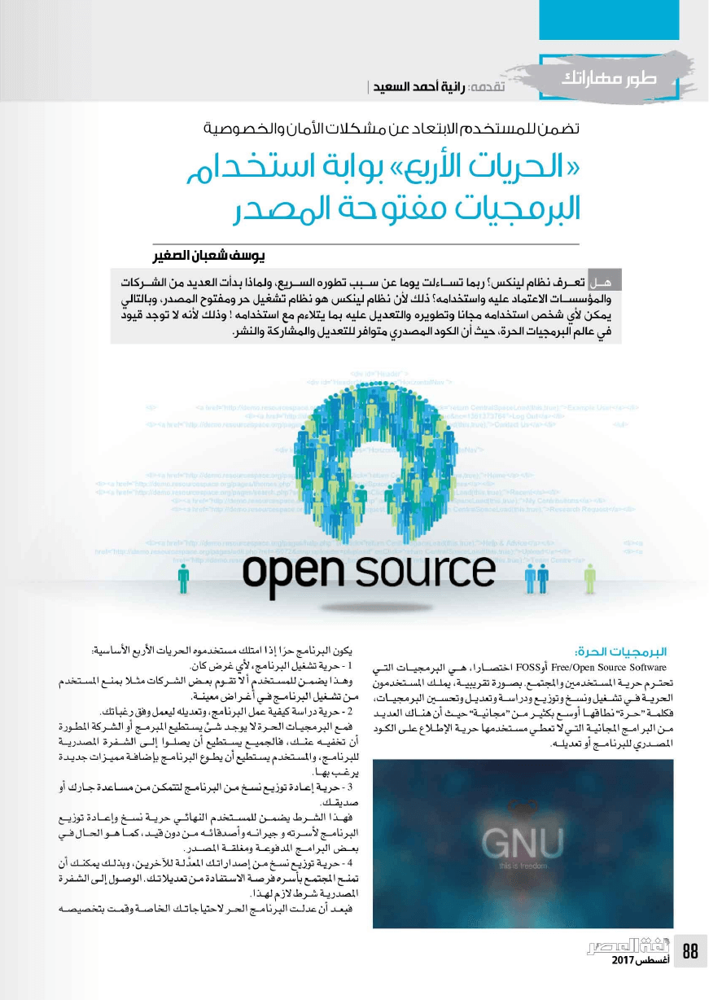

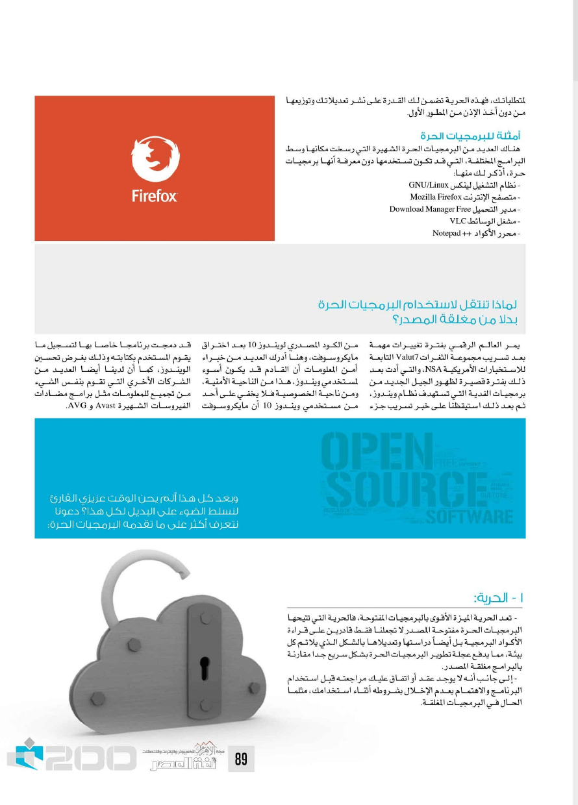

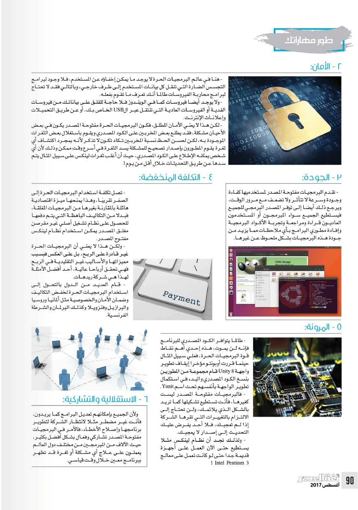

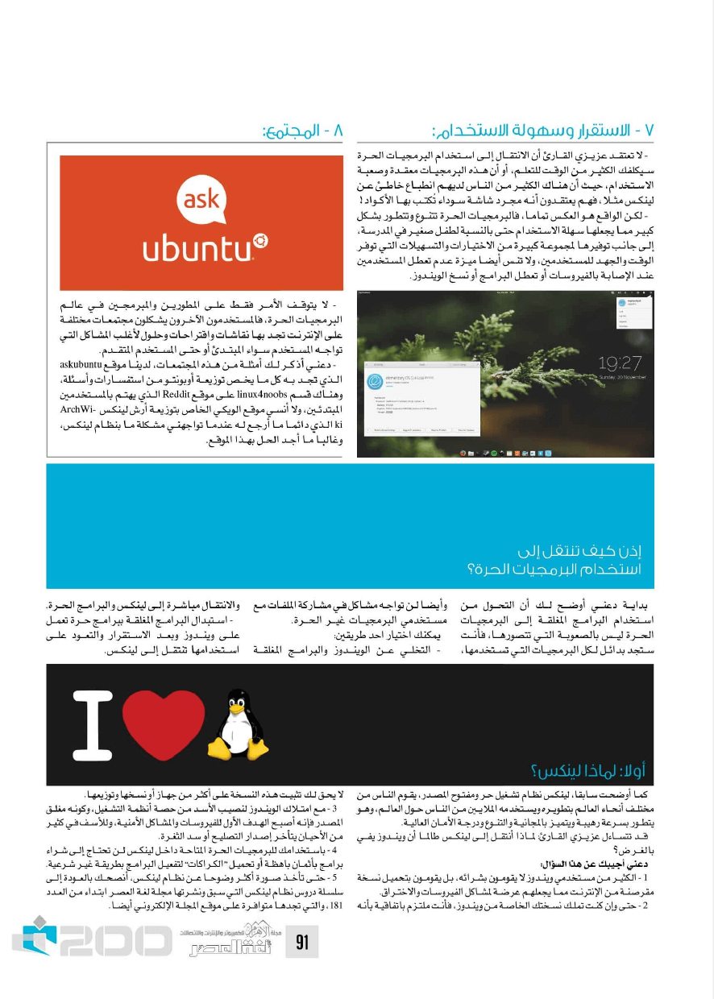

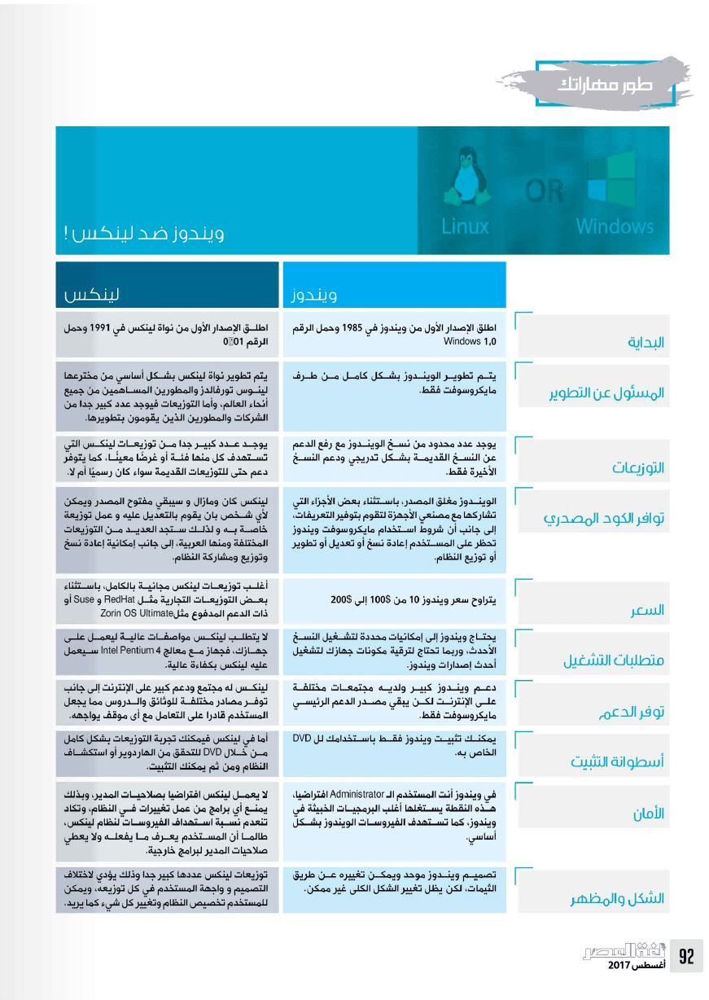

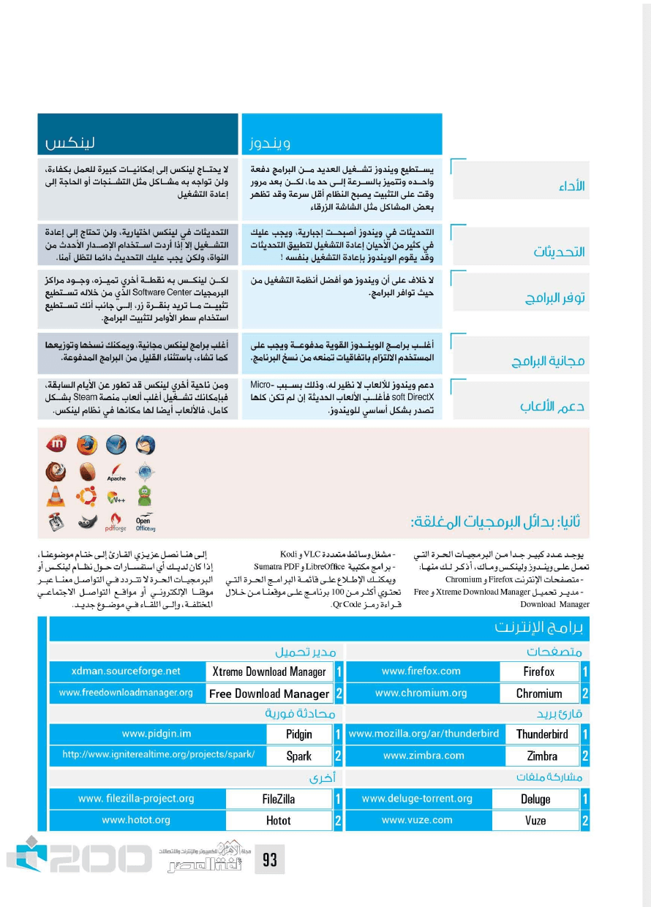

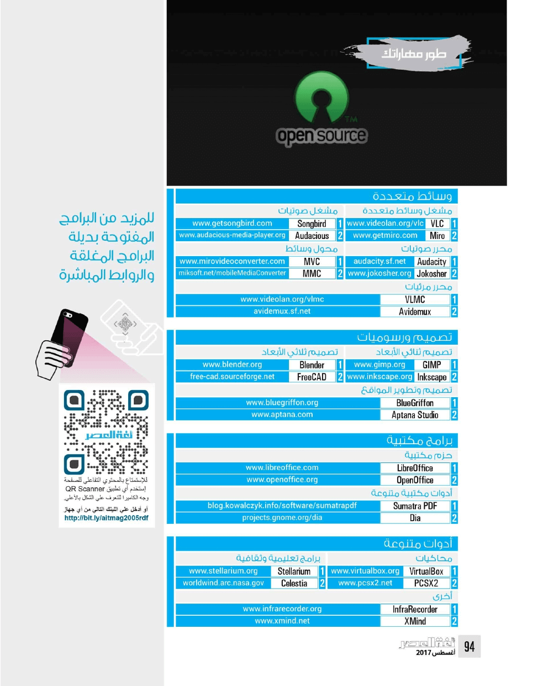
