+++
title = "ثغرة استغلال WPS في أجهزة الرواتر وطريقة تجنبها"
date = "2015-02-01"
description = "انتشرت في الآونة الأخيرة ثغرة في بعض أجهزة الراوتر تمكن المخترق من استخدام الإنترنت الخاص بك وقطع الإنترنت على المستخدم الأساسي للراوتر بل والحصول على كلمات السر التي تستخدمها في الدخول إلى حساباتك على الإنترنت."
categories = ["اﻷمن الرقمي",]
tags = ["مجلة لغة العصر"]

+++

انتشرت في الآونة الأخيرة ثغرة في بعض أجهزة الراوتر تمكن المخترق من استخدام الإنترنت الخاص بك وقطع الإنترنت على المستخدم الأساسي للراوتر بل والحصول على كلمات السر التي تستخدمها في الدخول إلى حساباتك على الإنترنت.

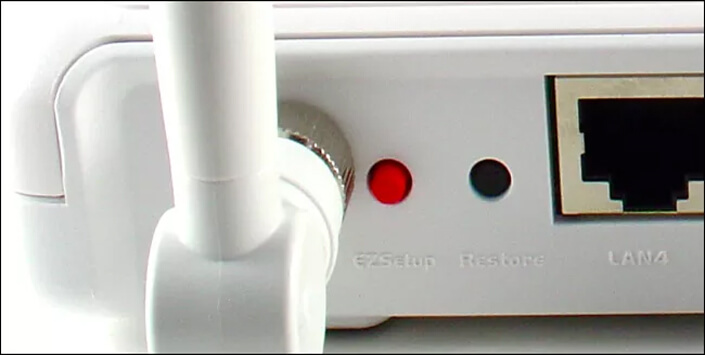
 

## ما هو WPS (Wireless Protect Setup)؟

 هو عبارة عن وسيلة تم تطويرها وتقديمها من قبل اتحاد Wi-Fi لمساعدة المستخدمين على إعداد اتصالاتهم اللاسلكية بأجهزتهم.

بدون WPS، سيجد المستخدم نفسه مضطراً لاتخاذ عدة خيارات قبل أن يتمكن من توصيل حاسوبه المحمول أو هاتفه الذكي بجهاز الراوتر الخاص به، مثل خوارزمية التشفير وطول الكلمة السرية وصيغتها.

هذا لأمر الذي يعني أنه يجب أن يكون لدى المستخدم خلفية لا بأس بها حول هذه النواحي قبل أن يتمكن من استخدام جهاز الراوتر بشكل لاسلكي لضمان أعلى مستوى من الحماية.

 أما مع WPS، فكل ما على المستخدم القيام به هو الضغط على زر Wi-Fi Protected Setup في حال توفره (أو تفعيله من داخل إعدادات الراوتر) أو إدخال PIN Code (بطول 8 أرقام) خاص بالجهاز والبدء بالاتصال بالأجهزة الأخرى مباشرة.

أو الضغط على زر تفعيل WPS من داخل صفحة إعدادات الراوتر وتفعيله أيضا في الجهاز الذي يريد الاتصال بالشبكة ليتم الاتصال بدون تدخل من المستخدم وكتابة أي كلمات مرور أو أكواد.

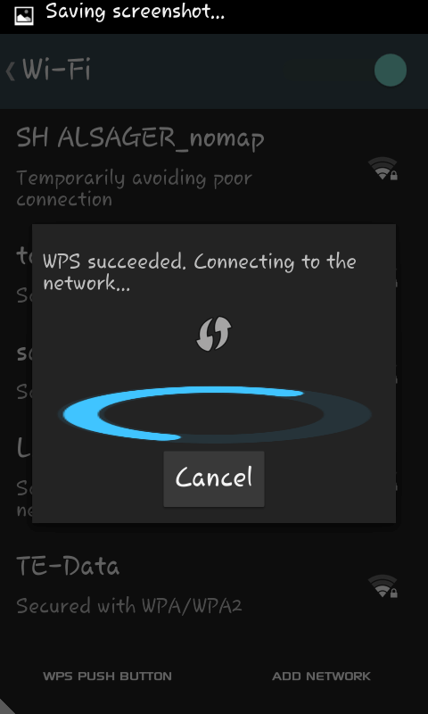

(صورة لعملية اتصال الهاتف بالراوتر عن طريق WPS PUSH BUTTON)

**ملاحظة**: قد تكتب هذه الخاصية في بعض أجهزة الراوتر QSS بدل WPS.

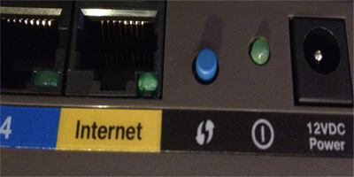

(صورة لزر WPS الموجود في بعض أجهزة الراوتر)

## طريقة عمل الثغرة

يمكن اختراق الراوتر عن طريقة ثغرة موجودة بنظام عمل WPS بطريقتين:

1. بواسطة نظام تشغيل لينكس ببعض البرامج الخاصة التي تقوم بعملية تسمى القوة الوحشية (brute force) لمهاجمة جهاز الراوتر لتوليد أرقام PIN عشوائية حيث يتمكن المهاجم من معرفة ما إذا كان النصف الأول من الأرقام الثمانية صحيحاً. ويحدث هذا بفضل غياب سياسة منع مؤقت بعد عدد معين من المحاولات الخاطئة في أجهزة الراوتر.

   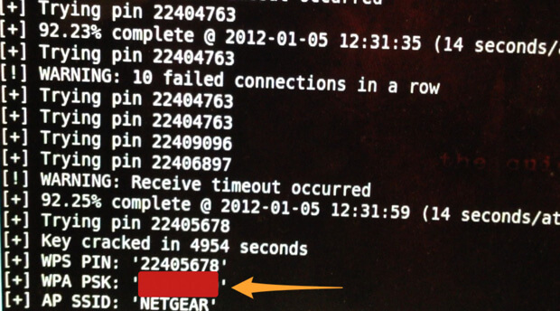

2. بواسطة معظم الهواتف التي تعمل بنظام التشغيل أندرويد وهي الطريقة الأشهر والأسهل والتي يستطيع المستخدم العادي تنفيذها، عن طريق تطبيقات معينة تستطيع الحصول على رمز PIN الذي يرسله الراوتر وادخاله بشكل يدوي مما يؤدى إلى اتصالك بالإنترنت عن طريق الراوتر المخترق دون الحاجة إلى معرفة كلمة المرور، وهناك بعض التطبيقات الأخرى التي تمكنك من معرفة كلمة المرور الخاصة بالراوتر المخترَق ليتمكن الهاكر من الدخول إلى هذا الراوتر عن طريق أجهزة أخرى.

   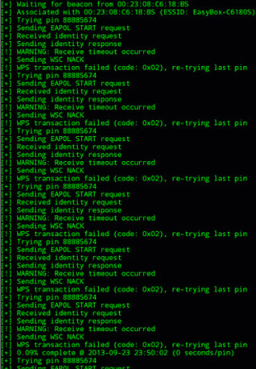

### بعض أجهزة الراوتر التي يمكن استغلال الثغرة بها

الأجهزة المصابة بهذه الثغرة فهي الأنواع الحديثة من كل من:

TP-LINK- D-LINK- TENDA- XTECH- NetGear- Huawei - Thomson- SpeedTouch- Orange- Infinitum- BBox- DMax- BigPond- O2Wireless- Otenet- Cyta - TN_private- Blink.

## كيفية اكتشاف إذا كان جهاز الراوتر يحتوي على خاصية WPS أم لا

### أولا: عن طريق أي هاتف يعمل بنظام الأندرويد

1. قم بتفعيل الواى فاى في هاتفك ثم ادخل إلى الشبكات المتاحة.

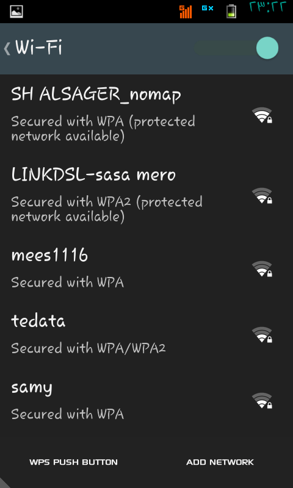

 

1. ​	إذا وجدت أمام اسم شبكتك اللاسلكية عبارة (Protected network available) فهذا معناه أن الراوتر به خاصية WPS.

### ثانيا: عن طريق الدخول إلى صفحة إعدادات الراوتر

1. ​	قم بفتح أي متصفح انترنت ثم قم بكتابة عنوان صفحة إعدادات الراوتر في شريط العنوان (غالبا ما تكون 192.168.1.1).
2. ​	تظهر لك نافذة ادخال اسم مستخدم الراوتر وكلمة السر (غالبا ما يكونا admin).

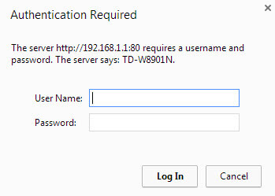

بعد ادخال اسم المستخدم وكلمة السر بنجاح تظهر لك صفحة إعدادات الراوتر قم بالدخول إلى التبويب Interface Setup.

3. من داخل التبويب Interface Setup اختر التبويب الفرعي Wireless.

4. إذا وجدت كلمة WPS في الصفحة فهذا معناه أن الراوتر يدعم خاصية WPS.

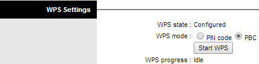

## هل بالإمكان سد هذه الثغرة؟

نعم بالطبع عن طريق إيقاف خاصية WPS تماما عن العمل ولكن يعتمد هذا على نوع جهاز الراوتر الذي لديك:

- ​	بعض أجهزة الراوتر لا تمكن المستخدم من التحكم في فتح أو إغلاق خاصية WPS.
- ​	بعض الأنواع الأخرى تمكن من اغلاق خاصية WPS ولكنها تظل تعمل بدون علم المستخدم (مثل أجهزة راوتر Linksys المصنعة عام 2012).
- ​	بعض الأجهزة تمكن من فتح أو اغلاق خاصية WPS بدون التحكم في طرق عملها (PIN Code أو من داخل إعدادات الراوتر (.
- ​	بعض الأجهزة تتيح اغلاق خاصية WPS عن طريق PIN Code بينما يظل تفعيلها من داخل إعدادات الراوتر يعمل.
- ​	وأخيرا هناك بعض الأنواع التي لا تدعم هذه الخاصية على الإطلاق وهي الأكثر أمانا لعدم تعرضها لهذه الثغرة.

## طريقة إيقاف خاصية WPS وسد هذه الثغرة

كما ذكرت بالأعلى فإن هذا يعتمد على نوع الراوتر الذي لديك.

1. قم بفتح صفحة إعدادات الراوتر ثم أدخل اسم المستخدم وكلمة السر.
2. قم بالدخول إلى التبويب Interface Setup ثم اختر التبويب الفرعي Wireless.
3. ستجد خاصية WPS كما بالصورة:

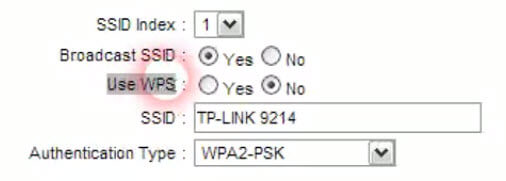

وفى بعض الأجهزة قد تجدها هكذا:

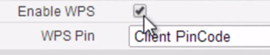

4. قم باختيار No أو إزالة العلامة حسب نوع الراوتر.
5. بالنسبة لأجهزة الراوتر التي لا يوجد بها اختيار إيقاف تفعيل خاصية WPS قم باختيار PBC وعدم اختيار PIN code لأنه هو الذي يؤدى إلى الاختراق.

 وبهذا تكون قد أوقفت تفعيل هذه الخاصية بشكل جزئي بحيث لن يتم استخدامها إلا إذا تم تفعيلها من داخل صفحة إعدادات الراوتر.

---

هذا الموضوع نشر باﻷصل في مجلة لغة العصر العدد 170 شهر 2-2015 ويمكن الإطلاع عليه [هنا](https://drive.google.com/file/d/18og9TY-oWYdZ6mV5bVsdI8ksz2zGyNtK/view?usp=sharing).

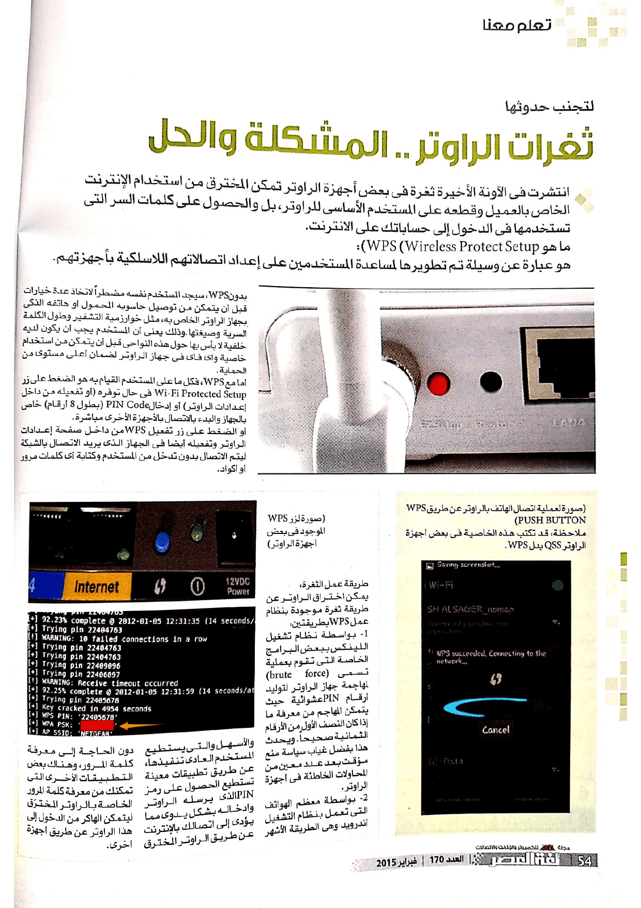

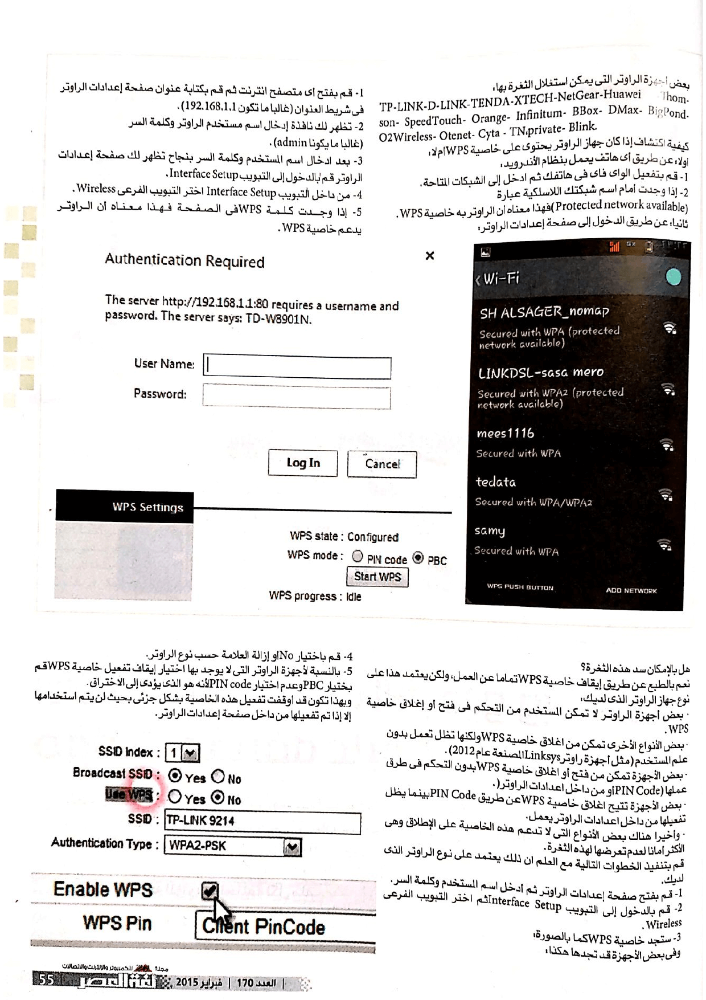
