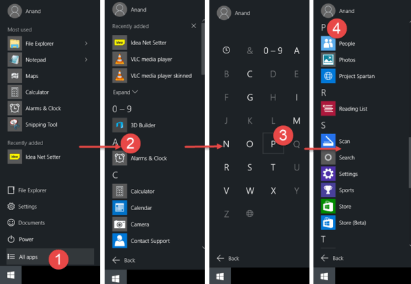
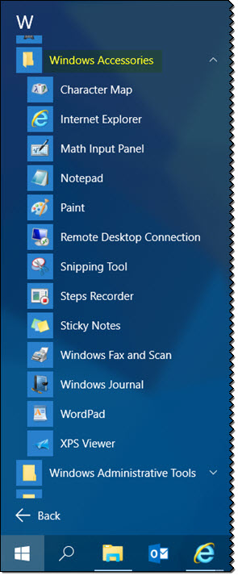

+++
title = "كيفية الوصول لمجلد Accessories في ويندوز 10"
date = "2016-04-04"
description = "هل تعتقد عزيزي القارئ أن مجلد Accessories غير موجود في قائمة البداية في ويندوز 10؟ كل ما في الأمر أن مكانه في قائمة البداية قد تغير تغييرا جذريا عن مكانه المعتاد في إصدارات الويندوز السابقة، دعونا نرى كيفية الوصول إليه"
categories = ["ويندوز",]
series = ["ويندوز 10"]
tags = ["موقع لغة العصر"]
images = ["images/2016-635953143469721374-972_thumb705x335.png"]
+++

هل تعتقد عزيزي القارئ أن مجلد Accessories غير موجود في قائمة البداية في ويندوز 10؟ كل ما في الأمر أن مكانه في قائمة البداية قد تغير تغييرا جذريا عن مكانه المعتاد في إصدارات الويندوز السابقة، دعونا نرى كيفية الوصول إليه.

مجلد ملحقات الويندوز Windows Accessories هو المكان الذي تتواجد فيه اختصارات جميع المحلقات المدمجة في ويندوز 10 مثل Sticky Notes, Program Steps Recorder, Snipping Tool, Paint, Character Map, الخ.

أين يوجد مجلد Accessories؟

1- قم بفتح قائمة البداية قم اضغط على All apps.

2- اضغط على أي حرف (A مثلا) للانتقال إلى قائمة الوصول السريع للبرامج.

3- اضغط على حرف W للوصول إلى البرامج التي تبدأ بحرف W.

أو يمكنك النزول بشكل يدوي إلى أن تصل لحرف W.

4- ستجد مجلد Windows Accessories قم بالضغط عليه لتظهر لك كل برامج الملحقات كما بالصورة.

---
هذا الموضوع نٌشر باﻷصل على موقع مجلة لغة العصر.

http://aitmag.ahram.org.eg/News/47377.aspx